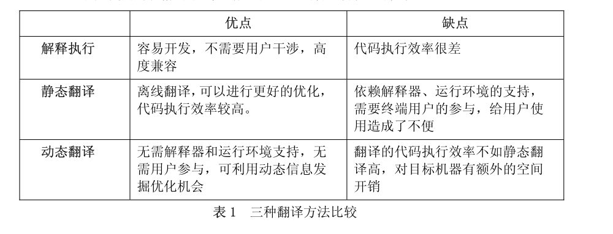

# 二进制翻译

## 什么是二进制翻译

把一种指令集的二进制代码翻译为另一种指令集的二进制代码的技术

## 为什么有二进制翻译技术？

新开发的处理器应用时可能遇到与旧处理器不兼容，原来可以运行的软件在新处理器上不可用。如何把支持老处理器的软件移植到新的处理器上，使新的处理器从诞生之初就有丰富的软件，不仅对软件重用有重大意义，更可以开阔处理器研发的思路，促进新处理器的创新。

一般有三种方法可以把老处理器上的代码移植到新处理器上

1. 在新处理器上提供专门的运行模式来执行老代码，如英特尔的安腾（Itanium）处理器专
   门设计了执行 x86 代码的硬件。
2. 把源程序重新编译到新的指令集。
3. 使用软件方法，解释或翻译应用程序

而二进制翻译的动机是缺少目标平台的二进制文件，缺少为目标平台编译的源代码，或者为目标平台编译源代码时遇到困难。

## 二进制翻译技术分类

基于软件的二进制翻译，可以分为解释翻译、静态翻译、动态翻译

 

### 二进制翻译的技术需求

- 编译、链接、程序装载

  《程序员的自我修养—链接、装载与库》，俞甲子等著

- 了解ELF和PE可执行文件格式

  如果同样在linux系统上翻译源代码的话，一般两者在可执行文件的形式上差别不是很大，只是其中一些字段可能会具有差异，比如要翻译risc-v到loongArch平台，那两者的ELF文件遵循的标准是一样的。

- 汇编与反汇编

​	二进制翻译会直接翻译二进制数据，这些二进制数据可以表示成一条条指令，那在翻译前就需要熟悉目标机器和原机器指令格式之间的差异。

- 处理器特性

​	不同的处理器可能会有一些特殊的寄存器存在，这些寄存器会提供特殊的功能，很多时候目标机器上是不存在这个寄存器的，因此需要想办法高效地模拟出这个寄存器。

## 二进制翻译的一些优化手段

- 代码缓存

  将已经翻译过的代码缓存下来，下次翻译时检查这个代码是否已经翻译过，在循环的时候常用

- 基本块翻译

  与编译器工作类似，以一个个基本进行翻译可以消除中间许多不必要的计算，以及内存加载

- 寄存器映射

  将目标机器的一些寄存器与源机器的寄存器对应，这样就不需要每次操作后都要保存寄存器到内存上

- 基本块链接

  由于翻译时存在上下文切换的开销，对于一些处于循环的基本块来说，如果从第一个到最后一个基本块之间每次循环都进行上下文切换，将会非常浪费

- eflags支持

  主要在x86->risc系列处理器翻译时出现，大多数的实现需要许多条指令模拟，在loongarch中使用硬件指令

- 间接跳转、代码布局、代码生成、软硬件结合

## 发展方向

1. 源机器二进制-->源代码-->重新编译-->新机器二进制

   性能可以达到100%,但是无法完全从二进制到源代码

2. 机器学习加持

​	使用机器学习的方法自动进行二进制翻译

3. 异构多核，Al处理器

   

## 资料

反汇编器：

DiStorm：https://github.com/gdabah/distorm for x86/AMD64

Capstone: https://github.com/capstone-engine/capstone

Support multiple hardware architectures: ARM, ARM64 (ARMv8), Ethereum VM, M68K, Mips, MOS65XX, PPC, Sparc, SystemZ, TMS320C64X, M680X, XCore and X86 (including X86_64

暂时没有找到risc-v相关的反汇编器

[【扫盲贴】什么是异构多处理系统，为什么需要异构多处理系统 | 电子创新网赛灵思中文社区 (eetrend.com)](https://xilinx.eetrend.com/d6-xilinx/article/2016-05/10087.html)

[二进制翻译 - 维基百科，自由的百科全书 (wikipedia.org)](https://en.wikipedia.org/wiki/Binary_translation)

[龙芯二进制翻译技术专家答疑 - 知乎 (zhihu.com)](https://zhuanlan.zhihu.com/p/376679541)

[二进制翻译( binary translation )有没有成熟的现实应用？请介绍一下实现方式与性能瓶颈。? - 知乎 (zhihu.com)](https://www.zhihu.com/question/29851229)