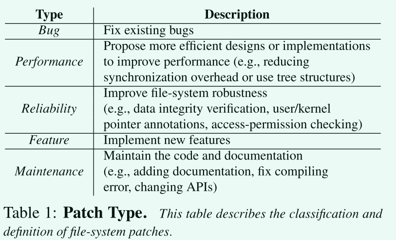
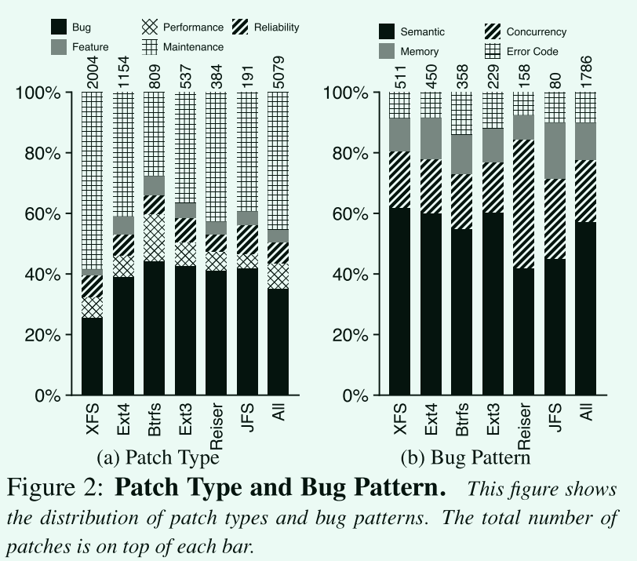
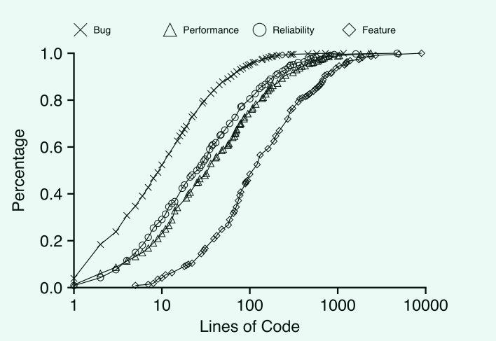
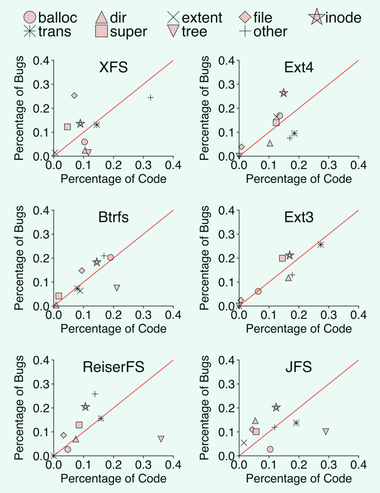
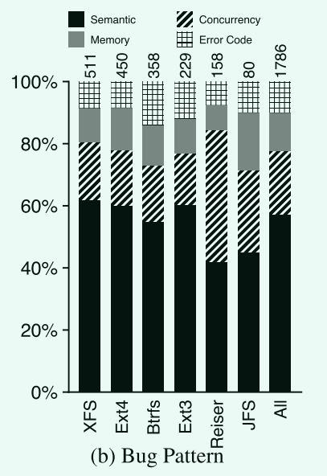
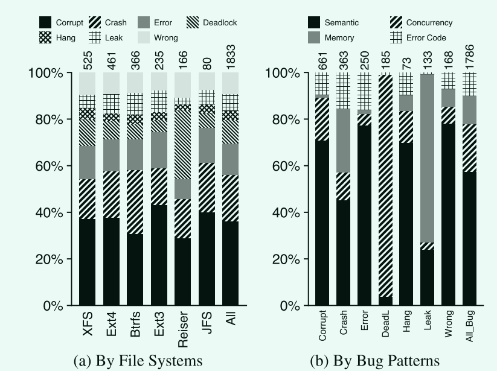
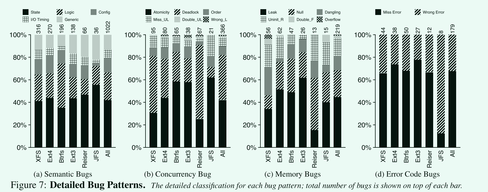
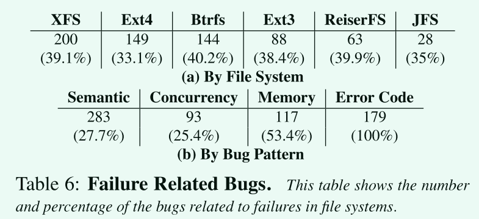
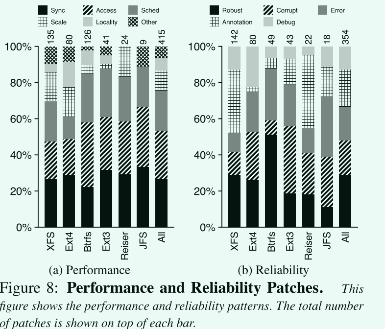

# A Study of Linux File System Evolution

通过对文件系统代码的演化进行研究，找出这些文件系统的复杂性，存在哪些类型的bug,有哪些性能特征，有哪些可靠性特征？

## 目标文件系统

基于磁盘的最流行最只要的文件系统，这些文件系统应该包含不同的可靠性特征(比如物理日志记录，裸机日志记录，校验和，写时复制等)、数据结构(哈希表、树，间接块、extent(类似于簇的结构)映射)、性能优化(异步、可伸缩算法、缓存、SSD设备的块分配)、高级特性(预分配、快照、在线更新大小、多磁盘管理)

1. EXT3
2. EXT4
3. XFS
4. Btrfs
5. ReiserFs
6. JFS

## 分析文件系统补丁

**确定需要回答或解决的问题**:

- OverView
  - 常见的补丁类型有哪些
  - 随着文件系统发展补丁如何发展？
  - 不同类型的补丁大小是否不同?
- bugs
  - 系统中会出现哪些bug
  - 不同组件之间的bug是否存在差异
  - 不同的bug会带来什么影响
- Performance and Reliability
  - 为改善性能使用了什么技术？
  - 有哪些可靠性增强措施被使用？

**如何分析**:

1. 获取linux中关于文件系统部分的补丁
2. 分析补丁的head和body
3. 判断此补丁的类型，大小(代码行数)，涉及的数据结构，以及bug类型，造成的后果
4. 对于缺乏完整信息的补丁，需要与源代码、文档以及邮件列表结合完成分析

**本文分析仍然存在的限制**

- 不能反映其它文件系统的特性
  - 比如一些其它操作系统使用的文件系统，fat32,ntfs
  - 一些针对flash设备的文件系统
  - 选择的linux版本不能包含之前以及之后的内容
  - 只研究了补丁中报告和修复的bug，对于一些应用程序存在的bug没有分析

## 具体的探究

**Overview**

- 维护补丁占了补丁的绝大多数
  - 这种类补丁主要包含改进可读性、简化数据结构等
  - 这些补丁是保证开源系统良好的可维护性所必须的工作

- 修复bug的补丁占据了剩余的绝大部分
  - 对于btrfs系统来说最高，这是因为此系统仍然在快速开发中
  - 对于其它已经稳定的文件系统可以看到仍然有数量庞大的bug存在
  - 持续地修复系统中存在的bug
- 性能和可靠性相关的补丁相对较少
  - 对文件系统进一步的研究至关重要

**Patch Trend** ：随着文件系统的发展，补丁的数量会逐渐增加，但是补丁类型的比例整体上没有变化

**Patch Size** : 

- 修复bug代码的行数一般较少
  - 说明bug很难察觉，可能在不经意间就产生了bug
- 复杂的文件系统具有更大的补丁
- 可靠性和性能相关的补丁大小中等
- 功能补丁大小明显大于其它补丁

**bugs**

- 对于许多文件系统组件，bug的密度都要大于预期
- 对于inode/superblock这种包含丰富元数据的逻辑组件来说，其bug产生的概率更大
- 事务在文件系统中占比较大，虽然从图上来看其主要位于图像下方，但由于代码量的增大其bug数量也会增大。
- 树结构代码数量虽然大，但其带来的bug少，说明良好的数据结构会减少bug的出现

- 语义错误占据bug的大部分，这些错误难以被通用的分析工具检查
- 并发错误占据了20%左右，用户态软件的并发错误要远远小于这个比例
  - 内核向上为应用程序提供了接口规范了应用程序的使用，但是内部实现不可避免地产生错误
- 随着文件系统发展逐渐稳定，许多错误检测工具也有发展，但是bug并不会就此减少，而是一直在波动中
  - 新特性的加入或者是性能改进的引入都会隐式带来新的bug
  - 修复原有的bug可能会造成新的bug

- 数据损坏的错误占40%
  - 数据同步
- 宕机占据20%
  - 由于一些断言或者判断导致的panic
- 语义错误会导致大量的数据损坏，系统崩溃、错误及一些未定义行为
- 并发错误会导致大量的死锁
- 内存错误会导致内存泄漏系统崩溃

- 语义bug
  - state
    - 文件系统维护大量的内存和磁盘状态。 通常，操作将文件系统从一种一致状态转换为另一种一致状态； 错误的状态更新或访问可能会导致严重的后果
  - logic
    - 这些错误是通过使用错误的算法、错误的假设和不正确的实现而产生的。
  - config
    - 文件系统行为还受各种配置参数的影响，如挂载选项和特殊硬件支持
  - I/O timing
    - 正确的I/O请求顺序对于文件系统中的崩溃一致性至关重要
  - Generic
    - 使用错误的变量类型或简单的错别字

- 并发bug
  - atomicity violations
    - 由于缺乏正确的同步方法来确保独占数据访问而导致的，通常会导致数据损坏
  - deadlocks
    - 使用错误的内核内存分配标志和在持有自旋锁时调用阻塞函数。
      - 比如在文件系统中分配内存但是分配内存时又调用文件系统
  - order violations
  - missed unlocks
  - double unlocks
  - wrong locks

- 内存bug （失败路径）
  - resource leaks
  - null pointer dereferences (空指针解引用)
  - dangling pointers (悬空指针)
  - uninitialized reads (未初始化读取)
  - double frees
  - buffer overflows

- 错误处理bug
  - 错误的错误码
  - 丢失错误码

**错误路径处理**

- 许多错误是在故障处理路径上产生

**Performance and Reliability**

- Performance 
  - Synchronization (>25%): 删除一对不必要的锁、使用更细粒度的锁以及用读/写锁替换写锁
  - access( 25%)： 缓存数据加快访问
  - schedule : 批处理机制，预读取，避免不必要的同步
  - scalability： 高效的数据结构
- Reliability 
  - robust : 检查权限以及文件系统相关的限制
  - corruption defense : 检查硬盘的元数据完整性
  - error enhancement： 错误传递以及更优雅的错误处理机制
  -  annotation  : 良好的类型注释
  - debugging  : 更详细调试信息

## 贡献

对于开发人员来说: 可以改进当前的设计和实现，并创建更好的系统

 对于工具构建者来说：可以改进他们的工具来匹配实际的系统（例如，通过找到困扰现有系统的bug类型）。

未来的系统设计需要更好的工具或语言支持，以使这些很少执行的故障路径正确。