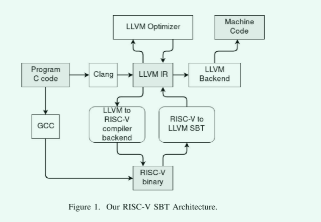
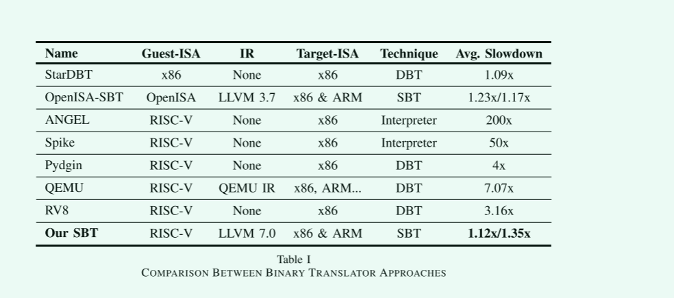

# RISC-V模拟器

两种方法：

- DBT 二进制翻译
- SBT 二进制翻译

本文的贡献：

- 证明了RISC-V二进制文件到x86和ARM的高质量转换是可能的
- 将SBT的性能与最先进的RISC-V仿真器的性能进行了比较，认为RISC-V仿真器的性能还有很大的改进空间

决定DBT翻译效率的原因：

- DBT的区域形成技术(RFT)，它定义了翻译单元的形状
- 客主机ISA的特性，它可以使翻译变得困难或容易

SBT翻译的缺陷

- 不能执行所有的二进制程序
  - 包含自修改代码
  - 间接分支

相关的工作

- OpenISA证明了这种想法是可能的，OpenISA是一个基于MIPS的ISA， 使用SBT在x86和ARM上模拟OpenISA，他们能够在大多数基准上实现不到1.2倍的减速。
- SPIKE模拟器在某些方面仍然存在问题因为DBT的原因

## 如何做

- 使用LLVM完成

静态二进制翻译器首先读取RISC-V可执行文件，并在LLVM库的帮助下分解其中的每个指令。 然后，对于每个RISC-V指令，我们的翻译器发出等价的、独立于目标的、LLVM中间表示(IR)指令或位码。 这实际上与CLANG编译源代码文件后产生的IR相同。 之后，将产生的LLVM IR写入文件，完成第一个翻译阶段

其余步骤是用现有软件执行的。 LLVM工具用于优化IR和生成X86或ARM的汇编代码。 之后，可以使用目标平台的标准汇编器和链接器（如GNU AS和LD)，为主机体系结构生成本机二进制文件。 在我们的实验中使用的代码生成流程将在第六节中进一步详细说明。 最后，在图1中的图表中总结了SBT的所有这些步骤。 

没有翻译最终链接的二进制文件，而是选择在链接之前翻译对象二进制文件，以避免处理一些问题。 它使我们能够只翻译基准代码，而不使用C运行时。 通过这种方式，我们避免了C运行时翻译质量对基准性能测量的干扰，并且还节省了如果SBT需要能够翻译所有C运行时库所需的大量工作

- 寄存器映射
  - 将RISC-V寄存器变成全局变量
    - 简单，不需要函数同步
    - 无法被优化
  - Riscv寄存器被转换到函数局部变量
    - 被积极优化
    - 函数调用和返回，局部变量的值需要与其它函数同步？

## 实验结果

## 收获

- 利用现有的成熟工具
  - LLVM对代码进行转换
  - 不用手动转换
- 

