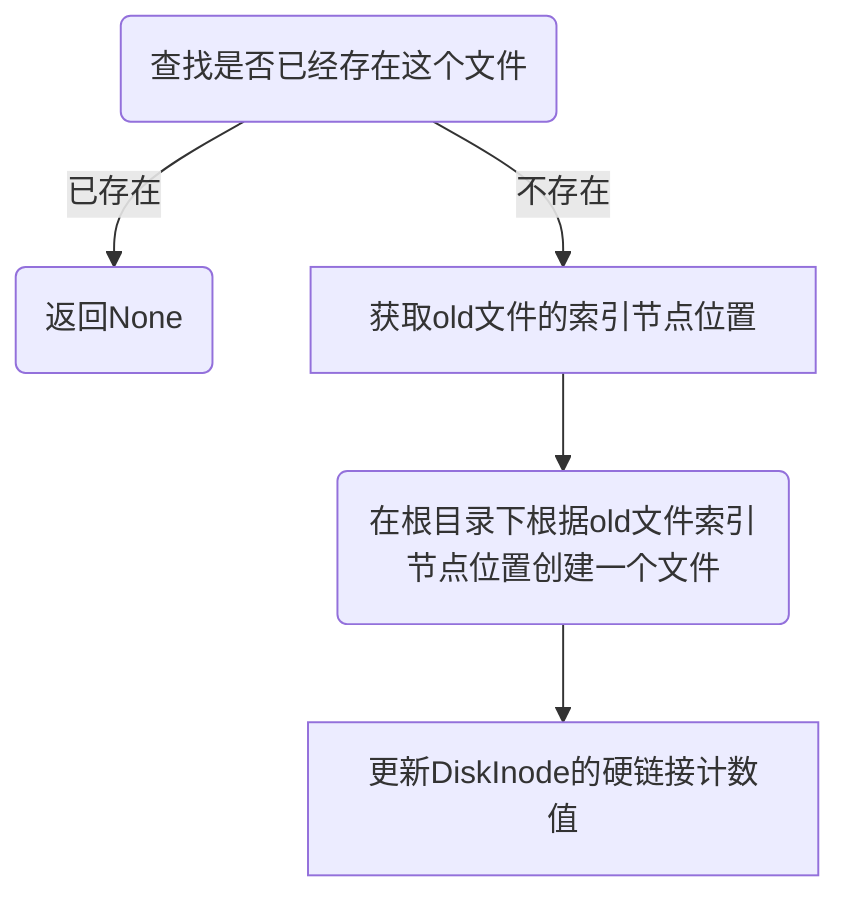

# 各章习题

## ch3

### 编程作业

```rust
fn sys_task_info(ti: *mut TaskInfo) -> isize
struct TaskInfo {
    status: TaskStatus,
    syscall_times: [u32; MAX_SYSCALL_NUM],
    time: usize
}
```

- syscall ID: 410
- 查询当前正在执行的任务信息，任务信息包括任务控制块相关信息（任务状态）、任务使用的系统调用及调用次数、任务总运行时长（单位ms）。

#### 实现

1. 根据要求在`TaskControlBlock`里添加两个变量用来记录任务开始被调度的时间以及各个系统调用的次数
2. 为`TaskControlBlock`编写相关的函数用来获取这些记录变量，因为这些变量是`public`的也可以不用这些函数，而是在外部直接使用
3. 在系统调用的处理函数前添加一个函数用来给当前任务更新系统调用次数。
4. 在任务调度的两个函数部分添加更新第一次调度运行的时间

#### 实现出现的缺点

由于需要记录任务第一次被调度的时间，因此在`run_next_task`函数中就需要每次都判断当前调度到的任务是否是第一次被调度，这里只是简单的判断调度的任务的时间是否为0 ，如果是零就说明第一次运行需要更新。但这样就会导致不必要的判断，其主要原因在于当前的任务在内存中是依次摆放的，因此在经过一轮调度后所有任务的时间都会已经被更新。


## 部分简答作业

深入理解 trap.S 中两个函数 \__alltraps 和 __restore 的作用，并回答如下问题:

L40：刚进入 `__restore` 时，`a0` 代表了什么值。请指出 `__restore` 的两种使用情景。

答：在`trap_handler`处理完成后会跳转到`__restore`函数执行，因此其`a0`参数就是`cx`.

1. `__restore`在任务被第一次调度时进入用户态，此时调用路径是`__switch`->`__restore`

2. 在其它情况下，`__restore`只会在`trap_handler`处理后进入然后返回用户态

L46-L51：这几行汇编代码特殊处理了哪些寄存器？这些寄存器的的值对于进入用户态有何意义？请分别解释。

```
ld t0, 32*8(sp)
ld t1, 33*8(sp)
ld t2, 2*8(sp)
csrw sstatus, t0
csrw sepc, t1
csrw sscratch, t2
```

答: 

- `sstatus`寄存器记录了发生trap前的特权级，即U用户态，这里恢复其值，代表即将回到用户态程序
- `sepc`记录了发生trap要执行的下一条指令，在进行系统调用时会被设置+1到下一条指令，其它一些页异常则不会改变，恢复其值后进入用户态PC的位置会指向其值
- `sscratch`此时记录了应用程序的用户栈，在后面使用`  csrrw sp, sscratch, sp`后其值则变成内核栈地址


L53-L59：为何跳过了 `x2` 和 `x4`？

```
ld x1, 1*8(sp)
ld x3, 3*8(sp)
.set n, 5
.rept 27
   LOAD_GP %n
   .set n, n+1
.endr
```

答: `x2`是栈指针，栈指针被`sscratch`寄存器保存以在用户态和内核态进行切换，其值不需要被记录

`x4`是线程指针，在当前系统中不会使用


`__restore`：中发生状态切换在哪一条指令？为何该指令执行之后会进入用户态？

答: `sret`指令，这条指令会将`sstatus`的`spp`值恢复，而此时`spp`的值为u,即用户态


```
csrrw sp, sscratch, sp
```

这条指令用来交换两个寄存器的值


从 U 态进入 S 态是哪一条指令发生的？

在本实验中是`ecall`指令


## ch4

### 编程作业

```rust
fn sys_mmap(start: usize, len: usize, port: usize) -> isize
```

- syscall ID：222
- 申请长度为 len 字节的物理内存（不要求实际物理内存位置，可以随便找一块），将其映射到 start 开始的虚存，内存页属性为 port

```rust
fn sys_munmap(start: usize, len: usize) -> isize
```

- syscall ID：215
- 取消到 [start, start + len) 虚存的映射
- 参数和返回值请参考 mmap

#### 实现

1. 根据要求判断标志位的合法性
2. 计算虚拟页范围并判断是否已经在地址空间中
3. 申请物理页并加入页表中/从页表中删除


#### 注意

这里需要注意如果使用`find_pte`函数进行查找页表项的话需要修改原来的实现，将判断合法性与查找下一级页表的顺序交换。


## ch5

### 编程作业

```rust
fn sys_spawn(path: *const u8) -> isize
```

- syscall ID: 400
- 功能：新建子进程，使其执行目标程序。
- 说明：成功返回子进程id，否则返回 -1。

### 实现

有了fork和exec的实现，spawn的实现就较为简单了

1. 创建`TaskControlBlock`
2. 修改其父进程的引用
3. 加入到任务队列中


## ch6

### 编程作业

- Rust 接口： 

  ````rust
  fn linkat(olddirfd: i32, oldpath: *const u8, newdirfd: i32, newpath: *const u8, flags: u32) -> i32
  ````

- olddirfd，newdirfd: 仅为了兼容性考虑，本次实验中始终为 AT_FDCWD (-100)，可以忽略。

- flags: 仅为了兼容性考虑，本次实验中始终为 0，可以忽略。

- oldpath：原有文件路径newpath: 新的链接文件路径。


````rust
fn unlinkat(dirfd: i32, path: *const u8, flags: u32) -> i32
````

- dirfd: 仅为了兼容性考虑，本次实验中始终为 AT_FDCWD (-100)，可以忽略。
- flags: 仅为了兼容性考虑，本次实验中始终为 0，可以忽略。
- path：文件路径。

注意考虑使用 unlink 彻底删除文件的情况，此时需要回收inode以及它对应的数据块


```rust
 fn fstat(fd: i32, st: *mut Stat) -> i32
```

- fd: 文件描述符
- st: 文件状态结构体


### 实现

上述三个任务只要实现了第一个，那么第二个和第三个都是在第一个的基础上完成。而要完成这个任务，需要深刻理解文件系统的整体架构以及各种元信息的存储方式。

要记录文件的硬链接信息，这里修改了`DiskInode`的定义，将直接索引的数量剪掉1个，然后这个就用来记录文件的硬链接信息，以此来保证`DiskInode`依然是128字节

在具体实现上，创建硬链接的步骤是：



目录项由名称与索引节点号构成，因此只要将新文件的索引节点号设置与旧文件的相同，那么两者在获取硬链接计数时，访问的都是同一个`DiskInode`，同样，两者访问的文件内容也是相同的。


删除硬链接则不需要那么复杂，在进行硬链接计数减一后判断是否为0，如果为0 就需要调用相关的函数删除数据块，并且要从根目录下删除文件对应的目录项。


### 问答作业

在我们的easy-fs中，root inode起着什么作用？如果root inode中的内容损坏了，会发生什么？

答：root_inode相当于根目录，所有的新建文件和读取文件都需要root_inode进行，如果其内容损坏，那么将无法正确的访问位于磁盘上的`DiskInode`，也就无法访问相应的内容了。

## ch8

### 编程作业

目前的 mutex 和 semaphore 相关的系统调用不会分析资源的依赖情况，用户程序可能出现死锁。 我们希望在系统中加入死锁检测机制，当发现可能发生死锁时拒绝对应的资源获取请求

### 实现

争对锁资源和信号量资源，分别使用图算法和银行家算法进行检测，在争对锁资源的死锁检测中，我们只需要击落各个锁被哪个线程拥有以及线程想拥有哪个锁。在`ProcessControlBlockInner`新增的数据结构如下

```rust
pub allocated_mutex: [Option<usize>;30],//锁被哪个线程所有
pub request_mutex:[Option<usize>;30],   //线程想拥有哪个锁
```

这里将线程数和锁的数量最大值设置为30，在具体申请锁时，只需要根据这两个数据结构就可以构建图并发现是否存在环路，如果存在，则发生了死锁。

对于信号量的检测，则需要记录可用量，已分配量以及需求量,在`ProcessControlBlockInner`新增的数据结构如下:

```rust
pub available_semaphore: [usize;30], //可用信号量
pub allocated_semaphore: [[usize;30];30],//每个线程拥有的各个信号量的数量
pub request_semaphore:[[usize;30];30],//线程想拥有的各个信号量的数量
```

这里也同样将信号量种类和线程数设置为30，在实现中，只需要根据银行家算法运行即可。


实现的缺点:

这里将线程数和资源种类的数目进行了限定，当程序中线程数量庞大，信号量较多时可能会出现错误。

