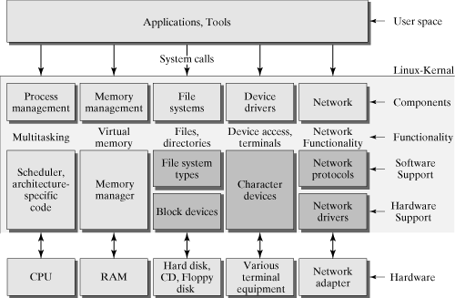

# 如何编写独立的内核模块

## 实验概述

本实验将会带大家实现独立的内核模块，我们会实现一个VFS模块，并在此基础上实现修改rcore的easy-fs、一个简单RamFs，在有了这个实践的基础，大家可以自己去实现一个独立的模块。

### 实验准备

这个实验实验rcore的ch8分支进行实验，因此你只需要切换到ch8分支上即可，如果你已经对ch8分支进行过修改也没有关系，因为前面的实验中并没有涉及到文件系统的修改，而且这次的实验会尽可能地脱离内核，以应用的视角来进行实现。[完整的代码](https://github.com/Godones/rCore-Tutorial-v3/tree/ch8-vfs)

### 实验概述

在Lab2-引入外部代码一节中，我们教大家如何引入了其它内核的代码实现，当时我们的做法是直接复制粘贴代码。这种方式不能说不行，但是不够优雅。`rust`给我们提供了很好的机制允许我们编写一些独立的`crate`，我们经常会在[crates.io](https://crates.io/)引用别人写好的库或者可执行程序，那么当我们在写内核代码的时候，自然而言也希望我们编写的代码会被别人方便地引用，那最好的做法就是我们在实现内核功能的时候尽量做到模块化，将这些功能以一个个`crate`的形式发布到网站上。

当然内核中有很多可以模块化的地方，我们不能一次性涵盖这么多主题。我们以其中涉及面最广的文件系统来做一个示例，展开对内核模块化的探讨。

在本章中，我们会依次学习以下几部分内容:

1. 为什么要进行模块化？简要介绍模块化的好处以及可能的困难
2. 思考如何从内核中拆分出可独立的模块
3. 实现一个简单的`VFS`模块，并改造原有的`easy-fs` 以满足 `VFS` 的要求
4. 实现一个简单的`Ramfs`
5. 在用户态测试和发布我们编写的模块

在此基础上，你可以进一步扩展`VFS`模块，因为它仍然缺少很多功能，比如文件系统的挂载、卸载以及其它许多可能的接口，在完善`VFS`后，你可以继续为各个具体的文件系统(`easy-fs` `ramfs`) 甚至到实用的`Fatfs`去适配`VFS`框架，最终你的内核就可以具备一个类似linux 内核中`VFS`一样的子系统，而且你的`VFS` 模块和各个具体的文件系统实现都可以被别人直接复用而不用拷贝代码。


## 为什么模块化？

在具体介绍如何编写一个独立的内核模块前，我们先来看看什么是模块化操作系统以及为什么要模块化。

模块化程序设计技术是20世纪60年代出现的一种结构化程序设计技术。该技术是基于“分解”和“模块化”原则来控制大型软件的复杂度。模块化结构的 OS 基于程序模块化开发的思想，按照功能划分了多个具有一定独立性和大小的模块，如进程管理模块、存储器管理模块、I /O设备管理模块等，并仔细地规定好各模块间的接口，使各模块之间能通过该接口实现交互。然后，再进一步将各模块细分为若干个具有一定功能的子模块之间的接口。若子模块较大时，可再进一步将它细分，此构成的操作系统就是具有模块化结构的操作系统。



Linux系统本身就是一个具有模块化的操作系统，但这个模块化的系统在不断发展的过程中丢失了一些模块化特征。在谈论模块化时，我们主要关注两个特征

1. 内聚性：指模块内部各部分间联系的紧密程度。内聚性越高，模块的独立性越强
2. 耦合性：指模块间相互联系和相互影响的程度。显然，耦合度越低，模块的独立性越好

理论上来说，我们希望一个模块应该同时具备上述两个特征。但Linux内核中的模块即使经过了很细致的划分，仍然会出现很多耦合，比如对于伙伴分配器来说，在Linux内核中，这个模块不仅仅负责分配物理页，它还和其它的模块有着非常复杂的交互，很多模块会依赖伙伴分配器的私有数据做出决策。这种情况在Linux内核中是普遍存在的，当然这有其合理性。但是我们需要做的就是尽量避免这种情况的发生，我们希望一个模块可以只做好它本身的事情并且避免侵入式的数据访问。

当这个OS由一系列高内聚、低耦合的模块来构成时，相比传统的一股脑将所有功能集中到内核的做法，有许多显著的优点:

1. 提高操作系统设计的正确性、可理解性和可维护性
2. 加速操作系统的开发过程
3. 可以针对模块实现进行独立测试

实现这个目标的过程是困难的，这不仅局限于功能实现的困难，更多地会体现在模块划分的过程当中，如果我们在划分模块时，将模块划分得太小，虽然可以降低模块本身的复杂性，但导致模块之间的联系过多，从而加剧系统的混乱；如果将模块划分得过大，又会增加模块内部的复杂性，使内部的联系增加；而且对于模块的划分，必须要求有提前的规划和规范，否则当各个模块被不同的人员进行编写时很容易造成接口的不一致性。面对这些问题，我们的想法是，在开发初期，不需要考虑这么多。我们首先可以编写出足够多的模块，这些模块分散于系统的各个部分，并且有自己定义良好的接口，在有了这些基本的模块之后，我们就可以考虑对这些已有的模块进行筛选和加工，从而形成更好的模块。在有了足够多，足够好的模块之后，我们才去考虑如何规范地定义好各个模块的接口，从而形成最终的模块。

在之前的学习中，各位同学其实已经见到了`rcore`中的模块`easy-fs`, 这就是一个模块化的例子，只不过这个模块实现的还不够好，还可以进一步的改善。


## 如何从OS中拆分出可以独立的模块

很多同学可能有这样的疑惑，我怎么知道哪些内核模块可以独立出来？一开始写内核代码的时候我们确实对这个问题感知不强，但在你已经有内核代码阅读经历的基础上，其实你已经隐约知道一些非常明显可以编写成独立模块的部分，比如**内存管理**， 通常，内存管理模块的输入就是一段很大的可用的内存空间，而它的功能就是分配一些小的内存块出来，相信你已经知道`rcore`中使用了`buddysystem` 这个内存管理模块来分配物理内存。再比如**设备驱动**，内核想要真正发挥作用，就需要与一系列外部设备打交道，而这中间就需要设备驱动来进行通信，计算机世界中的设备多种多样，从鼠标、键盘、屏幕等我们每天都直接接触的设备到网卡、声卡、磁盘等非直接接触的设备，这些设备内部形成了一个小的系统，由设备内部的各种寄存器和内存一起运作。而设备驱动，就是根据各个设备的手册和通信协议规范来实现的一个软件，通过这个设备驱动，OS就可以避免直接与设备交互，而是通过一些接口进行更高层次的控制。在`rcore`中，`virtio`是你遇到的第一个设备驱动集合(里面包含了网卡、磁盘等设备驱动)。

从这里我们也可以看到，内核中的一部分模块是具有较强的独立性的，总结来说，内核中一些容易独立的模块可能具有以下特征:

1. 这些模块负责的功能比较单一，通常他们只负责一个很具体的功能
   1. 物理页分配
   2. 内存分配
   3. 设备驱动
2. 一些模块可能只是一个算法的具体实现
   1. 红黑树
   2. `rangemap`
   3. 调度算法
3. 一些模块用于抽象一类系统的功能
   1. VFS

但内核中可不仅仅只有这些，还有许多其它功能，那么其它那些看起来不能独立的模块是真的不能独立吗？这个问题不能一概而论，当一个模块的功能与内核的功能过于耦合时，这个模块就不宜直接全部独立出去，相反，我们可以对这个模块的内部进一步探索，往往复杂的模块内部都存在一些独立的部分，复杂有时候仅仅体现在它的外部需要与内核其它部分进行信息的交换而已。对于那些不是那么耦合的模块，在一定程度上是可以通过`rust`的`trait` 或者一些不太安全的代码来实现的，这在后面我们使用一个`Ramfs`时会看到应该怎么做。

在开始具体的实现之前，我们先来一览之前的参赛作品中的一些模块。

### [Starry](https://github.com/Azure-stars/Starry)

`starry`由`Arceos`发展而来，因此它也继承了`Arceos`的模块化特性。在其目录`/crates`下，就是一些独立的模块：

| 模块名称       | 功能                      |
| -------------- | ------------------------- |
| allocator      | 物理页分配器/内存块分配器 |
| axfs_vfs       | VFS`trait `定义           |
| axfs_ramfs     | ramfs实现                 |
| driver_display | 图形设备驱动              |
| page-table     | 页表实现                  |
| scheduler      | 调度算法实现              |
| ....           | ......                    |

这里包含了很多实用且广泛的模块，并且多大是跨平台、独立的，我们在实现自己的模块或者如果自己的内核需要的话就可以来这里看看。对于位于`Modules`目录下的模块，这些模块互相引用，并不属于可直接引用的模块。

### [ByteOS]()

`ByteOS`的结构有点类似`Arceos`，里面也有`crates` 和`modules`，额外的还有`drivers`。

| 模块名称  | 功能                   |
| --------- | :--------------------- |
| backtrace | 打印内核调用栈(基于fp) |
| cv1811-sd | cv1811开发板的sd卡驱动 |
| vfscore   | VFS的`trait`定义       |
| timestamp | DateTime结构定义       |

在`modules`目录下，也有少数模块可以被外部模块直接使用，但更多的，许多模块会直接依赖一个`arch`模块，这个模块涵盖了很多功能，因此，当我们想引用这些模块时，可能不得不继而引用`arch`模块，但这`arch`模块中可能包含了我们不需要的许多功能。但从代码来看，这些依赖`arch`模块的模块可以进一步抽象从而去除`arch`的依赖变成一个独立的模块。

### [Alien](https://github.com/Godones/Alien)

`Alien` 是一个类似Linux的传统内核，不过在实现时，尽量将一些必要的内核模块移出了内核，形成了[独立的模块]()https://github.com/kern-crates/docs/blob/main/docs/alien.md。

| 模块名称          | 功能                          |
| ----------------- | ----------------------------- |
| syscall-table     | 统一的系统调用                |
| PLIC              | riscv plic                    |
| kernel-sync       | 内核锁的实现，兼容lock-api    |
| pager             | 物理页分配器                  |
| rslab             | 内存分配器                    |
| vfscore           | vfs `trait`定义               |
| devfs/ramfs/fatfs | 根据vfscore实现的具体文件系统 |
| visionfive2-sd    | VF2开发板的sd卡驱动           |
| .....             |                               |

在Alien中，很多模块是可以直接被复用的，不需要使用者额外再依赖别的模块。

### [Umi](https://github.com/js2xxx/umi/)

`Umi`是一个全异步的内核，与其它内核不同，这个内核中的许多模块是异步的。对于想要编写异步内核的同学来说，这些模块很值得参考，但是对于非异步内核，这些模块可能较难复用。

| 模块名称   | 功能              |
| ---------- | ----------------- |
| paging     | 页表抽象          |
| rand-riscv | 随机数生成器      |
| hart-id    | 获取当前的hart id |

| 模块名称 | 功能              |
| -------- | ----------------- |
| afat32   | 异步fat32         |
| art      | rust的async运行时 |
| co-trap  | 内核陷入陷出      |
| kalloc   | 内存分配          |
| ksync    | 异步同步原语      |
| ....     |                   |

与`ByteOS`类似， `Umi`中的绝大多数模块是紧耦合的，这导致了同一个问题：**不能直接复用** 。许多模块会依赖同一个最核心的模块，但是又并不依赖这个最核心模块的所有功能，当我们想要复用其中一个模块，必然引入另一个模块或者根据它引入模块的功能，自行提供对应的实现。

从上面众多的内核以及其内部的模块列表中可以看到，内核中可以模块化的地方还是很多的，而且我们也提到，许多内核的模块并不是独立的，当我们在实现这部分的代码的时候，我们可以思考如何让这些差一点就独立的模块独立。

你可以阅读这些内核的模块实现，进一步了解他们在进行模块化时考虑了那些因素，又是如何处理模块之间的依赖的。

## 如何编写独立的VFS模块

好了，啰嗦了两个小节，这一节让我们真正动起手来吧，让我们实现一个简单的`VFS`模块，并改造原有的`easy-fs` 以满足 `VFS` 的要求。请准备好`rcore`的`ch8` 代码，或许`ch7`也行，相信你现在已经不在意是第几章了，你在前面章节学到的技能已经让你拥有编写大量内核代码的能力。

让我们先new一个新的lib出来:

```bash
cargo new libvfs --lib
```

我们删除模块代码并在`lib.rs`的开头添加:

```
#![cfg_attr(not(test), no_std)]
```

这一行对于大部分独立模块是必要，这句话的作用是允许我们对编写的模块进行测试，同时在非测试模式下，我们的库是一个[no_std]库，而这也就意味着这个库不依赖具体操作系统，可以广泛地被其它库使用。

让我们回到`easy-fs`中，在实现`easy-fs` 时，我们已经对文件系统的分层架构有了一个了解，并给出了一个`Inode`的抽象，这个抽象代表了磁盘上的一个文件或者目录，并且这个抽象公开了几个重要的接口:

```rust
/// Inode struct in memory
pub struct Inode{...};
impl Inode{
     pub fn new(
        block_id: u32,
        block_offset: usize,
        fs: Arc<Mutex<EasyFileSystem>>,
        block_device: Arc<dyn BlockDevice>,
    ) -> Self;
    /// find the disk inode of the file with 'name'
    pub fn find(&self, name: &str) -> Option<Arc<Inode>>;
    /// create a file with 'name' in the root directory
    pub fn create(&self, name: &str) -> Option<Arc<Inode>> ;
    /// create a directory with 'name' in the root directory
    ///
    /// list the file names in the root directory
    pub fn ls(&self) -> Vec<String>;
    /// Read the content in offset position of the file into 'buf'
    pub fn read_at(&self, offset: usize, buf: &mut [u8]) -> usize;
    /// Write the content in 'buf' into offset position of the file
    pub fn write_at(&self, offset: usize, buf: &[u8]) -> usize;
    /// Set the file(disk inode) length to zero, delloc all data blocks of the file.
    pub fn clear(&self)
}
```

在内核中，我们会对`Inode`进一步封装形成`OSInode`。仔细思考一下，此时我们的内核是不是被这个`Inode`数据结构固定了住了，如果我们实现了另外一个文件系统，那个文件系统也定义了自己的`Inode`结构，也实现了上面这些接口，那么现在内核该如何统一这两个文件系统呢。

最原始和粗暴的方法就是我们可以针对`OSInode`增加成员和接口:

```rust
pub struct OSInode {
	....
    inner: UPSafeCell<OSInodeInner>,
}
/// inner of inode in memory
pub struct OSInodeInner {
    offset: usize,
    inode: Arc<InodeType>,
}

pub enum InodeType{
    Easyfs(easy_fs::Inode),
    Otherfs(otherfs::Inode),
}

impl OSInode{
    pub fn new(readable: bool, writable: bool, inode: Arc<InodeType>) -> Self
}
```

但这样一来，在`OSInode`的实现中，每次进行读写或其它操作时，我们都需要使用一个`match`语句来处理每一个文件系统。这一看就不是那么优雅对吧。想想Linux，它可是允许我们挂载数十种文件系统的。那么linux是怎么做的呢?发挥作用的就是linux内核中VFS框架，它规定了逻辑上目录树结构的通用格式及相关操作的抽象接口，只要不同的底层文件系统均实现虚拟文件系统要求的那些抽象接口，再加上 **挂载** (Mount) 等方式，这些持久存储设备上的不同文件系统便可以用一个统一的逻辑目录树结构一并进行管理。

在linux的VFS中，有几个很重要的数据结构和接口定义，这里我们浅浅地给大家展示其中的一部分 [more]([Overview of the Linux Virtual File System — The Linux Kernel documentation](https://docs.kernel.org/filesystems/vfs.html)):

```c
struct super_operations {
        struct inode *(*alloc_inode)(struct super_block *sb);
        void (*destroy_inode)(struct inode *);
        void (*free_inode)(struct inode *);
        void (*dirty_inode) (struct inode *, int flags);
        int (*write_inode) (struct inode *, struct writeback_control *wbc);
        int (*drop_inode) (struct inode *);
        void (*evict_inode) (struct inode *);
        void (*put_super) (struct super_block *);
    	.....
}
struct file_operations {
        struct module *owner;
        loff_t (*llseek) (struct file *, loff_t, int);
        ssize_t (*read) (struct file *, char __user *, size_t, loff_t *);
        ssize_t (*write) (struct file *, const char __user *, size_t, loff_t *);
    	......
}
struct inode_operations {
        int (*create) (struct mnt_idmap *, struct inode *,struct dentry *, umode_t, bool);
        struct dentry * (*lookup) (struct inode *,struct dentry *, unsigned int);
        int (*link) (struct dentry *,struct inode *,struct dentry *);
        int (*unlink) (struct inode *,struct dentry *);
        int (*symlink) (struct mnt_idmap *, struct inode *,struct dentry *,const char *);
        int (*mkdir) (struct mnt_idmap *, struct inode *,struct dentry *,umode_t);
        int (*rmdir) (struct inode *,struct dentry *);
        int (*mknod) (struct mnt_idmap *, struct inode *,struct dentry *,umode_t,dev_t);
        int (*rename) (struct mnt_idmap *, struct inode *, struct dentry *,
                       struct inode *, struct dentry *, unsigned int);
    	......
}
```

这里给出了超级块、文件、`Inode`的接口定义，是不是看起来有点熟悉，`file_operations` 有点像内核的`File` `trait`， `inode_operations`有点像 上面的`Inode`接口，是的，其实我们已经有一点linux的vfs的影子了。很好，我们可以对我们的实现稍微重构一下，让它更好(在参考Linux的实现时，切勿直接仿照，以笔者的经验来看，直接将linux的c实现翻译到rust是不好的，这两门语言有自己的特点，在c语言中看起来很合理的东西(指针)放到rust中就不那么容易一一对应了，我们应该做的是参考Linux的设计思路并在rust中设计一个符合rust工程学的结构)。

对于前面展示的`Inode` 接口，我们提到，在实现其它类型的文件系统时，我们也是采用这些接口，这就带来了一个共同点:

- 我们在实现不同的文件系统时，希望暴露同样的接口给外部使用者使用

于是乎，我们可以将这些接口组织成`rust`的`trait`，并放在刚才创建的`libvfs`中，现在，这个接口就形成了一个独立可复用的模块，因为它不包含任何依赖。

```rust
/// The VfsInode trait
pub trait VfsInode:Send+Sync {
    /// find the disk inode of the file with 'name'
    fn find(&self, name: &str) -> Option<Arc<dyn VfsInode>>;
    /// create a file with 'name' in the directory
    fn create(&self, name: &str) -> Option<Arc<dyn VfsInode>>;
    /// list the file names in the root directory
    fn ls(&self) -> Vec<String>;
    /// Read the content in offset position of the file into 'buf'
    fn read_at(&self, offset: usize, buf: &mut [u8]) -> usize;
    /// Write the content in 'buf' into offset position of the file
    fn write_at(&self, offset: usize, buf: &[u8]) -> usize;
    /// Set the file(disk inode) length to zero, delloc all data blocks of the file.
    fn clear(&self);
}

```

你可能已经看到了这些接口出现了一些变化，之前的`Arc<Inode>`变成了`Arc<dyn VfsInode>`, 这就去掉了对具体数据结构的依赖，在你新实现的文件系统中，你没有必要再定义一个跟`easy-fs` 一样的`Inode`的数据结构，你可以定义`RamFsInode` 、 `MyInode` 等等，只要它实现了我们定义的`trait`就行。

你也可以看到我们没有对这些接口做太大的变更，也没有增加诸如`mkdir` 、 `unlink` 这些想要兼容更多Linux应用就必须实现的接口，这里只是为了简化本实验的难度而已，这可以避免你对已有的`easy-fs`做出大量修改。相反，在你真正开始设计你的VFS或者扩展别的同学的VFS时，你可能需要仔细地设计和添加新的接口。

在有了上面的`VfsInode` 定义后，我们将目光转移到`easy-fs`中，对其进行改造从而实现我们定义的接口。这一步是很简单的，因为我们本身就是从`easy-fs`出发设计这个`trait`。 

在`Cargo.toml`中，添加`libvfs` 依赖:

```rust
[dependencies]
libvfs = { path = "../libvfs" }
```

在原来的`vfs.rs`中，我们只需要将原来的实现移入到`VfsInode`的实现当中即可：

```rust
impl VfsInode for Inode {
	fn find(&self, name: &str) -> Option<Arc<dyn VfsInode>>{
		......
	}
}
```

乍一看，是不是觉得上面这些工作都很简单，是的，当功能被足够简化时，我们确实不需要实现很多代码，但是要记住，当模块因为扩展逐渐变得复杂，我们仍然会会需要编写大量的代码，切勿低估了真实系统的复杂性。

为了能更好地利用好我们定义的`VfsInode` 接口，也为了说明这个独立模块很有用，我们将根据这个接口实现一个`Ramfs`。当你查看linux系统上的根目录的时候，你肯定会看到下面这些目录:

```
boot
dev
home
proc
sys
tmp
.....
```

而其中`tmp`目录上就挂载了一个文件系统`tmpfs`， 而Linux还支持我们创建`ramfs`，这两个文件系统其实都属于内存文件系统，只是`tmpfs` 除了使用系统内存外，还可以使用`swap`区域，而`ramfs`就只单纯地使用系统内存。

当然其它目录上其实还挂载了其它文件系统，比如`sys-> sysfs` 、 `proc->procfs`等，广义上来说，这些文件系统其实也算是内存文件系统的一种，因为这些文件系统的信息是在系统运行过程中动态产生的，而这些信息位于内存中。

当我们把精力集中在`ramfs`上，并只关注定义的几个接口，有了`easy-fs`的经验，相信你的脑海中已经浮现出一个原型系统了。

### Ramfs

我们新建一个`crate`， 就像创建`libvfs`一样:

```rust
cargo new ramfs --lib
```

然后加入`libvfs`依赖，因为我们将要实现定义的接口。

接下来我们定义`RamFs`的结构，就像`EasyFileSystem`一样:

```rust
pub struct RamFs<T> {
    inode_index: AtomicUsize,
    inode_count: AtomicUsize,
    root: Mutex<Option<Arc<RamFsDirInode<T>>>>,
    _provider: PhantomData<T>,
}
```

这里多出了一个泛型参数，不要着急，后面我们会知道它的作用。因为`ramfs`位于内存当中，所以它的结构相比磁盘文件系统会简单得多。这里我们只使用了几个必须的变量来记录文件系统的一些元数据

1. inode_index：用来创建文件时分配inode号码
2. inode_count： 记录当前的文件数量，在目前的文件系统实现中其实和inode_index一样，因为我们没有提供删除文件的接口
3. root：记录当前的根目录
4. _provider: 绕过编译器的检查(因为我们没有在结构体中定义泛型参数相关的字段导致)[更多信息](https://zhuanlan.zhihu.com/p/533695108)

我们为`RamFs`也实现了与`EasyFileSystem`类似的接口:

```rust
pub fn new() -> Arc<Self> {
        let fs = Arc::new(Self {
            inode_index: AtomicUsize::new(0),
            inode_count: AtomicUsize::new(0),
            root: Mutex::new(None),
            _provider: PhantomData,
        });
        fs
    }
pub fn root(self: &Arc<Self>) -> Arc<RamFsDirInode<T>> {
    let mut root = self.root.lock();
    if root.is_none() {
        let inode = Arc::new(RamFsDirInode::new(0, String::from("/"), self.clone()));
        *root = Some(inode.clone());
        self.inode_count.fetch_add(1, Ordering::SeqCst);
        self.inode_index.fetch_add(1, Ordering::SeqCst);
    }
    root.clone().unwrap()
}
```

接下来，我们定义两个最重要的数据结构：

```rust
pub struct TimeSpec {
    pub sec: usize,
    pub nsec: usize,
}
pub struct RamFsDirInode<T> {
    id: usize,
    name: String,
    children: Mutex<Vec<Arc<RamFsFileInode>>>,
    fs: Arc<RamFs<T>>,
    ctime: TimeSpec,
}
pub struct RamFsFileInode {
    id: usize,
    name: String,
    content: Mutex<Vec<u8>>,
    ctime: TimeSpec,
}
```

与`easy-fs`不同，我们定义了两种类型的`Inode`, 为什么这样做呢，我们知道，文件系统中除了普通文件外，还有目录、设备文件、链接文件等，而在定义`VfsInode`时， 我们说这个`trait`抽象了文件的操作，这里的文件其实包含了我们提到的所有种类的文件，但是你仔细想想，实际上这些文件的属性是不一样，对于目录说，你让他实现`write_at`或者`read_at`就很奇怪，对于普通文件来说，你让他实现`create`或者`ls`也会很奇怪。所以说`VfsInode` 虽然抽象了所有种类的文件的操作，但是对于具体的实现，我们要根据需要进行调整。

简单起见，我们只定义了目录和普通文件两种类型，在`easy-fs`中对其进行了进一步的简化从而没有区分这两者，如果你直接对根目录调用`read_at`可能就会导致文件系统崩溃。

好了，我们定义了对应不同文件的`Inode`结构，剩下的事情就是为这两个结构实现我们定义的`trait`了，这很简单，请看下面的代码，当然你可以自己实现:

```rust
impl VfsInode for RamFsFileInode {
    fn find(&self, _name: &str) -> Option<Arc<dyn VfsInode>> {
        None
    }
    fn create(&self, _name: &str) -> Option<Arc<dyn VfsInode>> {
        None
    }
    fn ls(&self) -> Vec<String> {
        Vec::new()
    }
    fn read_at(&self, offset: usize, buf: &mut [u8]) -> usize {
        let content = self.content.lock();
        let len = content.len();
        let buf_len = buf.len();
        let copy_start = offset.min(len);
        let copy_end = (offset + buf_len).min(len);
        buf[..(copy_end - copy_start)].copy_from_slice(&content[copy_start..copy_end]);
        copy_end - copy_start
    }
    fn write_at(&self, offset: usize, buf: &[u8]) -> usize {
        let mut content = self.content.lock();
        let len = content.len();
        let buf_len = buf.len();
        if len < offset + buf_len {
            content.resize(offset + buf_len, 0);
        }
        let copy_end = offset + buf_len;
        content[offset..copy_end].copy_from_slice(buf);
        buf_len
    }
    fn clear(&self) {
        let mut content = self.content.lock();
        content.clear();
    }
}
```

```rust
impl<T: RamFsProvider> VfsInode for RamFsDirInode<T> {
    fn find(&self, name: &str) -> Option<Arc<dyn VfsInode>> {
        let children = self.children.lock();
        for child in children.iter() {
            if child.name() == name {
                return Some(child.clone());
            }
        }
        None
    }
    fn create(&self, name: &str) -> Option<Arc<dyn VfsInode>> {
        let mut children = self.children.lock();
        let inode = Arc::new(RamFsFileInode::new(
            self.fs.alloc_inode(),
            String::from(name),
            T::current_time(),
        ));
        children.push(inode.clone());
        Some(inode)
    }
    fn ls(&self) -> Vec<String> {
        let children = self.children.lock();
        let mut names = Vec::new();
        for child in children.iter() {
            names.push(child.name().to_string());
        }
        names
    }
    fn read_at(&self, _offset: usize, _buf: &mut [u8]) -> usize {0}
    fn write_at(&self, _offset: usize, _buf: &[u8]) -> usize {0}
    fn clear(&self) {}
}
```

可以看到，对于`RamFsFileInode`， 我们并没有实现`create` `ls` `find`, 对于`RamFsDirInode`，我们没有实现`read_at` `write_at` `clear`，这很符合我们对普通文件和目录的理解。

这里值得提的一点是我们的接口设计的并不够好，我们希望对于`RamFsFileInode`，在调用`create`或者另外不支持的功能时返回错误而不是我们实现中的None,所以更好的返回值应该设计为`Result<Arc<dyn VfsInode>,VfsError>`, 我们可以在`libvfs`中定义文件系统可能出现的错误`VfsError`。大家可以对这个进行修改。

现在我们就已经根据`VfsInode`的定义实现了一个新的文件系统，在继续修改内核代码以达到内核可以支持多种文件系统的功能前，我们来解答上面保留的问题，`Ramfs`的那个泛型参数的作用是什么。

试想一下，一个文件系统在创建文件的时候要保存的一部分元数据是什么，你可以在linux系统上使用`stat`目录查看一个文件试试，你可以得到下面的信息：

```
stat ./Cargo.toml
  File: ./Cargo.toml
  Size: 272             Blocks: 8          IO Block: 4096   regular file
Device: 820h/2080d      Inode: 824376      Links: 1
Access: (0644/-rw-r--r--)  Uid: ( 1000/ godones)   Gid: ( 1000/ godones)
Access: 2023-11-19 20:34:20.269529331 +0800
Modify: 2023-11-19 20:34:20.259529332 +0800
Change: 2023-11-19 20:34:20.259529332 +0800
 Birth: 2023-11-19 19:56:29.299676521 +0800
```

其中底部的四行显示了文件系统保存的关于文件的时间相关的元数据，包括创建时间、访问时间、修改时间等，所以可以得出结论，当我们实现一个真正可用的文件系统时，我们需要文件系统可以记录文件的时间信息，而文件系统如何获取时间呢，那肯定是从操作系统获取，只有内核掌管设备，只有内核有办法从时钟设备中获取时间，所以这时候文件系统模块就变成了在之前我们提到的那种需要与内核进行交互的模块，我们想要独立文件系统模块，就需要处理这个问题，而这里的泛型参数就是其中一种解决办法。

相信你已经对`rust`的泛型参数有所了解，这里我们不再赘述，让我们直接看这个泛型参数所使用的约束即可:

```rust
pub trait RamFsProvider: Send + Sync {
    fn current_time() -> TimeSpec;
}
```

我们定义了一个`RamFsProvider`来表达创建`RamFs`需要的外部输入，即获取当前的时间。有了这个约束，当我们在内核创建`RamFs`时，我们就必须为其提供对应的实现，而`RamFs`也就成功地从内核获得了额外的信息。

```rust
struct Provider;
impl ramfs::RamFsProvider for Provider {
    fn current_time() -> ramfs::TimeSpec {
        TimeSpec { sec: 0, nsec: 0 }
    }
}

fn main() {
    let ramfs = RamFs::<Provider>::new();
}
```

这个方法对于很多可能独立的模块是很有用的，通过`trait` 和泛型参数，我们就可以隔离模块和内核降低耦合。不过有一点不好的地方在于这种方式具有传染性(由于泛型参数)，导致我们很多数据结构都不得不带上泛型参数和约束，不过为了让模块更加独立，这些工作是值得的。

当然也有一些不太安全的方式可以解决上面的问题，这里我们只作介绍，不希望大家在编写独立模块的时候使用。我们可以使用`rust` 的`extern "C"`来完成这件事。

```rust
extern "C" {
    fn current_time() -> TimeSpec;
}
```

通过定义一个`extern "C"`，我们可以省去上面的那些泛型参数和相关定义，在需要获取时间时，直接就调用`current_time`，但是要被包裹在unsafe块中。这其实就相当于声明了一个全局可见的函数，我们要在内核提供一个实现以便在编译链接时可以找到。

```rust
#[no_mangle]
fn current_time() -> TimeSpec{
    
}
```

这种方式有很多问题，比如定义的接口不能出现` not FFI-safe`的参数或返回值(当然你强制出现也不是不可以，不过出现bug时可能比较难debug)。而且我们在调用时不得不出现unsafe代码，我们应该尽量避免unsafe代码。`#[no_mangle]`的出现也可能导致实现冲突的情况，因为你不能保证你引入的库中没有定义一个相同的函数。

这里我们可以再提供一种方法: 直接参数传递。对于`ramfs` 来说，可能的形式如下:

```rust
/// create a file with 'name' in the directory
fn create(&self, name: &str,ctime:TimeSpec) -> Option<Arc<dyn VfsInode>>;
```

我们在`create`函数中增加了一个time参数, 用户在调用这个函数时就可以将值传递进来，这种方式可能带来的一个坏处时，可能很多接口都不得不带上这个参数，这给使用者带来了比较大的使用负担，而且这种方式在一些情况下可能不适用。


### 内核修改

现在我们实现了RamFs，如何让内核支持不同的文件系统呢，让我们对内核进行一点点修改。我们需要引入我们实现的`libvfs`和`ramfs`。

```rust
libvfs= {path = "../libvfs"}
ramfs = {path = "../ramfs"}
```

然后只需要内核修改两个定义即可:

```rust
pub struct OSInodeInner {
    offset: usize,
    inode: Arc<dyn VfsInode>,
}

impl OSInode {
    /// create a new inode in memory
    pub fn new(readable: bool, writable: bool, inode: Arc<dyn VfsInode>) -> Self {
    }
}
```

为了正常运行，你可能还需要在`easy-fs-fuse`中引入依赖，因为这个程序使用了`write_at`功能，而这个功能现在被我们定义在`VfsInode`中了。

这里提一个前面没有谈到的问题，那就是我们在`easy-fs` 或者 `ramfs`中实现`VfsInode`时，在顶层模块中，我们应该导出这个`trait`定义，就像下面这样:

```rust
pub use libvfs::*;
```

因为对于使用这些模块的人来说，它可能并不想引入`libvfs` 这个依赖, 我们尽量做到自包含来避免这样的问题，同时给予使用者最大的灵活性。

现在对内核来说`ramfs`似乎还不起作用，这是正常的，因为内核现在不支持挂载文件系统这种高级功能，导致即使我们编写了`ramfs`也无用武之地。不过在你实现自己的内核时它就能发挥它的作用了。

至少现在对于内核来说，可以不再只局限于`easy-fs`上了，只要文件系统实现了我们上面定义的接口，我们就可以替换掉`easy-fs`。 而且更多的，我们已经知道如何编写一些独立的模块了。现在其他人不仅可以基于你的VFS定义去扩展和实现他们的文件系统，他们还可以直接使用你实现的`easy-fs` 和`ramfs` ，这几个模块都不依赖内核，并且互相之间也不是强依赖。

到现在为止，大家已经学习到了编写一个独立模块所需要的所有步骤。

## 如何测试和发布模块

### 测试

在我们实现独立的模块后，我们需要对实现进行测试，以验证实现的正确性。对于程序开发而言，测试可以说是至关重要的一环，虽然它无法完全消除所有的 Bug，但是可以在我们发布模块之前尽可能找出程序的问题。

已经有很多文档描述了如何编写测试，我们就不教大家了。[如何写测试](https://course.rs/test/write-tests.html)

我们来考虑在编写独立模块时如何决定要不要测试以及如何测试？

首先对于`libvfs`这种 只有`trait` 和一些数据结构定义的模块，我们只需要争对少量的代码进行测试即可，即对那些包含了具体功能的数据结构进行测试。

对于像`ramfs`或者`easy-fs`这样的具体实现来说，通常对单个函数进行测试是不太直接的，因为对这些函数的测试往往依赖你已经创建的系统，比如你想测试`write_at`对不对，你可能就需要在测试代码中：

1. 创建一个文件系统
2. 创建一个文件
3. 写入一些内容
4. 读出一些内容
5. 检查这个内容是否正确

这样一来就不是针对单个函数的测试了，所以对于这种比较复杂的系统，我们会选择在一个测试中尽可能测试多的功能，并编写多个测试来涵盖大部分的可能出现的情况。

在`ramfs`中，我们编写了两个简单的测试,你可以增加更多的测试并且对`easy-fs`也编写测试。

```rust
  #[test]
    fn test_find() {
        let fs = RamFs::<Provider>::new();
        let root = fs.root();
        let etc = root.create("etc").unwrap();
        let passwd = root.create("passwd").unwrap();
        let _etc = root.find("etc").unwrap();
        let _passwd = root.find("passwd").unwrap();
        assert!(Arc::ptr_eq(&etc, &_etc));
        assert!(Arc::ptr_eq(&passwd, &_passwd));
        let no = root.find("no");
        assert!(no.is_none());
    }
    #[test]
    fn test_read() {
        let fs = RamFs::<Provider>::new();
        let root = fs.root();
        let r = root.read_at(0, &mut [0u8; 10]);
        assert_eq!(r, 0);
        let etc = root.create("etc").unwrap();
        etc.write_at(0, "hello world!".as_bytes());
        let mut buf = [0u8; 20];
        let r = etc.read_at(0, &mut buf);
        assert_eq!(r, 12);
        assert_eq!(core::str::from_utf8(&buf[..r]).unwrap(), "hello world!");
    }
```

### 如何发布模块

在实现完成并打磨好我们编写的模块之后，我们希望这些模块被别人复用，一些同学可能会主动查看你的仓库并看到你实现的模块，而一些同学到rust的`crates.io`上查找相关的库使用。为了让我们的独立模块得到更多人使用和反馈，最好的方式就是发布到`crates.io`上。

不过在发布前，请确保下面的这些事情你都做了:

1. 测试全部通过
2. 良好的注释和代码文档
3. 有一些简单的使用案例(就像我们在`ramfs`中编写的一样)
4. 有一个简洁明了的`README`

在完成这些事情之后，你就可以发布自己的模块了，`rust`官方的教程中给出了如何发布的步骤，你只需要安装步骤一步步完成即可，可以在这里看到一些有用的信息[rust程序语言设计](https://kaisery.github.io/trpl-zh-cn/ch14-02-publishing-to-crates-io.html) 。

这里提两个主要的点关注:

1. 确保我们的独立模块的依赖都来自`crates.io`上
2. 在`cargo.toml`中的`keywords`属性中要阐述出我们的模块的功能，别人才能更快地注意到这个模块


## 练习

### 编程作业

前面我们已经给出了三个模块实现，分别是`libvfs` 、 `ramfs` 、`easy-fs`，但是我们实现的`ramfs`对于rcore来说不是那么实用，所以这里我们写一个有用的文件系统`fatfs`来练习练习,不用害怕，我们不是让大家从零实现一个fat系列的文件系统，我们可以使用已经实现的[fatfs](https://crates.io/crates/fatfs)。 我们需要做的是让rcore支持这个文件系统。

这个文件系统也是一个独立的模块，因此我们可以很方便地复用，而且它也使用了我们之前使用的泛型参数和`trait`来与外部依赖进行交互(块设备)。所以在实现过程中你也可以进一步学习模块化的思想。

在本实验中，你可能需要完成以下这些工作:

1. 查看fatfs的示例，了解如何运行这个系统
   1. 阅读[Linux的手册](https://man7.org/linux/man-pages/man8/mkfs.8.html)了解如何创建一个块设备
   2. fatfs支持格式化块设备，也许你也可以直接创建一个文件，然后格式化它
2. 定义一些自己的数据结构包装fatfs的数据结构，然后实现`VfsInode`的接口
3. 将rcore的`easy-fs`替换成新的`fatfs`实现

除此，你也可以考虑对内核的其它模块进行模块化。

### 提示

1. 在lab3中你可以看到其它OS如何构建文件镜像，他们的文件系统支持就是`fat32`
2. `fatfs`中有`File` 和 `Dir`结构，他们提供的接口可以帮助你实现

### 思考题

1. 从`RamFs`和`EasyFileSystem`可以看到，我们都提供了`root()`接口来获取根目录，是不是我们也可以对文件系统做一个抽象，形成一个类似`VfsInode`的`VfsFileSystem`，里面包含一些文件系统都应该实现的功能？

2. 该如何增加文件系统挂载的功能？

### 报告要求

- 完成编程作业，描述实现思路以及修改的代码。本章没有自动评测，我们会人工检查你的代码实现和报告。
- 完成问答题。
- 推荐使用 `markdown` 格式
- 和 rCore-Tutorial 实验类似，报告放在 `reports/`文件夹下，但命名为 `labr4.md`或`labr4.pdf`

