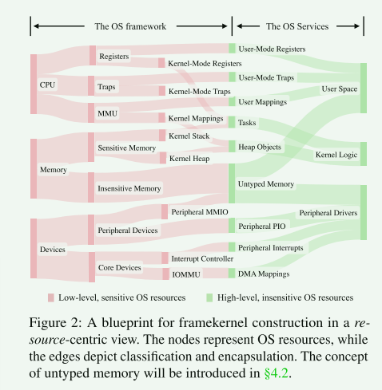
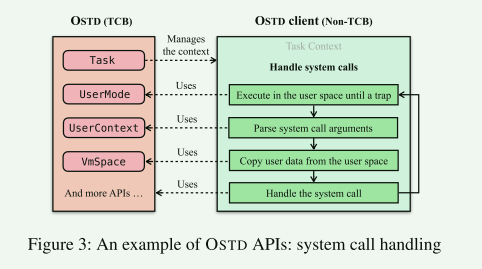
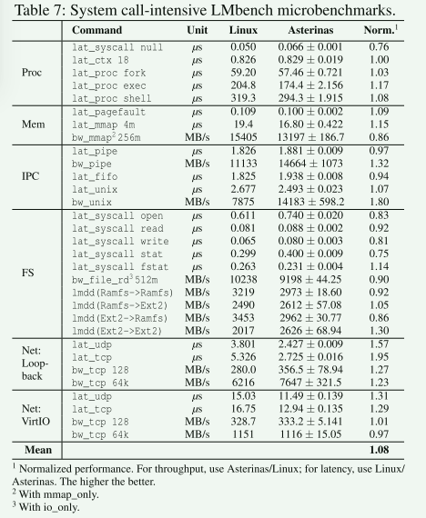
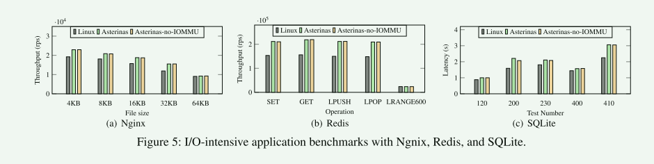
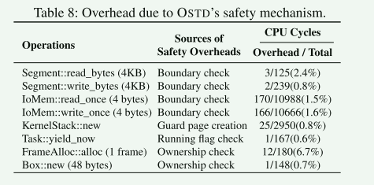
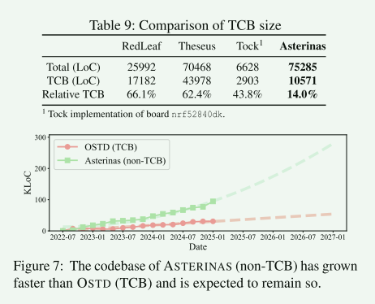
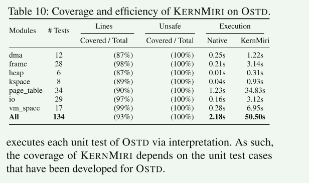

# ASTERINAS: A Linux ABI-Compatible, Rust-Based Framekernel OS with a Small and Sound TCB

如何构建一个功能丰富、通用性强且基于Rust的操作系统（OS），同时确保其可信计算基（TCB）在内存安全方面保持最小化与可靠性？现有基于Rust的操作系统因在内核开发中不当使用`unsafe Rust`而存在缺陷。为解决这一挑战，我们提出名为**framekernel**的新型OS架构，通过充分发挥Rust的潜力实现内核内特权隔离，从而保证TCB的最小化与可靠性。

## Introduction

近年来，随着 Rust编程语言的成熟与普及，基于 Rust的内存安全操作系统开发势头强劲。Rust通过所有权（ownership）、借用（borrowing）和生命周期（lifetimes）等创新语言特性提供内存安全保证，无需依赖垃圾回收机制即可实现安全的内存管理。

**Unsafe Rust**  尽管采用Rust是实现内核内存安全的重要一步，但仅此并不足够，因为基于Rust的操作系统必须包含非安全（unsafe）Rust代码。内核编程所需的底层控制类型的安全性无法通过Rust编译器静态验证，因此Rust仅允许在标有`unsafe`关键字的特殊代码块中使用此类操作。尽管Rust语言团队专门编写了整本著作来探讨"非安全Rust的黑暗艺术"，开发者仍容易误用该特性，RustSec安全公告数据库已记录了数百起因非安全代码滥用导致的漏洞

**业界对Unsafe Rust的处理**

1. 谨慎使用`unsafe`
2. 将`unsafe`代码封装在安全抽象层内

在基于Rust的OS中，`unsafe`代码广泛存在：Linux、Tock、RedLeaf和Theseus中涉及`unsafe`的crate占比分别达到55%、93%、62%和32%。

**核心问题：能否几乎完全基于安全Rust构建一个功能丰富、通用型的操作系统内核？**

Framekernel: 一种新颖的操作系统架构，旨在为Rust操作系统实现最小化且可靠的可信计算基（TCB）。在该架构中，整个操作系统驻留在单一地址空间（类似宏内核），并完全采用Rust实现。内核在逻辑上划分为两部分：特权级操作系统框架（类微内核）与降权级操作系统服务。仅特权框架允许使用`unsafe`代码，而降权服务必须完全用安全Rust编写。作为TCB，特权框架将所有面向硬件的底层不安全操作封装在安全API之后。通过这些安全API，降权服务可实现包括设备驱动在内的各类操作系统功能。框架内核在避免硬件隔离额外开销的同时，实现了TCB的最小化。因此，我们认为框架内核兼具宏内核与微内核的双重优势

**核内特权分离**： 系统化地识别敏感操作系统资源（即那些即使使用安全的Rust语言也可能因编程错误或滥用而导致内存安全问题的资源），将敏感操作系统资源保留在特权框架内以确保稳健性，同时将非敏感资源委托给降权后的操作系统服务以实现最小化

## Background

### Rust

Unsafe Rust：为提供更强的表达能力，Rust提供了 `unsafe`关键字，允许程序员绕过编译时检查，从而将确保安全的责任转移给使用不安全代码块的程序员

Undefined behaviors：Rust中的未定义行为（UBs）指破坏语言正确性与安全性保障的操作，包括内存安全、线程安全和类型安全。Rust语言团队维护的官方UB检测工具Miri能有效检测标准Rust应用中的UBs，但其设计未考虑底层系统编程需求（尤其在内存管理与硬件交互领域）

> 本研究致力于在Rust操作系统场景中实现UB的系统化识别与预防。

> 经验总结：在传统单体内核上构建安全的 Rust抽象层必然需要大量使用 `unsafe Rust`。

### Rustification OSes

RFL：除了膨胀的TCB（Trusted Computing Base）规模外，庞大的遗留代码库负担——其现状与既定理念——也制约了Rust的效能与RFL（Rust for Linux）的健全性

> 经验总结：实现可靠的内存安全性需要一个将安全性置于首位的全新操作系统。

### Rusty OSes

Tock 、RedLeaf 和Theseus ：对安全驱动程序开发的支持不足。这些系统中的设备驱动常需依赖`unsafe`代码来管理底层资源，例如原始数据缓冲区、内存映射I/O（MMIO）、I/O端口以及DMA区域

> [!WARNING]
>
> 考虑到驱动程序通常占据操作系统代码库的最大比重，大量使用`unsafe`代码会显著增加内存安全漏洞的风险。

语言层面的未定义行为（UBs）已通过Rust的安全保障机制得到有效解决，但源自执行环境或CPU架构的UBs在现有基于Rust的操作系统中仍未解决。例如，恶意设备可能通过DMA破坏内核内存，或伪造中断以操纵CPU陷阱处理程序；同样地，栈溢出可能危及执行环境——这类问题超出了安全Rust的检测能力范围

> 经验总结：Rust操作系统必须为可能受外部修改（如硬件、用户程序或 DMA）影响的内存开发安全抽象层。

> 经验教训：Rust操作系统不仅应在语言层面防范未定义行为（UB），还需在架构与环境层面建立防护机制。

## FrameKernel

设计理念。框架内核架构的核心在于**内核内特权分离**：尽管操作系统服务运行在CPU特权模式下，但其行为受到安全Rust和特权框架的约束，从而维持其降权状态。只有特权框架内部的缺陷才可能危及内核的内存安全性。这种内核内特权分离必须满足两个关键属性：**健全性(Soundness)**与**最小化(minimality.)**。

> 健全性：该操作系统框架确保在所有情况下均不会出现未定义行为（UBs），无论其与操作系统服务、用户代码或外围设备的交互方式如何。

> 最小化原则：只有当某组件被移出操作系统框架会导致无法实现必需的系统服务功能，或破坏框架的健全性时，该组件才被允许存在于框架内

从本质上说，操作系统管理着三类资源：CPU、内存和设备。所有三类基础资源均可划分为敏感子集与非敏感子集。

- CPU资源涉及内核态与用户态控制
- 内存资源包含用于内核代码、栈、堆及页表的敏感内存，而分配给非受信用户进程或设备的存储空间则属于非敏感资源
- 核心设备配置错误可能导致整个内核崩溃，而外围设备故障通常仅局限于该设备自身

## OSTD

### Expressive API

- 在安全用户态-内核态交互方面
  - 切换到用户空间并执行直至陷入陷阱（UserMode）
  - 操作用户态CPU寄存器（UserContext）
  - 管理用户地址空间（VmSpace）
- 安全内核逻辑构建方面，其提供同步原语（如SpinLock、Rcu、Mutex、WaitQueue和CpuLocal）及高效数据集合类型（如LinkedList和RbTree）
- 在安全内核-外设交互方面，支持注册中断处理程序（IrqLine）、执行MMIO与PIO（IoMem和IoPort）、创建一致性或流式DMA映射（DmaCoherent和DmaStream）

### Frame 管理

OSTD采用帧元数据系统来追踪每个页帧的状态，包括引用计数和可定制的元数据字段

> **不变式1**：任何新分配的`Frame`或`Segment`均源自当前未使用的内存

帧（Frame）与段（Segment）均可用于表示敏感或非敏感内存。在系统内部，OSTD利用它们为内核资源（如页表、栈或内存块）分配敏感内存。对外部而言，OSTD客户端可通过 `UFrame<M> = Frame<M: AnyUFrameMeta>`或 `USegment<M> = Segment<M: AnyUFrameMeta>`请求一种特殊的非敏感内存——非类型化内存（untyped memory），其中特征标记 `AnyUFrameMeta`用于标识适用于非类型化内存的元数据类型

**无类型内存处理的核心问题是：外部可修改内存（如用户映射内存或支持DMA的内存）无法维持Rust引用的强保证或任意Rust类型的类型安全**

### 特权分离

内核内特权隔离要求防止所有敏感资源被非可信计算基（TCB）实体篡改，包括安全客户端、用户程序及外围设备

> 不变式2：内核态 CPU状态无法被 OSTD客户端篡改。

> 不变式3：外设设备无法篡改内核态 CPU状态

> 敏感内存不可被OSTD客户端篡改。

> 敏感内存不可被用户程序篡改

> 敏感内存（包括I/O内存）不可被外围设备篡改

> 敏感I/O内存或端口不能被OSTD客户端篡改

OSTD利用来自体系架构、固件（例如 x86平台上的 ACPI表）以及核心设备驱动的信息，将 I/O内存和端口范围标记为敏感或非敏感区域。`IoMem`和 `IoPort`仅能实例化于非敏感区域，从而防止对敏感 I/O寄存器的意外或恶意滥用

### 安全策略注入

对任何安全抽象正确性的信心，最终取决于其可信计算基（TCB）的规模与复杂度。**如何约束OSTD——即使其实现随时间推移采用日益复杂的策略与机制？**

OSTD由以下组件构成，每个组件均基于特定策略或策略进行决策：(1) **任务调度器**决定下一个运行的任务，(2) **帧分配器**负责大块内存的分配，(3) **Slab分配器**管理小块内存的分配。当配备高级功能时，这些组件的复杂度会显著增加

> [!NOTE]
>
> **直观而言，为了实现最小化，可信计算基（TCB）应仅包含机制而非策略**

**安全策略注入**技术：

1. 识别TCB内部可能采用复杂策略或决策逻辑的组件
2. 判定完整策略实现是否可用安全Rust编写
3. 若能实现，则设计可接受策略的抽象层及对应注册API

#### Task Scheduler

实现`Scheduler`的类型应在内核初始化早期阶段（当不存在任何任务时）完成一次性注册。每当任务变为可运行状态（例如被创建或唤醒时），OSTD会通过`enqueue`方法将其移交给调度器。

> 不变量8：任一时刻，单个任务最多只能在一个CPU上运行。

#### Frame Allocator

#### Slab Allocator

> 不变量9： 任何从 HeapSlot派生的对象或其本身都不得比其父级 Slab存活更久

> 不变量10：只有当槽位满足对象的大小和对齐要求时，才会从 HeapSlot创建对象。

## ASTERINAS

为**实现更小的TCB**，ASTERINAS（而非OSTD）实现了Linux视为核心的大部分操作系统基础设施。例如，ASTERINAS通过OSTD提供的中断处理钩子，管理所有中断下半部（包括软中断、小任务和工作队列）。OSTD强制启用"原子模式"，以防止客户端提供的回调函数在中断上下文中休眠。此外，ASTERINAS通过注册定时器中断并经由OSTD读取时间戳计数器（TSC），维护系统时间、单调时间和挂钟时间

**性能优化**。我们已识别并解决了ASTERINAS与OSTD中的诸多性能瓶颈。由于篇幅限制，无法详述每项优化细节。在多数情况下，我们借鉴了Linux优化C实现的策略，同时遵循框架内核设计理念及安全Rust的约束条件。

## 评估

- 归一化性能的几何平均值为1.08，表明ASTERINAS在多数基准测试中略优于Linux。这一结果说明ASTERINAS在性能上与Linux相当，但并不意味着其优化程度更高。作为新开发的Rust内核，ASTERINAS缺少Linux中的某些高级特性与配置

### 安全检查开销

### TCB评估

将crate划分为两类：属于TCB（意味着必须信任其安全性）或排除在TCB外（表明其安全性由Rust编译器保障）。通过以下规则判定crate是否属于运行时TCB：

- 因此，由Rust工具链自身提供的crate（如`alloc`和`core`）不被视为运行时可信计算基（TCB）的组成部分
- 包含不安全代码的crate可能引入健全性缺陷，因此被视为可信计算基（TCB）的一部分。
- 作为TCB（可信计算基）crate依赖项的crate也应纳入TCB范畴。这是因为即使某个crate完全不使用`unsafe`代码、自身不会引发健壮性问题，但其API的正确性仍会影响依赖它的TCB crate的健壮性。

结果：

- ASTERINAS的相对TCB（可信计算基）大小仅为14.0%，显著低于其他基于Rust的操作系统。
- 尽管RedLeaf等系统通过限制机制仅允许特定组件库中使用安全Rust代码，但它们仍依赖大量包含不安全代码的自维护组件库，导致其代码的较大部分仍属于TCB（即66.1%）。
- Tock OS作为嵌入式操作系统相对轻量级，因此其可信计算基（TCB）规模略优于另外两个系统。然而，其 TCB规模（即43.8%）仍是 ASTERINAS的两倍以上。这些结果清晰地印证了我们所遵循的最小化原则的有效性

### UB检查

