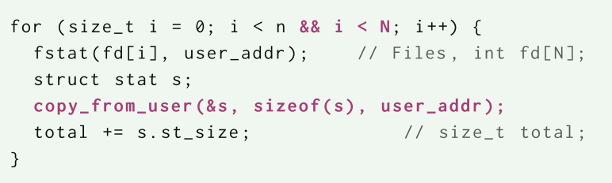

# AnyCall: Fast and Flexible System-Call Aggregation

**核心实现: 使用ebpf技术加速系统调用**

## 背景

通用计算系统依赖内存隔离作为最基本的安全机制，以防止恶意活动、维护隐私并限制错误程序。 **内存隔离的必要对应物是一个定义良好的通信接口**，它可以安全地向用户程序提供内核级功能，通常由系统调用实现。

 系统调用造成了大量开销：可见的上下文切换与不可见的处理器成本

**AnyCall: 这是一种只需要单个用户/内核转换即可实现任意数量的系统调用的系统**。

### 贡献

- 提出了一种将用户和内核切换次数与系统调用数量分离的方法，同时使用内核ebpf技术保持隔离
- 扩展了linux以支持从ebpf程序内发起系统调用
- 对基于ebpf和传统系统调用的开销进行评估

## 设计和实现

执行模型：

- return-oriented execution models 
- call-oriented execution models 

- 相当于编写ebpf程序，然后这个ebpf程序内会执行大量的系统调用
- 这个ebpf程序被执行时位于内核中，没有上下文切换

### 实现

1. 加载和调用：ebpf程序是被注册到一个内核特定事件上的，并且被异步触发。聚合系统调用需要同步触发ebpf程序的执行，因此增加了一个额外的系统调用以执行ebpf程序
2. 增加内核帮助函数
   1. epbf调用内核的函数是通过帮助函数实施的，这需要进行一些检查
   2. 在ebpf程序中使用系统调用，这需要在内核中为大多数系统调用添加帮助函数
3. 访问用户内存：提供在ebpf程序中访问用户程序内存的能力
   1. 基于页面错误/基于页面固定(被选择)
   2. 页面固定的方法就是将用户内存映射到内核的虚拟地址上，这样ebpf程序就可以直接访问

## 评估

- 对于系统调用不密集的程序来说，字节码的分析、编译、加载会占据大部分时间，导致其性能不如传统的系统调用
- 当系统调用的次数进一步上升，聚合系统调用将大幅度减少时间

- 当系统调用开销不在占据主要开销的时候，聚合系统调用带来的优势不再明显了
- 但当系统调用数量增大，其节省的时间依然可观

