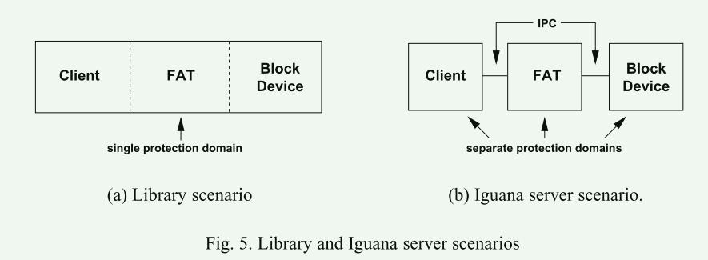

# CAmkES: A Component Model for Secure Microkernel-based Emebedded Systems

基于组件的软件工程有望为嵌入式系统软件提供结构和可重用性。与此同时，基于微内核的操作系统也被用来提高嵌入式系统的可靠性和可信度。本文介绍了一种组件架构，旨在开发基于微内核的嵌入式系统。该架构的主要特点是，它的内核最小、开销低，但高度模块化，因此具有灵活性和可扩展性。

## 概述

- 开发嵌入式系统的传统方法导致嵌入式软件越来越不可靠
- 随着嵌入式硬件能力的提高，为嵌入式系统增加更多功能的能力也随之提高，从而导致嵌入式系统软件日益复杂
- 在软件复杂性增加的同时，用于开发的方法和技术却没有发生重大变化
- 这些方法和技术虽然足以满足小型系统的需求，但却不足以构建目前正在开发的更大型、更复杂的系统。

解决方案：CBSE(Component-based software engineering) 基于组件的软件工程

CBSE 提供了一种由独立、定义明确的构件组成系统的方法。以这种方式组织软件有助于提供结构并提高代码的可重用性。它还允许从系统中添加和删除组件（可能在运行时），并允许用不同语言开发的组件相互交互，从而提高了灵活性。这意味着软件的开发和维护变得可监督和更有效率。此外，CBSE 还可以实现组件的独立开发。

嵌入式系统的特点：

1. 嵌入式系统通常是实时系统，这意味着它们的行为具有时间性。为这类系统开发的软件必须具有可预测性，以便对其时间属性进行分析和推理。软件的编写方式还必须能够可靠地满足严格的时间期限要求
2. 除了实时系统，许多嵌入式系统还部署在安全（或任务）关键型应用中。为这类系统开发的软件绝不能出现故障。此类应用中的软件故障可能导致任务失败、材料损坏甚至人员伤亡
3. 许多嵌入式系统都部署在不易维护或更换的环境中。这意味着**软件必须是可靠的，而且不能出现故障。或者，如果软件确实出现故障，系统必须提供能够发现故障并自我纠正的机制，以便继续运行**。

## 背景

尽管人们对嵌入式操作系统的实时性方面给予了很多关注，但**现有的嵌入式操作系统很少能够充分解决保护、可靠性和可信度问题**。 随着安全关键型嵌入式系统变得越来越复杂，安全威胁在嵌入式系统领域变得越来越普遍，安全性、可靠性和可信度要求也变得更加迫切。 基于微内核的操作系统正在填补这一空白。

**微内核架构与CBSE**

由于基于微内核的系统促进将功能分离为单独的服务，因此基于微内核的系统设计方法和 CBSE 之间存在很强的协同作用。 一方面，将系统建模为交互组件的 CBSE 方法适合将操作系统模型视为一组交互服务。 另一方面，微内核恰好提供了构建由交互组件组成的安全可靠系统所需的功能（保护和通信）

## 组件架构

CAmkES（基于微内核的嵌入式系统组件架构）的分层组件架构。该架构的目的是为在微内核基础上开发嵌入式系统提供支持。该架构提供了一个组件模型、标准接口和组件定义、组件实现、标准服务，并支持适合嵌入式系统的各种架构模式

CAmkES 核心运行时构成了组件架构的基础，提供了部署 CAmkES 组件所需的执行环境和基本服务。**核心运行时支持静态组件和组件组合。这意味着只有在系统初始化（即启动）时才会创建组件实例，而且组件之间的连接是在设计时建立的，不能在运行时动态创建或修改**。这样，我们就能最大限度地减少基于组件的最基本应用程序的开销（例如，在组件中插入直接过程调用，从而避免进程间通信（IPC）和编译开销）

更高级的组件功能由扩展层中运行于核心运行时之上的扩展提供。扩展本身就是利用核心运行时功能的组件。**扩展层旨在解决支持动态组件的各方面问题，包括动态创建和销毁、动态绑定、动态配置等**。

### 组件模型

CAmkES 核心运行时支持组件模型，该模型包括以下架构元素: 组件、接口、连接器、连接、组合和配置

#### 组件

组件是封装行为的基本单位，用于将操作和数据组织到具有明确定义的语义和行为的接口中。组件暴露了允许应用程序和其他组件访问其功能的接口。

组件可以是被动的，也可以是主动的。被动组件类似于语言级对象。它提供对方法的访问，但没有控制线程。而主动组件则包含自己的控制线程

#### 接口

CAmkES 支持三种接口，即远程过程调用（RPC）接口、事件接口和数据端口接口

- RPC 接口通过远程过程调用定义组件之间的同步通信。组件必须明确说明它是否提供或使用 RPC 接口

- CAmkES 支持发布/订阅事件模型。事件用于组件之间的异步通知，由组件在事件接口上发出或消耗

- 数据端口接口代表共享变量，允许组件之间传输数据。一对相连的数据端口代表相同的变量或相同的内存范围。这与其他组件模型中定义的纯数据接口（或端口）不同，后者用于在组件间传输或复制数据，但不具有共享语义。与复制相比，真正的数据共享可以降低性能开销.

- 组件之间的通信封装在称为连接器和连接的显式架构元素中。连接器是两个或多个组件之间的运行时交互路径.

连接器提供的灵活性不仅限于数据端口机制，同样可以应用于 RPC 和事件机制。 架构**连接器提供了一种分离关注点的方法，即将组件的功能行为与其与其他组件的交互分开**。 这提高了系统的可扩展性，因为可以替换通信协议而不影响组件的实现。 连接器和连接的使用还有助于运行时需求的表示、分析和执行

#### 组合

整个应用程序被建模为复合组件，即包含其他组件实例的组件。 组件组合利用连接器和连接。 与非复合组件一样，复合组件通常会导出接口，但它并不直接实现这些接口。 相反，接口直接连接到提供实现的组成组件

#### 配置

组件还可以具有一个或多个属性，其值表示组件的状态或设置。 这些值不是在组件定义内指定的，而是在组装组件时在单独的配置规范中指定的。 组件使用编译时指定的属性进行实例化。

#### 计算模型

CAmkES 组件模型是通用的，不针对任何特定的嵌入式应用领域。 因此，它没有规定任何特定的执行（或计算）模型。 例如，基于 CAmkES 模型构建的系统可以是面向控制流的，其中执行由对 RPC 接口的调用或通过事件接口的事件触发。 它还可以是面向数据的，可以访问通过数据端口建立的组件之间的共享数据。

## 非功能性属性

- 在配置文件中，可以指定组件之间的权限
- 配置规范配合微内核的权限机制实施访问控制

## 实现

L4作为内核提供最小的抽象，主要功能包括内存保护、地址空间之间的内存映射、低进程间通信 (IPC) 开销。L4 也避免实施策略，因此它不提供任何特定模型的操作系统服务，例如进程管理、内存和地址空间管理、访问控制等。此任务由运行在用户模式中的监控操作系统负责：Iguana 

Iguana具有较低的内存和缓存占用空间，并提供基本服务，例如内存管理、保护管理、基于远程过程调用 (RPC) 的 IPC 机制、低开销数据共享和基本设备驱动程序框架。

Iguana 提供了客户端-服务器交互模型。 应用程序和操作系统服务作为 Iguana 服务器运行，并使用 IPC 相互交互。 Iguana 服务器由一个线程和在保护域中运行的关联内存部分组成

**每个 Iguana 服务器都实现一个特定于服务器的接口，该接口由一组可以在该服务器上调用的方法组成。 Iguana 提供了一种远程过程调用风格的 IPC**。 客户端通过调用本地存根函数来调用服务器的方法。 存根使用底层 L4 IPC 机制编组参数并将消息发送到服务器。 在服务器端，通过类似的存根对消息参数进行解组并调用适当的函数。 在调用另一个服务器的方法之前，必须在客户端和服务器之间建立会话。 除了建立通信通道之外，建立会话还涉及确保通信双方拥有正确的能力。 为了调用另一个保护域中的服务器上的方法，调用者必须拥有该服务器的适当执行能力

### 组件与igunan的对应关系

CAmkES 组件通常放置在单独的 Iguana 保护域中，并作为单独的 Iguana 服务器实现。 这提供了适当的封装并防止其他组件（或进程）有意或无意地访问组件的内部。 此外，它允许架构将对组件接口的访问限制为仅授权方

CAmkES RPC 接口间接映射到 Iguana 接口。 与 CAmkES 接口不同，Iguana 接口充当保护单元而不是封装单元。 为了提供方法级访问控制，这意味着在映射到 Iguana 时，CAmkES RPC 接口的各个方法将被转换为单独的 Iguana 接口。

 CAmkES 数据端口映射到共享 Iguana 内存部分，因此 Iguana 中内存部分的共享由内存管理（或保护）单元管理，不需要任何数据复制

## 评估

### 文件系统服务

1. FAT32 文件系统库直接链接到客户端程序，这允许客户端直接访问文件系统，而无需使用任何 IPC
2. 库包装在 Iguana 代码中，以便可以使用 Iguana IPC 从其他保护域访问该功能
3. 将库包装在 CAmkES 组件代码中，创建 FAT 文件系统组件

- 空操作测量调用到文件系统服务器并返回的纯往返时间。 它表明，与 Iguana 场景相比，CAmkES 引入的额外开销约为 1μs 或 2.65% 开销
- 其他操作涉及多个往返 IPC（例如，调用块设备组件），因此具有更高的开销。 然而，在所有情况下，开销都保持在 7% 以下

代码行数：

1.   Iguana 场景以生成存根和额外代码的形式添加 361 loc
2. 与库场景相比，CAmkES 场景增加了 786 行代码。 与Iguana场景相比，CAmkES增加了425行代码。 这些额外的代码主要是由于 CAmkES 到 Iguana 的映射将每个方法实现为 Iguana 接口，这添加了额外的生成结构代码来处理和初始化这些接口

## 思考

1. 这个所谓的组件模型感觉是对微内核模型的进一步封装，因为用户态的根服务器比如文中提到的Iguana本身提供的接口还是比较原始，而本章实现的模型对这些接口做了封装
2. 微内核用户态的程序本质上都可以看作一个服务器app，组件模型把这些服务器视为实现特定接口的组件
3. 组件之间的通信通过连接器完成，而连接器其实是根服务器提供的IPC机制的封装

与我们目前的工作相比：

1. 域也是对一个功能实体的封装
2. 域间通信是函数通信的限制版本，不使用连接器
3. 组件的隔离依赖的是微内核用户程序的隔离，因为把组件视为服务器程序
4. 域的隔离依赖语言机制
5. 组件不提供热更新机制

