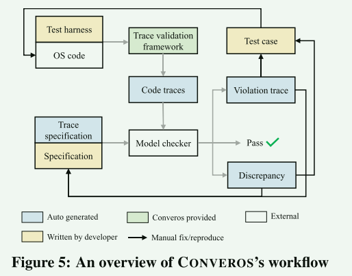
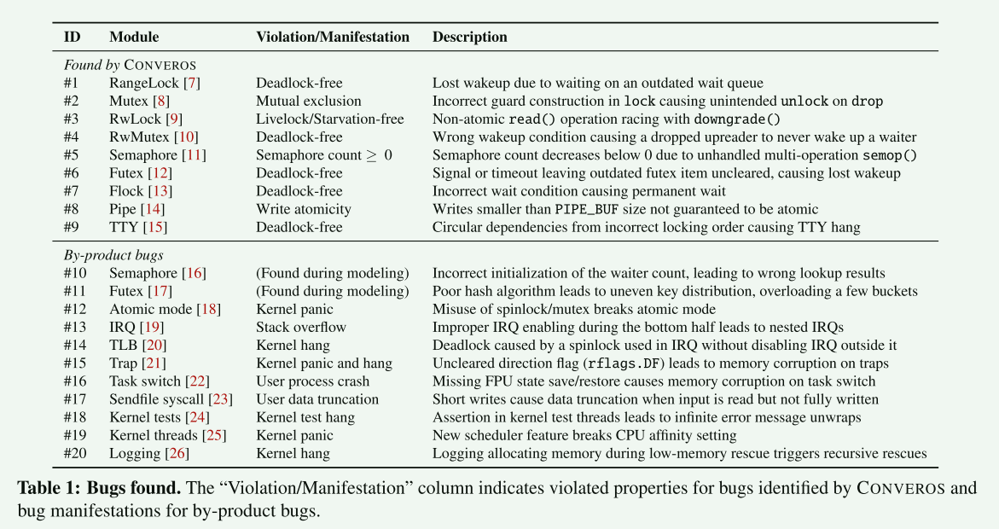
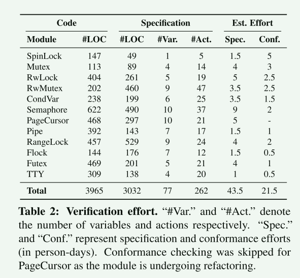

# CONVEROS: Practical Model Checking for Verifying Rust OS Kernel Concurrency

CONVEROS利用了形式化规范的严谨性，并引入了一种多层、多粒度的规范方法，使编写可扩展的规范变得可行，它还使一致性检查渐进式地进行，并且更加自动化地检测规范代码的差异。虽然由于复杂性和所需的专业知识，许多形式化方法的应用具有挑战性，但CONVEROS使模型检查具有成本效益，易于访问，并且可适应不断发展的规范和代码

## introduction

尽管Rust在安全代码中显著增强了内存安全性并防止了数据竞争，但OS内核开发不可避免地需要使用unsafe。逻辑错误和有缺陷的设计可能导致死锁、活动锁和功能属性违反。众所周知，这些并发性错误很难检测、重现和正确修复。

将模型检查应用于复杂的操作系统实现是困难的：

1. 编写规范可能具有挑战性，因为它需要领域知识和形式方法，而低质量的规范可能会阻碍模型检查的可扩展性
2. 规范和实现之间的差异可能会损害验证结果，导致假阳性和假阴性，这些差异可能是由建模错误或代码的快速演变引起的

**贡献**:

1. 对于编写规范，我们引入了一种多层次、多粒度的规范方法，将每个模块划分为可管理的组件，以便在不同粒度的逐步建模中进行：

   - 多层次规范由高级规范和低级规范组成。高级规范代表正确的设计，抽象出实现细节。低级规范反映了代码细节并融入潜在的代码错误

   - 使用了一种多粒度的规范方法用于低级规范，通过分别验证模块并在模块不发生交互时抽象出操作，实现了逐步验证

2. 编写PlusCal规范可适用于各种编程语言；对Rust代码建模带来了独特的挑战，比如识别自动变量的释放位置
   - 分析Rust的中间级IR（MIR）来解决这个问题，以确定复杂代码中这些位置。

3. 对于符合性检查，我们使用trace验证来检查规范-代码的一致性。trace验证执行实现以生成trace，并检查这些trace是否允许在规范的状态空间中。我们增强了trace验证，通过引入一个处理缺失事件的新算法使其更加自动化

结果：

- 通过验证12个关键的并发模块，包括自旋锁、睡眠锁、文件锁、futex、SysV信号量IPC、无锁环形缓冲区、页表的锁定协议以及TTY中的锁使用。我们在ASTERINAS中检测到了20个严重的新错误：9个是CONVEROS自动检测出的，11个是在诊断CONVEROS报告的错误时手动发现的
- 规范到代码比例在0.3到2.3之间变化，约花费了43.5人天来书写所有规范，以及21.5人天的符合性检查，总共约四个人月的工作量

## CONVEROS

CONVEROS通过模型检查检测实际代码错误的**有效性在于使用一致性检查处理规范代码差异**。应用CONVEROS涉及三个主要任务:

1. 形式化规范：开发人员编写从代码派生的PlusCal规范
2. 一致性检查：创建一个测试工具来记录日志并运行并发模块
3. 模型检查

> CONVEROS的设计是实用的，每一步都是小的、增量的、快速执行的，确保在整个过程中快速反馈

## 形式化规范

设计了多层和多粒度的规范，使它们易于编写、增量和可扩展，以用于模型检查。此外，我们定义正确性属性来验证系统是否按要求运行

**高级规范** ：高级规范捕获设计需求，并且可以直接为其公共api编写。这些规范主要用于基本的同步原语，如自旋锁和互斥锁，它们易于编写和验证；这些规范确保api满足常见的锁定属性，如互斥，免于死锁和活锁

**低级规范**：低级规范应该紧密地反映代码实现。当代码包含错误时，低级规范可以通过模型检查帮助揭示错误；低级规范可以构建在公共api中的高级规范和模型代码细节之上

**多粒度规范**：细粒度的规范可能导致状态空间爆炸，而粗粒度的规范可能会遗漏关键的bug

通过保持交互原则来实现，即对于每个模块，只可以省略内部部分，而必须保留与其他模块的交互。它支持一个模块一个模块地验证复杂的并发代码，并将验证模块中的细粒度操作抽象为粗粒度操作

分析每个模块的依赖关系，并采用逐步模块化的方法：

1. 基本同步原语的细粒度规范
2. 复杂模块的混合粒度规范。对于依赖已验证同步原语的模块，我们通过粗化规范来抽象其内部操作，以隐藏其内部细节。对于模块的独特逻辑，我们指定并验证细粒度的操作

**正确性属性**：安全性和活动性

- 安全属性指定系统永远不会达到不希望的状态(即“坏事永远不会发生”)
- 而活跃属性指定系统最终达到理想的状态(即“好事最终会发生”)

## 一致性检查

验证高层和低层规范和代码之间的一致性是确保验证结果的必要条件

TLA+中，一致性检查可以使用两种方法执行:自顶向下和自底向上

**自顶向下**：自顶向下的方法使用模型检查器生成规范跟踪，并在代码中重播它们，要求对事件交错进行确定性控制

**自底向上**：自底向上方法捕获代码执行跟踪，并验证规范是否允许这些跟踪

## 评估

