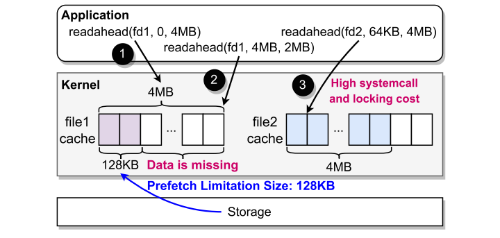
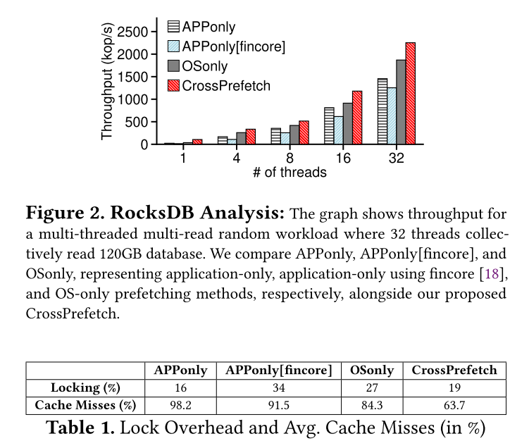
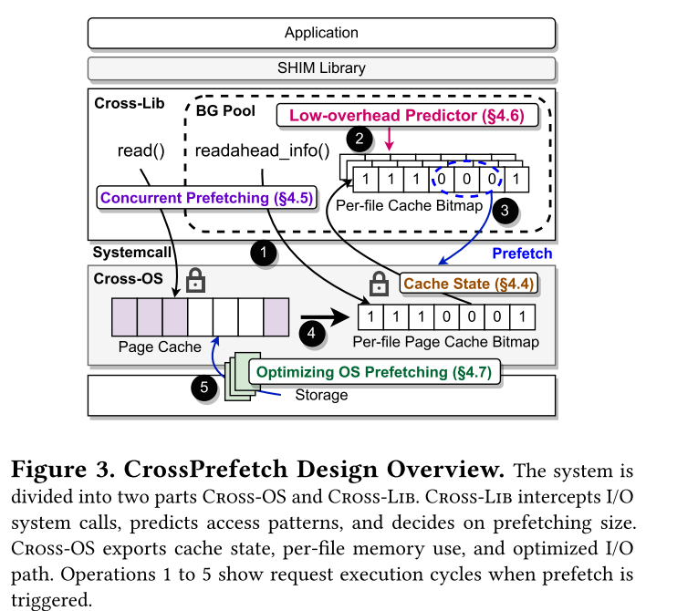
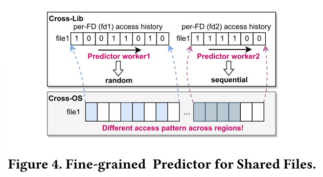
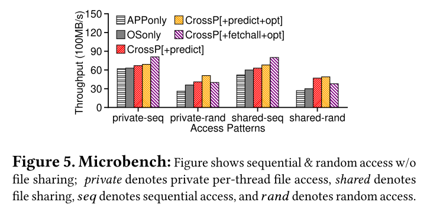
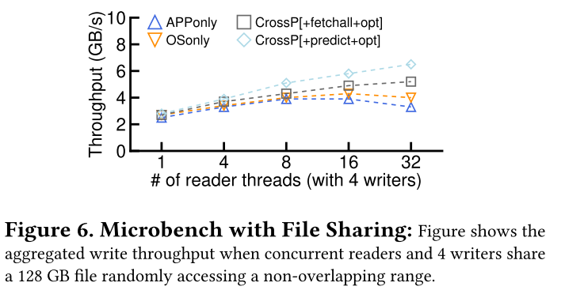
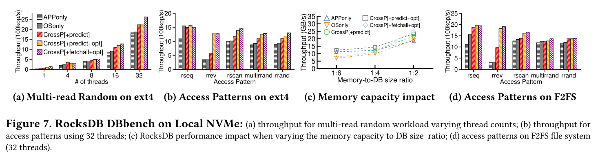

# CrossPrefetch: Accelerating I/O Prefetching for Modern Storage

本文提出CrossPrefetch，一种跨OS和用户级运行时的I/O预取机制，旨在解决现有OS预取机制的接口僵化、并发瓶颈和内存利用低效问题。通过划分OS与运行时职责，CrossPrefetch实现低缓存缺失、低锁竞争和高I/O性能，在微基准测试、宏基准测试和真实工作负载中实现1.22x-3.7x的吞吐量提升。

## 概述

尽管NVMe等高速存储技术发展，计算与存储性能差距仍显著，缓存和预取是隐藏差距的关键。现有OS预取机制存在三大局限：

1. 接口僵化导致应用无法获知预取有效性，易出现预取不足或过度；
2. 并发瓶颈源于预取与常规I/O共享数据结构，锁竞争严重；
3. 内存利用低效，无法协调OS与应用缓存状态。这些问题限制了现代存储设备带宽的充分利用，亟需跨层协同的预取方案。

**当前最先进的预取设计往往难以从I/O预取中获得更高的性能提升，也无法充分挖掘SSD等现代高速存储设备的可用带**

- 应用程序从偏移量0MB至4MB发出预读请求。然而，由于存在静态限制，操作系统仅预取了128KB。
-  应用程序假设已实现完全预取，随后从4MB开始发出后续请求，但访问128KB至4MB之间的数据时却产生了缓存未命中。
- 应用程序请求预取64KB至4MB之间的数据，而这些数据此前已缓存，因此由于缺乏缓存感知，导致了不必要的系统调用和锁竞争开销

**研究的创新性**：

1. 跨层协同设计，OS导出缓存状态，运行时优化预取决策；
2. 分离预取与常规I/O路径，通过范围树实现细粒度并发控制；
3. 基于内存预算的自适应预取/驱逐策略，平衡性能与资源。

## 背景

在Linux中，采用的是增量预取机制：预取器（即VFS中的预读组件）会提前将文件的一部分读入内存，以备进程或线程即将对该部分进行读取或写入操作，从而减少I/O等待时间。为了预测何时进行预取，Linux会在已填充缓存边缘的页面上维护每个文件的PG_readahead标记。当标记页面被访问时，系统会逐步预取（最多128KB）；而对于随机访问，系统则会根据文件的命中率来调整预取的大小。

Linux这样的操作系统提供了系统调用和数据访问模式提示：fadvise/readahead 系统调用；

> 应用程序往往并未意识到显式预读或建议调用的有效性，从而导致高缓存未命中率、软件开销以及性能受损。

Linux系统调用fincore和mincore使应用程序能够确定文件或地址范围中哪些页面当前驻留在内存中。这些调用通过锁定整个内存地址空间，并遍历缓存树及进程地址空间来构建相关信息。因此，由于这些调用开销较大，频繁使用会导致较高的系统开销和性能下降。

### 相关工作

####  操作系统级预取技术

- **Lynx**：基于学习的SSD预取机制，使用马尔可夫链捕获随机访问模式，但仅适用于内存映射文件，且在页缓存命中率下降时会关闭预测。
- **ATS**：在操作系统缓存层使用分区上下文建模（PCM），利用磁盘数据布局进行预取。
- **FastMap**和**MMap on Steroids**：通过禁用缓存来提升mmap性能。
- **Leap**：基于客户端页错误检测远程文件访问模式，使用现有Linux ABI进行预取。

#### 应用程序特定预取技术

- **VSS**：针对视频分析的存储系统，通过下采样或删除低频/高频预取视频来减少缓存使用。
- **HTTP流媒体服务器**：对顺序视频文件进行主动预取。
- **Hadoop文件的相关性预取**：基于I/O模式与数据节点复制/预取文件的相关性。
- **Frog**：基于上下文的文件系统，为不同应用上下文调整I/O设置。
- **移动应用加载时间优化**：针对移动应用的I/O预取技术。

#### 机器学习（ML）预取技术

- **内核级ML框架**：通过用户定义的训练函数识别并调整预取策略。
- **Clairvoyant**：针对分布式机器学习I/O的操作系统ML设计，利用伪随机数生成器预测下一个时间戳的数据。
- **SSD设备层ML技术**：学习访问模式以改进预取。
- **Stacker**：用于高性能计算（HPC）原位工作流的自主数据移动引擎，使用N-gram模型学习跨步访问模式。

#### 编译器预取技术

- **多面体模型优化**：针对n维数据对象，使用编译器优化文件布局以减少磁盘块读取

#### 现有技术的局限性

所有上述技术均未解决应用需求与操作系统预取之间的不匹配问题，主要原因是缺乏跨层（操作系统与应用程序）的预取感知与协调。

### 动机与分析

1. **预取状态感知缺失**：OS预取接口（如`readahead`、`fadvise`）无法向应用反馈预取有效性，导致应用可能过度预取（增加开销）或预取不足（缓存缺失）。例如，Linux初始预取限制为128KB，即使内存充足也无法调整，导致应用误判预取进度。
2. **并发瓶颈**：预取与常规I/O操作共享数据结构（如Xarray缓存树），引发锁竞争；多线程共享文件时因缺乏缓存感知，重复发起预取请求，增加系统调用开销。
3. **内存利用低效**：OS预取策略保守（如Linux增量预取限制128KB），即使内存充足也无法动态调整预取窗口，导致缓存利用率低，尤其在随机访问或内存紧张场景下性能下降。

## 设计和实现

Cross-Lib 优化了应用程序中单个文件的 I/O 预取功能。它通过一个 shim 层透明地拦截 POSIX I/O，检测访问模式，并发起预取调用。在打开文件时，Cross-Lib 会创建一个用户级文件描述符结构，用于维护文件级的访问模式和预取信息（1）。当发出 I/O 请求（例如读取或写入）时，Cross-Lib 预测器会识别该文件在应用程序各线程中的访问模式，并决定需要预取的字节范围（2）。随后，Cross-Lib 利用我们新引入的 readahead_info 系统调用，实现三个目的：预取数据块、将文件级缓存状态从操作系统导出，以及导出操作系统级别的遥测数据，例如文件的缓存内存使用情况（3）。此外，我们还使用专门的后台线程来发出预取调用，以避免影响应用程序线程的性能。最后，Cross-Lib 会根据可用内存预算进行调整，实施积极的预取和缓存驱逐操作。

操作系统组件：Cross-OS负责维护缓存状态及导出的预取信息，以供Cross-Lib使用。在操作系统内部，为减少常规I/O请求线程与发起预取操作线程之间的竞争，Cross-OS将常规I/O路径与预取路径分开处理。竞争主要源于获取不同的锁，包括inode（文件）、页缓存、日志以及内存管理器锁。在执行常规I/O操作（读或写）时，Cross-OS会在页面被加载到缓存或从缓存中逐出时更新位图（4）。处理readahead_info调用时，首先会检查所请求块是否存在，随后调整预取请求并发出请求。返回时，操作系统会将文件的缓存位图导出至跨库。最终，Cross-OS对I/O预取路径及预取参数进行了优化，例如取消了预设的限制（5）

操作系统组件（Cross-OS）在操作系统的每文件缓存树旁维护一个节点级位图，用于评估预取效果。它通过一种全新的多功能readahead_info系统调用，将这些信息传递给用户级运行时（Cross-Lib）。该系统调用可用于执行预读操作、导出文件的OS级缓存位图状态，以及导出OS级遥测数据。借助这些信息，Cross-Lib能够优化并减少预取系统调用，提升应用线程级针对私有文件和共享文件的预取性能，并支持无需对复杂的操作系统缓存层进行修改即可实现预取定制

为提升可扩展性并缓解并发瓶颈，CrossPrefetch将常规I/O操作与预取操作的I/O路径分开。这有助于通过readahead_info系统调用实现快速的缓存状态查询。为了支持线程共享以及对文件区域的无冲突访问，CrossPrefetch采用基于范围树的细粒度索引机制。这一机制使线程能够同时查询其缓存状态并发起明智的预取请求。此外，借助轻量级访问模式预测，Cross-Lib可根据每个inode的缓存状态调整预取请求，从而减少对过多预取系统调用的需求。

### 低开销的预测和预取

Cross-Lib 使用一个简单的n位计数器来检测文件的访问模式。该计数器可指示访问的顺序性程度，并能将文件表示为七种不同的状态：

高度随机（000，访问距离超过最大预取距离128KB）、随机（001，随机但距离在128KB以内）、部分随机（010，顺序访问与随机访问混合）、可能顺序（011，频繁的顺序访问与随机访问交替出现）、顺序（100，顺序访问但存在步长）、以及完全顺序（110）。**在读取或写入过程中，Cross-Lib会根据访问的顺序性对计数器的值进行增减，计数器的值则决定了需要预取的块**。

为每个描述符维护一个访问模式检测器，并在用户空间中构建文件描述符结构，其中包含块范围信息和访问模式计数器。图4展示了Cross-Lib如何执行预取操作。例如，如果线程1按顺序访问fd1，而线程2随机访问fd2，则预取仅针对线程1所访问文件中互不重叠的区域进行。在涉及多个文件描述符之间存在重叠访问的场景中，Cross-Lib利用缓存感知机制，避免重复预取，同时确保缓存命中。在配置时，Cross-Lib可使用单个位图位来表示树中的整个范围，从而降低内存占用

为最大限度地利用可用内存资源，CrossPrefetch基于可用空闲内存（预算）方法，实施了一种积极的预取与驱逐策略。通过感知每个文件的缓存情况，CrossPrefetch会根据可用内存预算，在积极预取与驱逐之间动态切换。这种自适应方法能够显著提升整体性能。最后，Cross-OS通过允许更大的预取请求，并根据可用内存预算动态调整预取限制，优化了I/O路径，从而实现更优异的系统性能。

为实现对缓存页面的积极回收，CrossPrefetch 采取了双管齐下的策略。首先，Cross-Lib 维护着每个进程的内存预算，并利用 LRU 机制监控活跃文件与非活跃文件。当内存预算趋于紧张时，CrossPrefetch 会驱逐非活跃文件的缓存块，从而避免了遍历每个文件的范围树。其次，对于大文件，除了由操作系统 LRU 管理的块级驱逐外，CrossPrefetch 还通过 fadvice() 函数，利用每个文件的缓存状态，主动驱逐那些访问频率较低的块。

## 评估

1. CrossPrefetch的跨层预取在多大程度上提升了I/O吞吐量？
2. CrossPrefetch能否在单个应用程序内的线程之间以及跨多个应用程序的进程之间实现扩展？
3.  CrossPrefetch在不同文件系统和存储设备上的有效性如何？
4.  CrossPrefetch的激进内存预取与驱逐策略的实效性如何？
5.  CrossPrefetch在实际应用中的表现如何？

- 仅使用APP的方式会关闭操作系统预取功能，从而导致高缓存未命中率。仅使用OS的方式则会进行增量预取，尽管初始时内存可用量很高，但增量预取的大小仅限于128KB。遗憾的是，采用增量预取时，随机访问会缩小预取窗口（最初甚至缩小至0），这将增加缓存未命中率，进而降低吞吐量。
- [+fetchall+opt] 方法通过使用操作系统导出的位图来监控缺失的块，并预取整个文件。尽管这一方法在理论上很理想，然而，这种方法会引发缓存污染，从而增加共享文件和私有文件的缺失次数
- [+predict] 采用精确预测，通过提高缓存命中率实现更高的性能提升。[+predict+opt] 则取消了操作系统预取的限制，根据可用内存和I/O带宽，实施积极但自适应的预取策略，突破了128KB的限制。这带来了缓存命中率的提升，减少了预取系统调用次数

CrossPrefetch的性能改进主要源于以下几个增量因素：

1. 首先，通过将缓存状态导出至用户空间，提升缓存可见性（+缓存可见性），从而提高缓存命中率并减少系统调用；
2. 其次，利用可扩展的按文件范围树（+范围树）支持并发预取，进一步提升了性能；
3. 第三，通过支持内存预算的智能管理并实施积极的预取策略（+聚合预取），进一步减少了缓存未命中，所有这些因素共同带来了更高的性能提升。