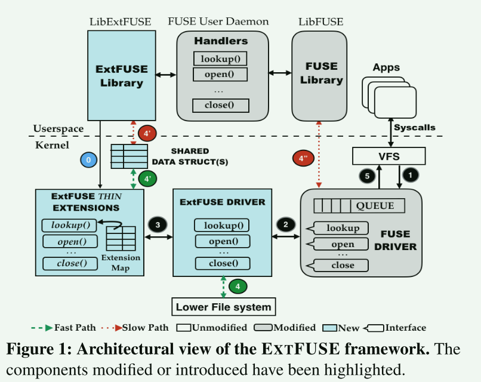
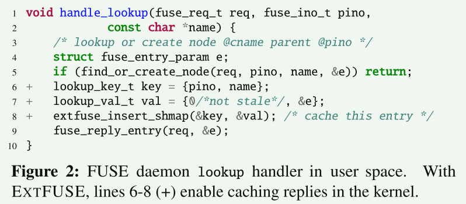
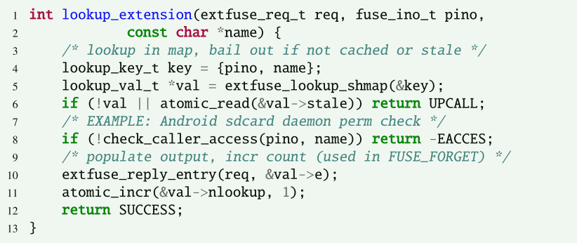
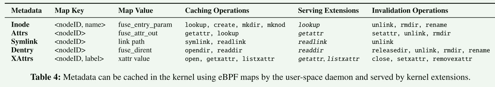
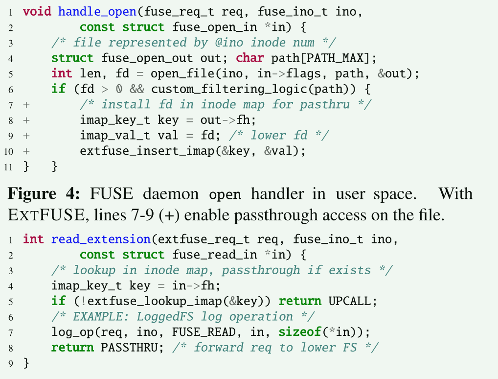
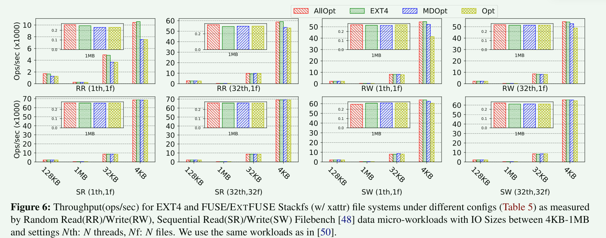
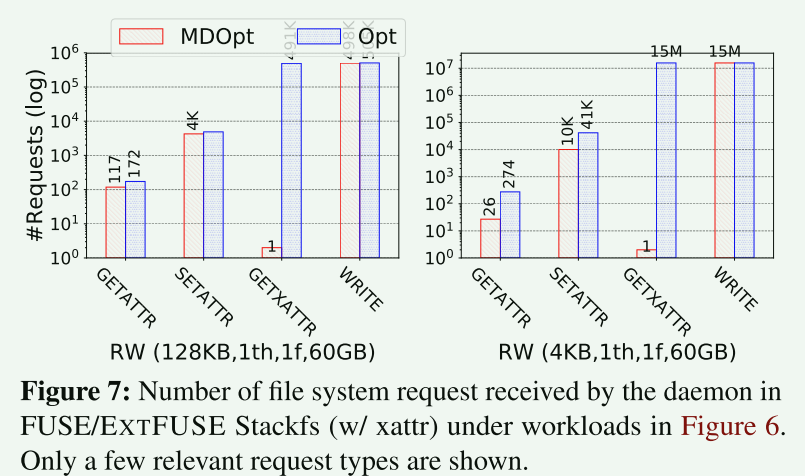
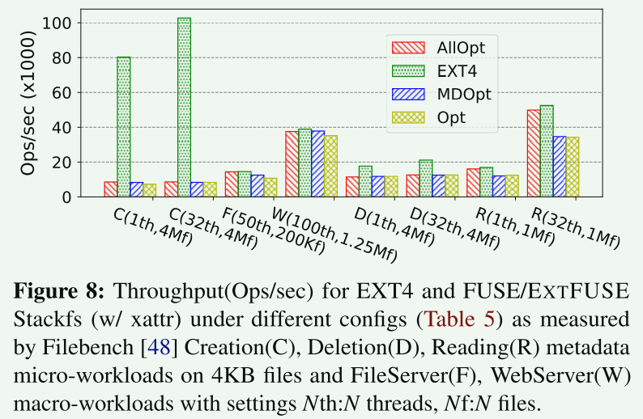
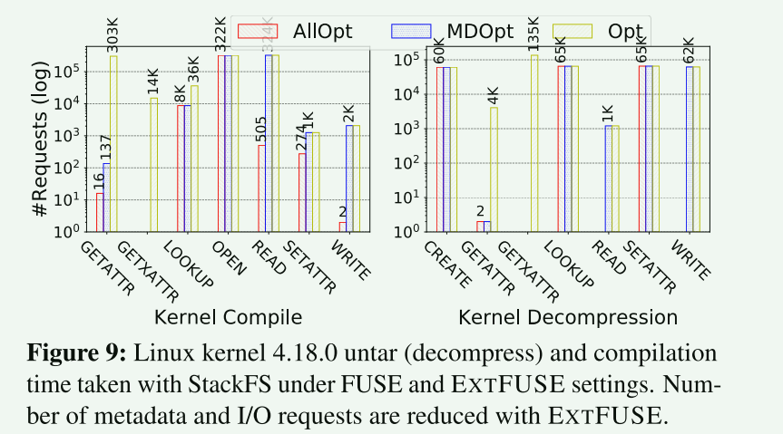

# EXTFuse

## Qusetion

现有用户文件系统框架导出的接口过于低级和通用。 因此，它们无法满足文件系统的特定操作需求。 例如，对于不包含安全标签的文件，可以完全消除 write() 期间的 getxattr 请求。 来自守护进程的查找回复可以在内核中缓存和验证，以减少到用户空间的上下文切换. 类似地，当在 open() 系统调用中堆叠沙箱功能以强制执行自定义权限检查时，I/O 请求（例如读/写）可以直接通过主机文件系统传递

- 缓存元数据信息
- I/O直通

## Architecture

### workflow

1. 挂载用户文件系统时，FUSE驱动程序将FUSE_INIT请求发送到用户空间守护程序
2. 用户守护程序通过查找请求参数中的FUSE_CAP_ExtFUSE标志来检查操作系统内核是否支持EXTFUSE框架
   1. 如果支持，守护程序必须调用libExtFUSE`init`API来加载包含专门处理程序（扩展）的eBPF程序到内核，并将它们注册到EXTFUSE驱动程序中
   2. 扩展程序安装在一个称为扩展映射的bpf_prog_type映射中，它实际上作为一个跳转表。
   3. FUSE驱动程序只需使用FUSE操作代码(例如，FUSE_OPEN)作为扩展映射的索引执行一个bpf_tail_call(远跳转)
   4. eBPF程序加载完毕，守护程序必须通过回复包含扩展映射标识符的FUSE_INIT，告知EXTFUSE驱动程序关于内核扩展已经加载的事实
3. 每个请求首先到达快速路径：
   1. 直接处理（使用快慢路径共享的数据）
   2. 将请求直通底层的文件系统
   3. 选择慢路径将请求传递到用户空间进行复杂的处理

### Implementation

1. 添加额外的内核帮助函数 - for ebpf
2. 添加新的映射类型 - for ebpf
3. 使用WrapFs完成直通的功能

由于使用 EXTFUSE 开发人员可以安装扩展来绕过用户空间守护程序并将 I/O 请求直接传递到较低的文件系统，因此恶意进程可以将多个 EXTFUSE 文件系统堆叠在一起并导致内核堆栈溢出 。为了防止此类攻击，需要限了可以堆叠在挂载点上的 EXTFUSE 层的数量。

### optimization

#### 自定义内核元数据缓存

诸如lookup和getattr之类的元数据操作经常发生，但VFS通常不缓存这些元数据，造成高延迟

用户空间代码 ： 内核扩展

可缓存元数据列表：

**元数据有效性管理：**

当文件（或目录）被删除或重命名时，在扩展中相应的缓存查找必须回复失效，从而触发慢路径的再一次查找。使缓存无效的操作可以

1. 由用户空间程序执行：比如在执行unlink时，通过删除SHashMap的键值对完成
2. 通过在内核安装响应的扩展来完成

第一种方法会引入竞争条件而造成错误：当一个unlink操作和lookup请求先后到达内核，unlink操作被慢路径处理

也许用户空间程序还没有完成，删除缓存的操作，但是lookup却因为有缓存的存在而提前进行了回复。这导致了错误。

**vs. VFS caching:**

其它在VFS层引入缓存的工作可能会导致一些 安全错误 。相比之下，使用 EXTFUSE，开发人员可以定义自己的元数据缓存并安装自定义代码来管理它们。

EXTFUSE允许主动缓存元数据/ VFS caching 是静态的

EXTFUSE需要考虑内核内存的使用开销。

#### 数据直通

- 在用户态处理打开文件操作后，将对应的文件描述符注册到内核扩展中
- 稍后的其它操作可以直接使用文件描述符通过VFS直通下层文件系统，而不是再次回到用户态

## Evaluation

#### micro

opt：FUSE本身可用的优化 128K Writes, Splice, WBCache, MltThrd

MDopt：Opt + Caches lookup, attrs, xattrs

Allopt：MDOpt + Pass R/W reqs through host FS

- 由于预读优化的存在，对于顺序读，几种优化机制的性能都差不多
- 随机读取可以从直通中收益
- 随机写中，如果fuse文件系统支持扩展属性，写入吞吐量会严重下降，因为 VFS 在每次写入之前都会发出 getxattr 请求
  - 元数据缓存可以减少这些请求的数量，从而提供性能

#### macro/real workload

- 创建和删除工作负载下，两种 EXTFUSE 配置都没有比 FUSE Opt 有所改进，MDOpt 无法利用元数据缓存

- 对于元数据密集操作，缓存带来了非常大的优势

  

- 对用户空间的lookup、getattr 和 getxattr 请求分别减少了 75%、99% 和 100% 以上