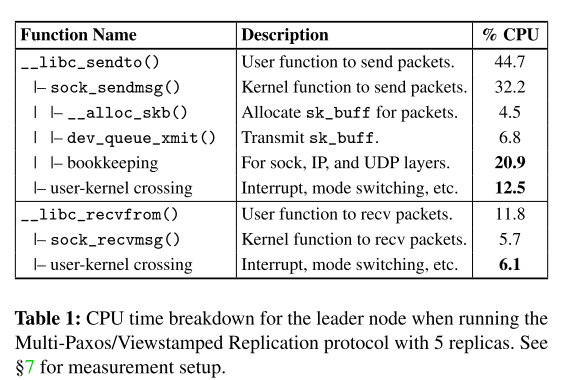
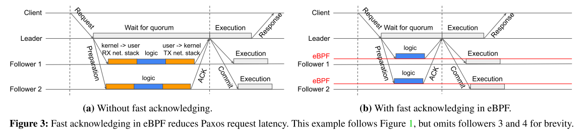
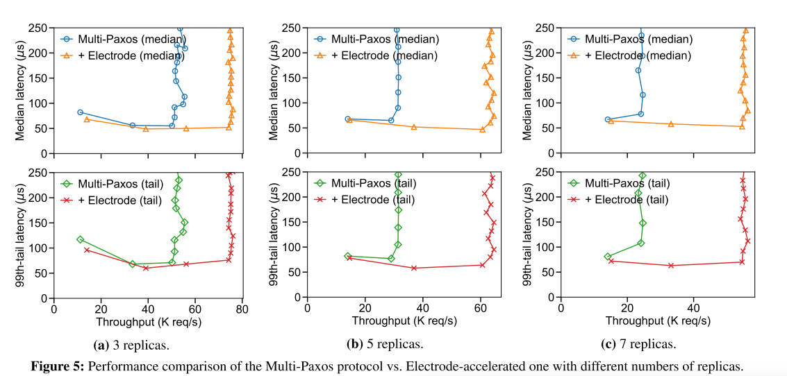
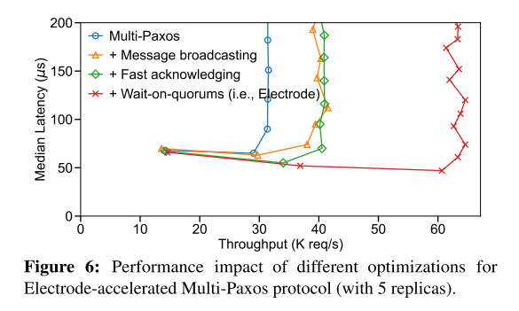
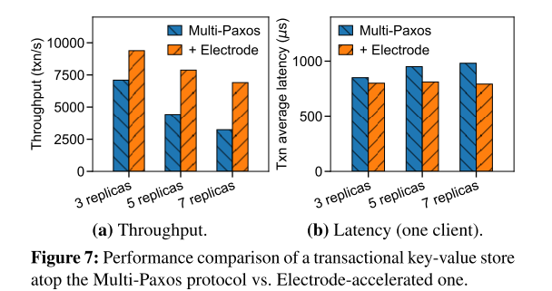
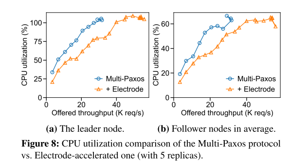
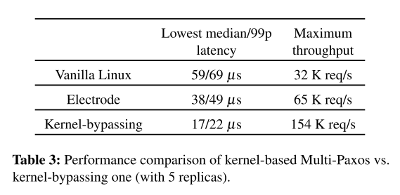

# Electrode: Accelerating Distributed Protocols with eBPF

在标准Linux内核网络栈下实现分布式协议，可享有负载感知的CPU扩展、高度兼容性以及强大安全性和隔离性的优势。然而，由于频繁的用户态与内核态切换以及内核网络栈的遍历，这类协议的性能往往较低。为此，我们提出了Electrode，它采用了一系列基于eBPF的性能优化技术，专为分布式协议而设计。这些优化技术在内核中、网络栈之前执行，却能实现与用户态相同的功能（例如消息广播、收集多数派确认），从而避免了用户态与内核态切换及内核网络栈遍历所带来的开销。我们证明，当Electrode应用于经典的Multi-Paxos状态机复制协议时，其吞吐量最高可提升128.4%，延迟最高可降低41.7%。

## introduction

诸如Paxos 等用于状态机复制的分布式协议，是构建高可用分布式应用的重要基石。

- 基于DPDK的内核旁路方法：
  - 应用开发者自行构建网络协议栈
  - 内核网络协议栈的兼容性
  - 分配CPU核心来轮询网络接口以处理I/O竞争，在低I/O负载时会牺牲CPU资源并造成能源浪费
- 特定的网络硬件协同工作，包括RDMA、FPGA、智能网卡以及可编程交换机
  - 设计、实现和部署难度较大

**洞察**：Paxos协议的常见操作——例如消息广播和等待多数派——会产生较大的内核栈开销，但这些操作天然可通过现有的eBPF编程能力实现卸载。

以消息广播为例：Paxos协议要求领导节点向跟随节点广播准备消息；如果传统上采用多次sendto()系统调用实现，将导致多次用户态与内核态之间的切换，以及内核网络栈的多次遍历。而借助eBPF，我们可**使用bpf_clone_redirect()函数，将内核中的数据包缓冲区多次克隆并发送至不同目标**；这样一来，基于eBPF的消息广播仅需一次用户态与内核态之间的切换，以及一次内核网络栈的遍历。除了消息广播，我们还**利用eBPF减少了在等待多数派时对用户空间应用程序的无谓唤醒**，并**优化了跟随节点处理准备消息的方式：在进入内核网络栈之前就提前进行确认**。这三项基于eBPF的优化最终形成了Electrode

## 背景

### XDP/TC

## Electrode 

Electrode 是一种框架，旨在将 Paxos 协议从内核网络栈卸载至内核中的 eBPF 程序，以减少用户空间与内核空间的交互以及内核网络栈的遍历

**目标**：

1. 大幅降低内核栈开销，从而提升性能；
2. 精心划分用户空间与内核空间的功能，确保卸载功能能够在 eBPF 子系统内部实现且高效运行。

**工作流程**：首先，用户空间应用程序将 eBPF 程序附加到与网络接口相对应的各个挂钩位置；接着，用户空间应用程序通过 Electrode API 调用由 eBPF 加速的函数，或获取 eBPF 处理结果；最后，eBPF 程序在内核中拦截并处理目标数据包，而无需经过网络协议栈或用户空间应用程序（在我们的案例中，即 Paxos 协议）。Electrode 的目标是加速处理那些能够装入单个以太网数据包的消息（例如，对于巨型帧而言，最大可达 9KB）。这一特性非常适合 Paxos 协议通常维护的锁、屏障和配置参数[25, 78]。至于非目标数据包，则仍会经过协议栈并送达用户空间应用程序，且不会影响应用程序的其他操作或协议语义

### Message Broadcasting in TC

在Paxos协议中，广泛使用了一对多的消息广播。例如，1）领导者节点向所有跟随者节点发送准备消息，2）（在收到足够多的跟随者确认后）领导者节点向所有跟随者节点发送提交消息。

**通过在TC钩子上利用eBPF，提供了一种灵活的基于主机的广播解决方案**。在此过程中，我们需要将实现广播操作的eBPF程序附加到TC钩子上，因为只有TC钩子能够拦截并处理出站数据包（§2.2）。附加eBPF程序后，用户空间应用程序可调用表2中所示的elec_broadcast()函数，传入指定的sock_fd、消息内容以及目标IP地址列表，从而通过套接字将消息广播至这些目标地址。在底层，eBPF程序会使用bpf_clone_redirect() [45]辅助函数对消息数据包进行克隆，相应地修改克隆数据包的目标地址，然后将这些克隆数据包发送出去

### Fast Acknowledging in XDP

Paxos请求延迟的很大一部分来自领导节点与跟随节点之间的往返延迟，这一往返延迟不仅包括物理传播和传输延迟，还包含了由内核网络栈引起的延迟（即用户态与内核态之间的切换以及网络栈的遍历过程）

**通过直接将准备消息缓冲至内核日志并提前向领导节点确认，从而优化跟随者节点的准备处理流程**。与此同时，用户空间应用程序可异步轮询并消费日志中已缓冲的消息，具体使用表2所示的elec_poll_message()函数。在底层，该函数会调用相应的eBPF系统调用，以批量轮询消息，从而摊销跨内核的开销。**这种方法从Paxos请求的关键路径中消除了两次用户态与内核态之间的切换以及网络协议栈的遍历。**

### Wait-on-Quorums in TC + XDP

Paxos协议中另一种常见的操作是，领导节点等待来自跟随节点的法定数量的确认（ACK，即“等待法定数量确认”）

在eBPF中维护一个位集数组（以及其它元数据），每个位集用于指示相应的Paxos请求是否已达成多数派。仅将表明已达成多数派的ACK消息转发给用户空间的应用程序，而丢弃其他消息。电极通过使用领导者节点分配的唯一递增序列号，将每个Paxos请求映射到特定的位集。

在TC层和XDP层挂钩的两个eBPF程序，持续维护位集的设置与清除（即置零）操作。在TC层挂钩的eBPF程序会拦截每个发出的准备消息，并清除对应的位集；而在XDP层挂钩的eBPF程序则会拦截来自跟随节点的每个入站ACK消息，并将与该跟随节点索引相对应的位设置为1

### RSS

Electrode支持RSS（接收端缩放），可将传入的数据包分配到不同的网卡队列和CPU核心。具体而言，Electrode采用了两项接收端优化技术：快速确认和等待法定人数。对于快速确认，从节点中的eBPF程序可在不同核心上维护独立的内核环形缓冲区，以避免日志追加时的同步开销，并使用自旋锁来同步对小型共享内核状态的访问（例如§6中的ebpf_seq）；用户空间应用程序则异步地从所有环形缓冲区中拉取消息，并按照消息中嵌入的序列号所指定的顺序进行处理。对于等待法定人数，主节点中的eBPF程序可利用原子指令统计已接收到的确认数量，并检查是否已达到法定人数。

## 评估

1. Electrode 和各项优化如何提升Multi-Paxos协议的性能？
2. Electrode如何提升基于Paxos的现实世界应用的性能？
3. Electrode如何节省内核栈开销？
4. Electrode与绕过内核的方式相比如何？

吞吐量：在分别采用3个、5个和7个副本的情况下，基于电极加速的Multi-Paxos协议所实现的最大吞吐量分别比原始Multi-Paxos协议高出34.9%、104.8%和128.4%。这种显著的吞吐量提升得益于基于eBPF的广播机制和基于法定人数的等待机制，它们大幅降低了领导者节点的内核栈开销。随着副本数量的增加，这种性能提升愈发明显。这是因为，对于每一条Multi-Paxos请求，领导者节点需要发送更多的准备消息和提交消息，并处理更多的ACK消息；因此，基于eBPF的广播和基于法定人数的等待机制能够进一步减少用户态与内核态之间的切换次数，以及内核网络栈的遍历次数

延迟的大幅降低主要得益于从属节点的快速确认机制。对于每一条MultiPaxos请求，这一机制可节省两次用户态与内核态之间的切换时间、两次内核网络协议栈的遍历时间，以及一次用户态进程的唤醒时间。随着副本数量的增加，延迟降低的幅度也会进一步扩大。这是因为快速确认机制绕过了用户态进程的调度，避免了操作系统带来的不可预测的调度延迟

- Electrode通过减少用户态与内核态之间的切换以及内核栈的遍历，使主节点的CPU利用率降低了22.7%至38.0%，从节点的CPU利用率降低了16.0%至35.7%。

