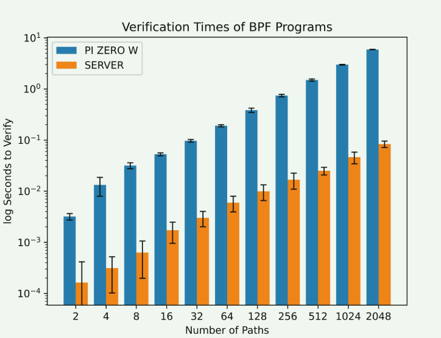
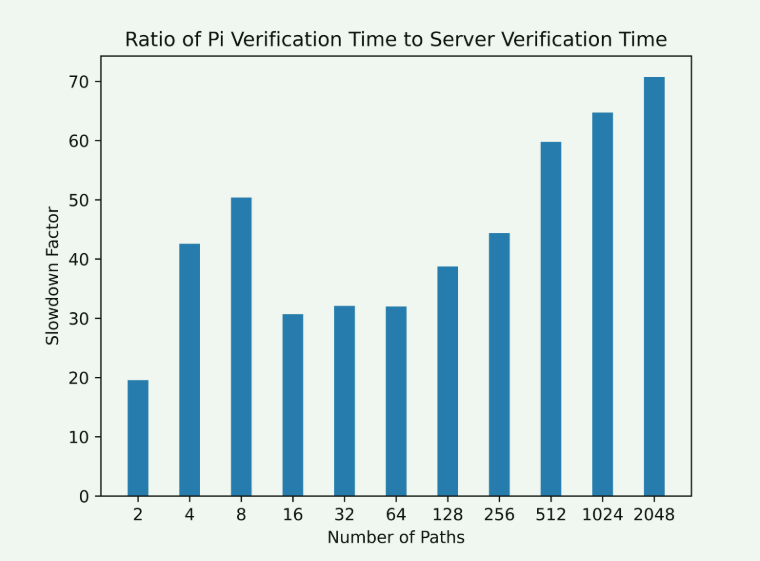
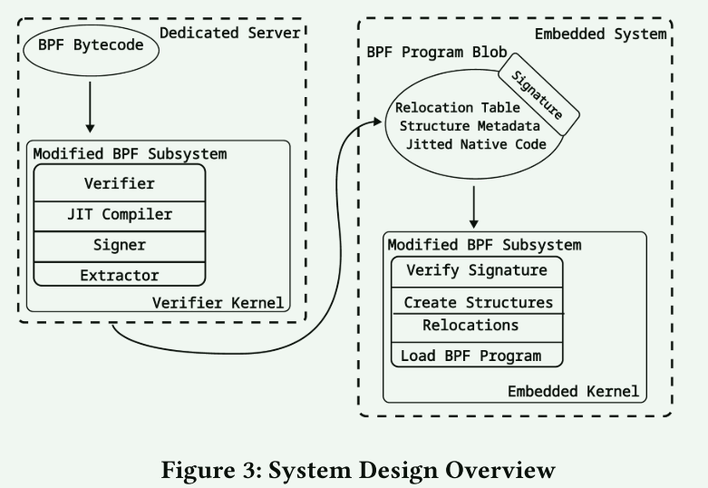
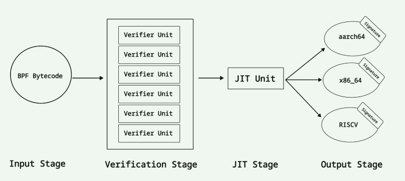

# Enabling eBPF on Embedded Systems Through Decoupled Verification

## Introduction

许多嵌入式系统使用Linux，尽管内核支持 BPF 程序，但由于资源限制，在嵌入式系统上运行 BPF 程序仍面临挑战。

- 从高级语言编译为 BPF 字节码需要一个庞大且计算成本高昂的软件工具链
  - 使用其他机器编译程序可以缓解这一问题
- 验证工作仍需在嵌入式设备的内核中进行，

解决方法：允许在嵌入式设备之外对 BPF 程序进行验证。

文章提出的系统允许在专用验证器内核上验证 BPF 程序并将其编译为本地代码，然后加载到嵌入式内核中

挑战：

1. 验证内核需要生成与嵌入式内核完全相同的结果；
2. 嵌入式内核不能相信不是由它创建的可执行文件是安全的
3. 外部内核会将嵌入式内核完全陌生的符号和地址输入到 jitted BPF 程序中

具体的实现方法：通过使用虚拟机验证和 JIT 程序来克服这些挑战。然后，外部内核将经过 JIT 的本地代码与概述程序结构以及所用符号和地址的元数据结合起来，以便嵌入式内核重新定位符号和地址。最后，外部内核会对这一组合进行签名，以表明程序是安全的

## BPF on Embedded system

如何发挥作用：

1. 对于嵌入式系统来说，它也很有价值，例如在支持物联网（IoT）传感器网络或提供更精细的性能洞察力方面
2. 提高嵌入式系统的性能
3. BPF 程序还提供了一种方法，可在不重启的情况下安全、动态地改变内核行为，以应对不断变化的条件

**Verification is Expensive**

在嵌入式设备上运行 BPF 程序的一个更棘手的问题是，每次加载程序时都要进行 BPF 程序验证，因此成本很高。校验器通过两次 BPF 程序验证其安全性。第一遍是确保程序不超过内核允许的最大指令数，并检查循环、非法跳转和无法执行的指令。第二步是遍历所有可能的程序路径，确保没有危及内核安全的分支[21]。更复杂的 BPF 程序需要更长的验证时间，因为可能的程序路径数量大大增加

- 在服务器上BPF 程序验证时间缩短了 19 倍到 70 倍
- 分析了Pi 的数据，发现 91% 到 99% 的 BPF 程序加载时间都用于验证，这表明 JIT 编译并不代表显著的成本

结论：这种程度的减速使得在嵌入式硬件上验证 BPF 程序的成本过高，尤其是当 BPF 程序发展得越来越大、越来越复杂时更是如此 

## DECOUPLING VERIFICATION FROM THE KERNEL

设计目标：

1. 使预先验证的程序能够加载到任何兼容的内核中：我们希望我们的解决方案是通用的，而不是与任何特定的架构绑定
2. 提供一种方法来提高嵌入式系统上 BPF 程序所允许的复杂性和可表达性：由于资源限制，目前的嵌入式系统对 BPF 程序运行的复杂性有所限制
3. 允许跨体系结构验证：我们希望利用可用的高性能 x86 硬件来运行我们的专用验证器。
4. 实现与 Linux 校验器的完全兼容：我们希望我们的系统能完全等同于当前的 in kernel 校验器，但验证发生时除外
5. 确保验证程序的安全保证仍然适用于我们的预验证程序：我们要确保不会丢失 BPF 验证器给出的任何安全属性

### Design

1. 将 BPF 字节码格式的程序加载到专用验证器内核中。在该内核中，我们验证字节码，然后使用 JIT 编译器生成本地可执行文件
2. 一旦程序通过验证和 jitted，专用内核就会收集 BPF 程序的元数据，并将其与 jitted 本地代码相结合。然后，专用内核会对合并后的jitted代码和元数据进行签名。该签名是程序可以安全执行的保证
3. 程序签名后，我们需要提取合并的本地代码和元数据。程序的某些部分在加载到嵌入式内核时需要重新定位。我们使用部分元数据建立一个重定位表，以便在嵌入式内核尝试加载程序时轻松进行重定位。元数据的其余部分则用于创建必要的内核结构，这些结构本应由校验器创建
4. 提取后，我们会得到一个签名二进制 blob，其中包含嵌入式系统的本地可执行代码、一些重定位和其他所需的元数据

### 实现完全兼容

校验器内核是一个可信系统，用于处理 BPF 字节码的校验和 JIT。文章没有创建自定义的校验器，而是使用了现成的 Linux 校验器和 JIT。

兼容性的另一个方面是，系统必须处理跨体系结构编译的问题，最初的解决方案是使用虚拟机模拟与嵌入式系统相同的架构。

可能的其它解决方案：

1. 其他架构的 JIT 代码插入专用服务器的内核，例如，可以在 x86 内核上运行 ARM JIT
2. 保留 JIT 来避免跨架构 JIT 带来的挑战。这样就可以对特定设备进行潜在的 JIT 优化

### 重定位程序

BPF 程序的两个核心功能在载入新内核时必须重新定位。第一个是辅助函数。

由于 KASLR、不同的内核配置、不同的加载时间和环境，两个内核中辅助函数的地址并不相同，为了重新定位这些调用，验证器内核为这些函数创建一个重定位表。该表由host代码中调用指令的偏移量和指定调用哪个辅助函数的数字组成

第二个需要重新定位的功能是映射，与辅助函数不同，映射是动态创建的，在内核内存中没有固定地址，文章设想用类似于解决辅助函数重定位的方式来解决映射重定位问题

## 扩展生态

尽管定制校验器和 JIT 具备潜力，但如果不对内核进行大量修改，BPF 子系统的当前设计不允许使用这些组件。与紧密耦合的内核系统相比，验证和 JIT 的问题更为细微。将验证和 JIT 从内核中分离出来，可以更容易地纳入新项目和新想法，从而扩大生态系统。

解耦验证为 BPF 程序提供了新的方法。一个有趣的想法是，BPF 程序验证是否可以通过某种形式的并行化来实现：

如果可以在进程间复制状态，并交流和同步需要检查的分支信息，那么我们就有可能进一步增加 BPF 程序的规模和复杂性。这也为分布式 BPF 程序验证提供了可能，在这种情况下，许多机器各自验证一个大型 BPF 程序的各个部分

> 由此衍生出的一个潜在行业是 "验证即服务"。用户上传 BPF 字节代码，就能获得经过验证的 BPF 二进制 blob，然后就可以加载