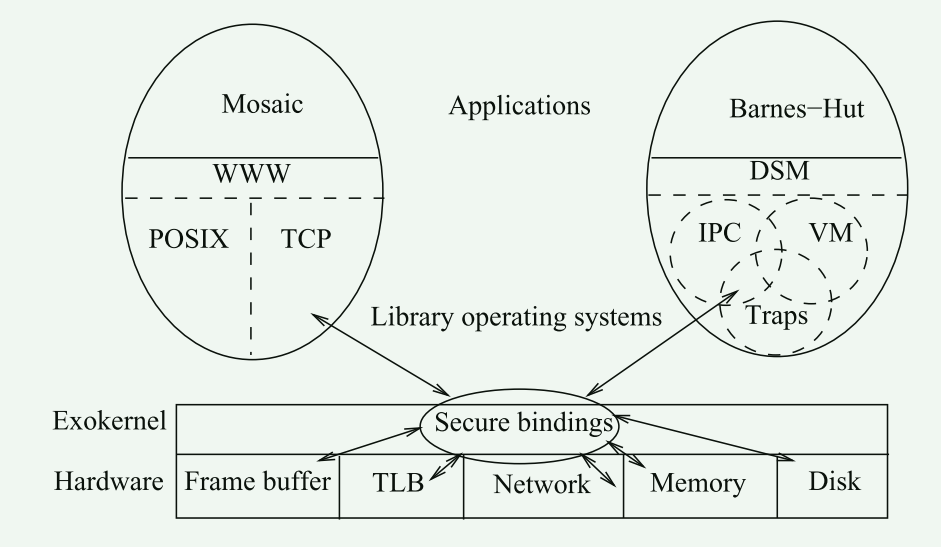
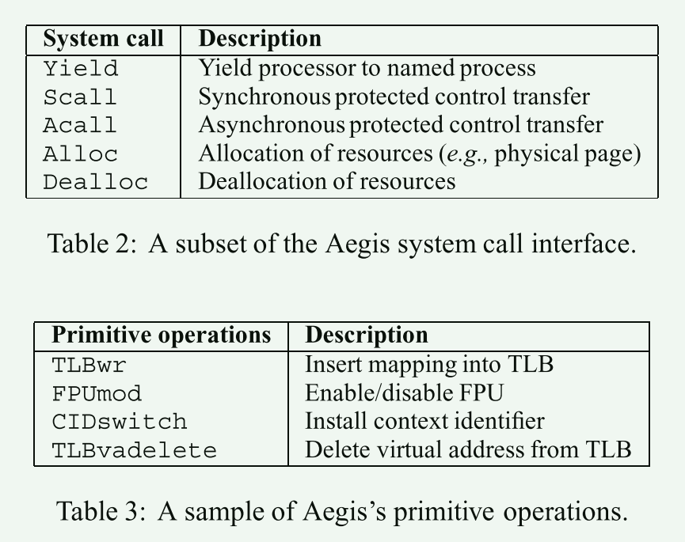
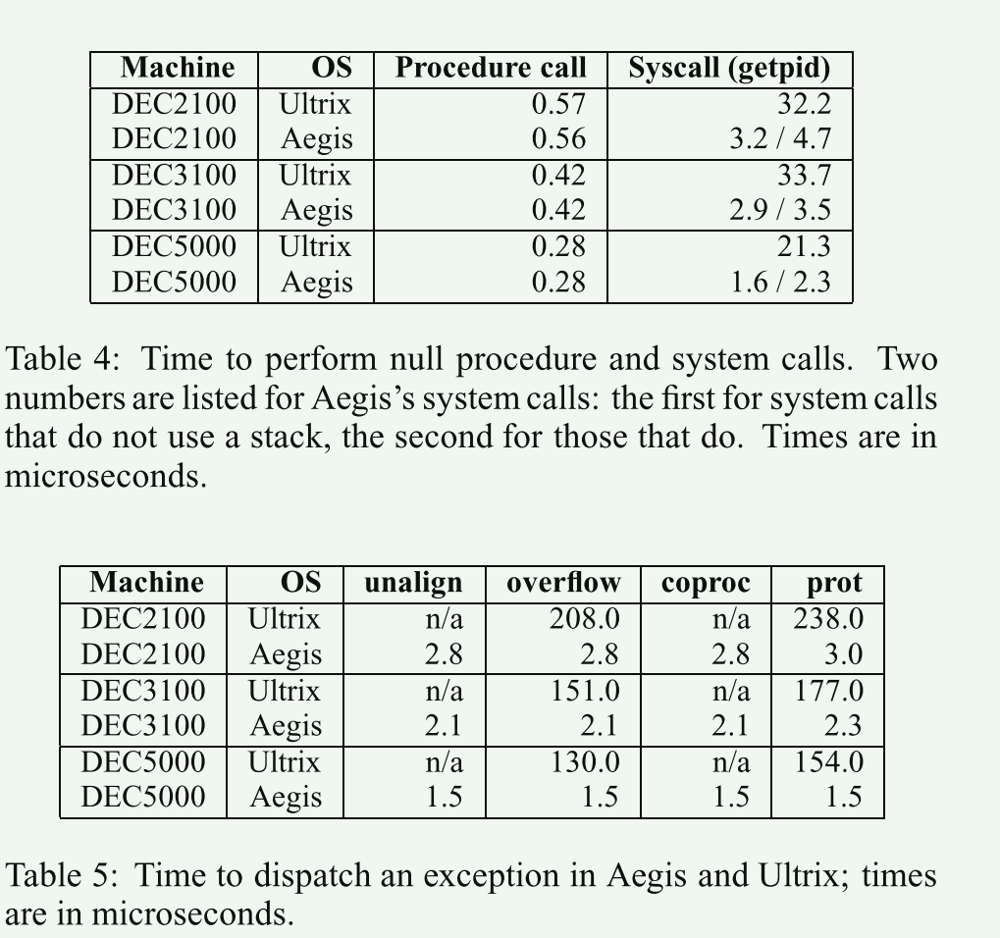
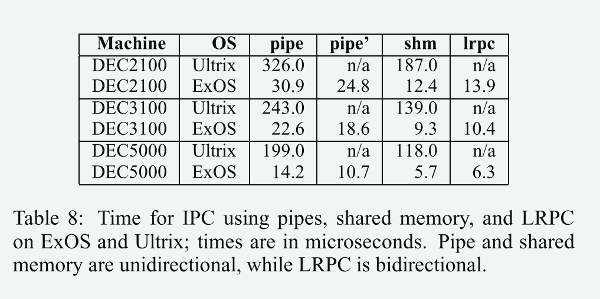

# ExoKernel

Exokernel: An Operating System Architecture for Application-Level Resource Management

本篇文章的研究内容是关于一种名为Exokernel的操作系统架构，该架构旨在实现应用级资源管理。文章介绍了Exokernel的设计原则和核心思想，包括将操作系统的功能限制在最低限度，将资源管理的控制权交给应用程序，以及提供灵活的接口和机制来支持应用程序对底层硬件资源的直接访问。通过这种架构，Exokernel可以提供更高的性能和灵活性，使应用程序能够更好地利用底层硬件资源。

## 传统kernel存在的问题

- 应用程序和物理资源直接的接口被操作系统固定了

- 资源信息被高级抽象隐藏
  - 文件、进程、进程间通信这些抽象定义了应用程序的执行环境，而应用程序无法修改这些实现
  - 硬编码这些抽象是不合适的
    - 否定了应用程序对特定领域的优化
    - 阻碍对现有抽象的修改
    - 限制了应用程序的灵活性，因为新的抽象只能在已有的抽象上再次增加

## Exokernel体系结构

- exokernel: 最小内核  ----> 安全地复用硬件资源

  - 提供尽可能低级别的接口

    - 将对资源的保护与管理分离

    传统内核通常将资源的保护和分离混合在一起，比如linux在分配给程序资源时同时也在管理资源的使用。

    - 安全导出资源
      - secure bindings 安全绑定
      - visible resource revocation 可见资源撤销
      - abort protocol 终止协议

- libos: work on exokernel’s interface

  - 应用程序与libos一起编译链接

The exokernel architecture is founded on and motivated by a single, simple, and old observation: the lower the level of a primitive, the more efficiently it can be implemented, and the more latitude it grants to implementors of higher-level abstractions.

exkernel体系结构是建立在一个简单而古老的观察基础上的:原语的级别越低，实现效率就越高，它赋予更高级别抽象的实现者的自由度也就越大。

## 原型系统实现

`Aegis`+`ExOS`

1. Exokernel必须提供的简单原语数量有限，所以Exokernel可以变得高效
2. 低开销提供硬件资源的低级别安全复用
3. 传统的抽象，如VM和IPC，可以在应用层有效地实现，它们可以很容易地扩展、专门化或替换
4. 应用程序可以创建特定目的的抽象实现，以满足其功能和性能需求。

## 详细设计

### 作者对可移植性的看法

1. 直接使用exkernel接口的应用程序是不可移植的，因为该接口将包含特定于硬件的信息。
2. 使用实现标准接口(例如，POSIX)的libos的应用程序可以在提供相同接口的任何系统之间移植
3. ==预计大多数应用程序将使用少数几个可用的库操作系统来实现流行的接口==
4. libos本身可以通过使用底层机器无关层来隐藏硬件细节来实现可移植
   1. 为什么要让libos可移植，既然已经考虑为应用特殊定制
   2. 这里指的可移植是在不同的exokernel上吗？比如对于mips/x86架构存在不同的exokernel

### exokernel的三个主要任务

1. 跟踪资源的所有权
2. 保证资源的保护
3. 撤销对资源的访问

对应安全导出资源的三个技术

### 设计准则

1. Securely expose hardware 安全暴露硬件

​	特权指令、硬件DMA能力和机器资源

2. Expose allocation 公开分配

   一个exkernel应该允许库操作系统请求特定的物理资源

3. Expose Revocation 公开撤销

​	一个exkernel应该利用一个可见的资源撤销协议

### 安全绑定

1. hardware mechanisms
   1. 硬件页表
2. software caching
   1. 软件页表
3. downloading appli-cation code. 包过滤器 特定于应用程序的安全处理程序(ASHs)
   1. 用户态代码到内核态执行

1. 类似与现在的libos，对于普通的过程调用，exokernel与传统内核的性能相近

2. 系统调用有10倍的差异，系统调用变为函数调用，经过高度优化，避免不必要的堆栈分配

### DPF：动态包过滤器 exokernel

### ASHs：application-specific handlers  libos

### 外核和微内核的区别

1. 外核架构将多个硬件资源切分长一个个切片，每个切片中保护的多个硬件资源由`LibOS`管理并直接服务于一个应用。而微内核架构则是通过让一个操作系统模块独立地运行在一个地址空间上来管理一个具体的硬件资源，为操作系统中的所有应用服务。
2. 外核架构中，运行在特权级的内核主要为`LibOS`提供硬件的多路复用能力，并管理`LibOS`。而微内核架构中，内核主要提供进程间通信的功能
3. 外核架构在面向一个功能和生态受限的场景下，可通过定制化`LibOS`获得更高的性能。微内核需要更复杂的优化。

## 总结

Exokernel：

- 不管理资源，但保护资源
- 保证多个应用之间的隔离
- 抽象原语

libos：

- 策略与机制分离：将对硬件的抽象以库的形式提供
- 高度定制化：不同应用可使用不同的LibOS，或完全自定义
- 更高性能：LibOS与应用其他代码之间通过函数调用直接交互

### Exokernel架构的优缺点分析

**优点**

1. OS无抽象，能在理论上提供最优性能
2. 应用对计算有更精确的实时等控制
3. LibOS在用户态更易调试，调试周期更短
4. 可以按照应用领域的特点和需求，动态组装成最适合该应用领域的`LibOS`，最小化非必要代码，从而获得更高性能
5. 处于硬件特权级的操作系统内核可以做到非常小，并且由于多个`LibOS`之间的强隔离性，从而可以提升安全性和可靠性

**缺点**

1. 定制化过多，导致维护难度增加
2. 现代机器变得越来越复杂，是否能达到所有的资源都是可导出的？

## 疑问

exokernel感觉有点像虚拟机管理程序？

