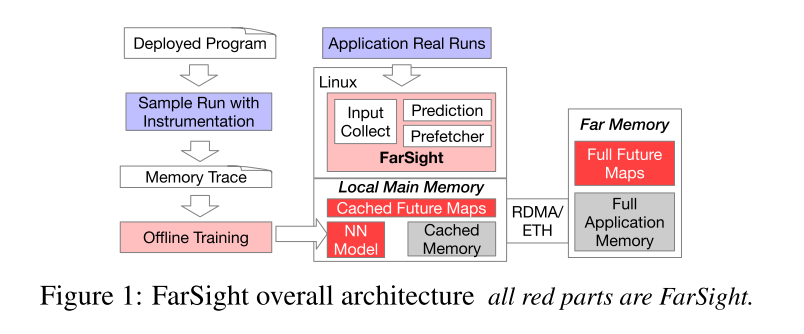
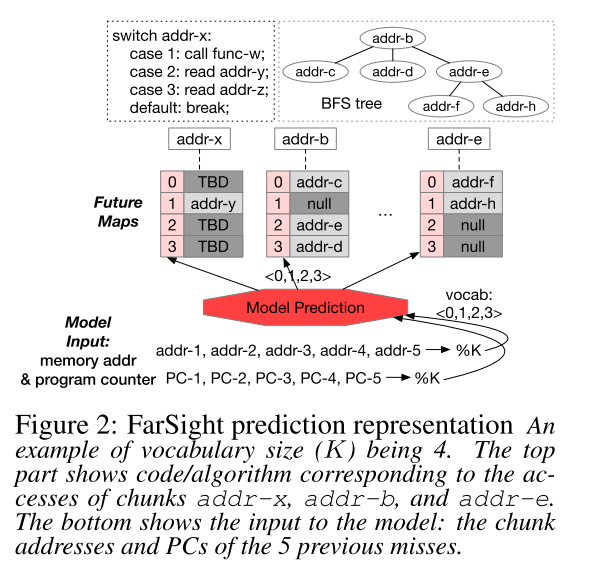
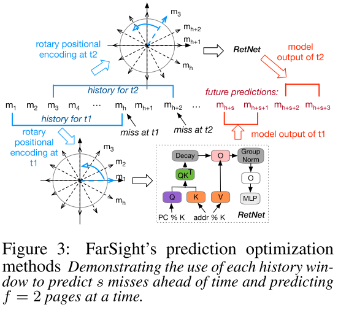
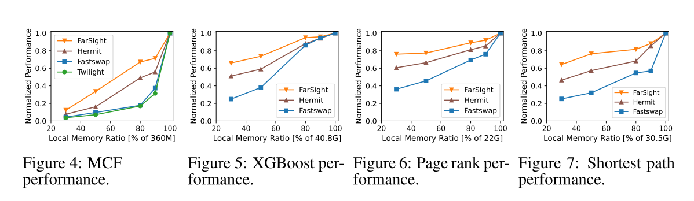
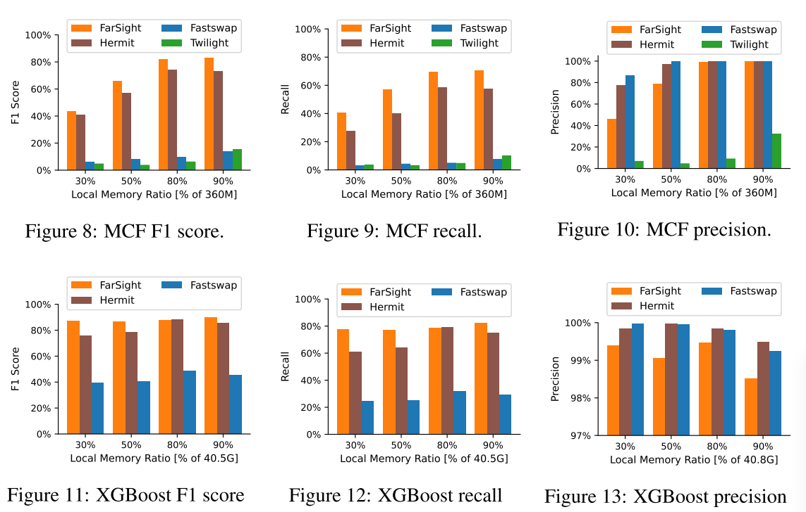
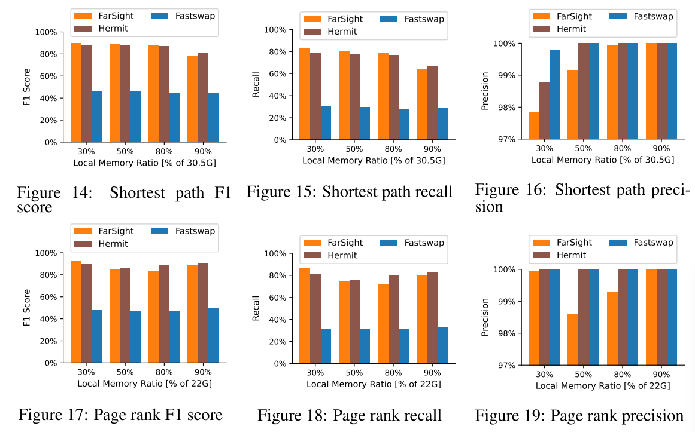
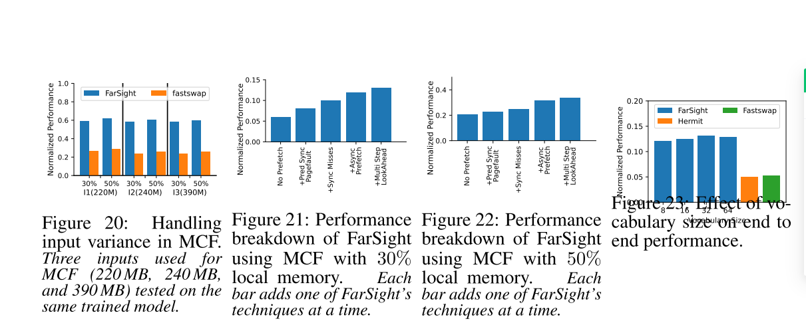

# FarSight: Deep-Learning-Driven Prefetching for Far Memory

为了应对不断增长的应用内存需求和服务器主内存扩展的放缓，谷歌和微软等主要数据中心采用了远内存的数据中心架构，其中大部分数据驻留在远程的网络连接内存中，并且只有一小部分数据被本地缓存在CPU连接的DRAM或GPU HBM中。

今天的远存储器系统的主要限制是从远程存储器访问非本地数据导致的应用程序性能开销，**该操作通常比本地DRAM访问慢20倍以上**。在现有的远存储器系统中采用的一种**常见机制是在数据被访问之前在后台从远存储器获取数据(即，预取)**，从而避免直接影响应用程序性能的前台按需远存储器数据获取时间。

有效的预取技术依赖于对未来内存访问模式的准确预测。当前远内存系统采取保守策略，仅预取符合简单规则（如**顺序访问**或**跨步访问模式**的内存访问。大多数数据中心工作负载：比如图计算/树形结构/递归数据结构表现出的内存访问模式均突破了基于规则的预取机制。

本文的工作：**FarSight**，一种基于深度学习的预取机制，专为远内存系统设计并实现在 Linux内核中。

**核心的挑战**：与基于仿真或硬件的 CPU缓存预取器不同，软件远内存预取器的核心挑战在于：**如何在庞大搜索空间中实现高准确率的同时避免预测延迟开销**？

**核心观点**：内存访问行为同时受应用程序语义（如算法逻辑）和输入相关的运行时上下文（如内存布局）支配。其中，语义特征往往具有跨输入的泛化性，可通过离线学习获得；而实际内存地址则与输入强相关，最适合在运行时处理。基于这种分离特性，我们采用深度学习（DL）模型来学习语义模式，并将地址解析任务委托给运行时系统组件

具体而言，我们提出将应用程序语义表示为内存访问之间的关系。对于每次访问，我们观察到，后续的访问通常只存在一小撮可能性。我们为每种可能的结果分配一个序数。尽管这些可能性所对应的实际内存地址会因不同输入而异，但其转移模式——即根据历史记录，哪个序数更有可能紧随其后——往往具有可学习性和可泛化性。

我们将深度学习模型的词汇表设定为预期的输出可能性（即一个可配置的K，默认值为64）。深度学习模型利用词汇表K中编码的内存访问历史序列，并以0至K-1之间的序数序列来预测未来的内存访问。这些序数在运行时通过一种轻量级的未来映射表进行解析——这是一种我们提出的内存内映射表，用于记录每次访问的内存地址。每个未来映射表包含K个条目，每个条目根据其索引映射到一个在运行时观察到的内存地址，该地址紧随当前页面的访问之后。这种设计大幅减少了模型词汇表的规模，使其从完整的内存地址空间缩减为一个固定的小尺寸，从而使得深度学习模型能够以紧凑的规模实现高精度的预测。

我们还提出了若干技术，以进一步降低或隐藏模型预测与预取的延迟。我们采用了一种位置编码方案，支持在多次预测之间复用已缓存的上下文，从而减少冗余计算和内存访问开销。我们提前预测数次访问，以便预取的数据能够在被访问之前抵达本地内存；同时，我们将在后台执行预测与预取操作，以隐藏其延迟

其它类似工作：

- [ ] Twilight-基于深度学习的内存预取器
- [ ] FastSwap-非机器学习的远端内存系统
- [ ] Hermit-非机器学习的远端内存系统

FarSight的性能优于FastSwap高达3.6倍，优于Hermit高达2.6倍，优于Twilight高达3.9倍。

## 背景

远端内存系统的主要局限性在于本地内存与远端内存之间的通信延迟。例如，若本地内存大小仅为远端内存的一半，采用朴素实现的远端内存系统可能导致一半的访问转向远端内存，从而使基于RDMA的远端内存系统的应用性能降低13倍。为了隐藏这一延迟，大多数远端内存系统会预先从远端内存中获取未来访问的数据，并将其缓存到本地。

### 现有方法

- 一些工作利用机器学习技术在微架构级别进行本地服务器预取预测的方法，即通过将数据从内存预取到CPU缓存中。然而，由于这些方法在性能和/或准确性方面存在一些问题，它们目前仅在仿真环境中或用于离线轨迹分析中得以实现。
- 基于强化学习的方法将预取预测建模为一个分类问题，每次预测仅能处理四种可能的地址偏移量；
- 基于回归的方法力求接近真实值，但正确的预取要求精确匹配真实值，因此其准确性存在明显问题
- Twilight和T-LITE则采用了一种定制的两层神经网络模型、聚类算法以及基于频率的历史表相结合的方案，用于CPU缓存的预取
- DART则先对一个Transformer模型进行蒸馏，再将蒸馏后的模型转化为一系列表格查找操作，以降低运行时性能开销

尽管这些研究工作已在仿真环境中证明了其在CPU缓存预取方面的有效性，但它们的训练和预测过程复杂，且缺乏普遍适用性，准确性也难以保持一致。

### 挑战

**延迟**：预取操作位于性能关键路径上，会直接影响应用程序的性能。如果预取的数据到达的时间晚于应用程序实际访问它的时间，那么这些预取数据便毫无用处

**准确性**：尽管错误的预取不会影响应用程序的正确执行，但会浪费本地内存空间和网络带宽，而在远距离内存环境下，这些资源尤为宝贵。由于本地内存预计将满负荷运行，一个被预取的页面需要另一个本地页面按需被换出，根据我们的评估，这一过程大约需要4微秒

**泛化**：由于性能要求，无法在运行时对模型进行训练或微调。离线训练的模型可避免任何运行时开销，但无法获取运行时状态。应用程序在运行时的内存访问通常取决于输入。此外，即使输入相同，由于采用了地址空间布局随机化（ASLR）等内存地址随机化技术，每次运行的内存地址也可能不同。

## FarSight

当应用程序部署时，FarSight会通过跟踪应用程序的执行过程，并结合用户提供的样本应用程序输入，训练一个小型模型（采用3K参数的保留网络架构）。在运行时，FarSight会将训练好的模型加载到运行该应用程序的每个CPU核心上。FarSight利用其捕获的近期程序执行历史，预测未来对远端内存的访问，并发出相应的预取请求。

### 预测任务

**模型输入：**FarSight将**页面缺失历史**作为深度学习模型的输入，而非完整的内存访问历史。这是因为，通过位于交换系统中，FarSight能够在每次页面错误时观察并记录缺失地址，而无需额外开销。除了使用页面缺失地址外，我们还将每次缺失与**引发该缺失的程序计数器（PC）**关联起来。这样做能够将程序执行信息与内存访问历史相结合，而且记录和使用PC并不会带来额外开销

为了将这两种类型的输入适配到词汇表中，分别对其值**取模**，模数为词汇表大小K。随后，采用图2底部所示的、由缺失页面地址与PC取模后得到的h对数值构成的历史序列作为模型输入。

> 尽管取模过程会带来信息损失，但借助历史序列以及两类信息，我们的模型仍能做出准确的预测。

**模型输出与未来预测图：**我们选择预测页面未命中（即访问本地内存中不存在的内存页面），而非试图预测每一次单独的内存访问——后者计算量巨大且并无必要。本质上，FarSight利用近期历史中的页面未命中序列来预测未来的页面未命中序列

**解决方案：将内存访问的可能结果标记为序数**。具体而言，我们记录一个词汇表大小（即K），表示在页面X发生缺失后，可能的下一次内存页面缺失的序号。根据上述模型输入，我们的模型会预测一个介于0到K-1之间的序数，该序数对应于一种可能的下一次页面缺失。我们为本地内存中的每个页面X动态维护一张未来映射表。未来映射表中的每个条目代表页面X发生缺失后，可能访问到的某个页面。当页面Y在页面X之后被访问，且我们的预测序数为k时，我们就将页面Y的虚拟内存地址填入页面X未来映射表的第k个条目。未来映射表中为空的条目，则表示该结果在运行时尚未发生。

**词汇表大小**：一个程序在访问一页后，可访问的内存页面数量可能少于或多于K个。未来的一些映射条目将不会被使用，从而浪费了局部内存。如果可能的访问路径多于K个，该模型将无法恰当地捕捉那些出现频率较低的访问行为。64这一默认值之所以能很好地适用于我们所有的应用，主要有以下几点原因：

1. 较小的未来映射使得热门条目能够缓存于CPU的L1和L2缓存中，从而大幅降低预测延迟
2. 具有可重复行为的应用程序，在发生一次页面错误后，其后续访问通常只会有有限的几种可能结果
3. 图的分布存在显著偏斜，某些节点可能会拥有大量邻居，但这些邻居的实际访问频率却相对较低。因此，即使预取未能命中这些邻居，也不会对应用性能造成显著影响
4. 大多数内存分配器会将地址分配范围限定在紧密相邻的地址区间内，这使得大多数访问都集中在同一内存页面内，而K个页面足以容纳这些访问

**模型结构**

RetNet用序列历史上下文的加权求和（对较新历史赋予更高权重）取代了Transformer中的softmax操作。我们将内存地址（取模K后）作为Q，将PC取模K后的结果作为K和V

RetNet实现了O(1)的推理延迟和O(N)的推理内存空间，其中N为序列长度，同时保持了良好的准确性和训练速度。其卓越的推理延迟和内存消耗使我们能够将其部署到每个CPU核心上

### 预测方法优化

**提前批量预取**：模型预测的是紧随其后的下一次缺失页。解决方案是通过设置一个前瞻距离，更长远地进行预测，以覆盖通信延迟，从而预取应用数据。具体而言，我们预测并预取自当前访问起第s次未来的内存缺失（即s即为前瞻距离）。我们通过保守地选取经过统计的通信延迟分布d的较高百分位数（例如95%）以及两次内存访问之间的平均间隔时间l，来确定s值，即s =d/l。采用这种保守的设置，预取的数据可能会在实际需要之前就到达，但极少会晚于实际需求。此外，为了更高效地利用网络带宽，我们每次预取f个页面

**模型输入编码**：用最近h次缺失的历史窗口作为模型输入序列存在重叠问题，但每次需要重新计算所有内容。提出一种基于旋转位置编码，该方法可复用重叠访问的已计算上下文。

**基于CPU的背景模型预测**：为最小化对应用程序性能的影响，我们尝试将FarSight的预测时间隐藏在应用前台执行过程中。具体而言，当应用线程因等待按需远端内存I/O操作而阻塞时，我们在该线程对应的CPU核心上执行预测模型权重、应用内存访问历史（模型输入）以及热点未来映射表项均保存在CPU核心的L1和L2缓存中。由于我们选择的模型体积小且历史窗口短（权重与元数据总计20KB），这种设计具有可行性。因此，单次模型预测耗时不足600纳秒，显著快于RDMA约2微秒的网络往返延迟。此外，所有预取操作均以异步方式执行。

### 模型训练和泛化

每个已部署的应用程序都会经历一次离线训练过程，直至其使用模式发生显著变化。这种针对每个应用程序的训练方式在我们所针对的本地数据中心中是可接受的，因为这些数据中心的应用程序仅用于企业内部。

为了训练模型，我们使用用户提供的样本输入，在单台服务器上以完全本地内存的方式运行该应用程序。

我们对样本运行进行插桩，以捕获内存访问行为，然后以离线方式利用所收集的轨迹训练RetNet模型。训练过程所采用的词汇表大小、前瞻距离、编码方法以及历史长度，均与第3.1节和第3.2节中介绍的保持一致。由于我们掌握了整个执行过程的精确信息，因此在每个未来映射中，我们会保留访问频率最高的前K个后续页面。训练的目标是未来映射中与真实值相匹配的正确索引。

**为什么少量的训练输入能够在运行时泛化到各种更大的输入上？**。FarSight的预测基于内存访问“分支”的“路径”，本质上就是根据运行时的历史行为，预测程序下一步将如何“分支”。对于训练过程中访问过的路径，如果在运行时再次遇到该路径，模型很可能会正确预测下一步的走向。

> 对于我们在评估中所使用的所有应用，我们在单块A6000 GPU上的训练时间约为30分钟

## 评估

FarSight在所有四种工作负载上均表现出色，与FastSwap和Hermit相比，速度提升高达3.6倍和2.6倍；在MCF上，其性能甚至比Twilight高出3.9倍。在不同本地内存大小的设置下进行对比，当本地内存较小的时候，FarSight的性能提升尤为显著

总体而言，FarSight在各种设置和工作负载下的F1分数和召回率均高于所有基线，这充分说明了其卓越的端到端应用性能。与Hermit相比，FarSight可减少11%至17%的按需页面错误；与FastSwap相比，可减少37%至63%的页面错误；与Twilight相比，可减少超过50%的页面错误

FarSight的精度远高于Twilight，在本地内存较大的情况下与FastSwap和Hermit相当。而在本地内存较小时，FarSight的精度则低于FastSwap和Hermit。这是因为FastSwap和Hermit依赖于Linux的顺序预取器；只有当检测到顺序访问模式时，这些系统才会进行预取操作，从而实现了较高的准确率，但召回率较低

FarSight展现出强大的泛化能力，仅需一次离线训练即可实现，其平均性能较FastSwap提升2.3倍，且适用于各种输入。得益于我们对内存访问行为与地址布局的解耦设计，FarSight能够跨不同输入进行泛化，并能以较小规模输入训练的模型适应更大规模的输入