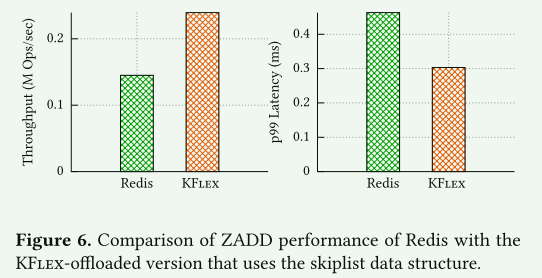

# Fast Flexible and Practical Kernel Extensions

## Introduction

内核可扩展性框架必须提供四个关键特性：安全性、灵活性、性能和实用性。

- 安全性要求保证扩展不会损害内核和其他应用程序或扩展的完整性。
- 灵活性使用户能够编写扩展程序，将各种功能卸载到内核中。
- 性能要求扩展作为内核的一部分执行时不会产生过多的运行时开销。
- 实用性要求框架应便于开发人员使用，不要求他们学习新的编程语言或使用特定的工具链。

现有的内核可扩展性解决方案并不能同时提供所有四种特性，通常只能确保安全性和其余三种特性中的两种。

1. 使用类型和内存安全编程语言来保证安全性的系统[spin]具有良好的性能和灵活性，但由于需要开发人员学习新的编程语言而未被广泛采用。

2. 依靠运行时检查来保证安全性的系统[]具有灵活性和易用性，但由于安全需要大量的运行时检查，因此性能较差。
3. 最后，依赖自动字节码验证的系统（如 eBPF）运行时开销低，可支持各种编程语言。但是，它们牺牲了灵活性，因为自动验证技术无法扩展到任意代码，这限制了用户可以卸载的功能

KFlex: 一种内核可扩展性的新方法，它基于内核安全性包含两个不同子属性的观点，每个子属性都由不同的机制来实现。

KFlex 将内核安全性分为：

1. 内核接口合规性，即要求扩展只能在允许的情况下访问内核拥有的资源（即内核内存和内核函数）；
2. 扩展正确性，即要求扩展能安全地访问自己的内存并正确终止

**为了强制执行内核接口合规性，KFlex 使用自动字节码验证，因为访问内核资源必须满足内存安全性之外的语义要求（例如，维护内核数据结构的不变性）。**

**相比之下，KFlex 依靠轻量级运行时检查来执行扩展的正确性。这是因为对扩展自有资源的访问不需要满足语义要求，简单的运行时机制就足以保证对扩展内存的访问不超出范围，并确保安全终止**。

KFlex 使用不同的机制来保证安全性，从而在灵活性、性能和实用性之间实现了更好的平衡。通过使用自动字节码验证，KFlex 无需用户使用特定的语言和工具链。通过使用可扩展至任意代码的轻量级运行时机制来增强验证功能，KFlex 可确保用户安全地卸载各种功能。最后，上述机制的结合使用确保了 KFlex 在运行时的低开销，因为验证提供的保证限制了所需的运行时检查次数。

实现：Linux环境下设计并实现了KFlex，重用了eBPF框架来自动验证内核接口的合规性，并用一个轻量级的运行时来增强它，以确保扩展的正确性

KFlex 运行时依赖于两项关键技术，这两项技术都是与 eBPF 的验证器共同设计的，以确保较低的性能开销

1. KFlex 利用轻量级软件故障隔离（SFI）来清除扩展对自身内存的所有访问，KFlex 的 SFI 使用 eBPF 的范围分析，在对自身内存的访问可验证为安全时省略检查，从而显著降低了运行时开销
2. KFlex 引入了扩展取消机制：一种以接近零的运行时开销安全终止长期运行的扩展的机制

这种低开销源于 KFlex 使用 eBPF 验证器静态计算扩展获取的内核资源集

**贡献**

1. 安全属性分离。我们提出了一种内核可扩展性的新方法，它将安全性分为两个子属性，并利用定制机制来执行每个属性
2. 运行时安全机制。我们提出了与 eBPF 自动验证共同设计的运行时机制，以保证以较低的开销实现安全终止和内存安全。
3. 实用设计。我们证明了我们的方法能为实际应用带来显著的性能优势，并使用户无需使用特定的编程语言和工具链就能将新功能卸载到 Linux 上。

## 背景和动机

eBPF扩展通过一个定义明确的接口与内核进行交互，该接口通过特定钩子输入或辅助函数公开内核对象。eBPF 的接口目前还比较有限，这是因为 eBPF 是在 Linux 上改造的。不过，随着新的扩展钩子和辅助函数的引入，这一接口正在逐步扩展，以应对新出现的使用案例。

为了保持内核安全自动验证的可操作性，eBPF 框架对扩展实施了两个限制。首先，由于自动验证无法扩展到任意数据结构 [62, 81]，**eBPF 阻止扩展定义数据结构，并要求它们使用内核提供的特定数据结构集（称为 eBPF 映射）**。其次，为了保证终止，**eBPF 不允许使用不具备静态可计算循环边界的循环**

目前解决eBPF灵活性问题的方法是逐步扩展验证器的功能 。然而，这一策略面临两大挑战。首先，将新功能并入 Linux 内核的过程既耗时又耗力，给开发人员造成了很大的障碍。其次，它会增加验证器的复杂性，从而增加内核代码出现错误的可能性。最近的研究发现了几个这样的错误，凸显了这一问题的严重性。这些缺点表明，从长远来看，目前逐个解决 eBPF 有限灵活性的方法是不可行的，需要一种更全面和可扩展的解决方案。

## KFlex设计

KFlex 的设计基于这样一种观点，即构成安全的两个子属性--内核接口合规性和扩展正确性--最好由不同的机制来执行。

自动验证最适合强制执行内核接口合规性，因为对内核资源的访问必须满足内存安全性之外的语义要求（例如，维护内核数据结构的不变性）。此外，由于扩展只能通过定义明确的接口（如钩子专用输入和辅助函数）访问内核资源，因此自动验证技术足以保证内核资源的安全性。

相比之下，运行时检查最适合强制执行扩展的正确性，因为内核只要求扩展在访问扩展拥有的内存时无挂起和内存安全。为了使所需的运行时检查保持简单，KFlex 在内核虚拟地址空间的专用部分分配扩展所有的内存，从而消除了内核所有内存和扩展所有内存之间的内存别名

> [!NOTE]
>
> 现在kernel的验证器会静态验证这两个属性，这带来了比较大的限制，分解为两个子属性并使用不同的方法确保其属性，就可以一定程度上降低限制

KFlex 的工作流程包括三个主要步骤：

1. 在步骤 1 中，KFlex 将扩展作为 eBPF 字节码输入，并使用 eBP 校验器检查内核接口合规性。由于 KFlex 保留了 Linux 向 eBPF 扩展提供的接口，因此我们重新使用了 eBPF 的内核接口合规性检查器
2. KFlex 的检测引擎（Kie）为扩展字节码添加了两类检测：(i) 对所有堆访问进行消毒，以防止对堆的越界访问；(ii) 对循环进行检测，以确保 KFlex 可以安全地终止循环。在这一步骤中，Kie 利用 eBPF 校验器的范围和循环终止分析来减少所发出的检测，从而降低运行时开销。然后，经过检测的字节码将被传递给 eBPF JIT，由其编译成机器码。KFlex 会增强 eBPF JIT，以确保添加的指令能正确编译为本地指令序列
3. 在第 3 步中，KFlex 运行时会执行扩展，同时保证内存安全和安全终止。

### 编程模型

KFlex 提供的 API 使开发人员能够声明一个完全由扩展拥有和管理的内存区域；我们称该区域为扩展堆。一旦声明了堆，开发人员就可以使用 kflex_malloc() 和 kflex_free()，从堆中分配和取消分配内存，创建任意的内存布局，并像在用户空间一样定义自己的数据结构。

KFlex 还允许扩展包含复杂的循环，而静态计算循环边界是不可行的。

KFlex 还提供了基于队列的自旋锁 ，使开发人员能够在用户空间应用程序和扩展程序之间同步访问共享内存。在 eBPF 中，扩展程序在任何时间点都不能获得一个以上的锁，与此不同，KFlex 扩展程序可以安全地同时持有多个 KFlex 自旋锁实例。

KFlex 对扩展施加了一个值得注意的限制。具体来说，KFlex 要求扩展代码中的循环必须收敛内核资源，即在循环迭代中获取的任何内核资源也必须在迭代结束时释放

### 使用轻量级 SFI 实现内存安全

当扩展声明堆时，KFlex 运行时会将堆（按其大小对齐）映射到扩展的虚拟地址空间。KFlex 运行时初始化 KFlex 内存分配器时，会为每个大小类别分配每个 CPU 的列表和一个全局列表，以保护内存，这与今天用户空间分配器的初始化方式类似。KFlex 在初始化时不会为整个堆预先分配物理内存，而是根据 KFlex 内存分配器的要求，填充与堆相对应的页表项。

Kie 实现了 SFI，对扩展代码中的所有指针解引用进行 "防护"，确保它们在堆边界内访问内存。

1. 首先，KFlex 屏蔽指针地址，只保留正确偏移到堆所需的位。
2. 接下来，KFlex 通过添加堆的起始地址作为基数，计算出一个经过净化的地址。这样就能确保消毒后的地址是安全的，因为堆已按其大小对齐

我们选择使用地址屏蔽对堆访问进行消毒，而不是在越界访问时捕获和取消扩展，因为前者提供了更好的性能。这是因为地址屏蔽通常可以优化为一条硬件指令，而捕获和取消每次访问都需要额外的硬件指令。**由于内核安全不需要对访问扩展自有内存提供任何语义保证**，因此我们选择了在 KFlex 中性能更好的 SFI 方案

KFlex 的 SFI 还支持 "性能模式"，允许开发人员以提高性能来换取保密性。在性能模式下，KFlex 不会对读取指令进行消毒，这虽然减少了开销，但会导致机密性损失，因为扩展可以读取任意内核内存。性能模式不会影响安全保证，因为写入指令始终会被清除，而导致页面故障的读取指令会触发取消

### Safe Termination Using Extension Cancellations

KFlex 引入了扩展取消机制：该机制可终止长期运行的扩展，并在终止时安全释放扩展获取的任何内核对象（如引用计数器、锁），以遵守内核不变式。当与内核接口合规性自动验证（保证对内核所有内存的访问符合内核不变式）相结合时，扩展取消功能可确保 KFlex 在终止扩展执行时将内核恢复到静止状态（内核拥有的内存和对象的不变式得到满足的状态）

**对于每个扩展，KFlex 都定义了一组取消点 (Cps)，它们代表扩展代码中的指令，如有需要，KFlex 将在这些指令上终止扩展。**Cps 由两个类组成：

1. 类 1（𝐶1）由扩展代码中无法静态保证终止的循环的所有后缘组成（ 第 49 行）
2. 类 2（𝐶2）包括对扩展堆的访问（第 28、29 和 40 行）。在所有此类访问中取消扩展可能是必要的，因为尽管 SFI 可以确保堆访问不超出范围，但它并不能保证被访问的页面具有有效的物理地址，因为这需要为整个堆预先分配物理内存

KFlex 通过在 𝐶1 中的结尾添加堆访问，将两类 Cps 简化为一类。在循环体插入一个堆访问（*terminate）来实现

**为确保运行时能在 Cp 安全终止扩展，Kie 会为每个 Cp 计算一个唯一的对象表**。该对象表记录了扩展在执行 Cp 时获得的堆栈位置和存放内核对象的寄存器，因此代表了扩展在 Cp 处被强制终止时必须安全释放的资源。

> [!NOTE]
>
> 记录资源的分配情况和对应的回收函数

KFlex 依靠 eBPF 验证器的符号执行来计算对象表。由于扩展只能通过具有明确语义的辅助函数来获取和释放内核资源，因此 KFlex 可以精确跟踪扩展在每个 Cp 中持有的资源集，以及在强制终止时释放这些资源所需的析构函数。

> [!TIP]
>
> 由于 KFlex 要求扩展代码中的所有循环迭代都释放在同一迭代中获取的任何内核资源，因此每个 Cp 的对象表也与执行的循环迭代次数无关，因此可以唯一确定。需要注意的是，由于不同的非循环分支序列会导致相同的 Cp，因此在计算对象表时仍有可能出现分支情况

为了强制取消长时间运行的循环，KFlex 运行时会监控扩展的执行时间，并在执行时间超过所需的量级时，将循环中用于堆访问的地址（(terminate)）清零。这将导致扩展在与长期运行的循环相对应的 Cp 处引发异常。为了正确释放内核拥有的对象，KFlex 运行时会逐步查看与 Cp 相对应的唯一对象表，并为表中的每个对象调用相应的析构函数

**KFlex 对正确扩展的唯一运行时开销来自每次循环迭代时执行的额外堆访问 (*terminate)**

### 与用户空间的低开销通信

**KFlex 可让用户空间代码请求将扩展堆映射到其地址空间，从而通过虚拟内存直接、透明地访问所有扩展状态，并避免系统调用**。

两个挑战：

1. 仅仅将堆映射到扩展和用户地址空间是不够的，因为对内存的所有引用都必须指向正确的地址
2. 第二个挑战涉及确保用户空间应用程序和扩展程序之间安全共享可变状态。虽然用户空间和扩展程序都可以使用同步机制，但由于在内核中运行的扩展程序可以在任何时候抢占其用户空间对应程序，因此这种同步变得更加复杂

为了应对第一个挑战，Kie 在存储指向共享堆的指针时，会将其转换为有效的用户空间地址。这种转换类似于消毒，但基址会调整为指向共享堆在应用程序虚拟地址步调中的映射位置

为了应对第二个挑战，KFlex 使用户空间应用程序能够在持有扩展也可能获得的自旋锁时，请求临时时间片扩展，类似于 Symunix [38]。这种方法在实际应用中效果很好，因为自旋锁的关键部分通常很短，因此单个时间片扩展（我们将其设置为 50 微秒）通常就足以让应用完成关键部分

在不合作的用户空间进程不释放锁并被强行抢占的情况下，内核中等待锁的扩展最初会继续旋转等待。不过，这些扩展最终会被 KFlex 的扩展取消机制取消。当这种取消发生时，KFlex 运行时会从内核中卸载扩展，但不会销毁扩展堆，因为它可能会被用于支持用户空间应用程序中的分配。只有当应用程序显式关闭堆文件描述符或应用程序终止时，才会解除扩展堆的分配

## 实现

## 评估

- KFlex 能为实际应用带来端到端的性能优势吗？
- KFlex是否能让开发者将新功能卸载到内核，从而带来切实的灵活性优势？
- KFlex是否使开发者能够与用户空间应用程序共同设计扩展？
- KFlex与eBPF的验证器共同设计的运行时技术是否能显著减少运行时开销？

### Performance Benefits for Applications

#### Memcached

为了用 KFlex 卸载 Memcached，我们在单个 KFlex 扩展中实现了所有的 Memcached 逻辑，包括解析传入的网络数据包以及处理 GET 和 SET 请求。这就确保了基于 KFlex 的 Memcached 完全在内核空间运行，而不涉及用户空间

BMC 是最近的一项研究提案，它实现了一个look-aside 高速缓存，只用 eBPF 处理 GET 请求。

#### Redis

虽然 KFlex 的性能优势显著（忽略离群值），但 Redis 的性能优势低于 Memcached。造成这种差异的原因是相应的扩展附加到了不同的钩子上。由于 Redis 通过 TCP 运行 SET 和 GET，而 Memcached 通过 UDP 运行 GET，通过 TCP 运行 SET [42]，因此 KFlex-Redis 中的所有请求都必须先穿越 Linux TCP 栈，然后再由扩展处理，从而降低了性能优势

### Offloading New Functionality with KFlex

展示了基于 KFlex 的数据结构卸载的性能。我们看到，在禁用性能模式时，KFlex 卸载的数据结构平均吞吐量开销为 9%，延迟开销为 31.7%。启用性能模式后，我们发现指针追逐较多的数据结构（链表、跳表）的延迟开销降低了 3-4%，其他数据结构（hashmap、rbtree）的延迟开销平均降低了 1-2%，而网络草图的延迟开销没有变化

- 基于 KFlex 的实现也要为 eBPF ISA 的低效付出代价，如寄存器压力和 memcpy() 的不良实现。我们相信，这种开销可以通过额外的工程设计来减少

KFlex 的性能比用户空间版本高出 1.65 倍，尾部延迟降低了 52.8%。**这些结果表明，虽然使用 KFlex 实现数据结构会产生少量运行时成本，但与 KFlex 的可扩展性所带来的端到端性能优势相比，这种成本就显得微不足道了。**

### 与用户空间应用程序共同设计扩展功能

### 验证是否会减少 SFI 的管理费用？

我们测量了由于验证器对每个数据结构的更新、查找和删除操作进行范围分析而省略的 SFI 防范指令的数量。我们不将形成新堆指针时发出的保护指令计入总数，因为这些指令不一定会被优化掉。由于每条保护指令都是相同的，因此省略的保护指令数量可以代表性能开销的减少

我们发现，在所有数据结构中，验证器的范围分析平均消除了指针操作中 76% 的防护指令，在一些数据结构操作中也消除了 100% 的防护指令。范围分析无法消除的保护指令通常是那些添加到指针的标量大小可能大于堆大小的指令