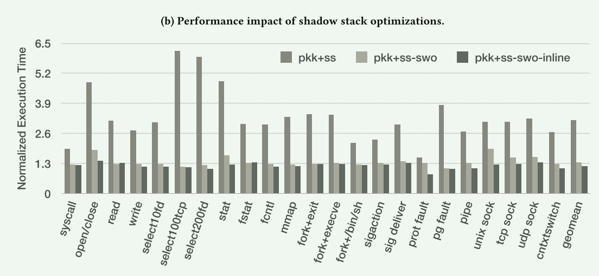

# Fast Intra-kernel Isolation and Security with IskiOS

操作系统内核是软件栈的基础，对操作系统内核的控制流劫持攻击会危及整个系统的安全性。为了保障系统的完整性，控制流完整性（CFI）执行确保在执行过程中只遵循授权控制流图中的路径。与此同时，抗泄漏多样化技术(leakage-resilient diversification )会削弱攻击者对内存中代码布局的了解。

- CFI 必须保护堆栈上返回地址的完整性
- diversification 必须防止攻击者了解内核代码的布局

**现有的内核内隔离机制通常依赖于软件故障隔离(SFI)，对内存写入和读取添加边界检查，以防止未经授权访问敏感数据**。由于这些检查的开销与受保护区域的数量成正比，基于 SFI 的方法通常会将所有敏感信息分组--通常位于虚拟地址空间的上端--因此只需检查一个边界。

- 这种分组方式降低了设计灵活性和多样化
- x86-64 上最有效的 SFI 实现依赖于英特尔的内存保护扩展（MPX），这一硬件特性最近已被淘汰

本文开发了一种新的用户/内核隔离机制，称为 PKK（Protection Keys for Kernel space），它使用 PKU 硬件动态禁止在操作系统内核中运行时对页面的读取和/或写入访问。我们的 PKK 机制既便宜又灵活，同时支持 SMEP 和 SMAP（监督模式执行/访问 预防）。

IskiOS，这是一个为 Linux 内核提供用于存储代码的只执行内存 (XOM) 和写保护影子堆栈的系统。 与以前的方法不同，IskiOS 有效地保护代码和影子堆栈，而不改变虚拟地址空间布局。

为了保护影子堆栈，IskiOS 采用了一种新颖的调用约定，该约定不仅可以免受调用线程中的控制流劫持攻击，还可以抵御利用跨线程竞争的攻击。 除了这个调用约定之外，我们还引入了两种技术来减少 PKU 域切换的频率。 第一种技术称为影子写入优化，可避免将返回地址冗余写入影子堆栈。 第二个执行积极的函数内联，完全避免调用许多较小的函数。

**贡献**：

1. 英特尔 PKU 可用于实现高效的用户/内核隔离，扩大内核内存的保护模式集
2. 利用由此产生的 PKK 机制在 Linux 内核中提供只执行内存 (XOM) 和受保护的影子堆栈，并具有任意地址空间布局
3. 影子写入优化，它与积极的内联一起，可以显着减少基于 PKK 的影子堆栈的剩余开销
4. 我们证明了 PKK 和 XOM 相对于标准 Linux 的几何平均开销约为 11%。 添加受保护的影子堆栈后，总数达到大约 22%
5. 我们确认全尺寸程序的开销要低得多：PKK 和 XOM 的平均开销可以忽略不计，并且受保护的影子堆栈增加的几何平均数不到 5% 开销

## 设计

**核心观点：使用内存保护密钥来取代 U/S 位的功能**

操作系统内核能做而用户代码不能做的只有两件事：执行特权指令和访问受保护的操作系统内核内存。

- 特权指令的执行不是由 PTE 中的 U/S 位控制，而是由处理器的执行模式（环 3 与环 0）
- U/S 位对加载和存储的影响可以通过将用户页和监督页分配到不同的保护域来模拟，在从用户空间到内核空间或从内核空间到用户空间时启用或禁用对这些保护域的访问，并在其他时间防止 pkru 发生变化

> 由于 pkru 权限对指令获取没有影响，因此在用户模式下运行的代码可以直接跳转到内核代码段内的代码。然而，这种跳转到内核代码的行为是无害的，因为处理器仍然处于用户模式（环 3）：执行特权指令会导致陷阱（因为执行模式仍然是非特权的），读取或写入内核内存会导致陷阱（因为访问被 pkru 锁定）。现在，进入内核的唯一方法是使用系统调用、陷阱或中断，将处理器的模式从用户模式改为内核模式。

实施方法：

IskiOS 在每个页表的每个条目中都设置了 U/S 位，但用于映射处理系统调用和中断的蹦床页的少数条目除外。这就有效地将所有内存标记为用户模式。

- IskiOS 将 0-7 键保留为内核保护键。内核内存的每个页面都会被分配到这八个密钥中的一个
- 当系统以用户模式运行时，IskiOS 会禁止对带有这些密钥的页面进行读写访问，而当执行内核代码时，则会启用它们
- 合法使用 PKU 的现有应用程序可继续通过 pkey_alloc() [38] 系统调用从内核获取密钥，该系统调用经过修改，可返回 8 到 15 之间的可用密钥
- 由于应用程序可能会使用 PKEY 8-15 来执行自己的安全策略，IskiOS 会在进入内核时保存 pkru 的值，并在返回用户空间时恢复该值

### 保护pkru

wrpkru不是特权指令，应用程序代码可以随意修改pkru。因此，IskiOS 必须阻止应用程序代码启用对内核页面的读或写访问。面临的两个挑战：

1. 允许应用程序使用 wrpkru 指令来实施自己的安全策略，防止它们清除 PKEY 0-7 的 WD 或 AD 位
2. 鉴于（非特权）内核指令现在可以在用户模式下执行，IskiOS 必须防止应用程序通过跳转到内核中的 wrpkru 指令来损害安全性

解决方法：

挑战1：IskiOS 确保所有具有执行权限的应用程序页面都禁用写入权限(针对wrpkru)

>  当内核将页面映射到具有执行权限的应用程序的虚拟地址空间时，它会扫描该页面（包括其前后页面的边界）以查找可能包含 wrpkru 指令的任何字节序列。 如果找到任何一个，它就会在该地址上放置一个调试观察点 。IskiOS 检查要写入 pkru 的值，以确保该进程不会修改 PKEY 0-7，如果修改，则终止该进程

- 合法的应用程序通常调用glibc的函数来修改pkru，通过在修改这个函数逻辑，可以禁止用户程序修改内核数据的权限

挑战2：IskiOS 在内核代码中的每个 wrpkru 之后插入一个检查，以确保处理器当前在由代码段寄存器 (cs) 指定的 Ring 0 中运行。

### 管理模式执行保护 (SMEP)

当 SMEP 启用时，内核模式代码无法从 PTE 被标记为用户空间的页面获取指令； 任何此类访问都会导致页面错误，从而允许操作系统进行干预。

 IskiOS 将内核内存配置为用户内存，因此必须禁用 SMEP 才能执行内核代码。 **为了防止内核在没有 SMEP 支持的情况下执行任意用户代码，IskiOS 采用了 kGuard 的方法，并对内核代码添加了控制流检查。这些检查适用于每个间接控制传输，并确保特权执行保留在内核空间内。**

### 管理员模式访问预防 (SMAP)

SMAP禁用对用户页面的管理员模式访问，试图阻止攻击者控制的指针直接访问用户内存，从而可能破坏内核的控制流。 

为了复制 SMAP 的保护，IskiOS 默认情况下不允许内核访问用键 8-15 标记的页面（即用户页面）。 当需要读取或写入应用程序内存时，copy_to/from_user()  函数临时启用对键 8-15 标记的页面的访问。

## 威胁模型

我们假设攻击者的目标是使用管理员权限在操作系统内核中执行计算。 内核本身是非恶意的，但可能存在可利用的内存安全错误，例如缓冲区溢出和悬空指针。 我们的攻击者是非特权用户：他们可以在用户空间中执行任意代码，但无法指示操作系统内核加载实现恶意代码的新内核模块。7 我们假设强制执行 WˆX  策略来阻止攻击者 将代码直接注入内核内存。 最后，我们假设硬件已正确实现并且侧通道超出范围

## 内核XOM

代码重用攻击（如 ROP ）利用的是有关代码在内存中的位置和放置方式的信息。

为了挫败这类攻击，code多样化方案对代码的布局和位置进行了随机化处理，使攻击者无法利用先验知识找到这些信息。高级代码重用攻击（如 JIT-ROP ）利用缓冲区超读漏洞 检查代码段，以找到可重用的代码。为防止此类攻击，**IskiOS 将所有内核和内核模块代码页都放在仅可执行内存（XOM--可执行但不可读写的内存中。x86 架构不直接支持 XOM，但 IskiOS 使用 PKK 实现了它**。

> IskiOS 为操作系统内核代码段保留了 8 个操作系统内核保护密钥中的一个。它将包含内核代码的页面的所有页表项配置为使用该密钥。然后，它会在 pkru 中为该保护密钥设置访问禁用（AD）位，禁止对包含内核代码的页面进行读取访问。由于保护密钥只影响数据访问，因此允许指令获取和执行

- 与基于 SFI 的 XOM 实现不同，IskiOS 可以保护任何虚拟地址上的代码页，对多样化没有限制：代码页和数据页可以穿插放置在虚拟地址空间中任何需要的地方

## Kernel Shadow Stack

高级代码重用攻击通常会修改堆栈上的返回地址。影子堆栈可将返回地址保存在不易被修改的位置，从而抵御此类攻击。**虽然影子堆栈的位置可以简单地通过随机化来掩盖，但这种方案已被证明是不够的。为了提供真正的保护，我们需要影子堆栈是不可访问的**。

提示，还需要保证影子堆栈不存在竞争问题，不会出现返回地址被其他内核上的攻击者修改的时间窗口。

为了避免使用单独的堆栈指针，我们采用了并行影子堆栈设计，其中所有影子堆栈条目都与原始堆栈上的条目位置有一个恒定的偏移量。**为了防止影子堆栈被篡改，我们将内核保护密钥之一专用于影子堆栈使用的页面（以及在物理映射中映射到相同帧的页面）**

为了实现无竞争，IskiOS 修改了默认调用约定，将返回地址通过寄存器传递给每个函数，而不是将其推入堆栈。我们修改了代码生成器，为此保留了 %r10。当调用者希望进行函数调用时，它首先将 %r10（存放调用者本身应返回的函数地址）存储到影子堆栈，然后将被调用者的返回地址加载到 %r10 中。函数返回时，控制将通过跳转寄存器指令重定向到 %r10 中保存的地址。

## 性能优化

我们设计了影子写优化（SWO）。利用 SWO，IskiOS 会在每个调用点添加代码，首先检查影子堆栈中将要写入返回地址的字是否已经包含返回地址。如果已经包含，则不会再次写入该字。

一个更明显的优化机会是尽量减少函数调用次数，这反过来又消除了在影子堆栈中保存返回地址的需要

## 评估

- 相对于普通 Linux，对 PKK 的基线支持对于大多数微基准测试而言，开销较低：几何平均值约为 11%，写入系统调用的最大值约为 25%。 PKK 在轻量级系统调用测试上会产生更高的开销。
  - PKK 向操作系统内核进入/退出路径添加了不到 10 条指令，并为内核代码中的每个间接分支添加了两条指令。 正如预期的那样，对内核操作的边际影响（除了如上所述的极小服务）可以忽略不计
- 与 PKK 相比，IskiOS 的 XOM 几乎不会产生任何开销

-  当在启用了 XOM 和完全优化的影子堆栈的情况下通过 TCP/IP 套接字移动数据时，IskiOS 会产生最大的开销（比普通版本高大约 16%）
  - 网络堆栈在层内和层间执行许多函数调用。 当启用影子堆栈时，这些调用会增加执行的指令数量（包括相对昂贵的wrpkru），并且没有来自真实网络的延迟来隐藏额外的开销

SMEP 检测造成了大部分 PKK 开销：禁用 SMEP 可以将 LMBench 延迟基准上的几何平均 PKK 开销从 11% 减少到 5%，在 LMBench 带宽基准上从 2% 减少到 1%。 我们认为这种开销是由于添加到每个间接分支的额外指令以及无法利用处理器的返回预测器造成的

- 未优化的影子堆栈实现 (pkk+ss) 向函数中的每个调用点添加了一个 rdpkru 和两个 wrpkru 指令，导致 select100tcp 延迟微基准测试的最大开销接近 520%。 在所有延迟微基准测试中，与我们的基线相比，未优化的影子堆栈产生的几何平均开销约为 217%。
- 当启用影子写入优化 (SWO) 时（即在 pkk+ss-swo 内核中），开销会急剧下降，最大可达 97%，几何平均值为 37%。 当 SWO 和内联优化都启用时（pkk+ss-swo-inline），开销下降到最大~43%，几何平均值~21%

真实用户程序测试：

- 在带有 XOM 和无竞争保护影子堆栈的完整版 IskiOS 上运行时，开销不到 5%
- 频繁使用短的内核调用会导致更高的开销

- IskiOS 未优化的影子堆栈实现导致代码段大小增加了 155%
- 影子堆栈编译器通道向每个调用点添加了 25 条指令，并向每个函数尾声添加了一条指令。 影子写入优化 (SWO) 为每个调用点添加了两条指令
- 内核以及 IskiOS 中加载的模块的绝对大小小于 136 MB，考虑到增加的安全性和事实，我们认为这是完全合理的

## 讨论

多项研究工作  采用软件故障隔离 (SFI)  来保护敏感数据免受不可信代码的影响。 通常，这些方法会对每次内存访问添加运行时检查，以确保目标地址不在受保护区域内。 此外，它们还强制实施某种形式的控制流完整性 (CFI) ，以确保 SFI 检测不会被绕过。 由于保护开销与执行检查的代码的复杂性成正比，因此使用 SFI 的解决方案通常 

1. 仅保护单个内存区域
2. 将属于同一保护域的页面连续放置在虚拟地址空间内 。

 不幸的是，这种方法限制了受保护域的数量，并且需要大量的工程工作（特别是内存分配器修改

## 总结

Good：

1. 利用MPK技术有效地改进了内核隔离方法，并且这种技术不是特殊设计，因为MPK机制已经在intel的CPU上普及
2. 使用这种方法，可以有效提供只执行内存 (XOM) 和受保护的影子堆栈，XOM（x86处理器不直接支持），并且基于SFI的实现会降低灵活性，这些可以解决系统中的漏洞
3. 通过优化降低这些方法的开销

bad:

1. 内核使用了MPK，导致现有的利用MPK实现隔离的用户态程序可能需要重写(一些key已经被内核使用)
2. 这种方法导致了内核需要被修改，从而可能引入其它的漏洞

## Reference

代码重用攻击介绍： https://wsong83.github.io/supervision/comparch-security2019/9.pdf