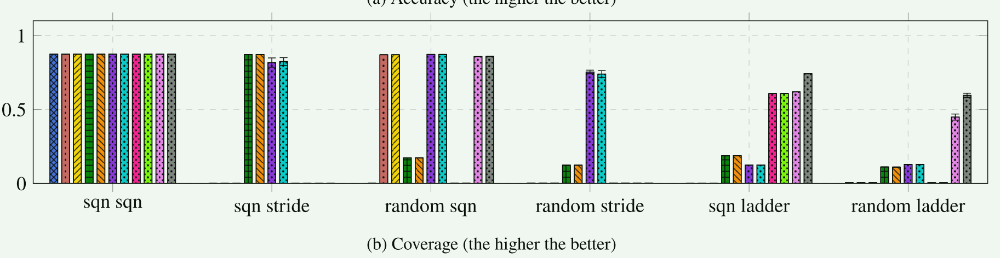

# FetchBPF: Customizable Prefetching Policies in Linux with eBPF

单片操作系统的复杂性是出了名的。尤其是 Linux，它倾向于将策略和机制混合在一起，从而阻碍了模块化。当开发人员希望对性能进行精细优化时，这一点尤其成问题，因为通常情况下，Linux 的默认策略虽然平均性能良好，但并不能在所有情况下都达到最佳性能。然而，由于软件工程成本高昂，开发和维护一个定制的内核以满足特定应用程序的需求通常是不现实的

需要一种机制来轻松定制内核策略及其行为。本文设计了一个名为 FetchBPF 的框架，在内存预取的背景下解决了这一问题。

## 概要

随着内存密集型应用（尤其是机器学习程序）对内存容量的需求日益增长，研究人员和从业人员都将注意力转向了改进内存管理系统[24, 36]。其中，优化内存预取是一个重点领域。

挑战和解决方法：

挑战1：**不同的内存预取策略存在不同的使用场景**

解决方法：

1. 在内核中使用多个预取策略，并根据特定的内存访问模式从其中选择最合适的一个：这种方法是否可以扩展到任意数量的策略尚不清楚。 事实上，可能不存在能够适应所有可能的访问模式的最佳策略集。 同时，在内核中实施新策略是一项艰巨的任务。
2. 在用户空间中实施预取策略：一方面，用户空间应用程序可以更好地向预取机制提供更精细的语义提示； 另一方面，缺乏内核访问最终会使开发变得复杂。种方法还引入了大量的开销，主要来自用户空间和内核之间的上下文切换。
3. 利用 eBPF 来克服这些挑战

## 背景和动机

当内存面临压力时，页面会被换出。 当再次需要这些页面时检索这些页面的成本很高。 为了提高性能，操作系统 (OS) 尝试预测需要哪些换出页面并预取它们。

## 设计和实现

修改内核以包含两个额外的钩子点，可以在其中触发预取相关的 eBPF 程序：

1. 当发生页面错误时
   1. Leap 等策略使用错误地址的历史记录来深入了解内存访问模式。 因此，该钩子通常用于记录此类数据。 传递给它的参数包括有关故障页面的物理和虚拟地址的信息，以支持基于这些地址的策略
2. 当内核决定预取特定页面时
   1. 有关故障页的物理和虚拟地址的信息作为参数传递。 附加到此挂钩的 eBPF 程序预计会 (1) 识别感兴趣的页面，以及 (2) 请求内核通过辅助函数预取它们

预取策略通常需要物理或虚拟的内存访问历史记录作为输入。 预取器所需的此类信息的确切类型和计算是特定于策略的。 因此，FetchBPF应该允许开发人员通过eBPF程序自定义历史信息的捕获和计算。

预取器在请求错误页面之前运行， 然后预取请求与页面一起发出。 FetchBPF 应使预取器能够调用实现自定义预取逻辑的 eBPF 程序。

预取策略会发出I/O请求，但具体的I/O机制取决于后端设备，而不是策略本身。 I/O 是内核提供的功能，开发人员在实施策略时应该可以使用这些功能。

### eBPF的helper函数

- `bpf_prefetch_physical_page`: 该辅助函数触发基于物理地址预取页面的机制
- `bpf_prefetch_virtual_page`: 此辅助函数触发基于虚拟地址预取页面的机制
- `bpf_<start/stop>_block_plug`: 这两个辅助函数启用策略来控制预取请求批处理

## 评估

1. 使用 FetchBPF 实施预取策略是否会影响策略的准确性和覆盖性能？
2. 与在内核中本地实现策略相比，使用 FetchBPF 是否会导致性能下降？

准确性：定义为缓存命中数与预取页面数的比率（缓存命中数预取页面数），衡量应用程序实际使用的预取页面数

覆盖率：定义为缓存命中与总页面错误的比率，衡量预取器预测的页面有助于减少主要错误的程度

执行时间是基准测试的总执行时间

- 预取策略的 FetchBPF 实现与所有机制上的内核内对应策略具有相同的准确性和覆盖范围
- 对于执行时间，FetchBPF 和内核实现之间的差异在统计上是微不足道的

-  FetchBPF 不会产生显着的额外延迟。 这并不奇怪，因为 (1) 延迟主要由页面检索主导； (2) eBPF 程序是 JIT 编译的，并作为内核中的本机机器代码执行，实现了与内置内核函数类似的性能。

真实应用程序测试：

1.  与本机内核实现相比，FetchBPF 不会降低应用程序性能
2. 良好的预取决策会带来更显着的性能改进

