# FlexOS

## 总结

论文指出, 现有的操作系统设计方案, 包括安全策略以及隔离策略等, 都是在进行具体开发之前就确定好的, 后续很难改动。这个工作提出了一种新的操作系统设计方法, 在设计时先把每个模块按最小的粒度设计好, 跨模块调用时使用专用的函数, 然后**编译期**可以根据配置自动地将模块合并或划分到不同的隔离域中。其中, 这个工作支持各种各样的隔离后端, 如MPK或EPT等。同一个隔离域中的不同模块的跨模块调用会被替换为普通的函数调用, 而跨域的调用会被替换为隔离后端提供的相应的跨域调用操作。此外, 每个隔离域还可以选择开启不同的漏洞防护措施。

为了方便用户选择安全及隔离策略, 这个工作还为每两种策略之间定义了一个安全性的偏序关系, 例如, 域数量多的比少的更安全, 开启了防护措施多的比少的更安全等。基于此, 这个工作可以在给定的性能约束下求解出最安全的那个策略。

## 背景

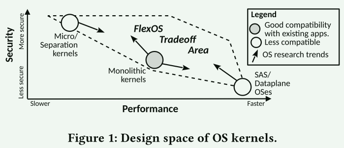

现代os的体系结构和其保护机制密切相关。在设计阶段，大多数安全措施就已经被确定了，这导致当这些系统被部署后难以更改这些保护措施。

**微内核**：

- 安全性更高
- 性能较差

**宏内核：**

- 特权级划分、多地址空间
- 性能和安全的折中

**libos：**

- 在单个地址空间保证安全性或者不关注安全性
- 专注性能

操作系统中安全原语的严格使用带来了许多问题：

1. 现代应用程序表现出广泛的安全和性能要求，过早锁定应用程序的安全措施可能导致性能/安全性不佳，这阻止了应用程序的定制化。
2. CPU制造商经常提出新的隔离机制，补充或者替代现有的隔离机制。当多个机制可以用于同一个任务时，选择最合适的隔离机制取决于很多因素，理想情况下我们应该可以在应用部署时自由选择。但在已有的系统中这显然不太现实。

鉴于这些问题，本文的研究集中于以下两点：

 **How can we enable users to easily and safely switch between different isolation and protection primitives at deployment time, avoiding the lock-in that characterizes the status-quo？**

**我们如何让用户在部署时能够轻松安全地在不同的隔离和保护原语之间切换，避免现状的锁定**？

**how to guide the user navigating the vast design space unlocked by FlexOS?**

**如何引导用户在FlexOS开启的广阔设计空间中遨游？**

**FlexOS**：

针对第一点，flexos允许用户在构建时

1. 决定哪些os组件应该放在哪个分区
2. 如何为每个分区实施隔离
3. 分区之间如何进行数据共享进行通信
4. 在哪些分区上应用软件加固机制

针对第二点，flexos提出了一个偏序集模型，可以在给定性能预算的前提下找到最安全的配置。

## 设计和实现

### 设计准则

1. The isolation granularity of FlexOS’ components should be configurable  隔离粒度可配置
2. The hardware isolation mechanisms used should be con-figurable.	   硬件隔离机制可配置
3. Software hardening and isolation mechanisms should be configurable     软件加固后者隔离措施可配置
4. Flexibility should not come at the cost of performance                                  灵活性不能以性能牺牲为代价
5. Compatibility with existing software should not come at a high porting cost  与现有软件的兼容性不应该以高昂的移植成本为代价
6. The user should be guided in the vast design space enabled by FlexOS    用户应该轻松地探索庞大的配置空间

### 挑战和解决方法

1. how to offer variable isolation granularities, and how to do so without compromising performance?

- flexos 使用libos(unikraft) 作为基础：因为这个架构具有很好的模块化特性和较好的性能
- 在跨域调用时尽量内联调用

2. how to design an OS in which 1) isolation can be enforced by many hardware mechanisms and 2) the engineering cost of introducing a new mechanism is low?

- 抽象现有的隔离技术
- 根据依赖的技术识别需要经过不同处理的内核设施

3. how to limit the engineering costs of porting new applications/libraries。

- 代码注释，工具链扫描，改写代码

4. how to help the user navigate the vast design space enabled by FlexOS?

- 偏序集

### 具体设计

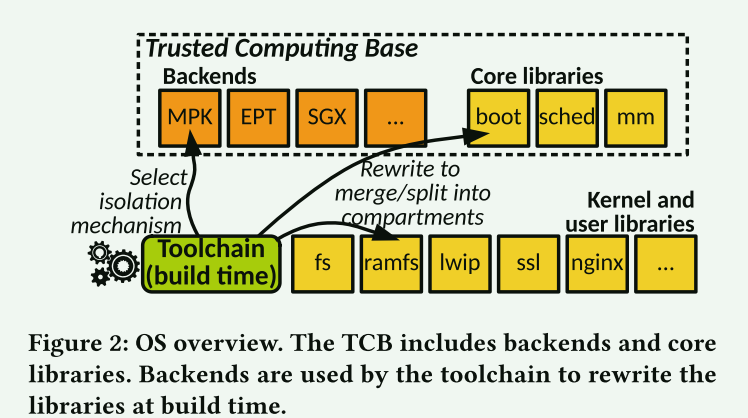

#### 分区API和转换

主要的硬件隔离机制1）根据当前的特权状态来决定数据的访问方式 2）类似虚拟化的完全隔离使用RPC或者共享内存进行通信

抽象这两种主要的隔离机制，需要flexos实现：

1. 实现域之间的切换
2. 支持某种形式的共享内存用于跨域通信

**Call Gates**： 调用门

- 不同库之间的调用使用调用门来表示
- 在构建时根据不同配置来决定会被替换的最终实现
  - 比如当两个库被配置在同一个域中，那么这个调用门被转换为普通的函数调用
  - 当在不同区域时，执行域切换流程

- 使用自动化工具来分析这些调用是否跨越了库的边界并做标记，也需要一些手工标注

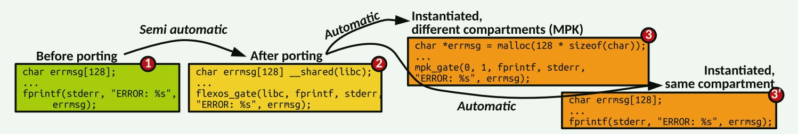

**Data Ownership**：数据共享

- 不同的机制需要不同的共享方式

- 使用手工标注

**Build-time Source Transformations**： 编译时代码转换

1. 实例化调用门
2. 实例化数据共享代码
3. 生成链接脚本
4. 根据后端接口为核心库生成额外的代码

**Trusted Computing Base** :可信计算基

最小的可信环境。

### 原型设计

#### MPK后端

- 为每一个分区分配一个Key
- 当分区数量少于15个时，剩余的key用来进行进行通信
- 为了避免有程序擅自修改key，可以进行二进制分析

**MPK Gate**：

1. full spatial safety
   - 保存当前域的寄存器集合
   - 清空寄存器
   - 加载参数到寄存器
   - 保存当前栈指针
   - 切换线程权限
   - 切换栈
   - 执行函数调用
2. partial safety
   - 共享堆栈和寄存器

**DataOwnership**：

- 对于堆分配变量，采用私有堆和共享堆
- 对于栈分配变量，采用**Data Shadow Stacks** 机制
  - 开辟一个新的段作为原来栈的对应区域
  - 在编译前，对栈变量的引用会被转换为DDS段上对应的位置
  - DSS段被放在一个共享域中

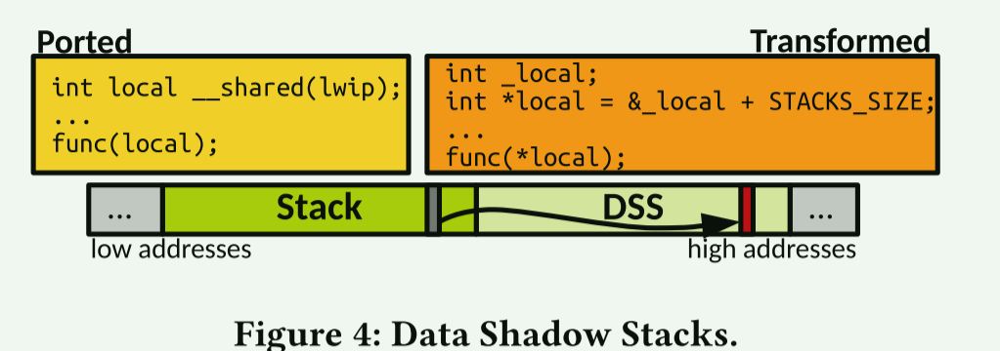

#### EPT后端

**EPT Gate**:

- 调用者将函数指针和参数放在共享区域
- 其它VM等待RPC请求
- 检查函数的合法性，执行函数，将结果放在共享区域

**Data ownership**:

- 共享内存

### 其它后端

CHERI hardware capabilities

### 软件加固措施

- address sanitization (KASan)
- undefined behavior sanitization (UBSan)
- CFI, and stack protector.

## 如何探索配置

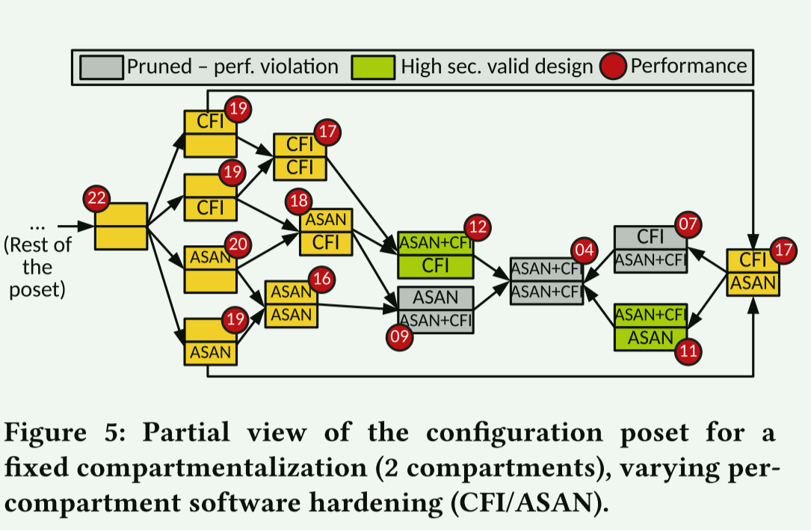

- 逐步添加隔离措施/软件加固方法来提升安全性
- 工具链会生成一系列配置自动完成评估

## 评估

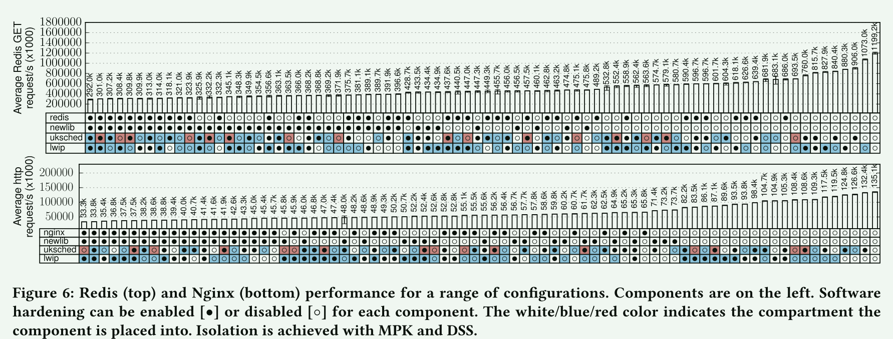

- 在给定的性能需求下，可能存在一系列可用的安全配置
- 不同的措施可能导致的性能损失不同

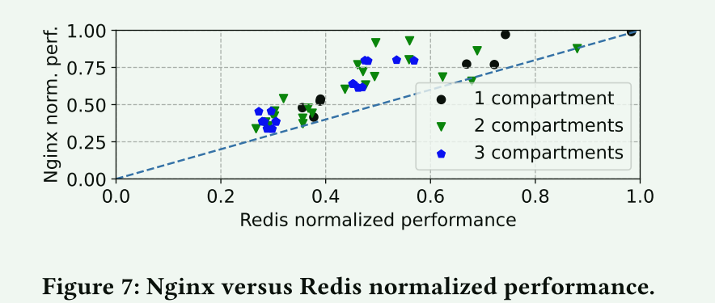

- 性能并不完全取决于隔室的数量或启用了加固的组件的数量，而是取决于隔离/加固了哪些特定组件以及它们的通信模式。
- 不同的应用可能对不同的配置敏感程度不一样

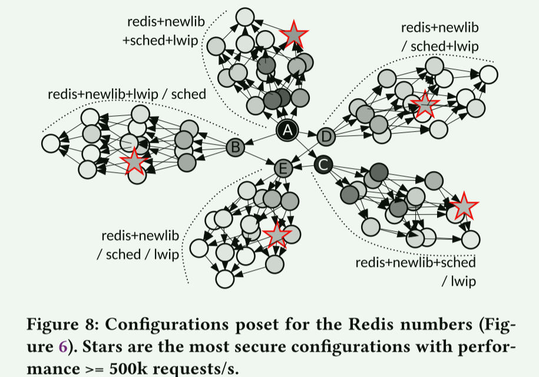

- 在不同的分区数量下，不同的隔离措施中可以找到满足性能要求的配置

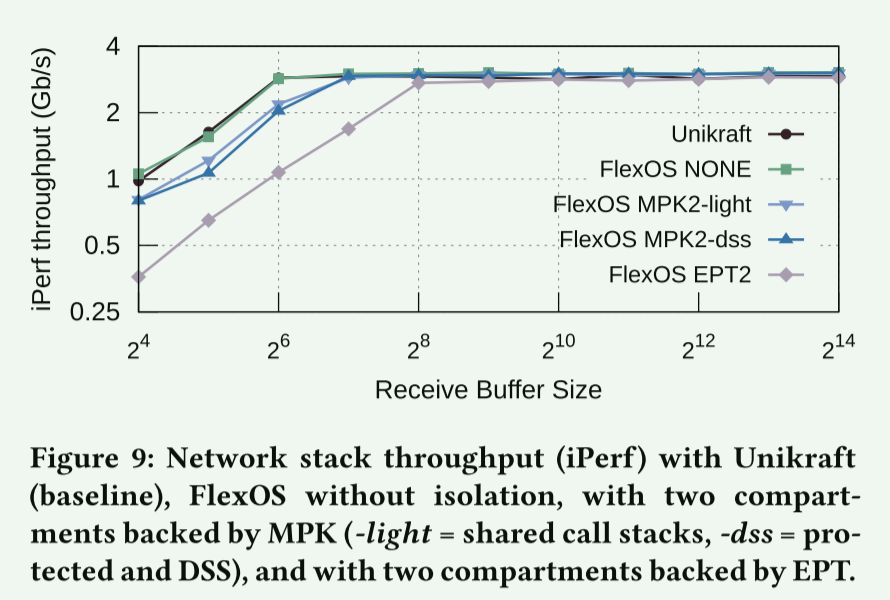

- 根据负载的大小和域交叉的频率，所有后端都可以构成给定问题的有效解决方案

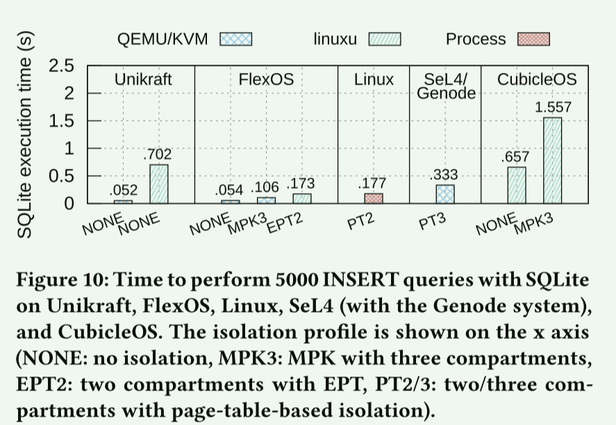

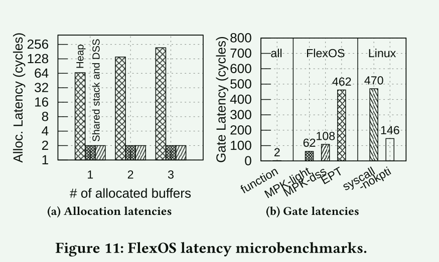

## 常见的内核安全措施

在计算机系统研究领域，CFI通常指的是**Control Flow Integrity（控制流完整性）**。控制流完整性是一种安全机制，旨在防止恶意攻击者利用程序中的漏洞来改变程序的正常执行流程。攻击者可能尝试通过操纵程序的控制流来执行恶意代码或绕过安全检查。

CFI 的主要目标是确保程序只能按照预定义的控制流路径执行，而不允许执行任意的、非预期的代码路径。实现控制流完整性通常涉及在程序中插入检查点、标签或其他机制，以验证程序在执行时是否遵循了预期的控制流。

这项技术对于防范诸如代码注入攻击、ROP（Return-Oriented Programming）攻击等具有重要意义。通过强化控制流完整性，可以减轻许多常见的安全威胁。

**KASAN** 是 **Kernel Address Sanitizer** 的缩写，它是一个动态检测内存错误的工具，主要功能是检查内存越界访问和使用已释放的内存等问题.KASAN利用额外的内存标记可用内存的状态，这部分额外的内存被称作shadow memory（影子区），KASAN将1/8的内存用作shadow memory。使用特殊的magic num填充shadow memory，在每一次load/store内存的时候检测对应的shadow memory确定操作是否valid。连续8 bytes内存（8 bytes align）使用1 byte shadow memory标记。

如果8 bytes内存都可以访问，则shadow memory的值为0；如果连续N(1 =< N <= 7) bytes可以访问，则shadow memory的值为N；如果8 bytes内存访问都是invalid，则shadow memory的值为负数。

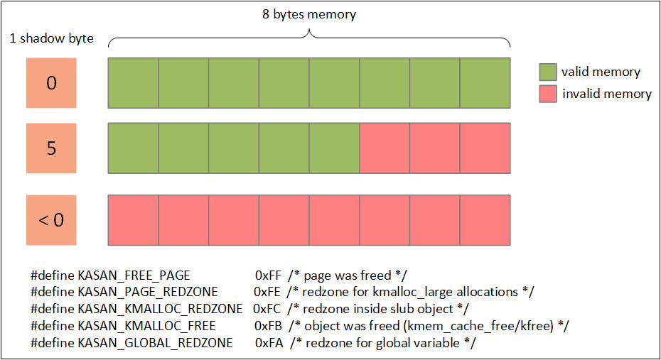

**Undefined Behavior Sanitizer**，用于运行时未定义行为检测。UBSAN使用编译时指令来获取未定义行为。编译器插入代码，在可能引起UB的操作之前运行某类检查，如果失败，会调用__ubsan_handle_*函数来输出错误信息

**KASLR（Kernel Address Space Layout Randomization）**是一种用于保护操作系统内核的安全技术。它通过在系统启动时随机化内核地址空间的布局来防止攻击者确定内核中的精确地址

**SMEP（Supervisor Mode Execution Protection）**通过在CPU开一个比特位，来限制内核态访问用户态的代码.

**SMAP（Supervisor Mode Access Protection）**在CPU中开启一个比特位来限制内核态访问用户态的能力。它使用户态的指针无法被内核态解引用.

**KPTI**（kernel page-table isolation, 内核页表隔离，也称PTI）是Linux内核中的一种强化技术，旨在更好地隔离用户空间与内核空间的内存来提高安全性，缓解现代x86 CPU中的“熔毁”硬件安全缺陷。KPTI通过完全分离用户空间与内核空间页表来解决页表泄露。一旦开启了 KPTI,由于内核态和用户态的页表不同，所以如果使用 ret2user或内核执行 ROP返回用户态时，由于内核态无法确定用户态的页表，就会报出一个段错误