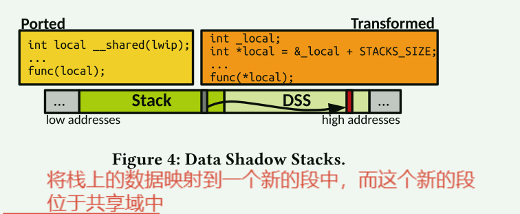

# FlexOS技术细节

如何配置分区和各个分区对应的隔离机制？

```bash
$ cd ~/.unikraft/apps/flexos-example
$ cat ./kraft.yaml
---
specification: '0.6'
name: flexos-example
unikraft:
  version: staging
  kconfig:
    - CONFIG_LIBFLEXOS=y
    - CONFIG_LIBVFSCORE_AUTOMOUNT_ROOTFS=y
    - CONFIG_LIBVFSCORE_ROOTFS_RAMFS=y
targets:
  - architecture: x86_64
    platform: kvm
compartments:
  - name: comp1
    mechanism:
      driver: intel-pku
      noisolstack: false
    default: true
  - name: comp2
    mechanism:
      driver: intel-pku
      noisolstack: true
libraries:
  tlsf:
    version: staging
    kconfig:
      - CONFIG_LIBTLSF=y
  newlib:
    version: staging
    kconfig:
      - CONFIG_LIBNEWLIBC=y
      - CONFIG_LIBNEWLIBM=y
    compartment: comp1
  flexos-example:
    version: staging
    compartment: comp2
volumes: {}
networks: {}
$ kraft configure
```

## 重写过程

1. 用户编写应用程序

2. 编写配置文件

3. 修改过的kraft工具会重写源代码(这导致如果我们需要重新配置新的隔离机制就不得不删除旧代码并重拉取)

   1. 一些脚本工具会根据规则修改函数调用：call -> flexos_gate()

      ```
      -        printf("Accept failed\n");
      +        flexos_gate(libc, printf, "Accept failed\n");
      ```

   2. 被注释的数据也会被进行改写

      ```
      -char *heap_buf = malloc(32)
      +char *heap_buf = flexos_malloc_whitelist(32, libflexosexample);
      ```

   3. 根据选择的后端不同，`flexos_gate`会被再次替换掉

4. 编译并运行

主要的后端可选项是:

- MPK/PKU
- VM/EPT

对于3-1步骤，可能出现的情况是对于类似`MPK`的硬件特权隔离机制，重写工具无法完全修改所有的调用。而如果这些调用发生时没有发生数据的访问，则不会违反硬件隔离，但其实已经违反了隔离，因为这绕过了调用门。

为了处理这种情况，文章使用gcc的一个特殊选项：-finstrument-functions选项

GCC Function instrumentation机制可以用来跟踪函数的调用关系，在gcc中对应的选项为“-finstrument-functions”。编译时如果为gcc加上“-finstrument-functions”选项，那在每个函数的入口和出口处会各增加一个额外的hook函数的调用，增加的这两个函数分别为：

```
void __cyg_profile_func_enter (void *this_fn, void *call_site);
void __cyg_profile_func_exit  (void *this_fn, void *call_site);
```

```
static void func_test(v)
{
	/* your code... */
}
```

```
static void func_test(v)
{
	__cyg_profile_func_enter(this_fn, call_site);
	/* your code... */
	__cyg_profile_func_exit(this_fn, call_site);
}
```

flexos的工具处理这种情况时，它会修改目标依赖库的编译选项，并且定义上面的函数:

```c
+volatile int uktime_local;
+
+void __cyg_profile_func_enter (void *this_fn,
+                               void *call_site)
+{
+       uktime_local = 0;
+}
+void __cyg_profile_func_exit  (void *this_fn,
+                               void *call_site)
+{
+       uktime_local = 1;
+}
+
```

相当于手工添加了数据访问，从而触发隔离失效崩溃。


## MPK/EPT

```c
#define _eflexos_intelpku_gate(N, key_from, key_to, fname, ...)		\
	_flexos_intelpku_gate(N, key_from, key_to, fname, ## __VA_ARGS__)
#define flexos_intelpku_gate(key_from, key_to, fname, ...)		\
do {									\
	if (ukarch_read_sp() >= __INTRSTACK_START &&			\
	    ukarch_read_sp() <= __END) {				\
		fname(__VA_ARGS__);					\
	} else {							\
		_flexos_intelpku_gate_inst_in(key_from, key_to, #fname);\
		_eflexos_intelpku_gate(COUNT_ARGUMENTS(__VA_ARGS__),	\
			key_from, key_to, fname, ## __VA_ARGS__);	\
		_flexos_intelpku_gate_inst_out(key_from, key_to);	\
	}								\
} while (0)
```

- `_flexos_intelpku_gate_inst_in`
- `_eflexos_intelpku_gate` 
- `_flexos_intelpku_gate_inst_out`


对于共享栈的情况：

```c
#define __flexos_intelpku_gate_swpkru(key_from, key_to)			\
do {									\
	/* switch thread permissions, this includes anti-ROP checks */	\
	asm volatile (  "1:\n\t" /* define local label */		\
			"movq %0, %%rax\n\t"				\
			"xor %%rcx, %%rcx\n\t"				\
			"xor %%rdx, %%rdx\n\t"				\
			"wrpkru\n\t"					\
			"lfence\n\t" /* TODO necessary? */		\
			"cmpq %0, %%rax\n\t"				\
			"jne 1b\n\t" /* ROP detected, re-do it */	\
			:: "i"(PKRU(key_to)) : "rax", "rcx", "rdx");	\
} while (0)

#define _flexos_intelpku_gate(N, key_from, key_to, fname, ...)		\
do {									\
	__flexos_intelpku_gate_swpkru(key_from, key_to);		\
	fname(__VA_ARGS__);						\
	__flexos_intelpku_gate_swpkru(key_to, key_from);		\
} while (0)

#define _flexos_intelpku_gate_r(N, key_from, key_to, retval, fname, ...)\
do {									\
	__flexos_intelpku_gate_swpkru(key_from, key_to);		\
	retval = fname(__VA_ARGS__);					\
	__flexos_intelpku_gate_swpkru(key_to, key_from);		\
} while (0)
```

1. 调用门代码直接切换**PKRU** 寄存器的值
2. 调用函数
3. 修改回原来的值


对于不共享栈的情况：

```c
#define __flexos_intelpku_gate0(key_from, key_to, fname)		\
do {									\
	/* we have to call this with a valid/accessible stack,	*/	\
	/* so do it before switching thread permissions. Note	*/	\
	/* that the stack won't be accessible after switching	*/	\
	/* permissions, so we HAVE to store this in a register.	*/	\
	register uint32_t tid asm("r15") = uk_thread_get_tid();		\
									\
	asm volatile (							\
	/* save remaining parameter registers			*/	\
	/* TODO do we actually HAVE to do this from the		*/	\
	/* perspective of the C calling convention?		*/	\
			"push %%rsi\n\t"				\
			"push %%rdi\n\t"				\
			"push %%r8\n\t"					\
			"push %%r9\n\t"					\
	/* save caller-saved registers (r10-11). */			\
			"push %%r10\n\t"				\
			"push %%r11\n\t"				\
	/* protecting registers? save callee-saved registers	*/	\
	/* and zero them out (r12-15).				*/	\
			/* TODO */					\
			"push %%r12\n\t"				\
	/* backup source domain's stack/frame pointers		*/	\
			__ASM_BACKUP_TSB(tsb_comp ## key_from)		\
			__ASM_UPDATE_TSB_TMP(tsb_comp ## key_from)	\
	/* put parameters in registers				*/	\
			/* nothing to do: no parameters */		\
	/* switch thread permissions 				*/	\
		"1:\n\t" /* define local label */			\
			"movq %3, %%rax\n\t"				\
			"xor %%rcx, %%rcx\n\t"				\
			"xor %%rdx, %%rdx\n\t"				\
			"wrpkru\n\t"					\
			"lfence\n\t" /* TODO necessary? */		\
			"cmpq %3, %%rax\n\t"				\
			"jne 1b\n\t" /* ROP detected, re-do it */	\
	/* put parameters in final registers			*/	\
			/* nothing to do: no parameters */		\
	/* we're ready, switch stack */					\
			__ASM_SWITCH_STACK(tsb_comp ## key_to)		\
			__ASM_ALIGN_AND_CALL(fname)			\
	/* backup return value in rsi */				\
			/* nothing to do: no return value */		\
	/* switch back thread permissions */				\
		"2:\n\t" /* define local label */			\
			"movq %2, %%rax\n\t"				\
			"xor %%rcx, %%rcx\n\t"				\
			"xor %%rdx, %%rdx\n\t"				\
			"wrpkru\n\t"					\
			"lfence\n\t" /* TODO necessary? */		\
			"cmpq %2, %%rax\n\t"				\
			"jne 2b\n\t" /* ROP detected, re-do it */	\
	/* switch back the stack				*/	\
			__ASM_SWITCH_STACK(tsb_comp ## key_from)	\
			__ASM_RESTORE_TSB(tsb_comp ## key_from)		\
	/* protecting registers? restore callee-saved registers	*/	\
			/* TODO */					\
			"pop %%r12\n\t"					\
	/* restore caller-saved registers			*/	\
			"pop %%r11\n\t"					\
			"pop %%r10\n\t"					\
	/* restore parameter registers				*/	\
			"pop %%r9\n\t"					\
	/* save return value from rsi (into r11) */			\
			/* nothing to do: no return value */		\
			"pop %%r8\n\t"					\
			"pop %%rdi\n\t"					\
			"pop %%rsi\n\t"					\
									\
			: /* output */					\
			  "=m" (tsb_comp ## key_from),			\
			  "=m" (tsb_comp ## key_to)			\
			: /* input */					\
			  "i"(PKRU(key_from)),				\
			  "i"(PKRU(key_to)),				\
			  "r"(tid),					\
			  "i"(fname)					\
			: /* clobbers */				\
			  "rax", "rcx", "rdx",				\
			  "memory" /* TODO should we clobber memory? */	\
	);								\
} while (0)
```

1. 保持寄存器现场
2. 准备好参数寄存器
3. 备份好旧的分区的栈信息
4. 为啥还要临时加载旧分区的栈呢？`__ASM_UPDATE_TSB_TMP`
5. 切换**PKRU** 
6. 切换新的分区的栈
7. 调用函数
8. 恢复旧分区的栈
9. `__ASM_RESTORE_TSB` 与第四步对应？


### 分区通信

每个分区都有自己的data、rdata、bss数据，并在启动阶段被保护(设置key)

每个分区使用私有堆和公有堆，公有堆用于通信：

```
__shared()标注的数据

#define flexos_malloc_whitelist(...) UK_CTASSERT(0)
#define flexos_calloc_whitelist(...) UK_CTASSERT(0)
#define flexos_palloc_whitelist(...) UK_CTASSERT(0)
#define flexos_free_whitelist(...) UK_CTASSERT(0)


- flexos_malloc_whitelist(size, ...)
+ uk_malloc(flexos_shared_alloc, size)
```

在启动阶段，会创建好共享堆:

```c
ASSIGN_HEAP("shared", 15 /* key */, 1000 /* size */,
		    flexos_shared_alloc);
```


```c
#define ASSIGN_HEAP(name, key, pages, symalloc)                                \
	do {                                                                   \
		uk_pr_info("Assigning %d pages to %s's heap\n", (pages),       \
			   (name));                                            \
                                                                               \
		void *_buf = uk_palloc(a, (pages));                            \
		if (!_buf)                                                     \
			UK_CRASH("Insufficient memory to allocate %s's "       \
				 "heap",                                       \
				 (name));                                      \
                                                                               \
		/* FIXME: we waste a page here, but TLSF seems to access 1 */  \
		/* byte	OOB leading the kernel to crash. This avoids the */    \
		/* issue. Needs more investigation! */                         \
		(symalloc) = uk_tlsf_init(_buf, ((pages)-1) * __PAGE_SIZE);    \
		if (!(symalloc))                                               \
			UK_CRASH("Failed to initialize heap for %s", (name));  \
                                                                               \
		uk_pr_info("Protecting %s's heap with key %d\n", (name),       \
			   (key));                                             \
                                                                               \
		flexos_intelpku_mem_set_key(_buf, (pages), (key));             \
	} while (0)
#endif /* CONFIG_LIBFLEXOS_INTELPKU */
```

`ASSIGN_HEAP` 会将共享堆打上对应的key。


除了公有堆进行通信外，还有一些全局数据和栈上的临时数据也会用来通信.

对于全局共享数据， 应该是被放到了另一个共享段中。

```c
@@
identifier p;
type T;
@@
+ __attribute__((section(".data_shared")))
T p
- __attribute__((flexos_whitelist))
;

@@
identifier p;
type T;
@@
+ __attribute__((section(".data_shared")))
T p
- __attribute__((flexos_whitelist))
= ...;
```


`Data Shadow Stacks`机制来应对栈上的变量：



转换规则:

```c
@dss_array@
identifier p;
fresh identifier pm = "_dss_" ## p;
type T;
function func;
expression size;
@@
func (...) {
... when exists
    when any
T p[size]
- __attribute__((flexos_whitelist))
;
+ T *pm = (T *) (((uintptr_t) &p) + STACK_SIZE);
<...
- p
+ pm
...>
}
```

栈上的变量有另一份对应的区域，位于DSS段中。