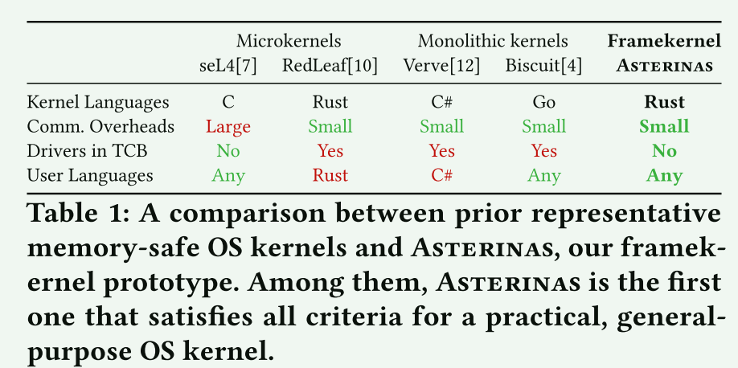
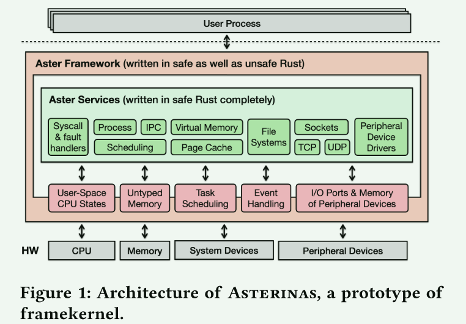
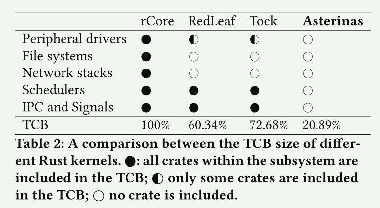

# Framekernel: A Safe and Efficient Kernel Architecture via Rust-based Intra-kernel Privilege Separation

 framekernel 架构，这是一种新颖的操作系统（OS）设计方法，它利用基于安全语言的内核权限分离。该架构结合了微内核的安全优势和单核内核的性能效率。框架内核由特权操作系统框架和去特权操作系统服务组成。框架将所有低级、不安全的操作封装为高级、安全的抽象，从而使服务能够用安全的语言实现各种功能。

## 概述

内存安全对于操作系统至关重要，因为它有助于防止未经授权或不正确的内存访问，从而降低崩溃、数据损坏和安全漏洞的风险。**操作系统内核通常是用 C 和 C++ 等语言编写的，这些语言本身并不提供内存安全，因此实现这一点通常需要形式验证。**

已经有许多工作尝试使用内存安全的编程语言在更基础的层面上解决内存安全问题：

- Verve  的core仅内置对四个 I/O 设备的支持，这意味着添加更多设备驱动程序需要进一步扩展 TCB
- RedLeaf 中，设备驱动程序依赖于可信库，其中包含core边界之外的不安全代码。 此外，RedLeaf 不支持硬件隔离的用户进程
- 这三个内核的 TCB 超出了其core范围，并且随着操作系统功能和驱动程序的添加而趋于变得更大

 framekernel  内核架构结合了微内核的安全优势和单片内核的性能优势。 与单片内核类似，框架内核模块共存于同一地址空间内，通过共享内存和函数调用促进通信。 然而，与传统的单片内核不同，整个内核的内存安全完全依赖于框架。 这种方法产生了类似于微内核的紧凑 TCB，从而增强了整体系统的安全性。

**挑战：在支持丰富的功能的同时保持最小的 TCB**

**最小化原则：**仅当将组件移至框架之外会阻止非特权操作系统服务安全地实现所需功能时，才允许其位于特权操作系统框架内。

### 规则集

根据最小化原则而建立的用来分离操作系统资源或功能的规则：

**分离内核和用户空间的 CPU 状态**

> 框架应提供抽象功能，允许服务检查和操作用户空间进程的 CPU 寄存器。这种能力对于服务自由处理来自用户空间的系统调用或 CPU 异常至关重要。相反，不应允许服务任意操作内核模式 CPU 寄存器，因为这些寄存器对内核内存安全至关重要。否则，服务可能会通过修改程序计数器或堆栈指针来破坏内核控制流的完整性

**分离类型化内存和非类型化内存**

> 类型化内存与内核内存安全相关。一个明显的例子是安全语言内核的代码、堆栈和堆，因为它们存储的是类型安全的对象；覆盖此类内存会破坏内核内存安全。另一方面，非类型化内存与内核内存安全无关。例如，映射到用户空间的内存页或为设备间 DMA 准备的内存页可被视为非类型内存，因为内核不信任此类内存，也不应在其上存储类型安全对象

**分离任务切换和调度**

> 上下文切换过程（包括保存和恢复 CPU 状态这种易出错且不安全的逻辑）必须在框架内执行。然而，调度策略（如 Linux 的 CFS）的实现非常复杂，可以与上下文切换分离

**分离事件分派和处理**

> 内核负责处理 CPU 异常和外部中断等系统事件。为这些事件注册处理程序例程涉及低级、不安全的操作，因此必须由框架进行管理。但是，处理来自用户空间的 CPU 异常或来自设备的外部中断并不需要不安全的操作

**将系统设备和外围设备分开**

> 系统设备（或控制器）管理着系统的基本方面。系统设备驱动程序中的逻辑错误（而非安全错误）会破坏内核的基本假设，从而可能危及内核内存安全。x86 架构上的系统设备包括 APIC 和 IOMMU。相比之下，存储、网络和图形设备等外围设备对系统的影响没有那么大。鉴于这些区别，框架应限制其抽象，只暴露外围设备的 I/O 端口或内存空间

## Rust

Rust 通过所有权模型建立安全保证，该模型要求编译器管理对象的所有引用，以防止并发突变和与内存相关的错误。然而，这种所有权模型从本质上限制了编程语言的表现力，给经常涉及低级和并发系统访问的操作系统开发带来了挑战。因此，Rust 提供了 "unsafe "关键字，以便在需要时绕过语言严格的类型系统和所有权模型。绕过类型系统意味着操作系统开发人员必须负责确保类型安全，从而维护 Rust 编译器所依赖的假设。否则，所有权模型提供的安全保证就会失效。在这种情况下，编译器往往无法验证不安全代码是否遵守了预期约束

## 架构设计

### 信任模型

硬件 TCB 包括 CPU 和系统设备（或控制器）。在 x86 机器上，这些系统设备包括内存管理单元（MMU）、输入输出内存管理单元（IOMMU）和高级可编程中断控制器（APIC）。框架内核不信任外围设备，如通过 PCI/PCI-E 总线连接的块设备或网络接口卡。

软件 TCB 包括安全语言的工具链、框架内核的特权操作系统框架、引导加载器以及在框架内核前运行的其他固件。在框架内核上运行的去特权操作系统服务或用户空间进程是不可信任的。

### 目标

- 健全性(Soundness): 如果任何安全代码都无法通过其API触发未定义的行为，那么该框架就被认为是健全的，前提是安全代码已通过工具链验证
- 表现力(Expressiveness): 该框架应使开发人员能够使用其（API）以安全语言实现各种操作系统功能
- 最小化(Minimalism): 作为 TCB 的主要组成部分，框架应尽可能小。它不应该包含任何可以在框架之外安全有效地实现的功能。
- 效率(Efficiency): 框架提供的API应将开销降至最低。理想情况下，这些应用程序接口应实现零成本抽象。

## ASTERINAS FRAMEWORK

### Untyped Memory Access

Frame分配器管理非类型化的内存区域。它在系统初始化过程中建立所有非类型化内存区域。Frame可能会在运行时请求内存页分配或取消分配，从而导致类型化内存和非类型化内存之间的转换。

该Frame维护 Inv1 和 Inv2 用于内存管理，以确保内存安全性：

- Inv1：IOMMU 映射到非类型化的内存页
- nv2：对于用户空间，MMU 只为非类型化内存创建映射

### User-Space CPU States Modifications

- Inv3：内核 CPU 状态必须位于类型化的内存中。

### Task Scheduling

- Inv4：内核的执行上下文必须不受破坏，必要时增加运行时检查。

### Event Handling

- Inv5：CPU 异常处理程序在执行操作前必须检查异常是否发生。

### Peripheral Devices I/O Access

- Inv6：系统设备驱动程序必须在系统初始化时移除分配器中的 I/O 访问
- Inv7：MMIO 分配器必须排除物理内存

### 并发工具

框架提供了并发实用程序类型，其实现必须依赖不安全的 Rust，例如并发锁和并发数据收集.由于 Rust 的引用限制和性能限制，仅使用安全 Rust 来实现某些数据结构（如链表）可能具有挑战性。因此，该框架允许此类数据结构的存在，但需要进行大量测试以确保准确实现

## Services

## 相关工作

RedLeaf  是一种微内核操作系统，它依赖于 Rust 的类型安全和内存安全来实现隔离，而不是硬件隔离机制。它不允许在用户域中使用不安全关键字，只允许内核和可信库使用不安全关键字。Asterinas 与 RedLeaf 类似，但有两点显著不同。**首先，Asterinas 仍然使用硬件隔离来运行用多种语言开发的程序，因为它的目标是通用，并提供与 Linux 兼容的 ABI。其次，Asterinas 提供了一个设备驱动程序框架，无需为外设驱动程序编写可信库**

## Domain kernel Vs Asterinas 

相同的地方：

1. 使用语言提供的能力来提供系统的安全性
2. 区分了用safe rust实现的部分和unsafe实现的部分

不同的地方：

1. 域相比系统服务这个概念来说，可以进一步做到内存隔离、故障隔离
2. 我们还提供了域的热更新机制