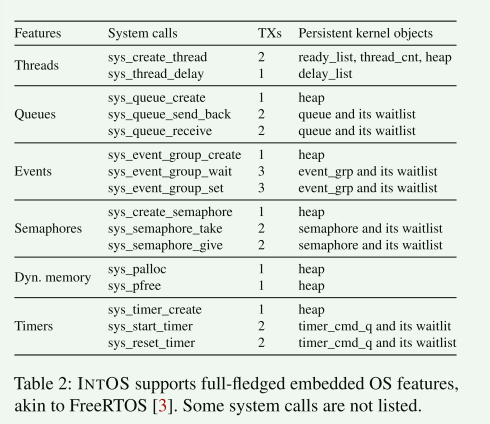
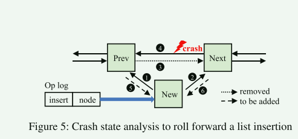

# INTOS: Persistent Embedded Operating System and Language Support for Multi-threaded Intermittent Computing

已有阅读笔记[INTOS: Persistent Embedded Operating System and Language Support for Multi-threaded Intermittent Computing](https://github.com/zflcs/learning/blob/main/articles/INTOS--Persistent-Embedded-Operating-System-and-Language-Support-for-Multi-threaded-Intermittent-Computing-PJ4X6RMF.md)

在嵌入式设备上为间歇性计算环境提供操作系统支持。

当前的崩溃一致性解决方案在应用于持久性嵌入式操作系统内核的开发时很难采用或导致设计效率低下。 **一些方法要求用户将应用程序分解为任务图，要求每个任务本质上具有故障原子性和幂等性**。 这给程序员带来了相当大的挑战。 将内核系统调用（例如创建线程或在满队列上阻塞）分解为任务并非易事。 其他基于编译器的解决方案自动划分程序（例如，划分为幂等区域）并合并检查点，几乎不需要用户注释。 因此，它们可用于构建持久操作系统。 然而，许多人（Chinchilla  除外）假设仅在 NVM 上执行，忽视了易失性存储器提供的潜在优势。

恢复供电后，INTOS 通过撤销中断事务的更新来恢复非易失性状态。为了重建易失性状态，INTOS 会从头开始重新启动每个线程，同时绕过已提交的事务和系统调用，返回已记录的结果而不重新执行。与将易失性状态检查点到非易失性存储器的替代方法相比，这种方法更节能，因为在指令集架构中，非易失性存储器的写入是最耗能的

## 背景

正如英特尔用于 Optane 内存的 PMDK 所证明的那样，事务是一种被广泛采用的非易失性存储器编程模型。用户可以使用非易失性内存分配器分配一个持久对象。事务采用撤销记录（或重做记录），以确保事务期间执行的操作具有故障原子性（"全有或全无 "语义）

## 相关工作

在基于任务的模型中，引入了一些新功能。例如，Alpaca 建议任务私有化，在进入每个任务前创建共享非易失性变量的易失性副本。任务的本地计算可在易失性内存上运行。任务完成后，共享变量的更新将以双缓冲方式提交到非易失性存储器。

自动检查点通常不考虑易失性内存。一些工作引入了编译器支持，将程序自动划分为多个区域，并在这些区域的边界插入检查点。用户几乎不需要注释，因此它们可用于构建持久性操作系统服务。然而，许多基于编译器的解决方案都假设程序只能在非易失性存储器上执行，从而放弃了易失性存储器可能带来的性能和能效优势。

只有实时（易失）寄存器才有必要在区域边界进行检查点处理。一个明显的例外是 Chinchilla ，它维护易失性和非易失性堆栈，但仍需要频繁地将堆栈检查点到 NVM

## 实现

INTOS 内核中维护了许多持久性对象，这些对象也保证崩溃一致性

 INTOS 通过以下方式提供节能执行：

1. 利用易失性和非易失性存储器
2. 避免易失状态的检查点
3.  优化非易失性状态的撤消日志记录
4. 提供阻塞/等待系统调用，例如信号量和事件

节能恢复：

1. 利用重放和旁路恢复来避免冗余执行
2. 引入循环优化
3. 仅撤消与将在恢复期间恢复的高优先级线程相关的非易失性状态

## 编程模型

1. 持久化对象在事务外部不应该被访问(既写又读)，在事务内部必须记录它们的更新。

> 重新启动时，非易失性内存状态不会回滚到线程的开头。因此，事务外部的控制流不应依赖于持久对象。

2. 持久化对象的指针/引用不能作为返回值传递出事务

3. 持久化对象不能包含对易失性对象的引用

> 持久对象不应包含对易失性对象的引用。 易失性对象在断电期间很容易丢失数据。 因此，将它们的引用存储在持久对象中是不安全的。

4. 系统调用（锁除外）只能在包含在事务内部

5. 不能在事务内部使用锁

## 优化

1. 循环优化

> INTOS 引入了新的 nv_for_loop！ 宏，扩展 Rust 中的循环结构以利用非易失性变量作为迭代计数器。 借助非易失性迭代计数器，INTOS 可以在重放期间推断已完成的迭代（其中已提交的事务），从而能够安全高效地快进到最后一次迭代，而无需执行旁路逻辑。

2. 链表插入优化

> INTOS 针对链接列表事务提出了基于崩溃状态分析的前向恢复优化方案。没有撤销日志。相反，INTOS 会记录操作日志，包括类型（如插入）和节点（数据）--每个操作只有一个日志。在恢复过程中，INTOS 会分析 NVM 中剩余的崩溃状态，以推断已完成的步骤。然后，它会向前滚动操作的其余部分。

将链表操作分解，并记录每一个小操作，在恢复期间可以从日志中推断出当前的进度

3. undo-logging

> 默认的 INTOS 事务会在每次首次写入（获取可变引用后）时自动执行 undologging，如清单 1（第 22-23 行）所示。INTOS 引入了另一种智能指针类型 Ptr<T>，提供了利用 Rust 类型系统静态检测写入后读取（WAR）依赖关系的选项。使用 Ptr<T> 的事务只有在事务中存在 WAR 依赖关系时才会记录旧值，从而减少记录次数

## 实现

- INTOS 内核会**在非易失性内存中分配重要的数据结构**，如线程控制块、线程间通信对象（如队列、寄存器）和调度列表（如就绪列表、等待列表
- 为了支持重放和旁路恢复，INTOS 维护了三个每线程重放表，缓存用户级事务、内核级事务和系统调用的返回值。对于每个表，尾指针表示最后完成的事务或系统调用，而当前指针指向当前正在执行的事务或系统调用。事务尾指针包含提交标志、事务 ID 和指向重放表的指针
- 每个事务完成后，事务中产生的系统调用记录结果都会被垃圾回收，从而限制了系统调用日志的最大长度。任务完成后，与该任务相关的所有事务日志都会被清理。我们假设一项任务只涉及有限数量的事务，鉴于嵌入式应用程序任务通常作为简短的事件处理程序，这一假设通常是有效的。

## 思考

INTOS文中说将持久性对象分配到持久性存储中，并使用事务来确保非易失性对象的崩溃一致性，INTOS 不再对易失性状态进行检查点处理，而是提出了一种重放和旁路恢复机制，在不重新执行已提交事务和系统调用的情况下重建易失性状态。

- 这种做法感觉只能应用在这种小型的嵌入式设备上，因为这类系统比较简单，可以将程序的对象和逻辑进行持久性分配和事务划分，这些是需要用户来完成的。如果是复杂的系统，这种划分是不太现实的
- 即使系统可以被划分为较大的事务块，由于系统中数据的复杂性，这些数据的修改都需要被记录，这个开销应该是很大的
- 在Linux这样的服务器操作系统上，通常是由应用程序来做崩溃恢复而不是操作系统内核，系统重启后用户态的应用程序会根据需要进行重启或者日志回放(数据库)，内核理论上不需要这样的崩溃一致性，也不可能有

