# Intra-Unikernel Isolation with Intel Memory Protection Keys

本篇文章的研究背景是关于在unikernel中实现内部隔离的问题。Unikernel是一种只包含单个应用程序的内核，它与最小化的内核LibOS进行静态链接。Unikernel具有单一且不受保护的地址空间，这在性能方面具有显著优势。然而，由于缺乏内部隔离，Unikernel存在严重的安全问题。本文主要关注两个内部隔离问题：**一是内核与用户空间之间的缺乏隔离**，**二是受信任和不受信任的内核组件之间的缺乏隔离**。为了解决这些问题，本文提出了使用Intel Memory Protection Keys（MPK）技术实现内部Unikernel隔离的方法。通过使用MPK技术，可以在单一地址空间中对内核和用户内存区域进行隔离，并保持低开销。文章选择了RustyHermit作为实现的目标，它是一个使用Rust语言编写的Unikernel。

从安全的角度来看，单一且不受保护的地址空间使得整个单内核必须被视为一个单一的信任单元**。颠覆一个内核或应用程序组件将导致整个单内核的颠覆**，并导致严重的后果，如任意代码执行、关键数据泄漏或篡改等。当前由unikernel提供的隔离级别对于许多场景来说都太粗粒度了。

- 单个应用程序可能由互不信任的组件组成，具有不同的安全标准
- 尽管有些unikernel是用内存安全语言编写的，但大都通过使用传统的不安全语言依赖于不可信的组件来进行低级操作
- 在属于同一应用程序的互不信任组件需要隔离的情况下，必须建立一个从租户角度看是可信的计算基础来实施这种隔离。在单内核模型的当前状态下，这个可信计算基础(TCB)不能成为客户内核，因为它本身并没有与应用程序隔离。这意味着将虚拟机变成这个TCB，从性能的角度来看，这个TCB不是最优的

## 硬件MPK

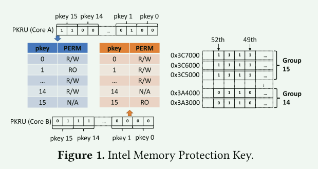

## 设计准则

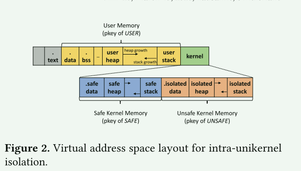

- 不安全代码只能访问不安全域的数据
  - 被不安全代码涉及的数据会被放到不安全区域中
- 用户代码只能访问用户的数据
- 使用两个MPK键来实现不同安全区域的隔离

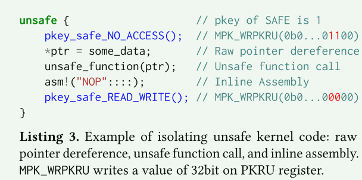

- 安全函数核不安全函数的调用需要使用独立的堆栈
  - 需要解决栈内数据的处理(局部变量-参数)
    - 使用共享栈帧(==共享该共享的数据==)的方式(需要开发人员进行标注)
- 不安全的堆是被特殊分配——分配的页被打上了`UNSAFE`标记
- 应用程序整个被视作不安全部分，因此它也有自己区域的数据且不能访问内核的任何数据

## 实现

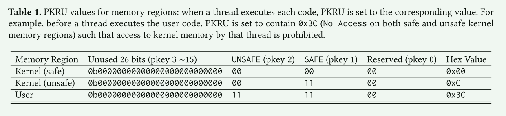

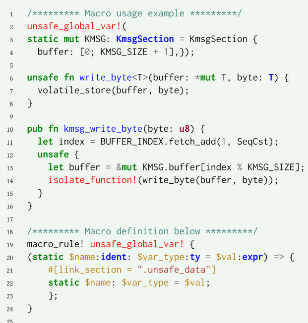

- 使用rust的宏来简化了数据的标记

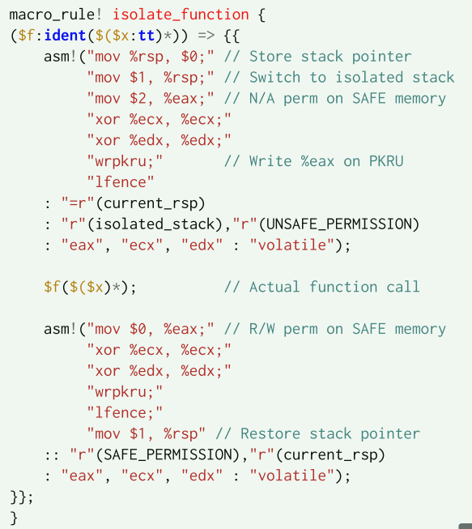

- 在安全代码与不安全代码调用时进行栈切换核PKU寄存器的修改
  - `isolate_function_weak` 实现了用于共享调用者堆栈帧的额外步骤
  - `isolate_function_strong`  禁止访问调用者堆栈帧
  - `share`宏和`unshare`宏，使得不安全的函数可以访问/不可访问远程堆栈帧中的局部变量

- 在进行原始指针解引用时需要处于隔离区间
  - `isolation_start` - `isolation_end`

- 在安全/不安全内核之间拷贝数据
  - 针对Per-CPU这样的数据

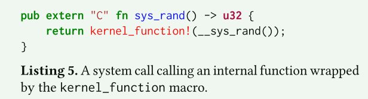

- 用户和内核的隔离主要依靠系统调用边界来实施
  - 这是用户编写程序时唯一进入内核的入口
  - 做与内核安全和不安全代码切换时相同的工作

## 评估

作者构造了几个攻击程序来评估内核/应用程序隔离与内核安全代码/非安全代码隔离可以抵御的攻击。

但仍然存在针对这种隔离措施的攻击方式:

- 篡改PKRU的值
  - 一种可能的缓解这种攻击的方法是使用二进制分析/重写来验证/清理WRPKRU指令的任何使用

- ROP
  - 对抗ROP的经典减缓措施是ASLR
- 数据泄露：缺乏在隔离区域切换时对寄存器进行擦除因为这会增加开销

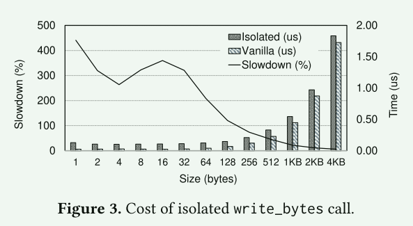

对于小的写入，孤立的write_bytes比普通的慢四倍。这是因为大部分开销来自我们的隔离机制。但是，随着写入大小的增加，调用write_bytes的成本将占总成本的主导地位，隔离开销将变得可以忽略不计。

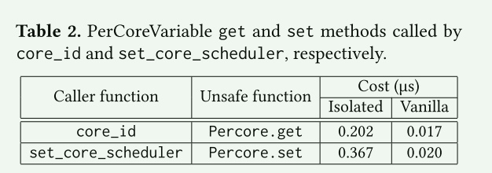

除了不安全的内核隔离开销(MPK权限切换、堆栈切换)外，它还引入了额外的内存复制开销

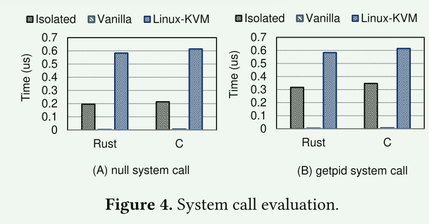

- 相比非隔离的unikernel，性能产生了下降，但相对于linux，依然保持了较好的性能优势

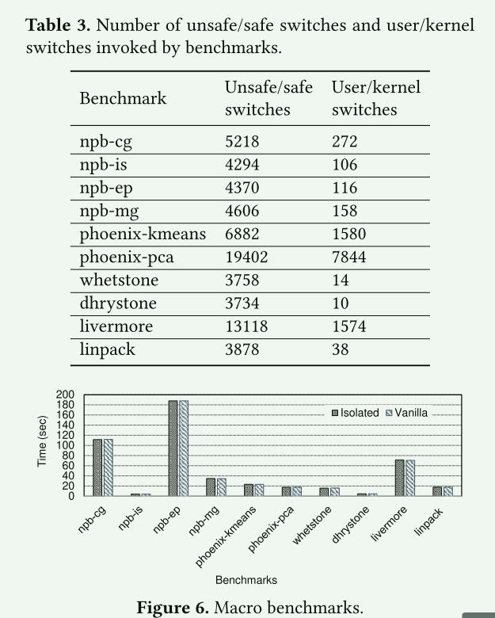

- 真实应用负载下，隔离导致的性能损失仅为0.6%？ ==是不是太小了？==

## 总结

本研究的创新性在于提出了一种利用Intel MPK技术实现unikernel内部隔离的方法。这种方法可以保持unikernel的单一地址空间特性，并且具有较低的开销。此外，本研究还提出了两种隔离策略，即隔离安全和不安全的内核代码，以及隔离内核和用户空间代码，从而进一步提高安全性。

不足之处：

- 隔离相比原来的版本还是带来了较大的开销，虽然比linux要好，但是这个下降是数十倍的。
  - 是否可以找到一些新方式来缓解隔离的开销？
- 隔离的粒度仍然很大，比如将应用程序整个视作一个不安全的部分
  - flexos做到了lib级别的隔离
- 硬件不能提供无限的隔离区域，那是否可以尽可能地利用已经提供的机制做到尽可能细粒度的隔离
  - 比如对内核的细粒度拆分，将一些有共性的子系统划分到一个隔离域当中