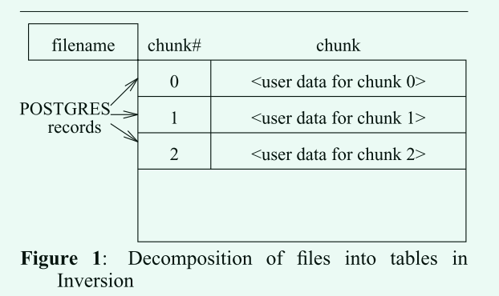
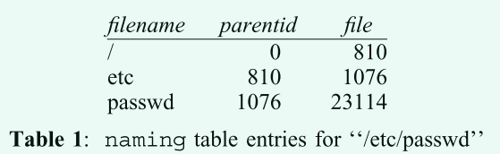
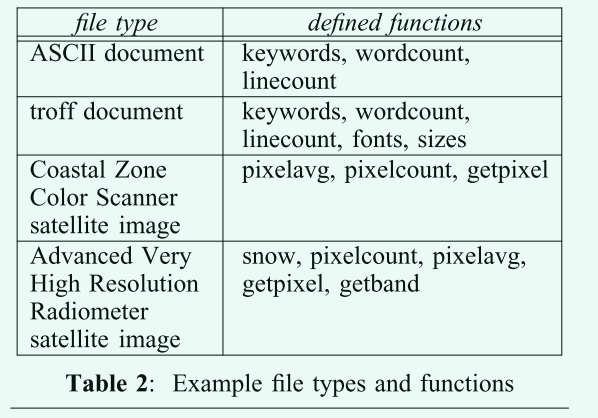
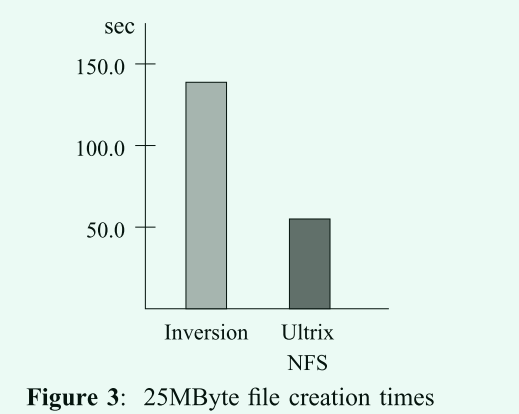
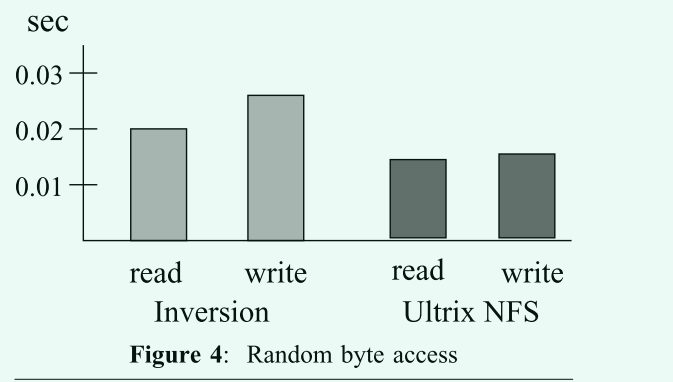
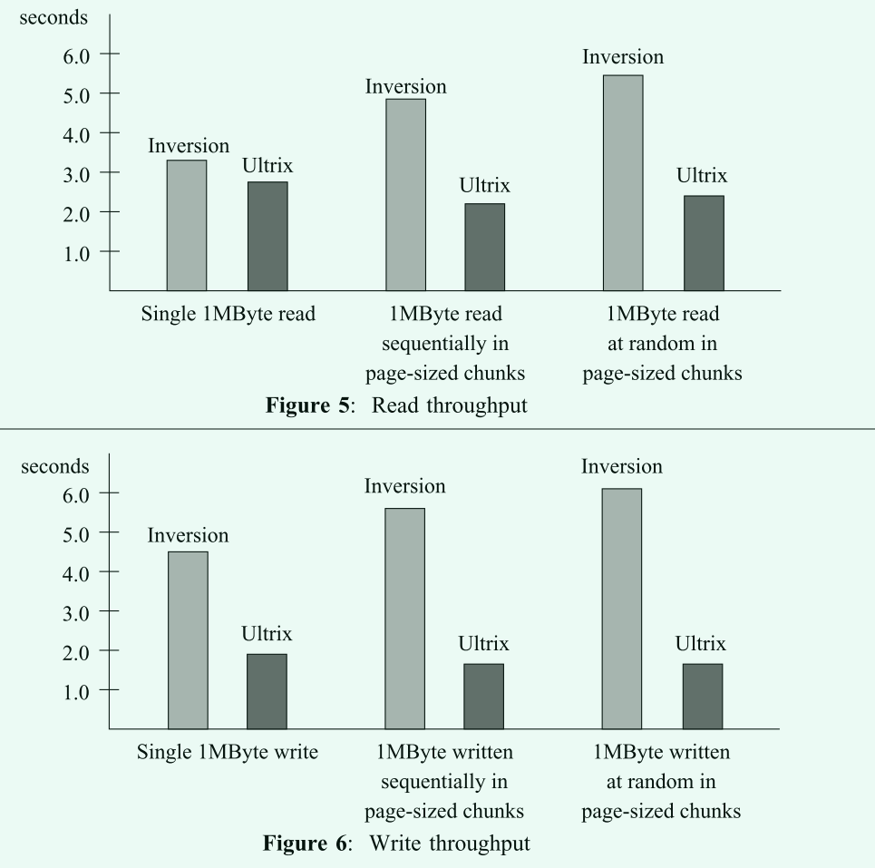

# The Design and Implementation of the Inversion File System 阅读

## 传统文件系统与传统数据库系统的差异和相似性

传统的文件系统处理用户数据块的命名和布局。 用户可以在文件系统的命名空间中移动，并且通常可以检查任何给定数据块的一小部分属性。 大多数文件系统保证用户数据的某种程度的一致性。 这些观察使我们可以将传统的文件系统归类为基本的数据库系统。

另一方面，传统的数据库系统允许用户定义具有新属性的对象，并方便地查询这些属性。 一致性保证通常比文件系统要强得多。 数据库系统经常使用底层文件系统来存储用户数据。 几乎没有商业上可用的数据库系统导出文件系统接口。

本文描述了一个建立在数据库系统之上的文件系统的设计与实现。 这个文件系统被称为`Inversion`，因为文件系统和数据库系统的传统角色是颠倒的，它运行在`Postgres`之上。 它支持`Postgres`管理的任何设备上的文件存储，并提供许多传统文件系统中没有的有用服务 

反转文件系统通过利用`PostGres`无覆盖存储管理器向用户提供事务和细粒度时间旅行。 文件数据存储在数据库中，因此文件更新受到事务保护。 此外，用户可能要求查看文件系统在过去任何时候的状态。 到那时为止提交的所有事务都将可见，因此文件系统状态将与当时完全相同。 这是对其他系统提供的粗粒度时间旅行的重要改进。 

## Postgres数据库系统的特点

## For time travel

`Postgres`数据库系统使用了一种新的无覆盖技术来管理存储。 这种技术允许用户查看数据库的整个历史记录，并避免了传统的提前写入日志的需要，从而加快了恢复速度。 当一个记录被更新或删除时，原始记录被标记为无效，但仍然保留在原地。 对于更新，包含新值的新记录将添加到数据库中。 通过使用事务开始时间和指示事务是否已提交的特殊状态文件，`Postgres`可以在历史上的任何时刻呈现数据库的事务一致视图。 这种能力被称为时间旅行。 由于只有事务的开始时间和提交状态必须记录在状态文件中，所以在崩溃恢复时不需要特殊的日志处理。 

### For tpye extend

`PostGres`允许用户定义在数据库系统中使用的新类型。 此外，用户可以用C或`PostGres`使用的查询语言`PostQuel`编写函数。 这些函数可以在数据库系统中注册，并在调用它们时由数据管理器动态加载。`Inversion`利用这两个功能对用户文件提供强大的键入功能，并支持描述文件的分类功能 


`PostGres`对数据的访问是位置透明的--数据库管理器找到存储数据的设备，并通过设备管理器开关发出调用来操作数据。 这允许用户将数据存储在`Postgres`所知的任何设备上，并以相同的方式管理数据。 逻辑上，数据库对其大小没有上限。 


## Inversion的文件设计



每个文件创建一个唯一命名的表。 文件数据被收集到略小于8K字节的块中。 当用户将新的数据块写入文件时，将创建一条记录，该记录由块号或该块在文件中的索引和数据块组成。 此记录追加到存储该文件的表中。 在单个事务期间合并多个小的顺序写操作，以最大化存储在每个数据库记录中的块的大小。 `Inversion`文件系统提供了一组接口例程来创建、打开、关闭、读取、写入和查找文件。 通过计算受影响块的块号，将面向字节的操作转换为对块的操作。 当文件被修改时，存储更改块的记录将以正常方式被替换：旧记录被当前事务标记为删除，新记录被当前事务标记为插入。 为了加快查找文件的速度，`Inversion`在Chunk Number属性上维护了一个BTree索引。 


传统的文件系统层次命名结构在`Inversion`中被组织成一张表，一个文件对应的一个条目是：

```
naming( filename = char[],
		parentid = object_id,
		file = object_id)
```

- filename 代表文件名称
- file表示该文件在数据库中的唯一标识
- parentID是包含该文件的目录的唯一标识

一个路径`/etc/passwd`在表中的项可能如下所示:



`Inversion`包括解析路径名的函数，以便找到所需的文件，并为特定的文件标识符构造路径名。 命名表上的各种BTree索引加快了这些操作。 

除了文件系统命名空间之外，`Inversion`还必须为每个文件管理额外的元数据。 例如，必须记录文件的所有者、类型、大小以及上次访问、修改和创建时间。 这些属性存储在另一张表中:

```
fileatt(file = object_id,
		owner = owner_id,
		type = type_id,
		size = longlong,
		ctime = time,
		mtime = time,
		atime = time)
```

file与层次命名表中的file是同一个数据，因此只需要两张表就可以联合查询就可以得到一个文件的相关元数据信息。

`Inversion`支持用户自定义文件类型。 通过向数据库系统发出`define type`命令来声明新的文件类型。 一旦发出此命令，文件可能会被分配新的类型。 例如，当调用对文件进行操作的函数时，`Postgres`将自动强制类型检查。 在特定类型上运行的功能也可以在数据库系统中注册.



这里的理解应该是根据元信息判断文件类型，对于注入的函数，其只能操作特定种类的文件，比如一个查询一句如下:

```
retrieve (filename)
where "RISC" in keywords(file)
```

这个语句就会查询数据库中具有关键字函数定义的文件，并且关键字函数返回的关键字中包含"RISCV"。


## 特性

- 对文件数据和文件系统元数据更改的事务保护。 
- 快速恢复
- 时间旅行
- 用户自定义类型和函数
- 管理大文件
- 一致性保证
- 对文件系统内容和元数据的强大查询支持
- 压缩与解压缩文件


## 性能评估

与NFS文件系统比较。

- 创建25MB大小的文件
- 测量文件随机位置byte读取的延迟
- 单个大传输中读取1MB
- 按照页大小的顺序读取1MB
- 按照页大小随机读取1MB
- 重复1MB的测试，但是改为写入










在大多数测试中，`Ineversion`的性能都低于NFS的50%。分析大致的原因可能来自于NFS使用了高速缓存机制以及客户端和服务端使用的TCP传输，在排除这些因素后，并将测试代码作为数据库函数的一部分运行，得到的性能将比NF更快，但这种测试感觉不公平，将测试代码放在数据库中，那么他们的运行地址空间就是同一个，但是NFS的仍然是不同的地址空间，即使数据库速度变快了，但比较是不公平的。

