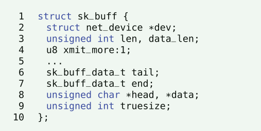
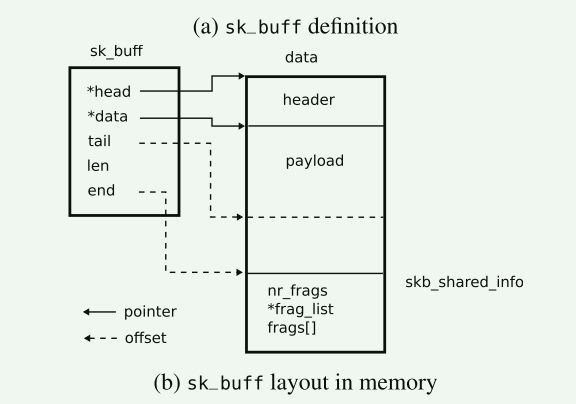
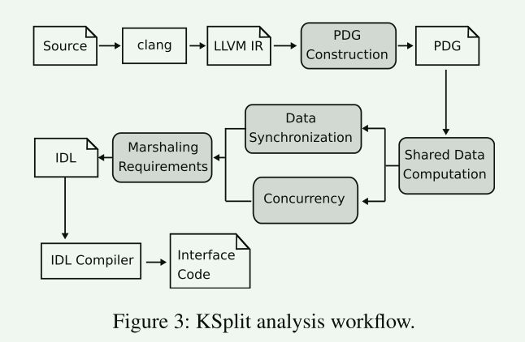
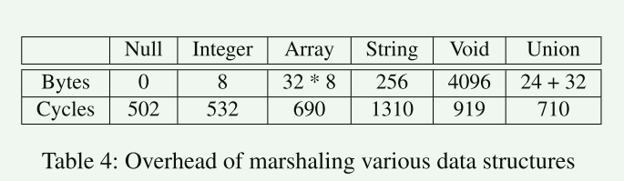
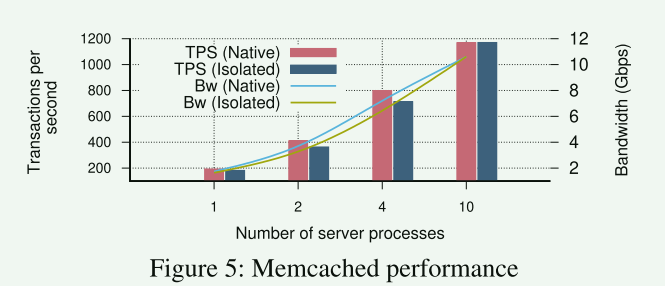

# KSplit: Automating Device Driver Isolation

本篇文章的研究背景是设备驱动程序的隔离。设备驱动程序是现代内核中的一个重要组成部分，但也是导致内核缺陷和漏洞的主要来源。随着硬件支持的提升，实现低开销的设备隔离框架已经成为可能。然而，现有的设备驱动程序的隔离仍然具有挑战性。**传统上，设备驱动程序和内核扩展是在共享内存环境中开发的，它们自由地交换对复杂数据结构的引用，这些数据结构混合了驱动程序和内核的状态**。因此，隔离驱动程序需要仔细分析隔离子系统之间的执行流程，以确定系统复杂状态在隔离边界的两侧如何访问。现有的手动分析方法需要大量的分解工作，限制了其适用性。因此，本文提出了一种名为KSplit的自动化框架，用于在现代、功能齐全的内核中隔离未修改的设备驱动程序。KSplit对内核和驱动程序的未修改源代码进行自动分析，以识别内核和驱动程序之间的共享状态，并计算出这些共享状态的同步需求，以实现高效的隔离。

> 新的硬件隔离技术
>
> Armv8.5-A Memory Tagging Extension
>
> Add protection keys supervisor (PKS) support


## 贡献

由于整个驱动程序分析的绝对复杂性，过去的方法仅限于仅隔离选定的驱动程序函数，并且仅支持内核习惯用法的有限子集。KSplit利用了静态分析方面的优势: 具体来说，它结合了精确的程序依赖图(PDG)表示和带有参数树[59]的模块化别名分析。这允许KSplit扩展分析并实现整个驱动程序的隔离。共享状态和私有状态的清晰分离允许我们扩展静态分析，并解决在低级驱动程序代码中编组数据所需的ambiguous annotations

本文认为先前的驱动隔离工作主要有两点不足：

1. 自动化程度低，需要大量人工成本，如LXD，LXFI。
2. 适用范围小，如Decaf，Microdriver

本文提出了KSplit，一个可以在当前完整特性的内核中对未经修改的设备驱动进行隔离的框架。其优势优势在于：

1. 适用范围广，而不是像Decaf只能针对个别类型的驱动。
2. 自动化程度高，在分析复杂驱动时人工介入会非常小。
3. 对同步数据这一过程进行了优化，从而使得隔离后的性能开销低。

## Ksplit总览

KSplit将完整的共享内存设备驱动程序转换为等效的驱动程序，这些**驱动程序可以在独立的域和驱动程序状态的独立副本上执行**。具体来说，KSplit**标识了一个被隔离的驱动运行所需要的内核状态的子集**，并推导出当调用跨越隔离边界时，以及**当驱动使用并发原语时，这个状态是如何被同步的**，例如atomics, spinlocks, mutexes, ready-copy-update (RCU)等

```c
ndo_start_xmit(struct sk_buff *skb,struct net_device *netdev)
```

两个输入参数(即skb和netdev)递归可访问的所有数据结构, KSplit确保内核和驱动程序之间共享的所有字段以及所有全局内核变量都与驱动程序同步。调用完成后，驱动程序更新的字段将同步回内核。对内核的嵌套调用还会触发同步，以确保内核和驱动程序使用当前状态。如果驱动程序代码使用与内核共享的并发原语，例如，一个全局锁，如网络设备驱动程序使用rtnl_lock注册到内核，KSplit在进入和退出原子区域时同步驱动程序和内核的状态，以在两个域中维护最新的副本。

KSplit 提供软件分析算法

1. 计算驱动程序访问的内核状态子集（即共享状态）
2. 在跨域调用和使用访问共享的并发原语时同步共享状态状态

虽然在概念上看起来很简单，但隔离遗留驱动程序却由于驱动程序当前在单片内核中的部署方式而导致的几个因素变得复杂。

**Complex shared state**： 复杂的共享状态

****

- 内核数据结构通常由大量可以通过多种方式引用的字段组成，内核和驱动程序共同操作这些字段中的一小部分

- KSplit 采用了字段敏感数据流分析，使用模块化别名分析来捕获内核和驱动程序共有的字段引用。为了有效地做到这一点，我们应用参数树方法，它在程序内计算别名并在程序间传播这些别名结果

**Size and complexity of the kernel**

为了使被隔离的驱动程序和内核正确操作，我们必须识别所有的共享状态。但是内核太大(例如，包含53,000个函数)，无法直接应用精确计算共享状态所需的字段敏感分析。KSplit处理这一挑战的方法是，**首先执行分析，以确定可以访问与驱动程序交互所涉及的状态的内核函数子集。然后，KSplit对内核函数的这个子集以及驱动程序执行精确的共享状态分析**。

**Concurrency and parallelism**

无论内核和驱动程序如何交互，KSplit必须确保内核和隔离的驱动程序在最新的共享状态下操作。驱动程序可能会使用各种并发原语之一更新内核并发访问的共享状态，反之亦然。**KSplit 利用了同步机制很少跨越驱动程序内核边界的关键观察结果，对于共享并发原语，KSplit 计算在临界区内访问并需要同步的状态**

**Low-level C idioms**

内核代码使用了一系列低级惯用语，这些惯用语会给静态分析带来歧义。


## Threat Model and Security Goal

KSplit 的目标与大多数先前关于驱动程序隔离的研究相同。具体来说，KSplit 旨在提高内核可靠性，即防止驱动程序域中的缺陷（例如内存错误）影响内核的其余部分。我们相信内核域没有软件缺陷，但假设驱动程序域可能包含缺陷，例如，可能会导致写入内核内存，从而可能导致内核崩溃。

关于KSplit驱动程序隔离是否能防止来自某个驱动程序的攻击的可行性分析，我们留作以后的工作。另外，一系列安全攻击仍然是可能的，例如资源耗尽（例如，驱动程序可以分配对象来消耗内存）、协议违规（例如，驱动程序可以从内核中注销自身），甚至释放后使用（例如，驱动程序可以以意想不到的方式触发对象的释放）。然而，我们相信 KSplit 是塑造未来隔离机制基础的关键一步。我们计划研究在未来的工作中可以自动实现哪些安全保证。最后，推测执行和旁路攻击也不属于本工作的范围。


## Ksplit 静态分析



Ksplit 将源代码（即内核和设备驱动程序的代码）作为输入，并使用 LLVM 的前端 Clang 将其转换为 LLVM IR。 

1. 识别内核和驱动程序之间的共享数据
2. 为每次跨边界处计算数据同步
3. 计算访问共享数据的并发原语的数据同步
4. 推测有歧义的数据类型

分析的结果是一系列过程调用，以KSplit的IDL（interface definition language）的形式记录。其后会被交给KS的IDL（interface definition language）编译器以生成胶水代码从而保证被隔离子系统间的数据同步。对于那些有歧义的地方编译器会报warning给开发者去人工介入处理。开发者要把每个warning变成一个IDL才能让编译器跑完，然后会生成让隔离系统之间数据同步的glue code


## 评估

这里的主要问题是KSplit是否可以作为Linux内核中设备驱动程序隔离的通用工具。为了回答这个问题，我们使用 KSplit 分析为来自多个 Linux 子系统的 354 个驱动程序生成 IDL，然后通过隔离和验证 10 个驱动程序的正确性来评估分析和 IDL 生成算法的有效性 。

文章给了10个驱动程序的分析结果，总的来说就是，ksplit确实可以简化内核驱动程序的手工分析工作，即使对于非常复杂的驱动程序，也可以在很少量的修改下完成工作。



本文对于跨隔离边界的调用由于涉及额外的数据同步，因此会带来一定的开销。从下表可知，同步的参数数据量越多，开销也就越大



在一个10核的机器上逐渐增加server进程数量，下图可以看出开销都在5.4%~18.7%之间
