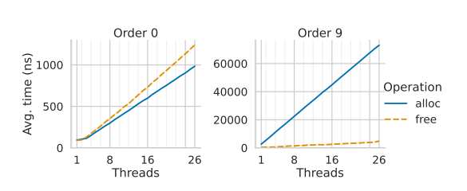
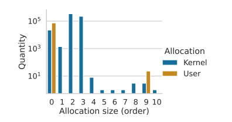
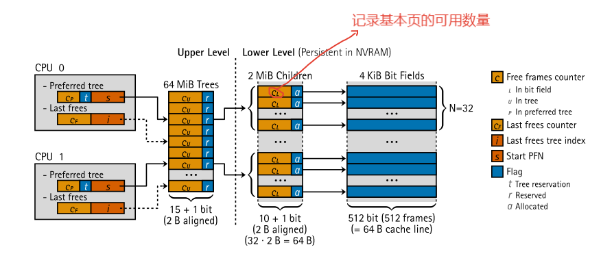
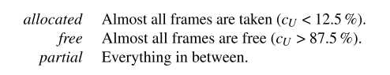
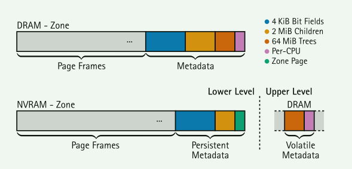

# LLFree: Scalable and Optionally-Persistent Page-Frame Allocation

## 背景

在操作系统的内存管理子系统中，页帧分配器是最基本的组件。它管理填充页表树所需的物理内存帧。尽管异构、非易失性和巨大内存的出现彻底改变了内存层次结构，但我们仍然使用20世纪60年代的开创性方法管理物理内存。在本文中，我们认为是时候重新审视页面框架分配器的设计了。我们证明了Linux帧分配器不仅在多核系统上扩展性差，而且还具有较高的内存开销，遭受巨大的帧碎片，并使用分散的数据结构，阻碍其作为持久性内存分配器的使用。使用LLFREE，我们提供了一种新的无锁和无日志的分配器设计，该设计具有良好的可扩展性，内存占用小，并且易于应用于非易失性内存。LLFREE使用缓存友好的数据结构，并在不增加性能开销的情况下表现出抗碎片行为。与Linux帧分配器相比，LLFREE将并发4 KiB分配的分配时间减少了88%，将2MiB分配的时间减少了98%。对于内存压缩，LLFREE将所需的页面移动次数减少了64%。

新兴硬件的出现对已有的页帧分配器发起了挑战

- 众核处理器
- NVRAM

操作系统的内存管理对外部应用具有重大影响。

## Linux伙伴系统的问题

- 分配器必须提供所有可能的`order`, 但是观察发现用户空间的请求集中在0、9(自然页)上面，而内核的请求则集中在其它order上(非自然页),这导致了许多次要问题
- 昂贵的合并代价(0->9)
- 扩展性差
  - per-cpu的存在一定程度上缓解了这个问题，但一些应用对分配要求很高很容易超过per-cpu的阈值。
  - per-cpu还造成了碎片化、加剧复杂性
- 大页碎片
  - high-atomic page blocks
  - memory compaction (两种方式都带来了额外的复杂性)
- 缺乏持久化分配支持(针对NVRAM)？
  - 都断电了为什么还需要恢复分配器的状态呢？

## LLFREE分配器

### 设计原则

- 尊重硬件
  - 缓存行粒度、原子指令、MMU
- 避免共享
- 仔细设计冗余信息

Lower level：执行具体的分配 (NVRAM崩溃一致性)

Upper level: 实现分配策略以避免共享和碎片化（扩展性)

### Lower level

分配基本页的过程:

1. 原子递减$C_L$
2. 位图搜索一个0位(由特殊的处理器指令支持)

分配大页的过程：

1. 设置$C_l=0$并且设置标记$a$ （CAS指令)

这可以让大多数分配只需要占用两个缓存行就可以完成分配（基本页，大页只需要一个) 。即使需要进行搜索，顺序搜索也更有利于缓存线的预取机制

### Upper level

物理内存被作为一个块数组+树进行管理。并做了缓存友好的设置。

- $r$ 标志用来作为per-cpu固定树

partial > free > allocated的策略可以避免大页碎片(启发式算法)

**CPU-Local Tree Roots**

- 在cpu本地保留一个$C_p$作为$C_u$ 的副本，这样就可以减少多核之间共享同一条缓存行带来的缓存失效
- $t$ flag 和 $starPFN$  用来标记(当一个zone里面的内存不足以为每一个cpu分配本地mem)和加速查找

**Reserve-on-Free**

在free的时候，在内存密集型应用上可能经常会发生free的内存不在本地的cpu上，这同样也会因为共享带来问题

- 在选择首选树时根据一个启发式算法：在本cpu上4次连续free命中同一个tree的时候。

### Crash Consistency

针对NVRAM，需要一个额外的页来保存一些元数据，检测是否需要断电后恢复

单缓存行属性还可以轻松地在所有系统上实现持久性一致性，这些系统提供至少一个缓存行的持久粒度[38]，以便在操作结束时以原子方式写入NVRAM，这被认为是NVRAM硬件的最低标准。

**恢复过程** ： 只需要lower level的信息即可

- 可能造成帧丢失

## 内核适配

1. 提供order 1-6的分配，7-8的分配，10的分配
2. 减少内核一些不必要的数据更新

## 评估

## 贡献

LLFREE:一个持久的、无锁、无日志的页帧分配器

1. 专注于分配MMU特定的内存大小
2. 减少内存共享，提高扩展性
3. 更高的内存效率(更少的元数据)
4. 大页碎片整理
5. 一致性

具体而言，本文的工作总结如下:

- 探究了linux系统中的伙伴分配器和基于链表的分配器的弱点
- 提出了以硬件为中心的无锁和无日志内存管理的设计原则
- LLFREE即适用于易失性内存，也适合非易失性内存
- 将LLFREE替换伙伴系统，对分配器的性能、可扩展性、空间开销、碎片行为、崩溃一致性都做了全面的评估