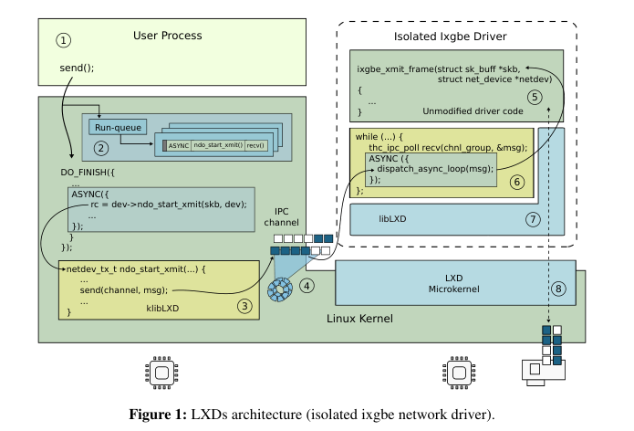
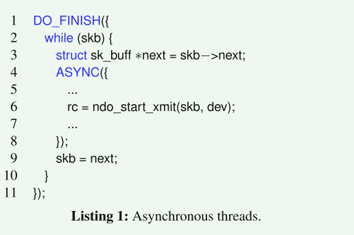
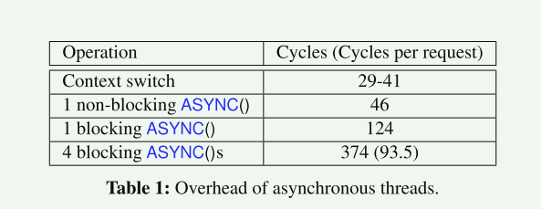
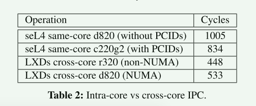
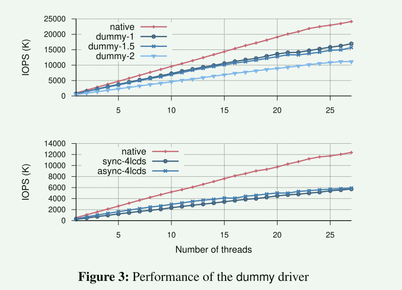

# LXDs: Towards Isolation of Kernel Subsystems

这篇文章的团队与论文[redleaf]()的相同。

本篇文章的研究背景是现代操作系统内核的安全性问题。由于内核代码的复杂性和快速的开发速度，加上使用不安全的低级编程语言，导致内核中经常出现错误和漏洞。尽管已经开发了许多静态和动态机制来保护低级内核代码的执行，但攻击者仍然能够找到绕过这些保护机制的新方法。**在一个单体内核中，一个漏洞就足以让攻击者访问整个内核，并改变任何数据结构来提升其权限。因此，现代内核需要一种实际的手段来限制单个漏洞的影响，即内核子系统的隔离**。然而，在内核中引入隔离是困难的，因为现代硬件接口不提供高效、细粒度的隔离支持，并且内核的复杂性阻碍了简单的分解工作。因此，本文的研究目标是通过轻量级执行域（LXDs）的方法，在一个功能完整的操作系统内核中实现隔离。LXDs允许将现有的内核子系统放置在一个隔离的域中运行，而无需进行或只需进行最小的修改，并且开销也很小。文章通过开发Linux内核中几个性能关键的设备驱动程序的隔离版本来评估这种方法的有效性。


本研究的创新性主要体现在以下几个方面：

- 提出了使用异步通信机制进行跨域调用的思想，以实现高效的隔离。
  - 开发了一种轻量级的异步运行时，可以创建轻量级的协作线程，实现跨域调用的批处理和流水线处理。
  - ==旨在通过利用可用的请求并行性来隐藏跨域调用的开销==
-  提出了分解模式，通过定义最小运行时层和接口定义语言（IDL），实现了对内核代码进行最小修改的分解。
  - 同步数据结构的私有副本
  - 跨域调用函数
  - 实现函数和数据结构指针的交换
- 通过高速缓存一致性协议进行跨核通信 ==也是为了降低跨域通信开销==
  - 原因是在现代硬件上，通过缓存一致性进行的跨核通信比同一CPU上的上下文切换更快


## 框架结构



1. 每个LXD是一个内核可加载模块
2. 依赖硬件辅助虚拟化技术(VT-x)
3. lxd运行在一个小的微内核中


隔离的子系统不共享任何可能破坏隔离保证的状态，例如内存指针、进入内存缓冲区的索引等。相反，每个独立的子系统维护自己的私有数据结构层次结构。IDL被设计用来生成调用者和被调用者插桩(stub)，这些stub隐藏了域间通信和数据结构同步的细节。

### 运行过程-以网络包为例子

1. 用户发送send请求
2. 内核调用`dev−>ndo_start_xmit()`将包传送给设备
   1. `dev−>ndo_start_xmit()`现在通过klibLXD模块的胶水代码实现替代
   2. 胶水代码通过IPC Channel将消息发送到隔离的驱动程序
3. 消息在隔离的驱动程序被IDL编译器生成的循环调度程序进行处理
   1. 循环调度程序直接调用未经过修改的驱动程序发送包


### 异步运行时




- `ASYCN`原语创建轻量级线程(协程？)并执行异步块的内容

- 异步运行时会为每一次发送创建一个轻量级线程

  ```rust
  runtime.spawn(||ndo_start_xmit())
  ```

- 异步运行时与消息传递系统进行集成， 当应答消息到来，被阻塞的异步线程会被唤醒

- 使用一些优化措施来减少线程切换的数量，推迟栈的释放


### Fast Cross-Core Messaging

- 将每个消息大小配置为缓存行大小


## 评估



异步运行时是否可以降低开销?相比传统的调用

- 第一个/二测试了异步运行时的创建删除开销和切换开销
- 第三个测试测试了一个轻量级线程的开销，这种情况下和传统的系统中调用yield类似
- 第四个测试测试了4个轻量级线程的开销，平均下来，每个轻量级线程的开销(94) < 124

得出了结论异步运行时确实可以减小开销。

==感觉不够严谨==



比较跨核通信的开销

- sel4的IPC开销更大(上下文的保存恢复)
- 跨核通信开销根据缓存一致性协议的复杂性而不同，但比在同一个核上的要小
- NUMA架构下跨核通信开销很高，可能的解决办法是每个NUMA节点运行一个LXD？==一个隔离的驱动运行在多个节点上合理吗？==



## 总结

本研究存在以下不足之处：

- 需要为每个隔离驱动程序的线程分配一个专用的核心，这可能会限制可扩展性。
- 基于虚拟化技术带来的额外开销
- 由于只对性能关键的设备驱动程序进行了隔离，对于核心内核子系统的隔离还需要进一步研究。
-  本研究的实验结果仅基于Linux内核，对于其他操作系统的适用性还需要进一步验证。

基于本研究，可能的后续研究方向包括：

- 进一步优化隔离驱动程序的资源利用，减少对专用核心的需求。
- 探索将隔离扩展到核心内核子系统，以实现更细粒度的隔离。
- 在其他操作系统上验证和扩展LXDs技术的适用性。

研究意义：本研究的理论意义和实践意义包括：

- 提供了一种实现内核子系统隔离的方法，有助于提高操作系统的安全性。

- 通过最小化对内核代码的修改，保留了现有操作系统内核的软件工程投入。

- 为进一步研究和开发支持细粒度隔离的操作系统提供了基础和思路。


## 参考文献

[CODOMs: protecting software with code-centric memory domains](https://dl.acm.org/doi/abs/10.1145/2678373.2665741)

当今复杂的软件系统既不安全也不可靠。当前硬件提供的基本软件保护原语迫使系统在同一保护域中运行许多不信任的软件组件（例如，过程、库、插件、模块），否则会因地址空间切换而导致性能下降。我们提出了 CODOM（以 COde 为中心的内存 DOMains），这是一种新颖的架构，可以在软件组件之间提供更细粒度的隔离，并且运行时开销实际上为零，而所有这些的复杂性只是其他方法的一小部分。CODOM 在周期精确的全系统 x86 模拟器中的实现表明，通过正确的硬件支持，更细粒度的保护和运行时性能可以和平共存.