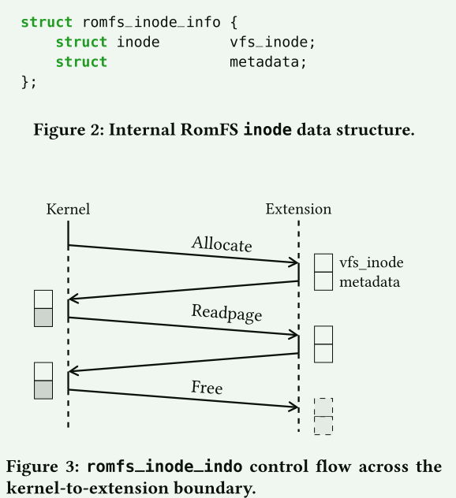
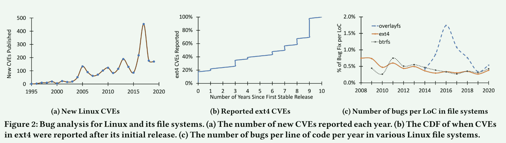
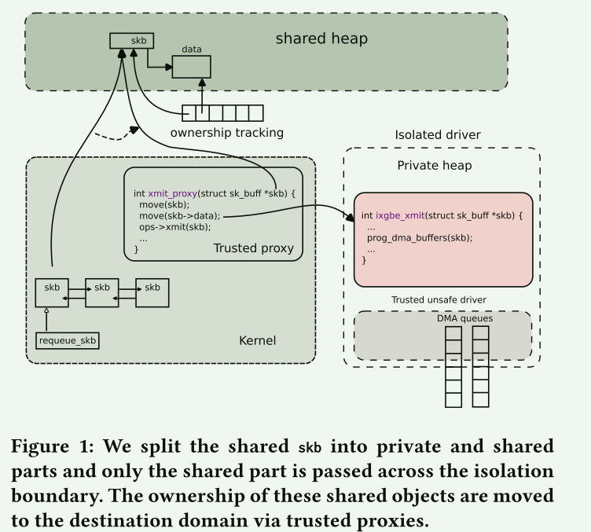

# Safe Linux Kernel Extensibility

这几篇文章都是介绍如何对Linux内核模块进行安全扩展。

## [Practical Safe Linux Kernel Extensibility](https://dl.acm.org/doi/10.1145/3317550.3321429)

可扩展性长期以来一直是操作系统的一个理想属性，因为它允许具有不同需求的用户共享相同的核心操作系统代码库。Linux内核提供了许多内核扩展来为不同的应用程序提供功能，这些扩展中的错误可能会影响这些运行的程序，甚至会影响系统的其余部分。

尽管在安全可扩展性领域开展了大量工作，例如 VINO 、SFI  和 SPIN，但现有解决方案对于现代操作系统来说过于重量级，需要对内核进行昂贵的更改和/或昂贵的运行时检查。更轻量级的解决方案，例如 Berkeley Packet Filter  等语言缺乏更加通用的特征以适应系统的复杂性。

这篇文章对于Docker相关的三个内核模块进行了分析，研究发现，这些内核扩展都存在相同的低级内存、并发和类型错误。

作者将过去对内核安全扩展进行的工作主要分为了几类：

1. 高级语言
2. Interpreted/JIT language BPF
3. Software fault isolation
4. Userspace
5. Verification

因为其它方法的局限性，文章探索了使用高级语言来为内核编写扩展的实用方案。在他们的设计中，**内核扩展可以纯粹用 Safe Rust 编写**。为此，他们提出了一个轻量级的框架，这个**框架作为内核和扩展之间的中介，围绕内核不安全的函数实现了安全的包装器，并强制扩展接口的安全类型**。中介层和内核是受信任的，因此可能包含不安全的代码。

文章根据这个方案实现了一个RomFS, 在这个过程中，内核设计模式的巨大差异引发了两个主要的问题:

1. Interfaces
2. hybrid code flow involving code in multiple languages.

内核接口虽然是为了可扩展性而设计的，但并不是为了类型安全而设计的。 Rust 依靠其强大的类型系统来提供安全性，但是内核接口使用隐藏类型信息的技术。所有数据结构和非结构化内存区域都作为原始指针提供给扩展

一个代码路径可能会涉及多种语言，许多扩展当前包含大量跨操作系统/扩展边界的错误。 Rust 的内存模型取决于所有权和生命周期。资源拥有其数据的内存区域。内存在创建资源时分配，当资源超出范围时，资源的生命周期结束并释放内存。该模型干净地管理纯粹存在于 Rust 中的资源的内存。然而，系统中的某些资源必须跨越语言边界

解决接口相关的问题是**在可能的情况下添加类型信息，并将内核提供的指针转换为访问相关内核资源的功能**。==抽象==

解决第二个问题的现有方法主要关注内存管理，文章建议内核扩展使用三种内存原语：全局变量、内核调用局部变量和内核对象绑定变量。

## [An incremental path towards a safer OS kernel](https://dl.acm.org/doi/10.1145/3458336.3465277)

这篇文章与上一篇文章的主要内容相同，但是站在更高层的角度分析了如何通过模块化和逐个模块逐步替换的方法打造更安全的Linux。文章列出了这条路线的研究挑战和潜在的解决方案，并讨论了未来可能遇到的问题

Linux系统正以每年数百万行的增量进行增长，研究表明，每年内核引入的新的扩展都引入了大量的错误。

一个有吸引力的选择是废弃 Linux 并重新开始。过去的许多工作都专注于从头开始构建更安全、更正确的操作系统：基于强类型的操作系统，基于更强大的模型（例如线性类型），但这些系统因为功能的匮乏，导致很难被实际采用。

还有另一条道路，通过开发更好的工具、更好的语言和更好的验证系统来实现新的内核扩展。我们可以逐步改进 Linux，而不是废弃它。

尽管在 C 静态分析工具和自动化测试框架方面做出了努力，Linux 仍然面临着众多错误。数据竞争和语义正确性等属性很难进行完全测试，但可以通过安全语言和形式验证来实现。**由于新的编程语言设计、高效的约束求解器和日益成熟的验证工具链的发展，使用安全语言和形式验证的开销和限制已显着减少**。我们相信**静态属性，包括类型安全、所有权安全和功能正确性，可以使 Linux 更安全并实现更有效的测试**。

检查的 1475 个 CVE 中，大约 42% 的 CVE 可以通过编译时类型和所有权安全来预防，另外 35% 的 CVE 可以通过功能正确性验证来预防。剩下的 23% 有多种原因：不适当的安全设计，例如弱访问限制或过度暴露内核信息，数字错误，例如整数上溢和下溢，以及各种其他原因。其中一些错误可以通过编程语言技术来预防，例如强制溢出检查、数组自动迭代器以及滥用未初始化变量；其他人可以从更好的技术来验证安全属性中受益，但这超出了本文的范围

文章提出的高层次方法的核心要素：**在保持兼容性的同时，沿着两个方向向 Linux 添加增量安全性：组件可以一次替换一个，每个组件都可以替换为增量安全的实现**

这种想法有两个成本：首先，增量替换模块需要模块化接口，这可能会导致性能成本。其次，增量更改需要谨慎的操作才能与现有代码兼容，从而增加开发工作量。

**Step**

1. Modularity 

围绕现有 Linux 组件引入模块化接口。具体来说，**任何模块的调用者只能引用模块化接口，而不能直接依赖于任何特定的实现**。模块化接口允许每个模块在不影响其他模块的情况下逐步改进，并提供隔离和封装，并且更容易推理验证

2. Type safety

第二步是引入类型安全以防止类型错误。重写模块时不使用 void 指针或将值转换为不兼容的类型，例如将错误值转换为指针。

3. Ownership safety

接下来，类型安全模块通过所有权安全得到增强。所有权安全是内存安全的多线程版本。在内存安全要求不访问无效内存的情况下，所有权安全添加了对内存的并发访问也受到保护。类型安全加上所有权安全允许模块知道它正在正确解释内存并且它有权访问、改变或释放该内存

4. Functional correctness

最后，通过部分或完整的功能正确性验证来增强模块。这需要为部分或全部模块制定规范，并确保模块与其规范相匹配。

这些步骤通过逐步向实现添加额外的要求，从而为内核模块带来了更强的安全保证，同时也消除了许多已有的错误。但因为Linux内核在其接口设计中优先考虑灵活性和性能，这让实施这些方法面临许多问题。

1. 由于 Linux 注重性能，因此组件之间通常**缺乏严格的模块边界**。模块化接口应该提供模块行为的抽象表示，但将其内部与内核的其他部分隔离。内核必须通过接口显式调用该模块，而不是随意调用。只要具有相同的接口，它就会支持各种底层实现。可以在不改变内核其他部分的情况下引入新的实现。**模块化接口可能会阻碍依赖于跨模块合作的性能优化**，并且对于未考虑模块化设计的子系统来说可能很难引入。

2.  Linux 是用 C 语言编写的，**没有强制禁止任意指针转换**。将指针转换为不兼容的类型很常见，开发人员依靠假设或手动运行时检查来确定正确的类型。用于传递自定义数据结构的 void 指针可以使用语言级技术（例如 C++ 模板或 Rust 泛型）替换为指向泛型类型的指针。
3.  Linux 内核通过跨接口边界的共享内存数据结构在组件之间传递信息。这些数据结构由内核的不同部分同时访问，通常具有复杂的规范，包括何时可以访问哪些字段、通过哪些函数以及何时需要持有哪些锁。
   1. Restricted Ownership Sharing+ExplicitOwnershipSharing

4. 出于性能原因，Linux 内核经常引入具有复杂属性和用法的新接口。内核中存在许多共享变量，这些变量被多个子系统所使用，必须在代码的适当位置，适当时候正确设置他们，以防止数据丢失和损坏。复杂的状态交互使得对这些模块进行验证异常困难。这需要对证明过程进行更好的建模和约束。

## [Evolving Operating System Kernels Towards Secure Kernel-Driver Interfaces](https://dl.acm.org/doi/10.1145/3593856.3595914)

本篇文章的研究背景是针对当前隔离框架存在的攻击向量，探讨开发安全的内核驱动程序接口以保护内核免受隔离驱动程序的攻击。随着安全攻击数量的不断增加，以及攻击复杂性和自动化程度的提高，硬件对隔离的支持引起了人们的关注。最近几代的通用CPU引入了一系列新的硬件隔离机制，如Intel Memory Protection Keys（MPK）和ARM的Memory Tagging Extensions（MTE）。此外，ARM和x86都提供了对控制流完整性（CFI）和堆栈保护的支持。然而，即使使用最先进的隔离边界方法，内核仍然可能受到多种攻击方式的攻击。因此，本文旨在提出一种新的安全的内核驱动程序接口，以保护内核免受隔离驱动程序的攻击。

从历史上看，隔离框架利用以下机制来强制隔离：硬件隔离原语、软件故障隔离 (SFI) 和编程语言安全。基于硬件的方法在一个私有、隔离副本上执行隔离子系统，并使用非隔离内核的拷贝数据，共享状态在跨子系统调用和同步原语周围进行同步。

基于 SFI 的方法在共享状态的单个副本上执行驱动程序和内核，对每个内存访问强制执行访问控制，将隔离子系统限制为一组允许的数据结构及其字段。这消除了维护共享状态的两个副本的需要，但需要频繁的访问控制检查。

一般来说，内核和驱动程序共享整个地址空间，即驱动程序可以通过驱动程序和帮助内核函数的集合访问内核内部复杂的分层数据结构。

即使使用最强的隔离方案也可能发生的一系列攻击：

1. Memory bounds
2. Pointer aliases
3. Function pointers
4. Lifetimes (use-after-free and double free)
5. Resource exhaustion
6. Denial ofservice
7. Synchronization and consistency
8. Protocol violations
9. Unrestricted hardware access

即使先进的安全和控制流执行机制也无法阻止利用驱动程序中逻辑流的攻击。**只能通过重新设计驱动程序内核接口来阻止一系列攻击。此类接口应对跨隔离边界交换的指针引用实施一系列限制，控制对象生命周期，并提供对硬件和系统资源的细粒度访问控制**。

### 方法

**将隔离设备驱动程序作为具有私有堆和特殊共享交换堆的隔离子系统来执行**

设备驱动程序本质上是不安全的，因为它们访问不安全的硬件接口。不安全 Rust 破坏了与任何不安全语言类似的所有安全保证。幸运的是，可以在 Rust 的安全子集中实现大部分驱动程序，并依赖于一个小型不安全库，该库封装了访问硬件所需的不安全机制 。虽然这个不安全的库成为 TCB 的一部分，但它的语义足够简单，可以使用现代验证工具进行验证。

虽然用 Rust 重写设备驱动程序是一个值得称赞的想法，但大多数内核设备驱动程序在未来几年仍将用 C 实现。对于遗留驱动程序，我们退回到一个实用的方案，**仅在跨越隔离边界的调用上检查安全性和线性类型**。具体来说，对于每次调用，我们利用 IPC 声明来显式定义跨子系统传递的对象层次结构。自动生成的 IPC 代码遍历层次结构，检查安全性和线性并强制执行访问控制规则；即，**所有对象都由传递它们的子系统拥有，同时转移所有权并撤销访问权。根据执行机制，我们要么更新内存标签（MTE 或 MPK），要么访问类似于 LXFI  的元数据**。