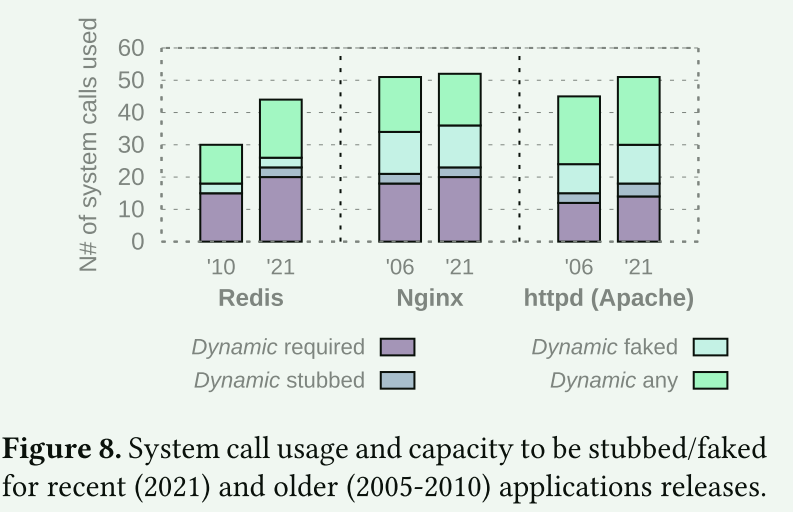

# Loupe Driving the Development of OS Compatibility Layers

## 概述

操作系统的有用性取决于它可以运行的应用程序。手动移植软件仅在短期内可行，因此新的和现有操作系统的开发人员必须通过构建兼容性层来为未修改的软件提供支持为应用程序提供类似于 POSIX 或 Linux 内核 ABI 等流行操作系统的接口。构建兼容性层代表着不可忽视的工程工作：

1. 识别目标应用程序所需的操作系统功能（系统调用、伪文件）
2.  实现这些功能

文章观察到，尽管兼容性层的成本很高，但它们通常是以一种特别的方式开发的:**没有系统的方法来确定和优先考虑要开发哪些操作系统特性，何时开发，支持哪些应用程序，或者应该在多大程度上实现所使用的系统调用以达到期望的支持程度。这将导致大量不必要的工程**。

过去的静态方法(二进制代码分析)常常会严重高估支持应用程序所需的操作系统功能集。而已有的动态分析方法(strace)没有考虑到早期操作系统开发中为节省工程工作量而采用的常见做法：**功能存根**（调用时返回 -ENOSYS [3]，而不实现功能）、**伪造功能成功**（返回成功代码，而不实现功能）以及**部分实现复杂功能**

Loupe：

对于一个应用程序和一个给定的输入工作负载（如基准、测试套件），Loupe 可以测量出哪些操作系统功能是真正需要实现的，哪些功能是可以伪造、存根或部分实现的。Loupe 还能根据正在构建中的操作系统以及一组应用程序和工作负载，计算出优化的开发计划，以尽可能少的工程工作量支持尽可能多的应用程序。

文章的贡献总结：

1. 一种新颖的方法，用于测量需要实现兼容性层以支持一组应用程序和工作负载的最小操作系统功能集，目的是最大限度地减少开发工作
2. Loupe 是一种工具，能够针对给定的操作系统和目标应用程序导出优化的操作系统功能支持计划，以便尽早运行尽可能多的应用程序
3. 演示使用 Loupe 节省的工程工作量，并提供针对正在开发的 11 个操作系统的优化功能实施计划的示例
4. 使用 Loupe 对一组应用程序所需的操作系统功能进行分析，显示过去的方法缺乏精确性，并调查兼容性层开发中的常见开发实践。

## 核心方法

1. 通过将 Loupe 设计为需要尽可能少的努力来集成新应用程序（最多编写 Dockerfile 和测试脚本）来解决应用程序支持的问题
2. 通过利用 Linux 的 seccomp  和 ptrace  工具来测量哪些操作系统功能可以针对给定的应用程序工作负载进行存根、伪造或部分实现，

## Loupe

Loupe 是一种动态分析工具，可在运行时挂钩应用程序使用的每个操作系统功能，分析应用程序在模拟不同程度的兼容性时的行为。 与现有的简单动态分析工具（例如 strace）不同，Loupe 是作为专门用于操作系统功能支持分析的框架而构建的。 它支持识别给定应用程序使用哪些系统调用和伪文件，并确定哪些可以伪造、存根或部分实现。 Loupe 专注于可靠且可重复的结果，并支持轻松集成到现有构建系统和复杂的测试套件系统中。 最后，Loupe可以处理一组应用程序的测量数据并输出有针对性的操作系统功能支持计划。

A: 设置跟踪和沙箱

B: 使用seccomp和ptrace 启动应用程序

C: 使用测试脚本向应用程序提供输入并收集性能数据

D: 使用/proc收集资源使用情况。使用 B 中设置的挂钩，Loupe 拦截应用程序调用的每个系统调用，并针对前面描述的两种模式之一对其进行测试。

为了最大限度地提高结果的可靠性和可重复性，每个分析都会在容器化副本中执行多次，并保守地更新分析结果以考虑所有结果。

### Evaluating Success and Performance

Loupe 的前提是用户能够描述他们想要支持给定应用程序的工作负载。 然后，Loupe 告诉用户他们必须支持哪些精确的系统调用集（以及如何）才能可靠地运行该工作负载，即多次运行而不会出现可观察到的功能和非功能问题

**Success 的定义**：当应用程序终止并且测试脚本退出代码指示成功时，运行被视为成功。

在执行性能基准测试时，测试脚本返回相关的性能数字（可以是任何特定于应用程序的性能指标），并且 Loupe 确保性能不会与成熟的基线相比产生统计上的显着变化。 资源使用和性能检查一起可以提供对存根或伪造功能的影响的深入了解，尤其是增加对伪造和存根的正确性（或不正确性）的信心

### 细节

####  vectored system calls 

类似(ioctl、fnctl)这样的vectored syscall 和类似(mmap、madvie)这样实现多个功能的系统调用，以整个系统调用的粒度来识别操作系统功能有时过于粗糙。在这种情况下，Loupe 还能根据单个系统调用参数禁用、存根和伪造系统调用，让用户轻松探索细粒度的部分实现。输出结果是系统调用及其使用的子功能，以及是否可以伪造或存根的列表。

#### pseudo-files

Linux API 的一部分是通过 /dev/random 等伪文件提供的。通过对某些系统调用（如 open、openat）的参数与路径（如 /dev、/proc）进行模式匹配，Loupe 能够检测此类特殊文件的使用情况。Loupe 还能伪造或存根访问这些文件的系统调用，使用户能够跟踪应用程序运行时需要实现哪些特殊文件

#### 测试框架集成

Loupe通过白名单系统来解决这个问题：在包装器（如测试套件）上运行时，用户可以指定哪些二进制文件属于应用程序，并应在分析中予以考虑。然后，Loupe 会跟踪所有子进程，在执行时检查二进制文件路径，忽略任何来自与指定二进制文件不一致的系统调用

#### Debhelper集成

为了进一步简化在许多应用程序上运行 Loupe 的过程，我们将 Loupe 集成到了 Debhelper [1] Debian 软件包构建系统中

#### 运行时间分析

$$
(2+ (2∗𝑡 ∗𝑠)) ∗ ⌈ 𝑟/𝑝 ⌉
$$

#### 共享结果

建立了一个共享的在线数据库，任何运行 Loupe 或对其结果感兴趣的个人都可以填充和查找该数据库。 Loupe 可以自动将结果与元数据一起提交到数据库（图 1 中的 E）。 我们预计，从长远来看，该数据库将包含广泛应用程序的结果，帮助操作系统和应用程序开发人员研究操作系统功能使用模式、构建兼容性层等，甚至不需要前面提到的运行时成本。

## Loupe支持

统计了常见的测试套件、应用负载116个，并针对正在开发的多个系统进行了分析。

为了估计操作系统项目在使用 Loupe 构建兼容层时会节省的工程工作量，文章选取了OSv中的62个应用程序进行分析:

****

Loupe 对实现 OSv 支持目标应用程序集的流程进行了大量优化，从而可以更快、更省地支持更多应用程序

## 使用Loupe分析Linux API

回答以下问题：

1. Loupe 方法与朴素动态分析（strace）和静态分析之间的准确度差距有多重要？
2. 在构建 Linux 兼容层时，必须实现哪些系统调用，哪些系统调用通常可以伪造或存根？ 为了使测试套件正确运行，必须实现的绝对最小系统调用集是多少？
3. 最重要的系统调用是什么，即大多数应用程序都需要实现哪些系统调用？
4. 为什么某些系统调用可以被伪造或存根？ 它会影响性能或资源使用指标吗？
5. 随着时间的推移，应用程序和标准库的系统调用需求会发生多大变化？

- 

- 静态分析技术都严重高估了运行基准测试和测试套件实际所需的系统调用数量。 Loupe 确定的这些应用程序所需的最小系统调用数量在基准测试中约为 20 个，而测试套件中为 20-40 个。 静态二进制和源分析方法报告的数字通常高出 5 倍到 2 倍
- 这些结果表明，提供核心功能甚至完整测试套件的全面支持的工作量远低于先前基于静态分析的工作所建议的工作量

平均而言，测试套件中可被存根或伪造的调用系统调用比例为 46%（范围从 Nginx 的 31% 到 Lighttpd 的 58%），基准测试中为 60% （从 Lighttpd 的 51% 到 HAProxy 的 65%）。 这表明，为这些流行的应用程序提供强大的核心功能（即测试套件涵盖的功能）支持所需的工作量肯定低于以前的工作建议的工作量，并且在仅考虑对基准测试的支持时甚至更低。

### 为什么系统调用可以被存根或者伪造？

1. 并非所有系统调用失败都会导致程序崩溃，程序可以简单地决定不采取进一步的行动
2. 系统调用API在功能上存在冗余：同一个手段往往可以通过不同的系统调用来实现
3. 回到安全默认值。应用程序会查询操作系统的各种值，以调整其行为（最大堆栈大小和文件描述符数量、处理器亲和性和调度重要性等）。当查询失败时，通常可以采用安全默认值
4. 禁用程序功能。 程序也可能决定简单地禁用使用系统调用的功能； 在某些情况下，这甚至可能不会产生明显的后果

### 源代码分析：系统调用返回值检查与被存根或伪造之间的关系

总的来说，我们得出的结论是，存根或伪造的能力不是检查存在（或不存在）的因素，而是单个系统调用和应用程序的语义的因素。

### 对性能的影响

- 对于大多数系统调用，存根或伪装时的性能变化在误差范围内
- 伪造或存根大多数系统调用不会导致资源使用情况出现统计上显着的变化

除了（取消）分配资源的系统调用以及表明潜在不稳定的系统调用之外，我们还确定了另外两类可能影响资源使用（或性能）的系统调用：

1. 优化系统调用(madvise)
2. 系统限制Setters/Getters: 诸如 prlimit64（或 ioctl 的一部分）之类的获取器/设置器系统调用也可能会导致资源使用或性能变化

文章强调评估存根和伪造对性能指标影响的重要性，这是决定支持什么和如何支持的过程的一部分。虽然大多数系统调用不会对性能指标产生影响，但有些系统调用会：当根本原因是不稳定时，操作系统功能绝不应被伪造；否则，是否存根或伪造应成为实验设置和对操作系统原型预期的明确因素。至关重要的是，不能把存根和伪造的（正面或负面）影响误认为是系统设计的影响

### 部分实现系统调用

几个复杂的系统调用不需要完整的实现来支持大量的应用程序。

### 系统调用使用的稳定性

-  表 3 的结果显示，使用的系统调用数量或多或少没有变化，分别为 48 与 51
- 系统调用使用量的大部分变化是由旧系统调用的弃用引起的

- 尽管 Linux 系统调用的数量有所增加，但所有应用程序使用的系统调用数量大致相同
- 可被存根或伪造的系统调用数量也几乎保持不变

### C库对系统调用的影响

- 动态编译的二进制文件的 glibc 初始化序列调用比 musl 多 2.5 倍，静态编译的程序多 1.8 倍

## 讨论

1. 动态分析、存根、伪造和部分支持技术带来了稳定性问题：我们是否会牺牲正确性来减少移植时间？
2. 我们是否会权衡（或仅仅影响）性能、资源使用或任何其他移植时间指标？
