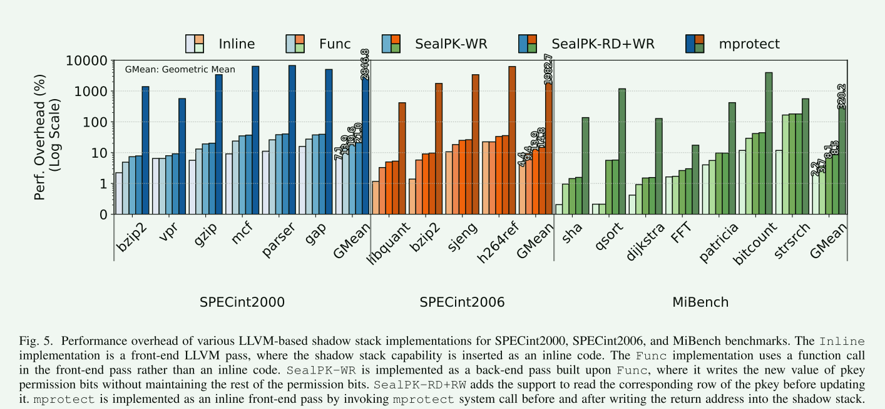

# Efficient Sealable Protection Keys for RISC-V

随着基于软件的攻击数量的持续增加，人们越来越努力地将敏感数据和可信软件组件与不可信的第三方组件隔离开来。硬件辅助的进程内隔离机制使软件开发人员能够将进程划分为隔离的组件，从而保护敏感数据不受不可信组件的影响。然而，现代处理器中的大多数现有硬件辅助进程内隔离机制，如ARM和IBM Power，都依赖于昂贵的内核操作来在可信域和不可信域之间切换。最近，英特尔推出了一个新的硬件功能，用于进程内内存隔离，称为内存保护密钥（MPK），它使用户空间进程能够以有效的方式切换域。虽然英特尔MPK的效率使开发人员能够将其用于常见用例，如代码指针完整性，但有限的域数量（16个）使其无法用于需要大量域的情况，如OpenSSL。此外，英特尔MPK还存在保护密钥释放后使用漏洞。为了解决这些缺点，在本文中，我们提出了一种用于RISC-V开放伊萨的高效进程内隔离技术，称为SealPK，它支持多达1024个唯一域。SealPK通过利用惰性解除分配方法来防止保护密钥使用后释放问题。为了进一步加强SealPK，我们设计了三个新的密封功能，以保护分配的域，其相关的页面，以及它们的权限。为了证明我们设计的可行性，我们在RISC-V Rocket处理器上实现了SealPK，为其提供了操作系统支持，并在FPGA上实现了我们的设计原型。

## MPK的相关工作

1. 针对攻击者篡改域权限的问题
   1. 二进制检查/重写技术
   2. CFI(控制流完整性) -> 一般是插入额外的代码 开销过大
2. 针对 pkey 数量有限的问题
   1. 基于软件虚拟化的libmpk  ==PTE更新开销==
   2. 基于硬件虚拟化的  ==针对特定应用==

## 本文的工作

1. 在`riscv`平台上实现类似于MPK的硬件支持
   1. 提供1024个域支持
2. 跟踪属于同一个域的页面数量和懒惰的解除分配方法来解决use-after-free的问题==软件方法==
3. Sealing the domain 封装域 (解决对隔离区域重新赋予权限的问题)==软件方法==
   1. 只允许对域进行一次赋予权限操作
4. Sealing pages   封装页(解决将不包含pkey的页赋予权限导致原来具备权限的线程失去权限的问题) ==软件方法==
   1. 禁止向一个域内添加页面，即固定一个pkey对应的页
5. Sealing permissions 封装权限 （解决恶意篡改pkey权限的问题） ==硬件辅助==
   1. 将WRPKR指令的执行限定在指定的内存地址范围内

- 在TLB的条目中添加10bit来存储页面对应的pkey
- 一个SRAM组成的PKR，原来存储每个pkey对应的权限
- 新增RDPKR/WRPKR指令

硬件辅助的辅助权限功能

## 评估

- clang有对影子堆栈的软件实现
- 对于SealPK，会分配一个内存区域并使用pkey来标记这些域
- 相比clang的实现，SealPK会带来一些开销
  - 但clang的实现会暴露攻击漏洞，安全性不如pkey进行保护的实现

- SealPk的实现只增加了额外的5%资源