# Microkernel Goes General: Performance and Compatibility in the HongMeng Production Microkernel

安全性、可靠性和可扩展性的优点使得最先进的微内核在嵌入式和安全关键场景中非常流行。然而，在针对更一般的场景(如智能手机和智能汽车)时，它们面临性能和兼容性问题

HM: 

1. 与Linux API和ABI兼容,以重用其丰富的应用程序和驱动程序生态系统
2. 在不受兼容性限制和通用限制的情况下保持高性能
   1. 区分隔离类
   2. 灵活组合
   3. 无策略的内核分页
   4. 基于地址令牌的访问控制

## Introduction

宏内核存在的问题：

1. 服务器和云等通用场景中占主导地位
2. 特定领域的策略难以进入内核
3. 高级行业认证

微内核的问题:

- 兼容性：POSIX子集兼容是不够的；难以重用设备驱动程序，这对生产部署至关重要
- 性能：IPC不是唯一的关注点
  - 当微内核通用时，IPC频率会显著增加(智能手机中的IPC频率比路由器高70倍)
  - 多服务器(multi-server)设计的状态双重记账引入了性能开销和内存占用
  - 基于功能的访问控制将频繁更新的内核对象隐藏在功能后面，由于频繁调用，可能会导致巨大的开销(页面错误处理比Linux慢3.4倍)

HM对微内核设计的关键决策：

1. Minimal microkernel with least-privileged and wellisolated OS services.
   1. 最小化
2. Maximizing compatibility by achieving Linux API/ABI compliant and performant driver reuse.
3. Performance first by structural supports(性能首先由结构支撑)
   1. HM实现了灵活的组合，从层次上放松了可信服务之间的隔离，以最小化IPC开销，并将紧密耦合的服务合并在一起，以最小化IPC频率，并在性能要求高的场景中消除状态双重记账
   2. 并在性能要求高的场景中消除状态双重记账

### 通用微内核的需求

智能汽车和智能手机等新兴场景需要丰富的外围设备和应用程序。

> 车辆的行业标准已经发展到需要更丰富的操作系统功能。同时，新兴场景也强调安全与保障。例如，车辆需要高可靠性以保障乘客安全，智能手机需要增强安全性以保护敏感数据

领域特定的差异性：

1. Software ecosystem：特定于领域的场景中，应用程序大多是定制的，并且源代码可用；然而，在智能手机等新兴场景中，应用程序和库通常以二进制形式分发，框架需要的不仅仅是POSIX遵从性，它要求Linux ABI兼容性
2. 资源管理：在特定于领域的场景中，只有少数预先确定的应用程序，并且硬件资源是有限的；在新兴的场景中，相互竞争的应用程序需要协调的资源管理。内核需要更成熟的功能，如有效的资源管理和公平分配
3. 性能。在特定于领域的场景中，对于大多数静态应用程序，微内核优先考虑安全性和严格的资源(例如，定时)隔离

### Linux的问题

尽管Linux正在渗透到PC和嵌入式领域，但通常牺牲了安全性、可靠性和性能

1. Security and Reliability
   1. 文件系统(FS)和设备驱动程序等Linux模块占其3000万行代码库的80%左右。它们造成了大多数缺陷和漏洞
2. Generality vs. Specialization
   1. 具有丰富外设和各种场景的设备的日益多样化，需要专门的策略来利用性能和能效的剩余空间；由于内核模块固有的紧密耦合，这种策略需要大量的工程工作来定制内核
3. Customization vs. Evolution.
   1. 与上游同步需要大量的工作来重新应用更改，而不同步可能会使系统暴露于安全漏洞

## 重新审视微内核

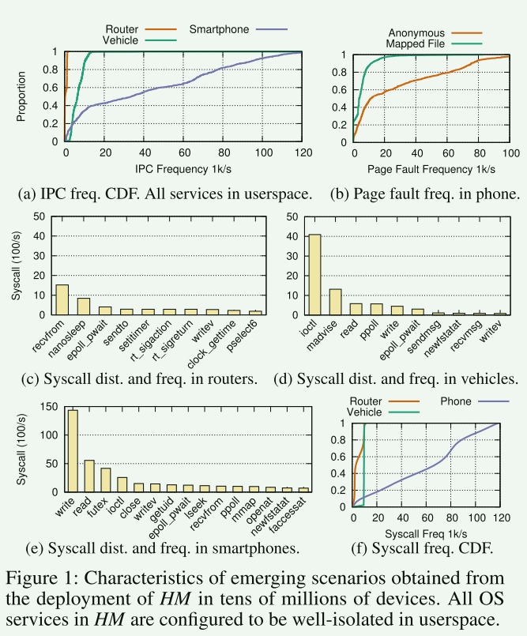

观察结果：

1. 在新兴情景中，IPC频率迅速增加

> IPC频率高不仅是因为系统调用频率高(61k/s，比路由器高13倍)，还因为调用了大量的文件操作(IPC到FS)，在内存映射文件上触发了大量的页面错误(5k/s)。这需要在内存管理器和FS之间进行额外的IPC往返

2. 分布式多服务器导致状态双重记账

> 新兴场景中的应用程序经常调用诸如poll之类的功

3. 能力抑制有效的合作

> 功能将内核对象隐藏在它们后面，由于频繁更新内核外部管理的一些内核对象(例如页表)

4. 生态兼容性要求的不仅仅是POSIX兼容性

5. 新兴场景中的部署需要高效的驱动程序重用

> 对于路由器，需要不到20个驱动程序(主要是内部维护)，而对于车辆和电话，则需要700多个驱动程序。我们的估计表明，重写这些驱动程序需要5000多人年的时间，并且需要时间来成熟和不断发展

### HM设计

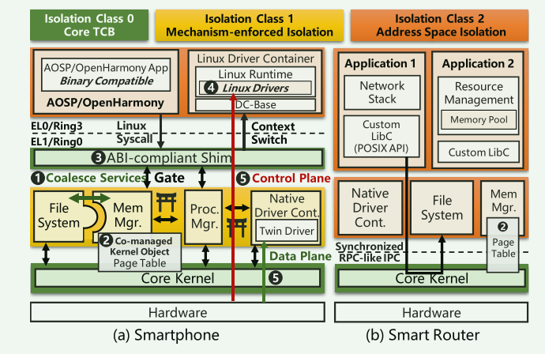

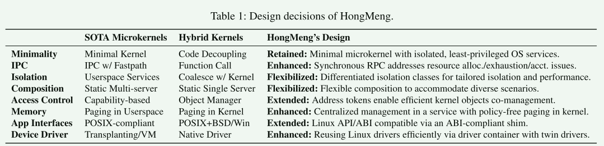

设计准则：

1. Principle 1: Retain minimality
2. Principle 2: Prioritize performance
3. Principle 3: Maximizing eco-compatibility

## HM的性能设计

### **Synchronous RPC-like IPC Fastpath**

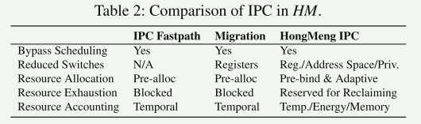

> 新兴的场景中，我们观察到大多数ipc是过程调用，可以清楚地识别调用方和被调用方。此外，操作系统服务大多是被动调用的，而不是连续工作的，应用程序的大多数后续操作依赖于过程调用的结果。因此，同步远程过程调用(RPC)是更适合服务调用的抽象

**HM采用类似rpc的线程迁移作为服务调用的IPC快速路径**：发送IPC时，内核执行直接切换(绕过调度)，只切换堆栈/指令指针(避免切换其他寄存器)以及保护域

- **性能差距**： 尽管HM绕过了调度，避免了寄存器的切换，但由于特权级别/地址空间切换和缓存/TLB污染(占IPC总成本的50%)，它仍然面临着不小的性能下降

**Resource Allocation**：HM通过为每个线程预绑定经常使用的OS服务(例如，进程/内存管理器和FS)中的堆栈，同时仍然维护一个堆栈池，其大小在运行时可自适应调整，从而达到了一个最佳点；当剩余堆栈低于阈值时，操作系统服务将分配更多堆栈以减少同步分配。HM通过在IPC链中调用相同的服务(例如，类似aba的调用)时重用相同的堆栈来进一步减少内存占用

**Resource Exhaustion**：HM通过保留一个单独的堆栈池来缓解这种情况。一旦发生OOM，内核将使用内存池同步IPC到内存管理器进行内存回收(重复)，直到用户的IPC成功

**Resource Accounting**：HM记录用户应用程序(IPC链中的根调用者)的身份，并在处理IPC时将消耗的资源归给它

> 新兴场景中的竞争应用程序需要明确的资源会计，因此消耗的资源应该精确地计入调用方应用程序。以前的工作通过继承调用方的调度上下文来实现时间隔离。然而，新出现的场景还需要计算能量和内存消

### Differentiated Isolation Classes

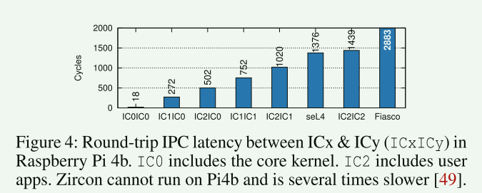

> [!WARNING]
>
> 并非所有服务都需要同一类隔离。特别是，成熟的、经过验证的、对性能至关重要的操作系统服务可以采用较弱的隔离，以便在实际部署中获得最佳性能

**Isolation Class 0: Core TCB**：IC0适用于经过仔细验证的、性能极其关键的、受信任的操作系统服务(shim层)；和kernel位于同一层，直接函数调用

**Isolation Class 1: Mechanism-enforced Isolation**：IC1适用于性能关键且经过验证的操作系统服务

- HM仔细地将内核地址空间划分为不同的域，并为每个服务分配一个唯一的域(IC0/core内核也驻留在一个唯一的域中)，HM使用ARM watchpoint[63]和Intel PKS[60]来防止跨域内存访问
- HM采用二进制扫描和轻量级控制流完整性(CFI，利用ARM指针认证(PA))来确保服务不能执行包含特权指令的非法控制流
- IC1服务之间(或IC0之间)的IPC将进入内核中的一个门，该门执行最小的上下文切换(切换指令和堆栈指针，w/o地址空间切换和调度)，并配置硬件来切换域

**Isolation Class 2: Address Space Isolation**：IC2适用于非性能关键型服务或包含第三方代码(例如，Linux驱动程序)的服务，通过地址空间和特权隔离来强制执行

### Flexible Composition

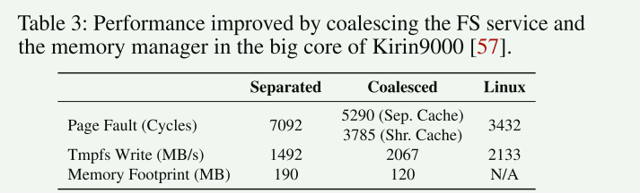

> [!NOTE]
>
> 虽然从直觉上看，操作系统服务应该很好地解耦，例如，FS和内存管理器，但我们观察到操作系统服务是不对称的，因为某些功能需要特定服务之间的密切合作(FS与内存管理器)

- 即使在IC1(内核空间)中，紧密耦合服务之间频繁调用的ipc仍然会导致明显的开销(内存映射文件的页面错误处理占20%)。

- 此外，对共享状态(如页面缓存)进行双重记账会带来巨大的内存占用和同步开销
- 没有页面缓存的全局视图来指导资源回收(例如，最近最少使用，LRU)

**HM采用了一种可配置的方法，允许在性能要求高的场景中合并紧密耦合的操作系统服务**

**安全**： 合并的服务位于单个故障域中，其威胁模型(作为一个整体)与其所在的隔离类保持相同。因此，任何失败或受损的服务只能破坏其合并的服务，这也是对性能的主要损害。因此，应该仔细评估服务合并

### Address Token-based Access Control

SOTA微内核使所有内核对象显式化，并服从基于能力的访问控制：**在用户空间中保留一个令牌(通常是一个槽ID)，表示访问内核对象的权限**

> [!WARNING]
>
> **Clear relationship but slow access**
>
> 功能在描述内核对象(即授权链)的外部关系方面是有效的，但是访问它们的内部内容需要将带有操作的令牌发送到核心内核，这将由于特权切换和对多个元数据表的访问而带来巨大的性能开销

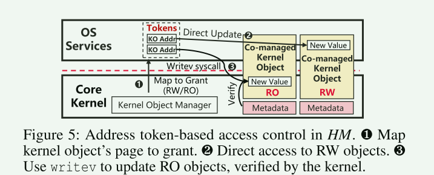

1. 每个内核对象都被放置在 HM 中一个唯一的物理页上
2. 将内核对象授予操作系统服务需要将该页面映射到其地址空间（❶）。这样，映射地址就成了直接从硬件访问内核对象的令牌
3. 操作系统服务可以读取 RO 内核对象，而无需内核参与；使用系统调用 writev，内核验证后更新数据
4. 对于 RW 内核对象，一旦授予权限，操作系统服务就可以在没有内核参与的情况下进行更新

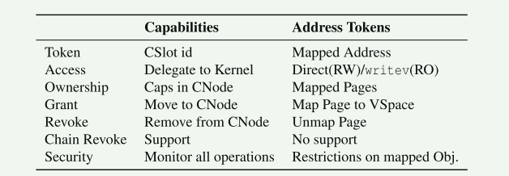

**Functionality**

- 地址令牌支持能力的大部分操作
- 地址令牌一旦被授予，就不能限制细粒度操作，这就削弱了安全性，暴露了更多的攻击面
- 能力存储了详细的关系，允许链撤销，而地址令牌由于隐式所有权而不支持链撤销

> - 地址令牌只用于选定的共同管理内核对象。攻击面得到了仔细缓解
> - 由于采用集中资源管理，内核对象有特定的所有者（不会授予他人）。因此，很少使用链式撤销

### Policy-free Kernel Paging

> 一些 SOTA 微内核（如 seL4）将内存管理委托给具有单独定制pager的应用程序。然而，由于新兴场景中的竞争性应用需要协调的集中管理，我们发现很难有效地实现某些需要通过分散式pager查看内存全局的功能，如控制组（cgroup）和内存回收

**HM 通过集中式内存管理器来管理内存。内核负责管理物理和虚拟内存，并为所有应用程序和操作系统服务处理页面故障**；为了提高处理匿名内存页面故障的性能，HM 提前做出了策略驱动决策，并在核心内核中留下了无策略页面故障处理机制

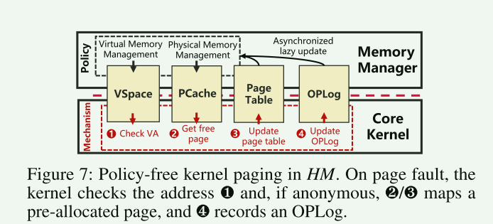

- 内存管理器在提供匿名内存地址范围的同时，还提供了几个预分配的物理页
- 页面故障是在该范围（❶）内触发的，核心内核可将其直接映射到预先分配的物理页面（❷ 和 ❸），并记录操作日志（OPLog, ❹），内存管理器将利用该日志异步更新其内部状态（如映射匿名页面的计数器）
- 否则，如果地址不在指定范围内（不影响性能）或预分配的页面已用完，核心内核将向内存管理器发出 IPC

## HM的兼容性设计

### Linux ABI兼容

**Syscall Redirection**： HM通过在IC0(内核空间)中放置一个兼容ABI的shim来实现Linux ABI兼容性，该shim将Linux系统调用重定向到ipc，指向适当的操作系统服务(

**Centralized States**： 除了二进制兼容性之外，微内核不再有全局状态的中央存储库，比如文件描述符(fd)表，这使得fd多路复用(poll)和fork等系统调用难以实现；**HM中符合abi的shim也可以作为全局状态(如fd表)的中央存储库，从而有效地实现fd多路复用(如poll)和系统调用(如fork)**

- 具体来说，shim维护fd表，该表将fd映射到凭证(由操作系统服务用于标识用户)
- 轮询只需要在shim中维护一个轮询列表，通过地址令牌与OS服务共同管理。它还避免在执行fork时复制用户空间中的fd表。

**Vectored Syscalls**：HM在FS服务中重定向并处理它们(ioctl/fcntl)

### Driver Container

已有工作：

- 移植：移植运行时环境需要重新实现驱动程序使用的所有内核api (kapi); 由于一些驱动程序使用大量的kapi，其中一些甚至在不断发展，因此这种方法面临兼容性和负担得起的工程工作的挑战
- VM：通过虚拟机重用驱动程序可以以更少的人力实现更好的兼容性；导致额外内存占用+驱动程序中频繁使用异步通知而降低性能的线程双重调度

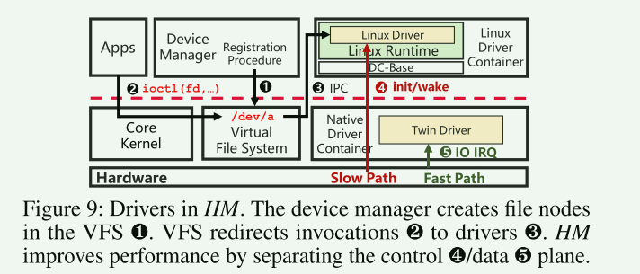

**Linux驱动程序容器(LDC)通过重用Linux代码库作为用户空间运行时来提供所有必要的Linux kapi，允许现有的Linux驱动程序无需修改即可运行**

- 提供了一个虚拟架构，并将kthread/memory接口重定向到HM。
- 为了使驱动程序正常工作，DCbase创建了一个虚拟定时器和一个虚拟IRQ芯片来提供中断请求，并为virt_to_phys等函数保留了一个线性映射空间

**关键路径性能**：

> LDC放置在IC2(用户空间)中是为了保持安全性(驱动程序有大量不受信任的代码库)并避免许可证污染
>
> - 在驱动程序关键场景中引入了不小的开销，比如应用程序启动和摄像头

- **HM通过在本地驱动程序容器中创建一个twin驱动程序来应用控制平面和数据平面分离，该驱动程序处理性能关键路径上的I/O irq**
- twin驱动程序重写数据处理过程，因此可以通过较弱的隔离(在内核空间中放置IC1)来强制执行

> [!NOTE]
>
> HM把设备驱动中「数据平面」（也就是IO操作）的部分，委托给IC1空间中的twin driver来完成，而控制平面操作留在LDC中

**权衡**：twin驱动程序需要额外的工程工作来拆分和重定向中断以及同步状态。因此，双驱动程序仅用于像通用闪存(UFS)驱动程序这样的性能关键驱动程序

## HM的真实应用

core kernel(90k) + server(100万)

**安全关键场景中**(智能汽车和智能手机的可信执行环境(TEE))：安全性和严格隔离优先于性能 + 应用程序大多是定制的，并且源代码可用

- HM将所有操作系统服务放在IC2(用户空间)中，并通过库向应用程序公开POSIX API

**性能要求场景**(智能手机)：，HM将性能关键型操作系统服务放在IC1(内核空间)中，包括进程管理器、内存管理器、FS和本机驱动程序容器，并将FS与内存管理器合并

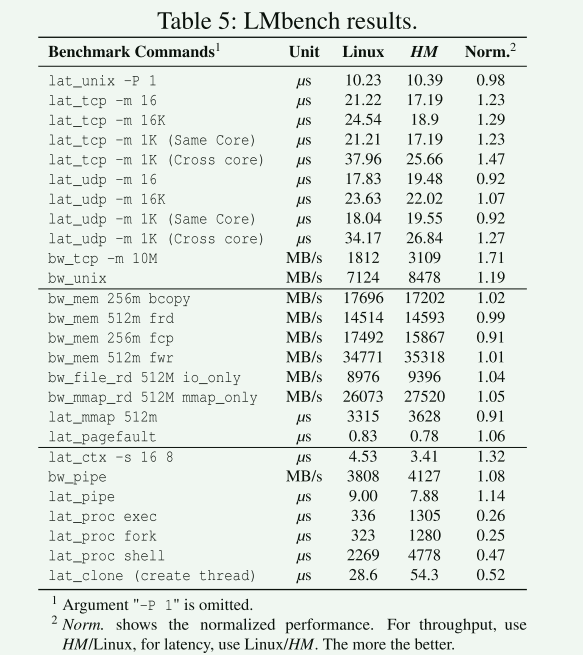

- HM上的上下文切换lat_ctx(32%)和网络(平均21%)更快，主要是由于与Linux相比简化了处理过程
- fork的性能仍然比Linux差：fork的主要开销来自复制虚拟内存区域(vma)。它可以通过并行加速，从而将开销从150ms减少到60ms(在典型的应用程序中，在Linux中接近30ms)
- 创建线程也比Linux慢1倍，主要是由于多个操作系统服务和内核之间的额外ipc

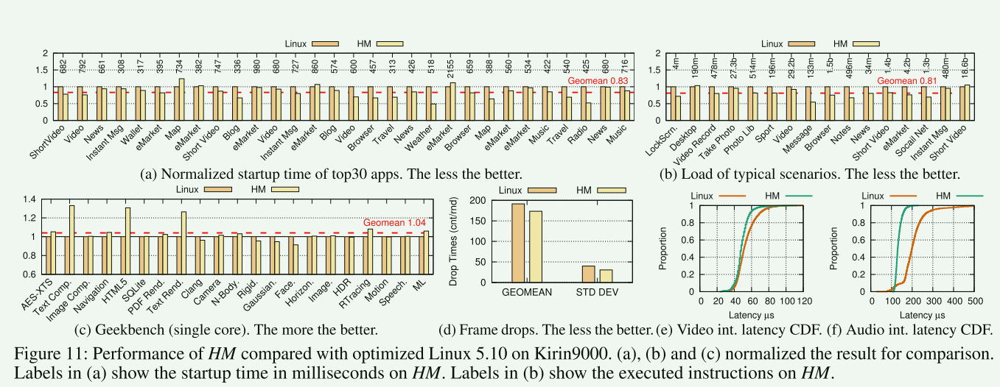

## Lessons and Experiences

- Compatible first, then nativize gradually
- Specification alone is insufficient. Examine compatibility via large-scale testing
- Deploy first, then optimize continuously
- Use automated verification as much as possible.
- Amplification ofhardware failures/bugs due to the scale effects(由于规模效应而放大硬件故障/bug)
- Big kernel lock is not scalable in emerging scenarios