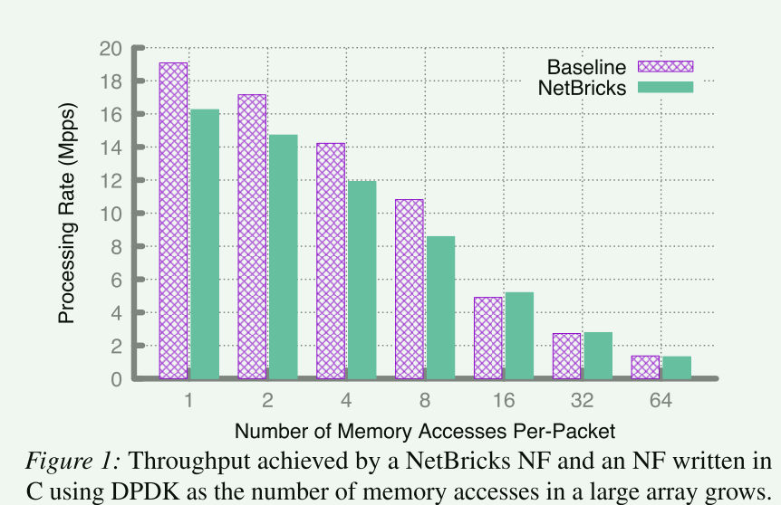
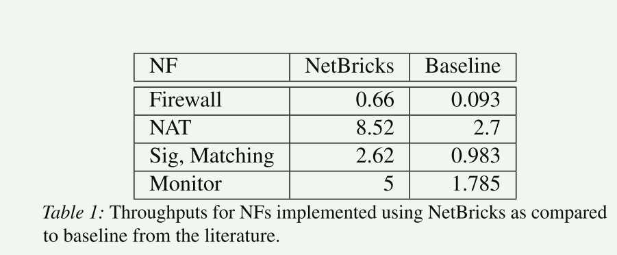
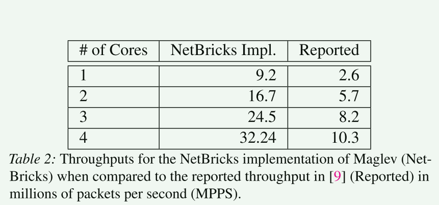
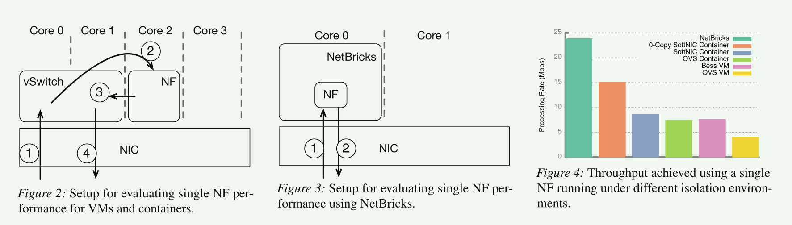

# NetBricks: Taking the V out of NFV

## 背景

本篇文章的研究背景是网络功能虚拟化（NFV）。NFV是一种将硬件中间盒替换为软件网络功能的方法，旨在提供更高的灵活性、可扩展性和降低成本。然而，NFV的发展进展缓慢，主要是因为传统的构建和运行NF的方法无法满足运营商网络的性能、效率、链式支持、多租户隔离等要求。当前的NFV工具在构建NF方面缺乏高性能和快速开发的支持，而在运行NF方面，现有的虚拟化和容器化技术在提供隔离性能方面存在性能开销。

因此，本文提出了一种名为NetBricks的NFV框架，旨在解决当前NFV范式的不足之处。NetBricks提供了一个编程模型和一个执行环境，通过使用高级抽象和安全语言和运行时来构建和运行NF。NetBricks的编程模型基于一组可定制的高级抽象，用于常见的数据包处理任务，而执行环境则依赖于安全语言和运行时来提供内存和故障隔离。此外，NetBricks还引入了一种名为Zero-Copy Software Isolation（ZCSI）的新技术，用于提高I/O效率和数据包隔离性能。

## 与已有工作的比较

### 构建

绝大多数商业 NF 都使用快速 I/O 库（DPDK、netmap 等）。虽然这极大地提高了 I/O 性能，但开发人员还要负责所有其他代码优化。 Click 模块化路由器（也可以利用此类库）使开发人员能够通过将各种数据包处理模块（称为元素）连接在一起来构建 NF。虽然 Click 不限制数据包在元素之间流动的方式，但模块通常仅通过设置各种参数来支持有限数量的自定义。因此，在实现新的NF功能时，开发人员通常需要实现新的模块，并且优化此类模块的性能是困难且耗时的。

本文将这些NF模块的集合限制为核心功能，例如数据包解析、处理有效负载、字节流处理等。也就是说，NetBricks 不会让开发人员处理大量模块，而是专注于这些经过高度优化的核心模块。为了提供必要的通用性，还允许通过使用用户定义函数（UDF）来定制这些核心模块。

与Click方法不同，其致力于提供一个完全通用的框架来构建应用程序，但开发人员需要去承担优化性能的任务，而NetBricks支持最核心的抽象，开发者可以在此基础上进行灵活扩展。

### 运行

已有的NFV 部署依赖虚拟机和容器来提供隔离，虚拟机和容器提供隔离，确保一个 NF 无法访问属于另一个 NF 的内存，并且一个 NF 的故障不会导致另一个 NF 瘫痪。这会带来很大的开销，造成这种性能差异的主要原因是网络 I/O 数据包必须跨越硬件内存隔离边界。这需要上下文切换（或系统调用），或者要求数据包必须跨越核心边界，两者都会产生大量的开销。

## 设计

### 构建

五个核心的抽象：

包处理 Packet Processing：

- 解析 Parse
- 反解析 Deparse
- 转换 Transform
- 过滤 Filter

字节流处理 Bytestream Processing

- window ：该抽象需要四个输入参数：窗口大小、滑动增量、超时和流 UDF。该抽象负责接收、重新排序和缓冲数据包以重建 TCP 流
- 包格式化 Packetize ：这种抽象允许用户将字节数组转换为数据包。

控制流 Control Flow ：NetBricks 中的控制流抽象对于 NF 图中的分支（和合并分支）是必需的。需要分支来实现条件（例如，根据目标端口拆分数据包等），以及跨内核扩展数据包处理

- 聚合 Group By 
- Shuffle
- 合并 Merge

状态管理 State

计划事件 Scheduled Events

### 运行

基于容器和 VM 的隔离对于简单的 NF 来说会带来重大损失，因此，NetBricks 采取了不同的策略并使用软件隔离

安全语言和运行时环境提供了四个对于在软件中提供内存隔离至关重要的保证:

1. 它们不允许指针算术，并要求代码获取的任何引用要么是由于分配或函数调用而生成的； 
2. 它们检查数组访问的边界，从而防止由于缓冲区溢出（和下溢）而导致的杂散内存访问； 
3.  它们不允许访问空对象，从而防止应用程序使用未定义的行为来访问应隔离的内存； 
4. 它们确保所有类型转换都是安全的（并且在兼容对象之间）

隔离：

1. 内存隔离

2. 包隔离

   NFV 需要的不仅仅是内存隔离； NFV 必须保留物理网络的语义，即 NF 无法修改数据包一旦发送（我们称之为数据包隔离）。这通常是通过在数据包从 NF 传递到 NF 时复制数据包来实现的，但这种复制会在数据包处理应用程序中产生很高的性能开销。因此，我们转向独特的类型[13]来消除复制数据包的要求，同时保持数据包隔离。

   我们设计 NetBricks，以便对 NF 之间的调用进行标记，以确保发送方失去对数据包的访问权限，从而确保只有单个 NF 可以访问数据包。这使我们能够保证数据包隔离保持不变，而无需任何复制。

## 评估

- 在单个包访问内存的次数较少时， rust的实现会带来20%左右的开销，当次数增多，缓存未命中的开销占据了更大的比例

-  NetBricks 实现通常优于现有的实现，成这种差异的主要原因是我们采用了许多这些系统未实现的最先进的优化（例如批处理）

 与Maglev的比较，这些数字并不意味着我们的性能更好，只是表明 NetBricks 可以达到与手动调整 NF 所获得的结果相当的结果。

