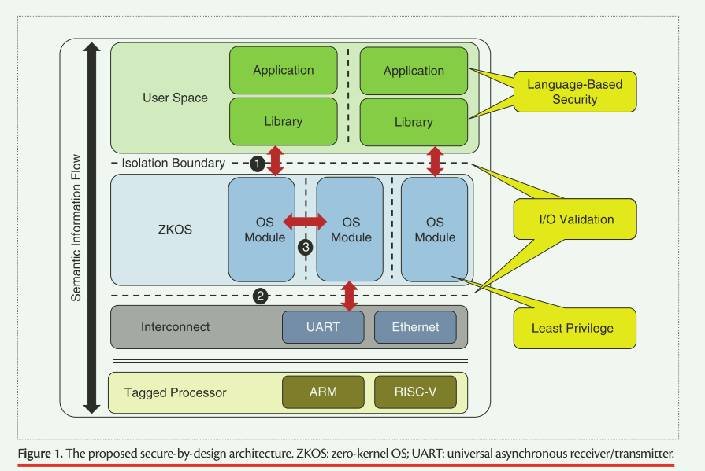

## One Giant Leap for Computer Security

## 概述

计算机安全目前的任务是在无穷无尽的原始比特中建立秩序，如果不从根本上改变我们处理安全问题的方式，这项艰巨的任务注定要失败。安全现状的根源在于计算机体系结构、操作系统（OS）和编程语言方面的传统设计决策，自 1970 年以来，这些设计决策在商品系统中基本上没有受到质疑。早期的系统信任用户，将重心放在提高系统的性能上。

早期系统性能至上的直接后果是：某些设计决策直接导致了今天的安全漏洞

- 处理器处理原始比特，没有任何关于其所代表对象的元数据
- 除了虚拟内存外，缺乏其它核心安全功能，而且虚拟内存最初是为了掩盖进程可用内存的限制而添加的

> [!WARNING]
>
> - 在指令集架构（ISA）层面上不存在缓冲区溢出的概念；这种语义是程序员强加的，对机器来说并不重要
> - 操作系统仍然是单一的，在操作系统内部不存在隔离或权限分离
> - 当今的系统编程语言 C 和 C++ 诞生于编译器还很简陋的时代，当时的编译器只刻意在汇编代码中提供少量抽象。因此，它们几乎不提供静态验证，也没有运行时系统来验证安全属性

**现在是通过采用新的系统架构来结束内存永恒战争的时候了，在这种架构中，安全性是与性能并列的一等公民，处理器、操作系统和编程语言通力合作，共同保证安全性**

### 目标

在我们的设想中，未来的安全将是计算机设计的基础，而不是在原始比特的不稳定基础上从上而下强加的。我们确定了计算机安全的三大支柱，它们应是任何安全系统架构的固有特性，并贯穿系统设计的各个层面：

1. **代码模块内部的安全，即基于语言的安全**
2. **代码模块之间的安全，即输入输出（I/O）验证**
3. **代码模块的隔离，即每个代码模块的最小权限**

- 基于语言的安全性适用于所有代码模块，无论是应用程序、库还是操作系统模块。

- 当数据跨越系统中的逻辑边界时，I/O 验证就会发生，无论是从操作系统到应用程序，还是从硬件到操作系统。

- 通过将应用程序和操作系统内的功能相互隔离，可实现最低权限。

> [!IMPORTANT]
>
> 这些支柱都是由语义感知处理器实现的，这些处理器所感知的不仅仅是原始比特。

基于语言的安全性： 基于语言的安全性的基本属性是内存/类型安全，它在高层次上要求内存只能按照程序员的意图使用

输入/输出验证：系统中的信息位可以通过编程生成，也可以从外部输入，如用户输入或网络。内存/类型安全可处理第一种情况，而 I/O 验证则需要确保来自外部的比特信息类型正确、边界有效

最小权限：隔离代码模块，即把每个模块减少到完成其工作所需的最小权限集，是为计算机系统提供分隔的基础。通过隔离组件，任何特定组件的破坏都不会危及整个系统。此外，隔离还能使我们确保每个组件都能访问其功能所需的最小资源集，即最小权限

## 设计

### 内存和内存安全

早期的编程语言（如 C 和 C++）旨在尽可能提高应用程序的性能。一般来说，这是通过尽量缩小源语言的操作语义与底层机器架构的实际语义之间的差距来实现的。

1. 为开发人员提供了利用低级程序运行（如访问结构字段的指针运算）的强大能力
2. 无法执行两个关键的安全属性：内存和类型安全

> [!CAUTION]
>
> - C 语言允许创建和取消引用指向任意内存地址的指针，这就使得任何映射的内存区域都有可能被漏洞破坏
> - C++ 容易发生类型混淆，例如，一个不相关类的对象被用于虚拟调度

#### Memory Safety

缓冲区溢出和使用后释放漏洞违反了内存安全的两个原则：

1. 空间或边界安全，即要求所有指针的取消引用都在被引用对象的边界内
2. 时间或生命周期安全，即要求被引用对象已被分配

提供内存安全的语言本质上需要一些运行时检查。 对象边界，特别是堆对象的边界，可以在运行时基于例如用户输入来确定。 优化所需的检查集引起了广泛的研究兴趣，因为它直接影响性能。时间安全经常依赖于垃圾收集，这本身就是一个研究领域。

> [!CAUTION]
>
> Rust 这样的语言会在编译时通过其类型系统实现时态安全，但会损失一些表达能力

#### Type Safety

内存安全关注的是何时何地将位写入内存，而类型安全关注的是如何解释这些位。编程语言社区已经开发了强类型语言，通过其类型系统提供空间安全性。 面向对象的语言功能（例如继承和虚拟分派）为类型安全带来了额外的挑战，因为它们在程序数据之上引入了额外的抽象层和类型信息。

类型系统可以从两个维度解读:

1. 执行的时间
2. 严格程度

静态执行要求在编译时验证所有对象的类型，并且在执行过程中不得更改。与此相反，动态执行允许变量在运行时改变类型，但会牺牲性能开销。

静态执行可能过于严格并限制程序的表达能力以提供保证。 例如，面向对象语言中的向下转型通常很有用，但如果没有关于别名的强有力假设，就无法静态验证。

#### Tagged Architectures(标记架构)

现代标记架构允许执行通用安全策略，例如内存和类型安全。 这些系统以内存中单个字的粒度使用有关内存和指令的附加元数据“标签”来扩展硬件，从而能够跨指令和数据执行任意策略。 本质上，有关代码预期行为的丰富语义信息可以通过标签在处理器中进行编码，并在运行时进行验证。 这个概念的一个变体是能力，或者是不可伪造的、不可变的令牌，赋予执行操作的能力

### 基于语言的安全(Language-Based Security)

现代语言提供了比 C/C++ 强大得多的抽象，包括静态特性（如强类型系统）和运行时特性（如垃圾回收），这些可以统称为基于语言的安全性。这些抽象功能免除了程序员对底层细节的责任，并设法保证代码在编译和执行时的内存和类型安全，防止攻击者劫持.

基于语言的安全性是确保软件安全的有力工具，因为它消除了对开发人员插入式人工检查的依赖。

但是这种说法在两个方面并不完全正确：

> [!WARNING]
>
> **语言设计**通过让开发人员在编写代码时依赖抽象概念来提供安全性。这种抽象会限制程序的功能，特别是对于实现自定义数据结构或访问低级硬件细节的低级系统代码。为了缓解这些问题，许多语言都提供了摆脱抽象的方法，这样开发人员就可以编写任意代码。这种 "不安全 "代码区域会破坏语言的安全保证

> [!WARNING]
>
>  安全语言的实现也可能暴露缺陷，特别是在运行时系统的正确性方面，该系统通常是用不安全的语言编写的。

#### 语言设计

某些软件无法在保持语言抽象的限制的情况下提供其预期功能。 为了解决这个问题，**许多内存和类型安全语言在抽象中提供了一个“逃生舱口”，使开发人员能够增强对过程的控制，但代价是削弱或消除对无错误的保证**。 例如，Rust 提供了 unsafe 关键字。

不安全代码的 safe 接口是一种为开发人员提供一系列安全/控制选项的机制。这种方法也有其自身的挑战。

1. 首先，API 确实必须是安全的。 这意味着仅使用核心 Rust 语言编写的程序的安全保证仍然适用于使用新 API 定义的语言扩展的代码。 

2. 其次，该 API 背后的不安全代码实际上必须没有错误。 如果这些属性中的任何一个未能保持，应用程序可能面临内存损坏漏洞或其他危险错误的风险。

**要确保不安全代码的安全接口实际上是安全的，一种方法是利用对应用程序接口和不安全代码的形式验证**

#### 分离编译

对于 Rust 等静态保证内存和类型安全的语言来说，单独编译是一个基本的设计挑战，因为它们的保证要求对整个程序进行分析。即使假设所有应用程序都是静态链接的，在至少两种情况下，这种分析也是不可能的：

1. 进程间通信
2. 对操作系统的系统调用

**即使是运行时能保证安全的语言，也无法跨进程-内核边界传输必要的信息**

#### 低级操作

涉及到硬件上下文的低级汇编代码也会破坏程序的正确性。形式化验证可能是保护内联程序集代码的一种选择

### 语言实现的挑战

1. 确保运行时本身没有错误
2. 确保语言满足商品软件供应商对性能的要求

### IO验证

无论语言的类型系统有多么富有表现力和强大，任何非复杂程序都会在某些时候需要处理来自外部环境或跨进程边界的未类型化、不可信任的输入。

开发人员不能依赖语言来为输入分配类型。他们面临的挑战是决定如何手动验证输入数据在语法和语义上是否有效。一旦这些校验成功，开发人员仍必须使用可能不安全的转换操作来为数据分配希望正确的类型，然后执行可能不安全的复制到希望足够大的缓冲区。如果这些检查不充分，而恶意数据又被成功注入语言的类型系统，那么许多安全属性就可能不再有效。

**在系统内部通信（包括系统调用和进程间通信）的情况下，问题不在于生成类型信息，而在于跨越用户定义的系统障碍保留类型信息。在这种情况下，重新设计硬件和操作系统以支持保留类型信息将是有效的。**

### 最小特权

操作系统对执行最小权限既是设计上的挑战，也是实施上的挑战

设计挑战来自于操作系统是跨硬件的抽象层，它为不同架构的应用程序提供了统一的接口。因此，操作系统可以看到整个机器的状态，并负责管理内存、外设和其他底层细节。因此，它也是改变硬件状态或影响整个系统正确运行的 "特权 "操作的天然存放处。**这些特权操作中有许多是相互独立的，这意味着当今的单片内核并不遵守最小特权原则**

提供隔离并尽量减少任何代码区域的权限，是未来安全操作系统的核心设计挑战。

## OS设计(ZKOS)

ZKOS 提供了代码和数据区域的隔离，从而实现了分隔和最小权限。在此基础上，ZKOS 取消了内核/用户空间的划分，所有进程都在一个扁平化的地址空间中运行。

**现代标记架构能够在字节级实现隔离/权限控制，其语义要比之前的工作 所提供的 RWX 丰富得多。因此，内存和进程管理数据结构等不再需要隐藏在内核中，而是可以单独受到保护**

将隔离作为一项服务来提供是一项挑战，因为它要求操作系统能够主动更改内存上的标签，以改变权限。突然之间，安全策略不再是由编译器工具链决定的静态策略，而是动态策略，从而暴露在恶意行为者面前。因此，**安全地将隔离作为一种服务提供，仍然是开发与标记架构协同工作以最大限度提高安全性的操作系统所面临的重要挑战**

## 相关工作

现有的软件安全硬件防御工作有两个主要方向：

1. 商品硬件公司的 ISA 扩展
   1. ISA 扩展采用专用指令的形式，能以较低的成本执行单一的安全属性，目前已经可以使用
2. 研究界的标记架构
   1. 标签架构的成本较高，因此能有效支持任何安全策略，成为通用解决方案。此外，标签消除了对虚拟内存/MMU 作为隔离机制和特权模式交换的需求，用更细粒度的标签取代了这些粗糙的机制

因此，硬件/软件编码设计的目标是利用语言类系统等提供的静态保证，尽可能减少硬件必须执行的策略，同时利用硬件的动态特性，防止出现不安全代码区域，并消除安全策略的运行时开销

对于系统内 I/O 情况，两个单独编译的进程在同一台机器上进行通信，标记架构可以有效地保留所需的安全信息，即对象边界和类型。 通过在系统内用户定义的屏障（例如进程和操作系统/用户空间边界）传递的内存上保留标签，可以在整个系统中保留完整的类型/绑定/生命周期信息。

## TODO

TOCKOS
