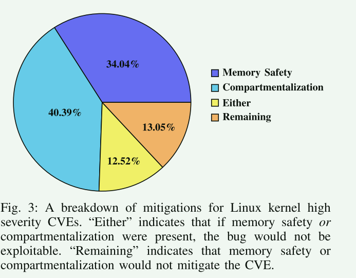

# Preventing Kernel Hacks with HAKC

> [!WARNING]
>
> 出于实际和历史原因，商品操作系统内核仍然是单体的。所有内核代码共用一个地址空间，以较高的处理器权限执行，并且基本上可以不受阻碍地访问所有数据，包括与完成特定任务无关的数据

> [!TIP]
>
> 应用最小特权原则（将可用资源仅限制为执行特定任务所需的资源）来划分内核将实现重大安全收益，类似于微内核，但无需进行重大的重新设计工作

**硬件辅助内核划分 (HAKC)(Hardware-Assisted Kernel Compartmentalization):**

HAKC将代码和数据划分为单独的分区，并为每个分区指定访问策略。 数据由单个分区拥有，并且分区的访问控制策略在运行时强制执行，以防止未经授权的数据访问。 当分区需要将控制流转移到自身外部时，数据所有权转移到目标，并在返回时转移回来。

HAKC 设计允许将代码和数据与内核的其余部分隔离，而在执行隔离代码时无需使用任何额外的可信计算基础。与之对应的，HAKC 依靠硬件来执行。

## 概述

随着内核规模和复杂性的增加，针对 Linu 发布的 CVE 数量也在不断增加。

可加载内核模块（LKM）是增加额外功能的机制，它为内核提供了一个天然的分隔边界。在运行时，LKM 与内核的其他部分之间存在明显的逻辑分隔，但内核的单片设计有效地消除了这种分隔。

**LKM 中的漏洞与其他内核漏洞一样严重，因为所有代码和数据都存在于相同的地址空间中，没有隔离，并且是在权限提升的情况下执行的。不幸的是，LKM 代码的大小和复杂性造成了比核心内核大得多的攻击面**

文章给了一个内核数据包清理例程漏洞，该漏洞可在不违反内存安全和控制流完整性的情况下触发。所以说现有的内存安全和控制流完整性等缓解措施在确保内核安全方面有一定作用，但要真正确保内核安全，还必须进行分隔。争对这个数据包的例子，将数据包过滤功能分隔开来，使可访问的内存仅限于开发人员想要访问的内存，这样即使在代码存在漏洞的情况下，也能防止这种只利用数据的漏洞。

现状：现有的内核保护措施主要有三种: 基于虚拟化、基于微内核或基于编译器

- 虚拟化和微内核防御提供了最强的保护，但性能最差，而且仍然依赖于额外的软件 TCB
- 编译器保护性能更高，但只能保护攻击面的一个子集，或经常被规避

HAKC 将代码和数据分割成包含开发人员指定的两者组合的分区，并将分区收集到更大的分组中以实现高效的策略执行:

- 为较大分组中的每个分区指定数据访问策略
  - 数据访问策略确保所有数据都属于一个分区，并且访问的数据符合为每个分区定义的数据访问策略
- 为较大分组指定控制策略
  - 控制转换策略检查间接控制流目标是否也符合分区集访问策略。 当控制流退出分区集时，数据所有权将转移到目标，然后在返回时恢复

通过这种方式，HAKC 优化并执行了安全的本地数据访问；相对于分区外的访问，分区内的代码和数据访问既安全又快速。不过，在分区之外定义的数据和代码也可以访问，但只有在明确需要时才能访问

**贡献**：

1. 用于定义细粒度分隔策略的分隔策略应用程序接口。
2. 基于硬件的实用分隔执行机制。
3. 在 ipv6.ko 和 nf_tables.ko LKM 上实施分隔策略
4. 对我们的分隔政策和执行所造成的开销进行广泛评估，证明其实用性。

## 背景和动机

### Pointer Authentication (PAC) 指针验证

PAC 实现了两个指令类，一个用于签名，一个用于验证签名指针。签名涉及指定要签名的指针、签名使用的密钥和 64 位签名上下文。**PAC 最初是为了减少代码重用和指针替换攻击而设计的，因为已签名的指针不再引用有效映射的内存，而无效修改的指针将无法通过未来的验证**。

要获得有效指针，必须使用相同的密钥和上下文对签名指针进行验证，如果指针、密钥和上下文与签名时使用的值相同，则会从指针上去除签名，恢复指针的原始值（假定有效）

### Memory Tagging Extension (MTE)

内存标记扩展（MTE）允许为内存区域分配 "颜色 "或标记，可用于将地址空间隔离为不同的区域。MTE 引入了两个指令类，一个用于为内存区域分配颜色，另一个用于检索内存地址的当前颜色

> [!NOTE]
>
> 只有 16 种颜色可供使用，内存地址必须对齐到 16 字节，要着色的区域不能小于 16 字节

**将 PAC 与 MTE 相结合，可以创建比可用颜色多得多的分区。颜色可以重复使用，但隔间使用 PAC 上下文进行保护，PAC 上下文是根据编译时已知的硬编码值和运行时检索的地址标签计算得出的，目的是防止重复使用的颜色导致虚假访问。**

### 内核漏洞

- 在我们数据集中的 567 个 CVE 中，229 个可以通过分隔来缓解，193 个可以通过内存安全来缓解。只有 71 个可以通过任一种防御机制来缓解，这意味着内存安全与分隔的重要性并存，当两者都启用时，保护的重叠程度很小。
- 有 73 个 CVE 无法通过分隔和内存安全来缓解，其中 57 个涉及不正确或缺失的特定领域逻辑，如丢弃返回的错误值或冷路径缺失数据有效性检查。其余未处理的 CVE 涉及竞赛条件（9 个）、整数溢出/溢出不足（8 个）和启用不支持功能的配置（1 个）

## 威胁模型和假设

与其他内核安全机制一样，我们假设攻击者没有 root 访问权限，因此无法修改内核模块。然而，他们可以采取任意行动，试图入侵受害内核模块，包括进行任意系统调用或让外设发送任意数据 。我们还假设 LKM 本身不是恶意的，但包含可利用的漏洞。受害者 LKM 之外的内核功能是可信源基础的一部分，我们假设来自内核的数据是有效的。信任传入 LKM 的数据可能会导致混乱代理攻击，但要防止这种攻击，需要对内核进行全面的代码和数据流分析。这种分析目前还不现实，因此我们要求内核成为受信任的代理（类似于微内核的受信任内核）。此外，我们还将核心 SoC 纳入可信计算基础，包括其标记和指针验证实现，但 IO 设备不属于我们的可信组件，可能是恶意的。不过，我们的硬件假设有三个例外，即直接内存访问 (DMA) 操作、硬件闪烁攻击  和侧信道攻击，如 Spectre 、Meltdown  或 Rowhammer 。

## 设计

HAKC 是围绕两个核心要素构建的：

1. 分区策略API（Compartmentalization Policy API）
2. 基于硬件的分区执行机制（Compartment Enforcement Mechanism）

### Compartmentalization Policy API

- 分区策略 API 允许开发人员将代码和全局变量分配给分区
- 堆栈和堆变量与分配它们的代码分配到同一个分区
- 分区策略还指定了分区之间允许的控制流。当控制流在隔间间转换时，任何所需的数据也会自动传输

两层分区：Clique 和 Compartment 

1. 能够用有限的颜色创建大量分区--克服了标签位数少的传统限制
2. 高效访问分区中定义的数据，即本地数据优化
3. 开发人员可以灵活地进行细粒度安全/性能权衡

当 Clique 执行时，指针访问的任何数据都必须满足两个条件：

1.  数据必须属于 Clique 所在的 Compartment
2. 数据必须属于当前 Clique 根据 Clique 访问策略允许访问的 Clique

在函数中首次解引用指针之前，运行时会对这些条件进行检查，但除非指针被修改，否则不会再进行检查。满足这两个条件可确保防止任意数据访问，并确保数据所有权得到执行

开发人员通过将代码和数据划分为一个或多个 Clique 来建立分区，确定每个特定 Clique 应合法访问哪些 Clique，以及哪些Compartment分区是有效的控制流目标。一个 Compartment 中的所有数据和代码必须完全属于一个 Clique，Clique 之间的有向边表示有效访问。有向边表示基于 Clique 的前向控制转移策略，不需要对称。

当控制流必须通过直接或间接函数调用退出隔层时，退出数据的所有权必须转移到目标目的地，然后在返回时恢复。这种转移可确保在小隔中的数据检查能按计划进行，从而保持有效的数据所有权。在间接函数调用的情况下，要对目标进行检查，确保其符合 Compartment 定义的有效转换策略，并确保目标是目标 Compartment 的有效入口。如果间接调用的目标在同一个 Compartment 内，则必须遵守当前 Clique 的访问策略，但数据所有权不会转移。控制流检查可确保遵循有效的控制路径，并防止任意代码的执行。

### Clique 

一个 Clique 恰好属于一个 Compartment，它将代码、全局数据、堆栈数据和动态分配的数据组合成一个逻辑组，所有这些数据都被分配了一种颜色，即 Cc。Cc 对于 Clique 所属的 Compartment 来说必须是唯一的，但并不需要是全局唯一的

### Compartment 

一个 Compartment 至少由一个 Clique 组成，但 Clique 的数量不得多于可用标签的数量 Ntag，并分配一个全局唯一标识符 IDn。任何 Clique 访问的所有数据都必须属于该分区，在指针验证过程中，标识符用于确保这一点

## 实现

HAKC 分区执行机制结合使用标记架构和加密哈希值来提供访问执行。也就是说 ，分区执行机制使用 Arm 的 MTE 提供标记支持，并使用 PAC 提供加密哈希算法。PAC 用于确保指针未被无意篡改，并符合为 Cliques 和 Compartments 定义的各种访问控制策略，而 MTE 则提供运行时 Clique 成员资格。通过将编译时已知的信息（如分区标识符和访问控制策略）与动态收集的 MTE 颜色相结合，HAKC 可以提供比本地提供的 16 个分区更多的分区粒度。

## 评估

1. HAKC 带来的开销是多少？
2. 在一个系统中使用多个舱室的开销是多少？
3. 在实际工作负载下，用户是否会注意到性能上的差异？

### 单个分区的开销

在最坏情况下，每秒请求数和传输速率都只降低了 20%。

- 当传输量较小时，相对于实际传输过程，TCP 连接的建立会带来很大的开销
- 一旦建立了 TCP 连接，传输有效载荷所需的数据检查相对较少。这就是 10MB 有效载荷测量开销低至 2%-4% 的原因；相对于总传输时间，较大的有效载荷在建立 TCP 连接时花费的时间较少

- 虽然每秒的操作次数要么增加要么保持不变，但每 KB 发送数据的操作次数随着有效载荷大小的增加而单调减少。

### 多个分区的开销

与单分区系统相比，性能会随着有效载荷大小的增加而降低。性能下降的原因是，内核在收到每个 TCP ACK 数据包时，都会进行额外的分区转换，以执行数据包过滤和 TCP 功能，而这个额外的转换超过了数据包增大带来的优势。

### 实际应用负载

无明显差距

### 漏洞阻止

可以有效地阻止一类攻击(非法内存访问，任意内存执行)

## 限制

- HAKC 无法阻止所有攻击。攻击者可能会找到一条有效的控制流路径，该路径遵守所有 Clique 和隔层访问策略，但允许破坏 Clique 中的数据。然而，被破坏的数据指针在被取消引用时不可能属于某个无效的 Clique，因此该漏洞造成的破坏仅限于隔层代码。
- 性能开销

