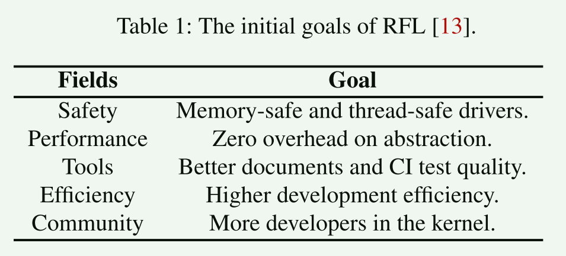
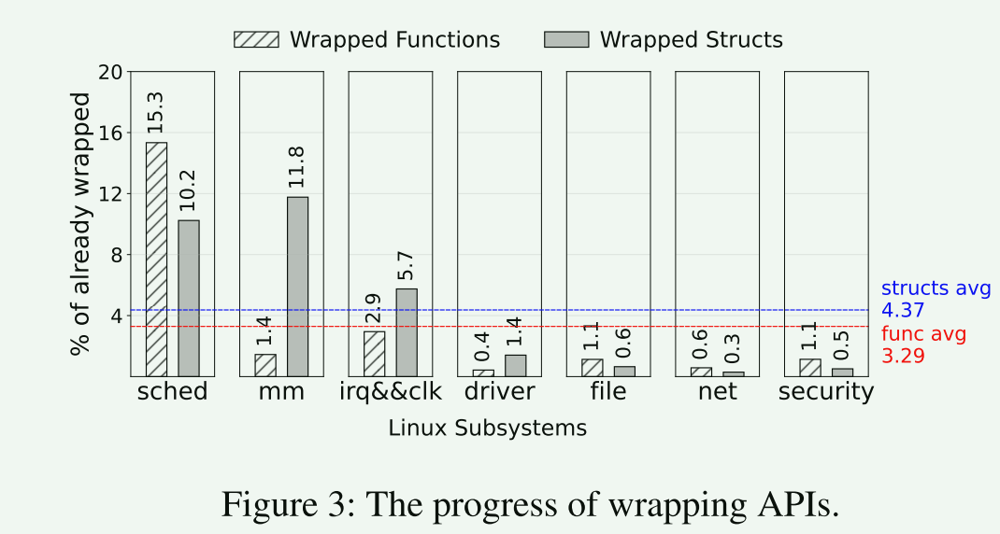
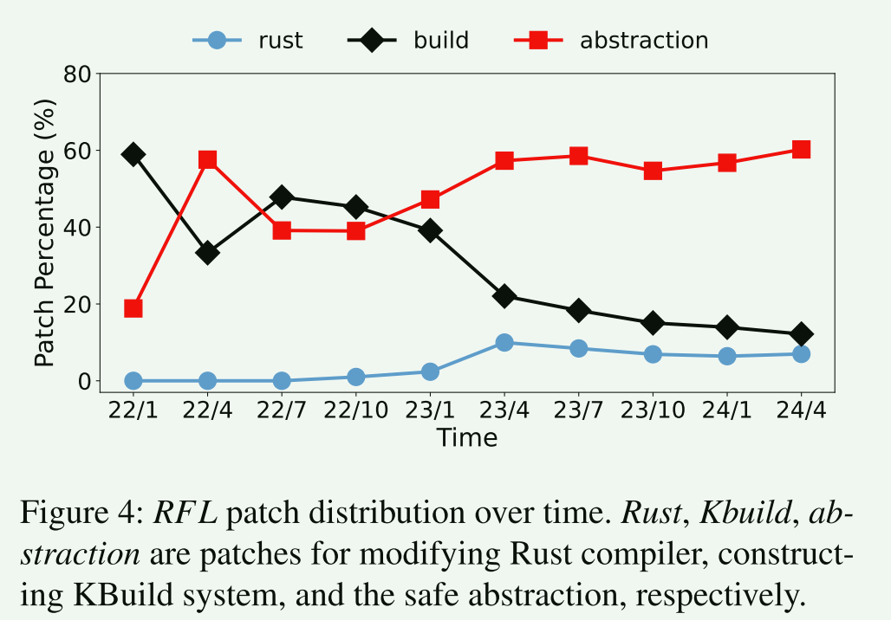
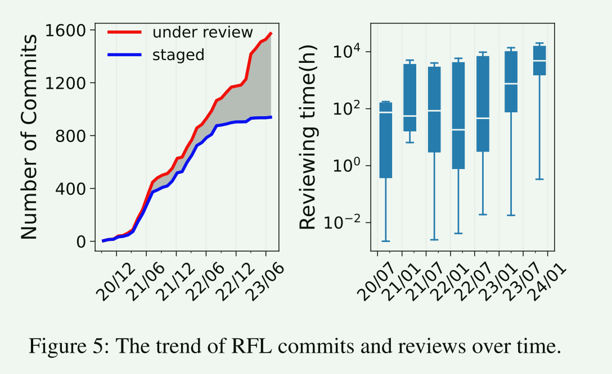
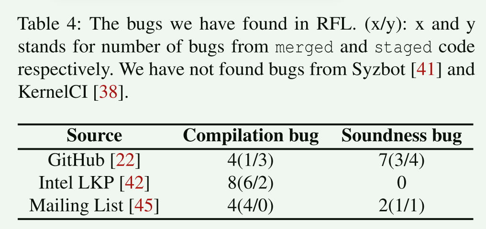
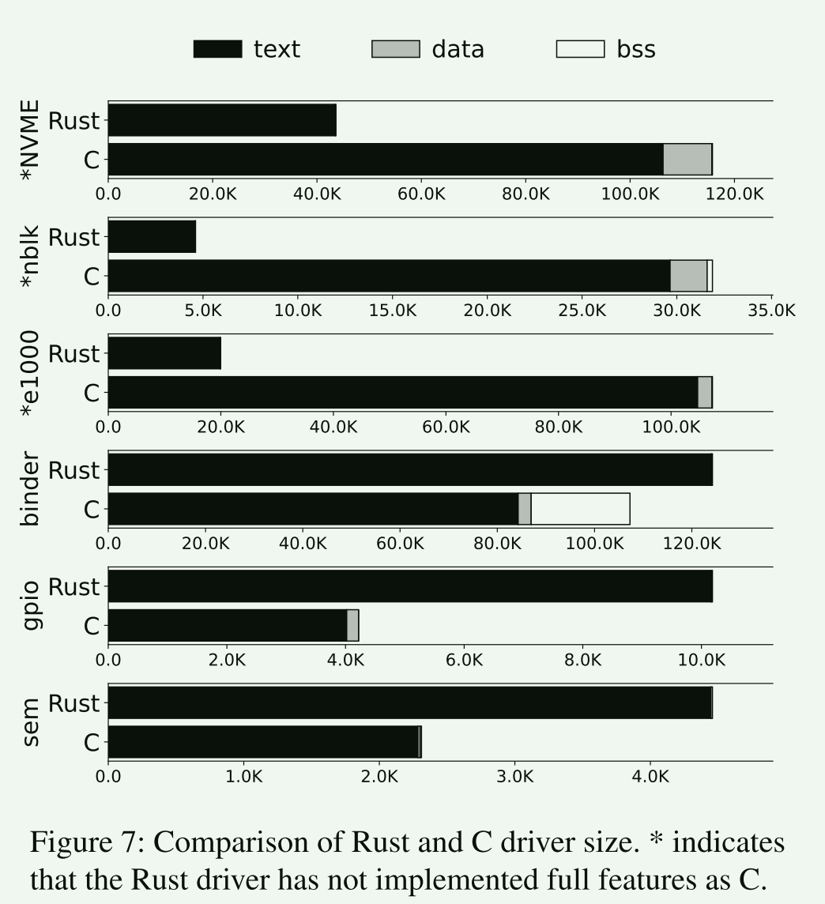
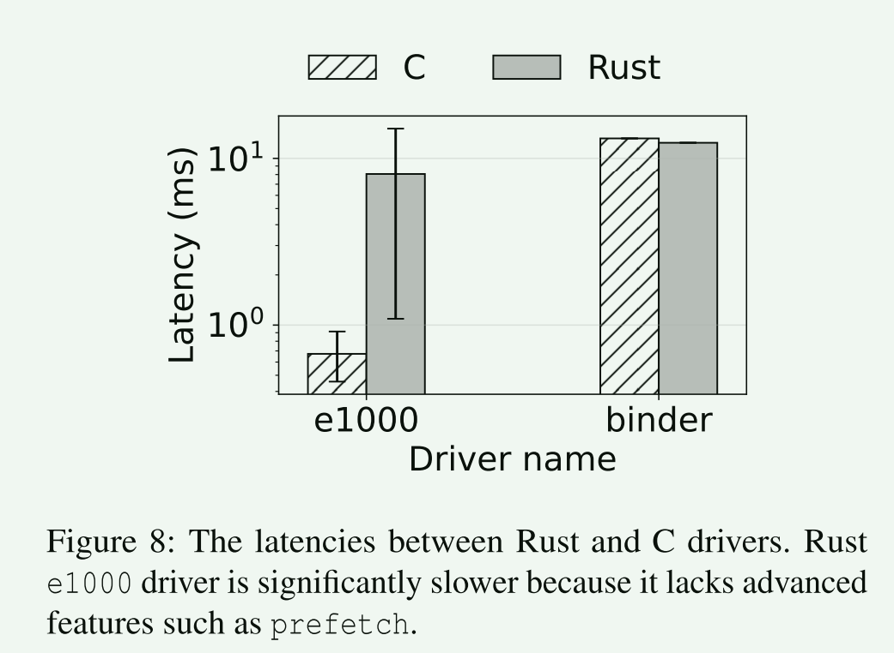
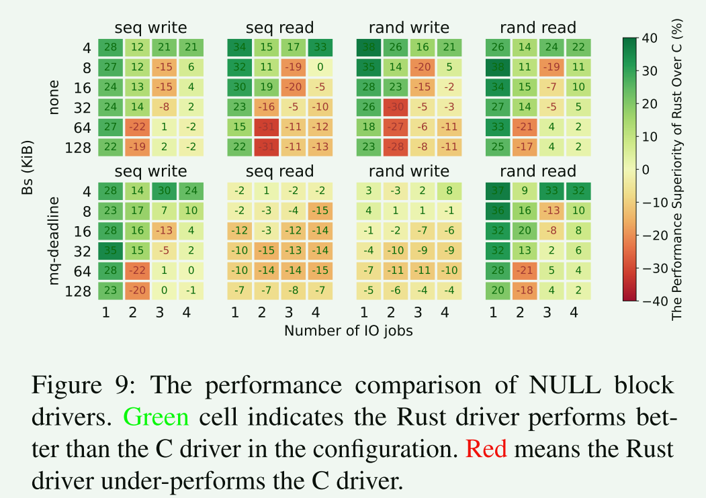
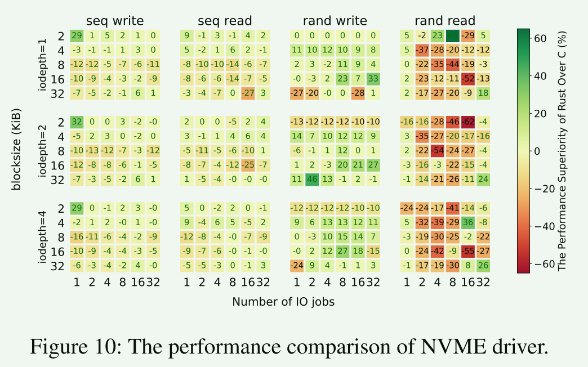
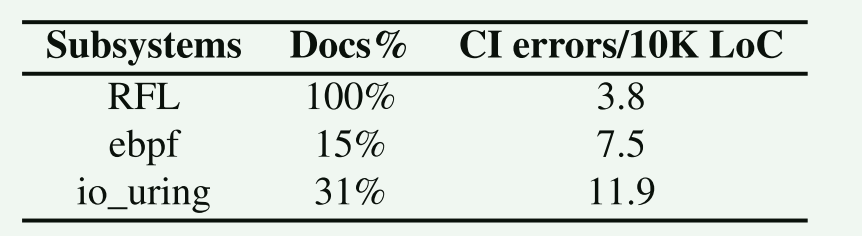

# An Empirical Study of Rust-for-Linux: The Success, Dissatisfaction, and Compromise

总结：文章发现，虽然Rust减轻了内核漏洞，但Rust无法完全消除它们。更重要的是，如果处理不当，其安全保证甚至会在运行时开销和开发工作方面给开发人员带来高昂的成本

## 概要

为了确保内存安全，同时又不能导致性能骤降。社区开始探索使用rust的解决方案。作为一种新兴的静态和强类型系统编程语言，Rust声称在没有运行时开销的情况下提供安全性和性能。

rust消除内存和并发错误的关键是其所有权机制：

1. 每个内存位置一次只能由一个变量独占;
2. 变量的所有权可以永久移动（即转移到其他变量）或通过线程内和线程间的引用临时借用
3. 一旦所有者超出作用域，其拥有的变量将被删除，其内存将被释放

**rust依赖广泛的静态检查在编译时执行这些规则，从而避免了开销过大的内存检查器和垃圾收集器**

本文回答了三个问题：

1. RFL的现状是什么？
   1. 虽然RFL的工具链（例如，Kbuild）基本上已经成熟，它缺乏主要的驱动程序和文件系统，这是一个缓慢的代码审查过程的瓶颈
   2. 尽管Rust Traits减轻了手动执行内核安全审计的重大负担，但它不是确认完全内存安全的银弹
      1. Rust和内核在内存操作上的不匹配导致了复杂的变通办法，这导致了运行时和开发开销
2. RFL是否达到了炒作的水平？：RLF是否达到了使内核更安全、开销更小、更容易的并发的目标
   1. 研究表明，由于在驱动程序开发中不可避免地会出现不安全的使用，Rust仅使内核更“可保护”，但并非完全安全
   2. 由于通用特性和智能指针的副作用，Rust驱动程序在某些情况下会导致大量icache未命中，并且在某些情况下明显逊色于C驱动程序
   3. Rust极大地提高了内核代码质量，并吸引了不熟悉C甚至不熟悉内核编程的新开发人员
3. 从RFL学到了什么？
   1. 对于开发人员，我们建议他们对Rust安全保证持保留态度，因为Rust安全规则不能检测语义错误，开发人员通常选择不安全作为最终手段
   2. 对于寻求将RFL范围扩展到未来内核子系统的社区，我们将内核子系统rustification的好处建模为安全增益（即Rust可能消除的错误）和工程工作之间的权衡

## A Primer on Rust in Linux

- 安全性
- 性能
- 工具：rustdoc and other
- 开发效率
- 社区

## RFL的现状是什么？

### 开发状态

内核的MM、IRQ、SCHED已经相对成熟，而各个驱动程序和文件系统正是rust大展拳脚的地方。

> RFL的大多数代码位于MM、SCHED中，而内核占比更大的驱动程序、文件系统等只收到很少的RFL代码

结果是合理的。由于调度、内存管理和IRQ子系统是所有驱动程序最常用的，因此优化RFL开发具有很高的价值和优先级。相比之下，驱动程序和文件系统具有更具体的用例（需要针对特定型号的设备），这需要更多的编程和审查工作。

- 随着时间的推移，Kbuild在RFL的份额明显衰退，表明RFL的基础已经奠定
- 安全抽象的代码占据了更多的部分，并逐渐从20%上升到60%

- RFL中处于staged阶段的代码逐步到达一个平稳的阶段，但是在开发的代码依然很活跃
- 右图中可以看出，随着时间的推移，PR审查变得明显变慢。这表明产生RFL代码的速度比消耗的速度快得多

导致出现这个现象的原因有多方面：

1. 缺乏熟悉rust和内核编程的评审人员
2. RFL和Linux子系统社区之间的协作约定不匹配，包括响应时间和审查周期。这种不匹配减缓了发展速度
3. RFL开发存在一个僵局：子系统社区不愿意在没有真实的Rust驱动程序作为激励示例的情况下审查关于安全抽象的补丁;然而，如果没有这样的抽象，RFL社区就无法在Rust中构建驱动程序

### 安全抽象

安全抽象是使Linux内核健壮化的关键因素，也是RFL代码中最大的部分。该层将C内核安全地扩展到Rust驱动程序中：它抽象内核数据结构和接口，以便在调用时它们仍然可以确保内存和线程安全。

1. rust需要变通以适应内核编程习惯
2. rust对内核数据结构的属性支持不完整

> 1. 内核以细粒度控制内存的主动性与Rust哲学相冲突，这会导致RFL的开销。
> 2. RFL使用helper类型将内核数据的管理委托给Rust，而将操作留给内核本身。

### rustify 驱动程序

1. 复杂的类型包装: `Pin<Box<SpinLock<Box<Ring<RxDesc>>>>>`
2. 实现的复杂度：驱动程序中使用某些独特的c魔法，在rust中需要经过很多封装才能做到
3. C语言中大量使用goto进行资源的集中清理，Rust的Drop特征简化了这个操作

## RFL是否达到了其声明的目标？

### 安全

- 在相关的代码中，rust的实现仍然包含错误：一些错误来自编译器，一些错误来自对内核代码的安全抽象
- 语言级支持帮助内核驱动程序修复现有错误并避免潜在的内存/并发错误
- 不安全代码是不可避免的，包含不安全的代码不一定意味中存在漏洞、
- rust并不是万金油，许多语义错误无法纠正

### 性能开销

- 具有完全实现的特性的Rust驱动程序明显大于C
  - Rust生成了额外的代码（99%）来支持C所不具备的独特功能：泛型编程，边界检查，生命周期管理等

- e1000相比c实现慢了11倍，但这可能是由于rust实现没有覆盖一些影响性能的功能
- 存储设备不相上下，不同的配置两者各有优略

什么导致了rust的性能下降：

1. Rust驱动程序中的锁是粗粒度的。尽管Rust将确保线程安全的责任卸载给了语言本身（即，通过规则），但它并没有减轻开发人员的高性能并发编程的负担。
2. Rust运行时检查访问数组（例如，边界检查）引入了额外的性能成本。Rust在内存密集型工作负载中表现不佳。
3. Rust使用模拟位字段。位字段访问通过数组访问来仿真。运行时边界检查进一步加剧了这种情况
4. Rust大量使用指针来共享对象的所有权，这会导致更高的缓存/TLB/分支未命中率。

什么导致了rust的性能上升：

1. 与C相比，Rust结构体的大小较小，这是由于使用了智能指针，而不是在结构体内部分配项内存。我们使用pahole来识别Rust结构体使用的缓存行比C少。
2. 与C相比，Rust驱动程序没有实现全部功能，因此可能会省略一些代码路径。

### 促进内核开发

1. 提高代码质量和可读性
2. 为Linux社区注入更多的年轻血液

## 经验教训

对于开发人员来书：

1. 不要将Rust内置检查器视为圣杯，而是利用其他综合分析工具（例如，RustBelt 和miri ）
2. 构建安全的内核抽象并从所有权的角度管理驱动程序资源，而不是像传统内核编程那样管理内存。在开始编程之前，在结构之间有明确的所有权关系。否则，在管理所有权时，由于错误使用智能指针而修复错误的成本将是非常巨大的
3. 接受不安全的使用作为最终手段。使用Rust安全规则利用内核内存操作通常涉及大量使用智能指针和泛型编程，这会导致大量的内存占用和开销