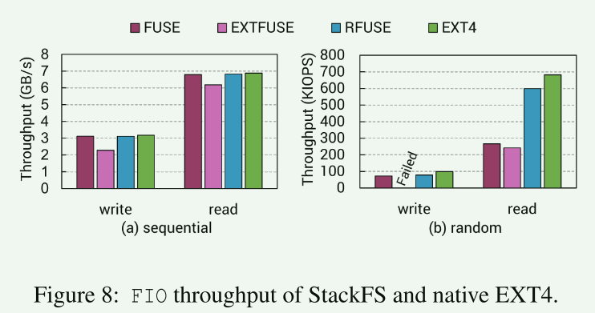

# RFUSE

会议：ATC2023

这是一篇改进fuse性能的文章。

## 研究背景

本篇文章的研究背景是关于FUSE（用户空间文件系统）的性能问题。FUSE允许非特权用户在不修改内核的情况下开发自己的文件系统。然而，FUSE的性能在现代硬件环境中面临一些挑战，特别是在具有大量核心和高性能设备的环境中。本文介绍了一种名为RFUSE的新型用户空间文件系统框架，旨在解决FUSE内部架构中的性能问题，并提供对现代硬件环境的改进支持。**RFUSE利用了一种称为环形缓冲区的数据结构来实现内核和用户空间之间的可扩展通信**。它具有可扩展的内核-用户空间通信、高效的请求传输和与现有基于FUSE的文件系统的完全兼容性等设计目标。通过一系列实验证明，RFUSE在现代硬件环境中能够显著降低通信延迟，并在大多数I/O工作负载中表现出更好的性能和可扩展性。

## Fuse存在的问题

- 多次上下文切换和数据拷贝带来的开销
- 内核中的单队列导致扩展性下降

- 在VFS层进行初次路径解析导致了多次上下文切换和lookup调用(72%)
- 内核和用户态的参数拷贝时间忽略不计
- 用户进程的延迟也占据了重要部分

- fuse的扩展性差

### 已有的改进

- Android12 引入了fuse直通的方法，将fuse请求直接传递到底下的文件系统，这种方法绕过了fuse守护程序，牺牲了fuse自定义用户空间文件系统的能力，只对于那些stackfs有效
- EXTFUSE利用ebpf的能力扩展了fuse框架，允许用户在内核中执行某些文件系统功能，这可以避免频繁的上下文切换。但是这种方法限制了开发人员必须在ebpf的约定下设计功能。[ATC2019]
- XFUSE提出增加多个通信通道来增加fuse的并行性。但这个并不能缓解锁争用的问题，同时上下文开销依然存在 [ATC2021]

==从研究趋势来看，针对fuse的改进一直在发展，通常在内核中添加文件系统是一件困难切缓慢的事情，而在用户态使用fuse编写用户态文件系统是一个很好的选择，但是fuse的性能是阻碍其进一步被广泛使用的罪魁祸首==

**为什么还需要改进？**

1. 大多数的改进侧重于增强内核和用户态的通信效率，但是这些方法仍然使用Fuse的单队列设计。
2. 需要开发者重新实现文件系统，与现有的fuse不再兼容

## 目标

1. 可扩展的内核-用户空间通信 
2. 高效的请求传输
3. 与现有基于 FUSE 的文件系统完全兼容

## 设计和实现

灵感来源：io_uring

- 使用per-cpu环形通道进行通信
  - 在fuse守护进程中环形通道将被映射到虚拟地址空间中，稍后守护进程与内核驱动直接通过共享内存进行通信，相比原来fuse中通过/dev/fuse进行通信，这大大降低了由于系统调用(read/write)带来的开销

- 对应于per-cpu通道，fuse守护进程会为每个通道创建工作线程，并将线程的亲和性设置为同一个cpu。为了避免单个核心上大量的线程争用，per-cpu通道会限制工作线程的数量。
- 混合轮询机制：原来的fuse中，用户程序在等待守护线程响应或者守护进程不再有处理的请求时会进入睡眠状态，直到唤醒事件到来，这会造成比较大的延迟。RFUSE支持轮询机制，以避免这种延迟，但是单纯的轮询会造成cpu资源浪费，因为一些操作会需要较长的时间响应，为了取得平衡，RFUSE限定了一个轮询时间，当超过这个时间还没有响应，则进入睡眠状态。
- 负载均衡
  - 当大量的异步请求到来时，由于RFUSE会根据请求的core id选择对应的通道，这会导致通道无法容纳如此多的请求。
  - 当观察到本地的队列满时 / 本地守护进程中的工作线程处于睡眠状态，会将请求迁移到其它核心上

- 内存占用合理
  - 250MB(80 core)
- 与fuse相同的接口

## 评估

对象：RFUSE/EXTFUSE/XFUSE/EXT4/NFS

- 延迟下降了53%
  - 消除了上下文切换开销
  - 混合轮询降低了唤醒开销

- 顺序读取和写入与EXT4相当的性能，因为这些数据已经在缓存中了
- EXTFUSE的开源版本中没有提供论文中所述的功能（直通）
- 随机读取RFUSE是FUSE的2.27倍：考虑到 4KB I/O 操作的执行时间通常很短，混合轮询有效降低了等待的时间

- 当线程数量较少时，内核和用户态之间的通信开销不可忽视。
- 在顺序读中，单个线程的RFUSE吞吐量低于FUSE：顺序读中出现预读，导致异步通道堵塞，这又会触发负载均衡算法， 因此只有一个线程时，由于需要重新分配请求，RFUSE出现了轻微的性能下降
- 随着线程数量的增大，RFUSE保持了更好的扩展性

- 在元数据操作测试中，RFUSE均表现出较好的性能，因为这些元数据操作时间很短，而RFUSE提供了混合轮询机制
- 工作负载 MRPL、MRPM 和 MRPH由于依赖VFS中的Cache，因此三者性能差异不大

- 实际应用负载中，RFUSE依然保持较好的性能优势

- 各个优化带来的性能提升

- RFUSE对CPU的利用率更高，因此也更快完成任务，
- 从能源消耗的角度来看，尽管 RFUSE 的架构基于混合轮询，但认为 RFUSE 消耗的能源较少或与 FUSE 相当。

## 启发

- 由于通信开销，即使在页面缓存和预读操作的帮助下，用更少的线程实现足够的吞吐量也具有挑战性

