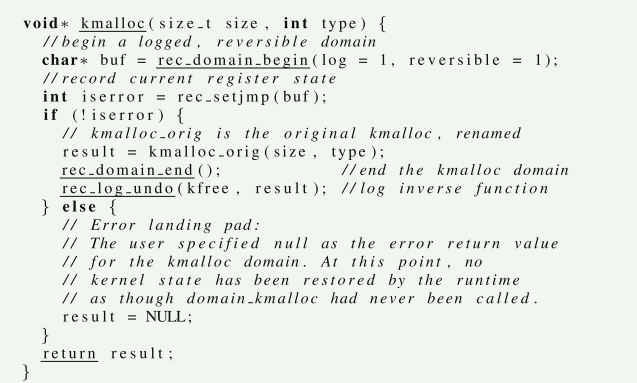
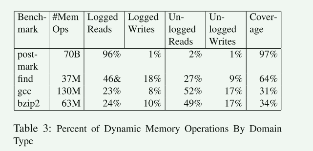
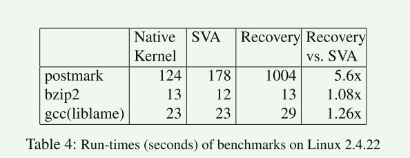

# Recovery Domains: An Organizing Principle for Recoverable Operating Systems

文章描述了一种策略，使现有的商用操作系统能够从内核几乎任何部分（包括核心内核组件）中的意外运行时错误中恢复。我们的方法是动态的、以请求为导向的；它将故障的影响隔离到导致故障的请求，而不是静态内核组件。

## 背景

商品操作系统是对于实现现代服务所需的高可用性至关重要的系统示例。**系统崩溃会导致低端嵌入式系统变得无响应，导致中端笔记本电脑和台式机系统丢失数据，并导致高端服务器系统发生昂贵的停机**。据估计，高端服务器系统的系统中断每小时会给公司造成数百万美元的损失。

现有的方法不能从核心内核组件的故障中自动恢复。 Nooks [23, 22] 和 SafeDrive [27] 通过干预驱动程序和内核其余部分之间的通信，为设备驱动程序提供故障隔离和恢复。然而，这两个系统都不能容忍内核其余部分的错误。

故障恢复的困难性：

1. 内核组件本质是多线程的，因为同一时刻可能存在多个线程运行在同一个组件中
2. 处理被多个客户端(用户进程)所共享的资源
3. significant output commit problems because they directly interface to hardware

文章提出了一种称为**恢复域**的的操作系统组织原则，以及基于该原则的名为 Akeso 的系统，该系统使复杂的多线程系统能够从几乎任意组件的运行时故障中恢复。

1. 面向请求，在请求级别处理故障恢复，比如系统调用或者中断，而不是在子系统或者组件级别
2. 将故障视为请求属性的观点与基于语言的恢复和驱动恢复不一样，这两种方法将故障视为静态代码区域或者瞬态的状态

为了提供面向请求的恢复，Akeso动态地将每个新请求绑定到一个新的恢复域。在执行此请求时，Akeso跟踪由请求引起的所有状态更改以及与其他恢复域形成的任何依赖关系(例如通过共享变量的并发访问)，以便在检测到故障后回滚所有潜在的故障状态。当发生故障时，Akeso使用日志记录和回滚技术[10,19,6]来删除由故障请求引起的所有状态更改，包括依赖恢复域所做的状态更改，从而自动将系统恢复到一致状态。

文章的方法类似于事务性内存(Transactional Memory, TM)系统，因为其使用日志记录和回滚来恢复故障时的系统状态

## 恢复语义

Akeso的目标是在面向请求的客户端系统中检测到故障时自动从意外故障中恢复。

通过自动回滚导致单个独立请求失败的计算和状态来实现故障恢复，这种技术有几个优点：

1. 细粒度的恢复
2. 自动化

### Recovery Domain

文章将系统根据代码分为recovery domain。恢复域是可组合的。在正常的执行期间，在一个域内发生的状态变化被记录下来，同时，不同域之间的数据依赖也被记录。

并非所有客户端代码(文章使用客户端泛指系统)都是可恢复的。 涉及显式输出提交的代码（例如实际磁盘写入或网络输出操作）无法回滚。 一些低级硬件交互（例如处理器调度）也可能难以回滚，具体取决于客户端设计。

如果在域内触发恢复事件，则该域通常会回滚，以便它看起来没有执行，并且依赖于该域的任何域（直接或间接）也会回滚。 这些依赖域可能位于其他线程上，从而有效地回滚所有依赖线程。 回滚域会撤消该域的状态修改，将堆栈和寄存器（包括程序计数器）恢复到该域的开头，然后执行为该域指定的任何操作，例如返回错误代码、重试操作、 或任何其他任意行为。

### 可预测语义

- 故障线程的执行流会返回到故障域的起始点
- 在故障域内执行的线程的内存和寄存器状态被恢复到故障域还没有被执行时的状态
- 如果其它线程当前所运行的域依赖这个故障域，那么其执行流回退到最初依赖故障域的位置

局限性：

1. 出现故障的线程(整个系统)可能看到无法回滚的低级硬件状态的更改
2. 无辜线程可能会因为对故障域的处理而产生错误，因为其它线程可能不会遇到错误，但被强制性打断。重启无辜线程可以缓解此类问题，但是没有实现

## 设计

### 异常事件和回滚恢复域

在回滚期间，所有处理器都暂停在已知状态，并且一个进程遍历故障域的依赖图，回滚任何依赖域。 线程的寄存器状态恢复到每个活动回滚域的域入口点，唯一的变化似乎是域入口指令返回了错误（这本质上是 setjmp 和 longjmp，但可能在当前线程之外的线程上运行）

## 实现

编译Pass+运行时

1. 第一个Pass： 第一遍将所有内存操作替换为对运行时例程的调用，这些例程将执行操作、记录操作并跟踪由操作引起的依赖性
2. 第二遍解释程序员提供的注释并将这些注释映射到低级注释序列，即域开始和域结束，以由第三遍处理
3. 第三遍将低级注释转换为设置和拆除保护域的操作，并使用 setjmp 创建域中止后控制流的着陆点

- 把函数包装成一个域，域的开始，记录程序的状态：寄存器现场信息
- 因为kmalloc是可逆的 这里会记录其逆过程，以便于当父域中止时恢复

运行时组件：

1. 保护域管理
   1. 保护域管理实现了多种数据结构，包括域堆栈、写入和逆操作日志以及域依赖图
2. 日志记录
3. 内存数据流检测
4. 回滚基础设施

## 评估

1. 恢复技术的理论覆盖范围
2. 从理论上覆盖的代码部分中注入的错误中恢复的能力
3. 内核正常（即无故障）执行期间产生的开销。

- 测量恢复域的覆盖范围，通过统计读写操作的数量

- 性能开销：系统调用密集型的postmark开销较大

## 参考文献

[22] M. Swift, M. Annamalai, B. Bershad, and H. Levy. Recovering device  drivers. In Proceedings of the 2004 Symposium on Operating Systems  Design and Implementation (OSDI), Nov 2004.

[23] M. Swift, B. Bershad, and H. Levy. Improving the reliability of  commodity operating systems. In Proceedings of the 19th Symposium on  Operating Systems Principles, New York, 2003.

[27] F. Zhou, J. Condit, Z. Anderson, I. Bagrak, R. Ennals, M. Harren, G.  Necula, and E. Brewer. Safedrive: Safe and recoverable extensions using  language-based techniques. In Proceedings of the 2006 Symposium on  Operating Systems Design and Implementation (OSDI), pages 45–60, Nov.  2006.

[26] J. Xu, B. Randell, A. Romanovsky, C. M. F. Rubira, and Z. Wu. Fault  tolerance in concurrent object-oriented software through coordinated  error recovery. In FTCS ’95: Proceedings of the Twenty-Fifth  International Symposium on FaultTolerant Computing, page 499,  Washington, DC, USA, 1995. IEEE Computer Society.

## 相关工作

一些编程语言扩展或编程模型的存在是为了尝试改进错误处理和错误返回路径的正确性。 Weimer 和 Necula [25] 扩展了 Java 异常处理程序，以拥有一堆“补偿”代码来释放在引发异常之前获取的资源。 辛纳尔等。 等人。 [20] 扩展 C# 的异常模型以支持内存撤消异常。 它们的语言扩展还支持用户定义的挂钩来撤消任意操作。 这两项工作都不处理跨多个线程的内存依赖性跟踪和回滚。

徐等人。 [26]描述了一种编程模型，可以实现并发面向对象程序的错误恢复。 它们定义了协作异常处理的机制，并且（像数据库系统一样）也利用底层语言中的事务进行恢复。 由于我们正在恢复用汇编语言和 C 语言编写的操作系统，因此我们既不能简单地扩展语言异常机制，也不能依赖某些编程风格。 **恢复域允许在恢复代码中执行更广泛的操作，例如 使整个磁盘缓存失效，而不是仅限于资源释放操作**。

## 收获

我们在讨论故障恢复的时候，可以对硬件触发的错误执行恢复，在异常处理期间，也可以恢复程序的状态。