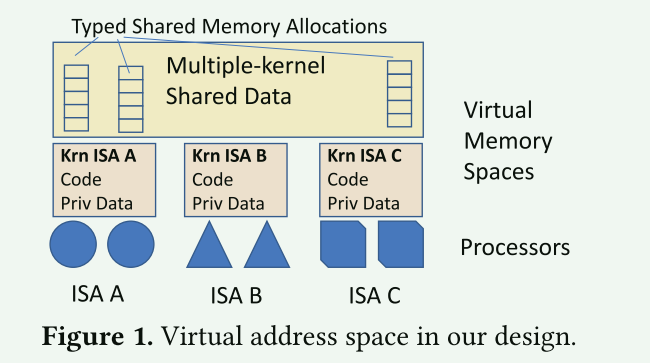
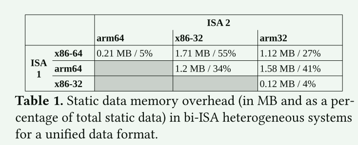

# Rethinking Communication in Multiple-kernel OSes for New Shared Memory Interconnects

未来的计算机平台可能会由大量片上和片外处理单元构建，这些处理单元可能具有不同的 ISA、支持操作系统，并以某种形式的一致性共享内存。 多内核操作系统（从多内核到单系统映像操作系统）已被证明可以有效管理此类平台，但它们的**基本原则是假设内核之间不共享内存**。本文提出了这样的设计，基于两个新的软件原语，解决最终异构计算单元之间的共享和数据格式差异问题：**类型共享内存和类型可变形的可执行代码**。

## 背景

在集成了多个处理单元（可能是异构处理单元）的平台上，经典的方法是为每组同构处理单元运行整个软件栈（SMP 操作系统和应用程序），这种情况下，操作系统是独立的，应用程序需要重写才能在它们之间运行。多内核操作系统设计，为每个（组）处理单元运行一个**内核实例**，同时**在所有实例中提供相同的操作系统和操作系统服务**，被证明是一种更通用的操作系统架构。

## 设计准则

多内核和经典 SMP 操作系统的中间点提出了一种新的操作系统设计：基于共享内存的多内核操作系统，它建立在两个设计原则之上：

1. 对于内核间通信，避免或尽量减少使用消息传递，因此更倾向于使用硬件实现的一致共享内存（与多内核相反）
2. 当处理具有不同格式和布局的相同数据时，与其保持代码原样并转换数据，不如反其道而行之：使代码适应数据格式。

### 内核间通信

**未来的计算机将在不同的处理单元之间提供一种一致的共享内存**。尽管消息传递代码被普遍认为在一致的共享内存上比共享内存代码具有更好的扩展性，但消息传递也有其不可忽视的开销来源：

- 在使用消息时，需要花费大量的时间来进行编译和解编译、序列化和反序列化，或者仅仅是转换数据，这可能会超过可扩展性带来的好处
- 很多人致力于解决共享内存的可扩展性问题，其中一些已被集成到经典的 SMP 操作系统中
- 在使用共享内存时，处理器是解耦的：如果不需要进行数据同步，它们可以以最小的开销对共享数据进行独立操作。使用消息时，即使没有同步，对数据的任何操作都会给发送方和接收方带来开销。

> 就性能而言，共享内存比消息传递更可取

在多内核的基础上使用共享内存，可以方便地将商品 SMP 操作系统应用于异构平台。目前这些平台必须重新设计为多内核操作系统：SMP 操作系统必须重写，以支持消息传递，这是当今多内核操作系统的标准通信方法。这种重写成本高昂，需要添加分布式协议以及处理每个数据结构的代码。**依靠一致的共享内存，移植商品 SMP 操作系统只需花费极少的精力**。

### 数据格式

第二项设计原则源于这样一种观察，即我们生产的大多数软件都有固定的数据格式和一成不变的可执行代码段。因此，以前在异构处理器之间迁移代码的方法主要是保持代码原样，并将数据调整为新格式，每次迁移都会产生大量开销。**关于编译器的工作声称，持续优化代码可能具有优势，因此可以在运行时更改可执行代码。更新代码而不是数据有望显著减少运行时的开销，尤其是在需要处理大量数据的情况下**

## 架构

- 透明(transparent)内核间共享内存，即类型化共享内存( typed shared memory )

- 类型可变形可执行代码(type-morphable executable code)

两个新的软件原语实现了上述设计原则，并共同实现了合约抽象(contract abstraction)。合约是描述内存区域格式的元数据，所有访问该内存区域的处理器都会根据合约遵守格式——每个处理器岛上的监督代码负责确保在其上运行的所有软件都遵守合约。

异构处理平台的特点是处理器的 ISA 和 ABI 各不相同，因此可执行代码、地址空间布局、数据约定等都不兼容。每种处理器都需要不同的内核可执行代码和特定处理器的处理方法。文章对**每个内核的地址空间都规定了私有部分和公共部分。后者包含与其他处理器共享的数据**。

在内核实例间共享数据结构的操作系统服务仍通过传统操作系统的内存分配器（如页面或slab分配器）分配内存。对这些分配器进行了扩展，增加了一个参数，代表要分配的内存对象的格式描述。对象描述在编译时产生，可以是任何格式。

- 当第一个内核（称为创建者）分配了一个特定的共享内存区域后，其他希望附加到该共享内存区域的内核就不必重新分配或重新初始化同一区域
- 扩展的内核加载器还支持共享全局变量（.bss、.data）
- 每个共享内存区域都由一个全局名称标识，共享内存上的内核可全局共享该名称的列表（包括区域描述）
- **当附加内核附加到共享内存区域时，它会首先检查对象格式。如果格式与代码编译时的格式不同，则必须在运行时更新访问数据的代码（访问代码），从而保持数据的原样。**

### 为什么不设计统一的数据格式？

- 统一数据格式可以强制执行 ，但要以内存开销为代价，以满足 ISA 组合的要求：需要为基元类型选择最大尺寸，为对齐约束选择最小公倍数

- 在考虑由 64 位和 32 位处理器组成的系统时，统一数据格式可能会增加大量内存占用（最多 55%）。这一开销也是一个下限，因为我们在本研究中只考虑大小而不考虑排列

### 编程模型

如果处理器岛之间的共享内存是一致的，那么在多内核操作系统中使用共享内存编程模型将是最理想的。然而，由于处理单元的异构性，内核之间不可能共享全部内存，例如，处理器特定的启动变量和例程就不应该共享。因此，该编程模型并非直接共享内存，而是采用了与 PGAS 相同的内存分割方法

### 类型化共享内存

类型化共享内存试图创建一种（共享）内存分配器，将数据格式与内存区域和全局名称联系起来。格式描述了准确的数据类型（含大小）、结构中的字段偏移、数组中的项偏移、数组的内存布局等。对这些内存的所有访问都必须执行指定的数据类型格式。类型化共享内存的数据类型格式是在创建时定义的，同时还有一个用于标记该区域的全局名称（哈希），以便附加内核可以查找并附加到该区域。当附加到一个类型化共享内存区域时，内核会收到访问该内存时必须使用的数据类型格式。文章使用DWARF作为数据格式描述

- 在类型化共享内存区域中使用的变量应由开发者用关键字 __typed 标记，这样编译器就会发出特殊代码并生成类型信息
- 为了便于使用，编译器可以插入自动转换例程，以便开发人员在同一对象的两个实例之间分别进行类型化和非类型化操作
- 为了安全起见，可以在指针访问时对类型变量进行检查

### 类型可变形可执行代码

为了支持运行时定义的数据格式，可执行代码必须在运行时进行更改/切换/适配，以遵守特定类型共享内存区域的已发布格式：填充/对齐、数据偏移、数据大小、数组内存布局等。

### 更多的内核间数据共享

进程管理：与进程管理相关的多个数据结构可以共享。例如，进程描述符（在 Linux 中为 task_struct）大多与体系结构无关，因此应该共享。这将便于维护在异构计算单元间迁移、生成或分布的线程状态

内存管理：共享一些与内存管理相关的数据结构（如虚拟内存区域描述符）将有助于不同的内核实例保持对 PGAS 虚拟地址空间的一致看法

统计和剖析： 共享与硬件性能计数器相关的数据结构有助于异构调度程序做出更合理的决策

IO 子系统： 共享 I/O 子系统的数据结构将大大有助于有效地向程序提供 I/O 资源的同构视图

## 实现

