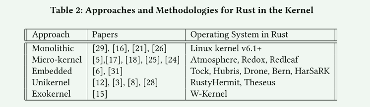

# Rusty Linux: Advances in Rust for Linux Kernel Development

## 简介

白宫国家网络主任办公室 (ONCD) 发布了一份报告，呼吁技术界通过双管齐下主动减少网络空间的攻击面 [30]。 首先，我们需要解决许多**最令人发指的网络攻击的根本原因：内存不安全的编程语言**。 其次，我们需要建立更好的网络安全质量指标，以便更好地了解网络安全形势。

在不断发展的软件开发领域，计算机系统的可靠性和安全性是所有相关方最关心的问题。 现代软件是通过构建越来越复杂的抽象来构建的，一个在另一个之上。 因此，**如果我们的目标是拥有一个安全的系统，我们必须开始剥离所有层并解决计算机科学中的基本抽象之一：编程语言**。 提供和加强内存安全的编程语言消除了所有类型的错误，例如缓冲区溢出、悬空指针和内存泄漏，这些错误与无数的安全漏洞和系统崩溃有关。

> [!NOTE]
>
> C 因其低级功能和性能效率而受到青睐，这对于内核开发至关重要。 然而，C 语言固有的内存安全性缺陷导致了许多安全漏洞，包括缓冲区溢出和释放后使用错误，这些漏洞几十年来一直困扰着操作系统的开发

研究的问题：

1. 用 Rust 实现操作系统内核的现有方法有哪些？
2. 使用 Rust 开发操作系统内核对性能有什么影响？
3. 在使用 Rust 开发操作系统内核时，有哪些主要挑战和限制？
4. 用 Rust 开发操作系统内核有哪些经验教训？

## 回答

### 用 Rust 实现操作系统内核的现有方法有哪些？

1. 第一种是全新方法，其中操作系统架构从头开始重新设计和构建，以充分利用 Rust 编程语言 [3, 6] [thesues,Tockos]
2. 第二种方法是将 Rust 增量集成到现有内核中，例如 Linux 内核 ,这种方法涉及使用 Rust 逐步重写或增强内核的特定组件，同时保持与现有 C 代码库的兼容性
3. 第三种是研究人员正在将现有的 C 内核移植到 Rust，然后评估差异

Boos 等人创建了一个名为Theseus的实验性操作系统，它在单一地址空间和单一特权级别上运行，并利用Rust编程语言的特性来实现隔离，而不是依赖于硬件。 这种新颖的方法将传统操作系统所扮演的一些角色推给了编译器。 Theseus 的设计采用了一种新颖的基于单元的结构，其中内存和资源的所有权由编译器强制执行，从而避免了运行时的这些检查，从而提高了性能。 除了内存安全之外，Theseus 的目标还在于解决状态溢出问题。 当操作系统中的单个服务可以隐藏因与其他服务交互而引起的状态更改时，就会发生状态溢出。 这种状态变化最终可能会在未来的某个时刻导致系统崩溃或系统不稳定，由于问题发生的时间和观察到的时间之间的分离，使得追踪问题变得非常困难。 Theseus OS 是一个旨在匹配 Rust 语言的操作系统，而不是更传统的匹配硬件的路线

### 使用 Rust 开发操作系统内核对性能有什么影响？

比较具有不同架构的不同系统之间的性能、吞吐量和延迟是非常困难的。 例如，一些用 Rust 编写的操作系统完全重新思考了操作系统的设计方式 ，而其他操作系统则完全在内核空间中运行

- TOCKOS的早期工作(原型) 降低了系统响应和中断响应时间3X
- 使用 Rust 编程语言实现了一个现有组件--Out ofMemory（OOM）的替代。未封装接口的 Rust 组件与原始 C 组件几乎完全相同，只带来了 0.7% 的开销。而封装的 Rust 组件则增加了 3% 的性能开销

### 挑战和限制？

与 C 语言等更传统的语言相比，用 Rust 开发操作系统内核会遇到一些独特的挑战和限制。这些挑战来自 Rust 严格的安全保证、其在系统编程中的应用相对较晚，以及内核开发固有的复杂性

| 挑战       | 描述                                                         |
| ---------- | ------------------------------------------------------------ |
| 二进制大小 | 根深蒂固的单态化增加了rust二进制的大小 编译器优化不如某些基于 C 语言的编译器成熟，因此增加了二进制文件的大小 隐藏数据结构和数据  次优编译器生成的支持代码 |
| 缺少的功能 | 支持具有任意数量参数的函数和闭包的特征边界 公开过程宏中的类型信息 支持无冲突、唯一的类型标识符 支持 Rust 的类型化汇编语言 支持可信构建环境 提供具有可扩展探测接口的纯软件堆栈防护 开发plain-old数据结构的零拷贝序列化 |
| 健全性     | 不同步的全局状态 - 任何可变静态的使用都是不安全的 C 风格抽象 - 使用 Rust 风格抽象来正确封装原始指针的内部不安全用法 给可变引用起别名 - 给出指向也可变引用的内存的原始指针 重新实现内存访问 - 最好创建和使用对整个区域的引用，而不是访问程序集中的特定内存区域 |
| panic      | 支持可扩展的 no_std 展开库 嵌入式环境中的堆栈展开       |
| C互操作    | 内核接口虽然是为了可扩展性而设计的，但并不是为了类型安全而设计的 混合代码流。 在用 C 和 Rust 编写的模块之间切换时，Rust 编译器无法跟踪所有权 |

减小二进制大小的措施：

1. 最小化通用代码的长度 + 实例
2. 慎用特质对象
3. 不要panic
4. 谨慎使用编译器生成的支持代码
5. 不要使用静态 mut

### 经验教训？

Klimt 等人详细介绍了实施 Theseus 时的经验教训和挑战。首先，他们发现**不可能用 100% 安全的 Rust 编写一个完整的操作系统**。例如，在编写内存管理系统时，必须使用原始指针来修改硬件。尽管硬件带来了限制，但作者描述了 Theseus 如何利用内部语言设计最大限度地发挥编译器在执行正确性方面的作用。通过利用 Rust 的类型系统和借用检查器的内存安全，可以在比 C 语言更高的级别上实现正确的所有权转移。作者还详细介绍了内部语言设计的一些局限性，例如由于类型系统可以执行的不变性有限，其表现力不如许多其他形式化验证技术。其中最重要的一条经验是，线性类型系统本身不能保证所代表资源的唯一性，例如当内存资源可能重叠时。作者提出了使用混合验证方法的想法，即同时利用线性类型系统和 SMT 解算器

## 总结

我们的审查表明，Rust 通过其所有权模型和严格的编译时检查对内存安全提供了强有力的保证，与传统的基于 C 的内核开发相比，具有引人注目的优势。 这些功能有可能减少缓冲区溢出和释放后使用错误等常见漏洞，这些漏洞在 C 语言中很普遍，并且在历史上曾导致严重的安全漏洞。 几个案例研究和原型实现表明，Rust 可以成功集成到内核中，提供更安全的接口并减少与内存相关的错误的发生率，而不会导致显着的性能损失。