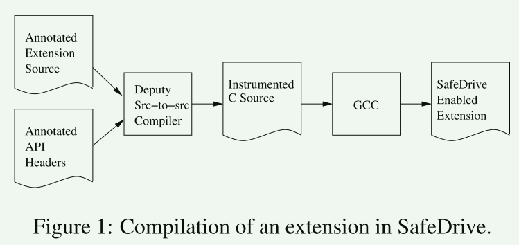
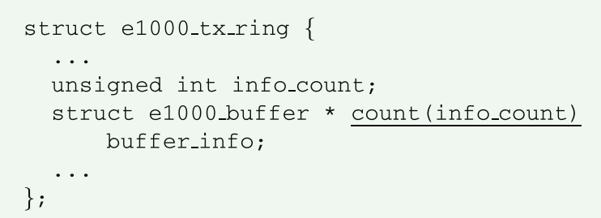
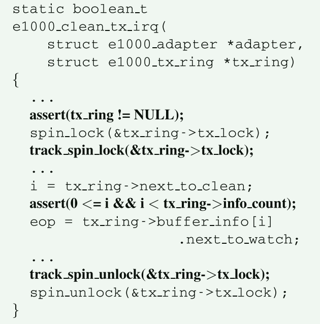
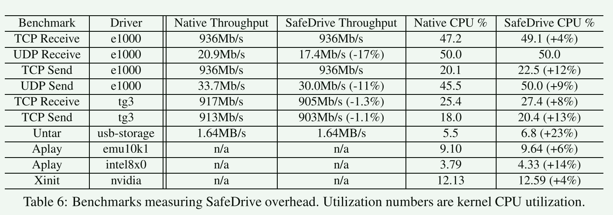

# SafeDrive

**Safe and Recoverable Extensions Using Language-Based Techniques**: 使用基于语言的技术进行安全且可恢复的扩展

## 问题

操作系统或者其它系统通常会提供可扩展机制，允许用户扩展系统功能。这些扩展通常会导致系统中不成比例的大量错误，并且扩展中的错误通常会导致整个系统出现问题。

文章主要聚焦于改善设备驱动程序的可靠性。之前的工作通过轻量级保护域来解决这个问题 [Nooks]，这种方法使用地址空间隔离，避免驱动程序错误访问内核其它内存。**但这种方法在驱动程序域内核的边界处成本较高**， 因为这一步需要改变内核页表。

## 目标

在不需要对系统核心进行重大更改的情况下提高可扩展系统的可靠性。

为此，我们必须隔离现有的扩展，最好不经过太多修改，在它们失败时恢复系统不变量，自动重新启动以确保可用性，并（理想情况下）恢复活动会话。

### 贡献

1. Fine-grained type-based isolation 基于类型的细粒度隔离
   1. 在指针级别检测内存和类型错误，之前的工作是在模块级别提高内存安全
   2. 与基于硬件的方法相比，还可以捕获那些违反类型安全但并不触发VM fault的错误
   3. 提供细粒度的错误报告以供调试
2. Lower overhead for isolation 低开销
3. Non-intrusive evolutionary design 非嵌入式设计，不需要实现新的隔离机制
4. Protection against buggy (but not malicious) extensions 保护有错误（但不是恶意）的扩展


SafeDrive 使用一种新颖的指针类型系统，称为 Vice，它可以确保大多数程序的内存安全，而无需使用胖指针，因此不需要更改数据布局或驱动程序 API。 **关键的见解是，大多数所需的指针边界信息已经存在于驱动程序代码或 API 中，只是不是以编译器当前理解的形式存在**。 Vice 使用类型注释（尤其是在 API 和共享结构的头文件中）来识别该信息已存在的位置。


## 设计




- 在 SafeDrive 中，隔离的可恢复扩展需要程序员、编译器和运行时系统的支持
  - 程序员负责插入描述指针边界的类型注释
  - 编译器使用这些注释插入适当的运行时检查
  - 运行时系统包含恢复子系统的实现





- 对于大多数的指针而言，其约束已经在定义的时候表示出来，safedriver的工作是显式地把这些约束应用到使用这些指针的位置(运行时检查)
- 如果这些断言中的任何一个失败，SafeDrive 都会调用恢复子系统，为了支持恢复，SafeDrive 插入代码来跟踪必须恢复的不变量。（第2/4条语句）


### 代理系统

代理(Deputy) 作为一个源代码->源代码的工具实现，其主要包含的工作是:

1. 为程序中每个未注释的指针推断边界注释<相当于帮开发者插入一些注释>
2. 类型检查。一旦所有指针具有代理注释，代理检查代码本身。它会在适当的地方发出错误和运行时检查。
3. 由于类型检查阶段生成了大量的运行时检查，Deputy专门的优化阶段被用来消除永远不会在运行时失败的检查，并识别在运行时肯定会失败的检查

#### 常见的代理类型

##### buffer

Vice 允许用户使用四种类型注释之一来指定指针的边界：safe、sentinel、count(n) 和bound(lo, hi)。在这些注释中，n、lo 和 hi 代表表达式： 可以引用紧邻范围内的其他变量或字段名称

```
 int * count(len) buf
```

- safe: 安全注释指示指针要么为空，要么指向基类型的单个元素。 此类指针是 C 程序中最常见的指针类型，它们通常只需要在解引用时进行空检查。
- sentinel：哨兵注释表明指针仅用于比较，而不用于解引用。 此注释通常用于紧随分配区域之后的指针
- count(n) 注释指示该指针要么为 null，要么指向至少包含 n 个元素的数组
- bound(lo, hi) 注释指示该指针或者为空，或者指向具有下限和上限为 lo 和 hi 的数组


```c
int * safe find(int * count(len) buf,int len) {
	assert(buf != 0);
	int * sentinel end = buf + len;
	int * bound(cur, end) cur = buf;
	while (cur < end) {
		assert(cur != 0 && cur < end);
		if (*cur == 0) return cur;
		cur++;
	}
	return NULL;
}
```

- 插入的运行时代码包含了大量检查，但这些检查是不必要的
- 优化器会删除部分不必要检查

##### Null termination

```c
count(5) nullterm
// 指针指向一个由五个元素组成的数组，后跟一个以 null 结尾的序列
```

##### Tagged unions

代理允许程序员声明联合的每个字段在何种条件下使用，以便在运行时验证这些条件，当访问联合的一个字段时。为此，程序员在联合的每个字段中添加注释`when(p)`，其中p是一个可以引用定义封闭范围内的变量或字段名称，并且可以使用任意无副作用的算术和逻辑运算符的谓词。

```c
struct e1000 option {
    enum {range option, list option} type;
    union {
        struct {
        	int min, max;
        } range when(type == range option);
        struct {
        	int nr;
        	struct e1000 opt list {...} *p;
        } list when(type == list option);
    } arg;
};
```


#### 特殊处理

代理类型系统期望在程序中的每个指针变量上看到指针绑定注释，以便插入检查。 然而，由于向每个指针类型添加注释会很困难并且会使代码变得混乱，因此 Vice 提供了一种简单的推理机制。

- 对于任何指针类型的局部变量以及任何到指针类型的转换，代理将插入两个新变量来显式保存该类型的边界
- 对于局部变量或强制类型转换中发现的指针类型以外的指针类型，代理要求程序员插入注释。 此类指针类型包括函数原型、结构体字段和全局变量。 需要这些注释是为了支持单独编译。

#### 限制

1. 表达能力不足
2. 不检查悬空指针,应该是说不关注内存释放的问题
3. 运行时检查可能会破坏原子性保证
4. 导致源代码调试困难


### 错误恢复

更新跟踪模块(update tracking module) 维护驱动程序对内核状态所做的所有更新的链接列表，如果驱动程序失败，则应撤消这些更新。**对于每个更新，该列表存储一个补偿操作，它是一个指向可以撤消原始更新的函数的指针，以及该补偿操作所需的任何数据。**

跟踪模块记录的更新分为两个独立的池，一个与驱动程序本身相关（长期更新），另一个与当前CPU和控制路径相关（短期更新）


**故障**通过插入的运行时检查检测，出现故障时：

1. 打印导致错误的原因
2. SafeDrive 通过一系列步骤来清理驱动程序模块本身，恢复内核状态并可选择地重新启动驱动程序，同时允许系统的其他部分继续运行。 我们在恢复过程中保持两个不变量，这两个不变量对于恢复的成功至关重要
   1. 从检测到故障到恢复完成期间不执行任何驱动程序代码     
   2. 没有内核函数被强制停止并提前返回。 从内核函数强制返回会破坏内核状态。 另一方面，失败的驱动程序函数总是被强制停止，以维持第一个不变量。

从驱动程序函数“强制返回”的基本机制是 setjmp()/longjump() 变体，它展开堆栈并直接跳转到 setjmp() 之后的下一条指令。

1. 在驱动程序入口点，SafeDrive 添加了一个标准包装存根，该存根调用 setjmp() 将上下文存储在当前任务结构（Linux 的内核线程数据结构）中
2. 当发生故障时，故障处理代码将调用 longjmp() 返回到包装器，然后包装器使用预先指定的返回值将控制权返回给内核，通常指示临时错误或繁忙情况
3. 故障处理代码还设置一个标志，指示驱动程序处于“故障”状态。 在每个包装器存根处检查此标志，以确保将来对驱动程序的任何调用都将立即返回，从而保留不变式 1。

这个处理被后面的文章所使用 [redleaf os]。我们的工作中也使用了这种方法，但更灵活

这里需要处理的一个棘手的问题是：**驱动程序可能会调用内核部分，而内核部分又再次调用驱动程序代码**。

 **如果我们跳转到初始驱动程序入口点，我们会跳过交错堆栈帧中的重要内核代码，从而违反了不变式 2。但是，如果我们跳转到最近的内核堆栈帧，则必须确保当我们返回到失败时保持不变式 1。**


**恢复内核状态并重启驱动**。驱动对内核所做的更新通过存储的补偿函数撤销。

这些补偿会撤消驱动程序迄今为止对内核所做的所有状态更改，类似于 C++ 和 Java 等语言中的异常处理。 我们的方法与 C++/Java 异常之间的主要区别在于，补偿代码不包含扩展本身的任何代码，因此保留了不变量 1。这里即使执行驱动本身的代码释放这些资源也是可行的。

在c++或者rust这样的高级语言中，如果程序出现异常，我们可以通过堆栈展开释放其资源。但是c语言中没有这样的机制。Thesues论文正是利用这种机制保证了系统的可用性。这里的解决方案应该是避免驱动程序破坏内核核心部分的状态，驱动程序只通过最小接口向内核请求服务，并自包含程序逻辑。


## 评估




-  UDP 测试显示较高的开销可能是由于两个原因。 首先，数据包要小得多，从而导致总体上有更多的代理开销。 其次，与 TCP 相比，UDP 处理涉及的其他内核代码更少，从而增加了 SafeDrive 的开销。
- 即使对于数据密集型驱动程序，SafeDrive 也具有相对较低的性能开销


## 总结

后续的文章应该有借鉴这篇文章的核心思想：比如Redleaf的基于语言机制的隔离方法以及Thesues的模块更新

这篇文章是讨论基于语言注释的技术，在源代码层面插入运行时检查的代码来提高驱动程序的安全性和稳定性。除此之外，文章还提出了故障恢复的方案，以解决当驱动程序发生故障时如何恢复的问题。


