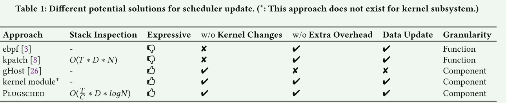
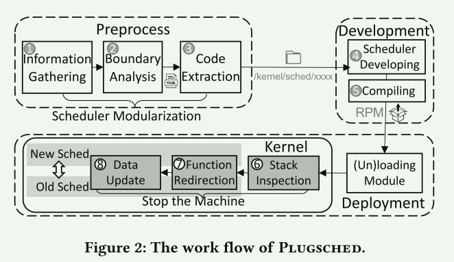
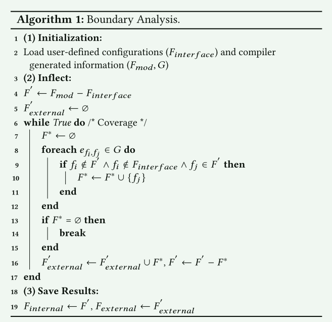
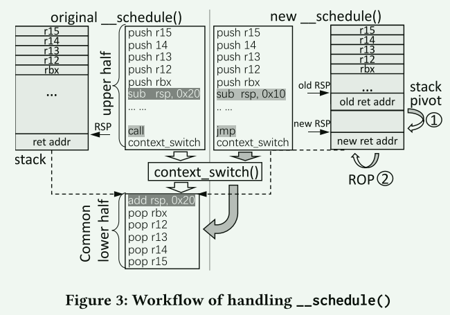
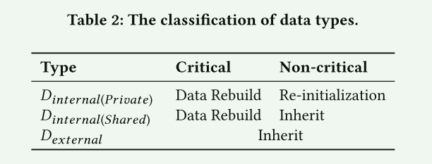
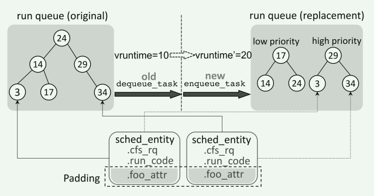

# Efficient Scheduler Live Update for Linux Kernel with Modularization

**Target**： live update kernel scheduler

本文介绍了Plugsched，一个安全高效的开源系统，可以实现内核调度器的实时更新。Plugsched具有两个关键创新点，即调度器模块化和数据重建。调度器模块化可以将调度器与内核解耦，为实时更新提供前提条件。数据重建可以将旧调度器的数据状态迁移到新调度器，确保调度的正确性。通过这样的通用解决方案，调度器可以根据特定场景进行定制，并支持集成任何新的特性。实验结果表明，Plugsched能够正确地修补、更新或替换调度器，并且在更新过程中的停机时间较短。

## Problem

Linux内核调度器是一个基本且复杂的子系统，它决定了何时切换进程以实现抢占式多任务处理。然而，由于不同应用程序对调度器的需求不同，因此需要能够定制化调度策略以提高性能。目前更新调度器的方法通常需要重新编译内核并重新启动操作系统，这会导致长时间的停机.

- 现有的patch方法无法应用复杂的更新
- 一些支持组件级别更新的又不适用于linux系统（依赖VM 或者 适用于微内核架构）

## Two keys

### scheduler modularization

模块化允许调度程序与内核解耦，这是实时更新的前提

### data rebuild

We observe that the data structure states in the scheduler can be reconstructed via two stable APIs that manipulates the run queue and task structure.

对于调度器来说，最核心的操作就是任务队列的管理和task元数据

### Four design paradigms

1. 利用内核调用图来识别调度器和内核其它子系统的边界，使用gcc插件将调度器相关代码提取到子目录作为新调度器的基础代码
2. 为了减少停机时间，Plugsched从两个维度充分利用多核，优化了堆栈检查方法
3. Plugsched 替换了原始功能的序言并重定向到新功能。 为了处理无法直接替换的上下文切换逻辑（即 \__schedule()），Plugsched 使用 stack-pivot 和 ROP 拆分 __schedule() 函数
4. Plugsched 提出了一种基于重建的方法来处理数据状态迁移

## Design and implementation

### Goals

1. Adequate expressiveness 足够的表现力
2. High generality 高通用性
3. Achieve both short downtime and safety 低延迟和安全
4. Easy-to-use 易于使用

### workflow

1. 预处理阶段
   1. 预处理阶段，使用根据内核版本手动生成的配置，Plugsched 在编译阶段自动收集调度程序相关信息，例如函数和数据的符号
   2. 运行边界分析算法来确定调度器和内核之间的清晰边界，并将函数进一步细分为内部函数( internal functions)、接口函数( interface functions)和外部函数(external functions
   3. 代码提取阶段，Plugsched通过代码生成技术将调度器相关代码（例如内部函数和接口函数）重新组织到单独的目录中，并将调度器解耦到新的模块
2. 开发阶段
   1. 开发者可以自由开发调度器或集成新功能，然后编译新的调度器生成RPM包)
3. 部署阶段：Plugsched 应该找到一个安全的机会（也称为静止状态）来用新的调度程序替换原来的调度程序
   1. Plugsched 调用 stop_machine 来停止所有线程。 然后Plugsched使用堆栈检查来检查所有内核堆栈并检查是否存在不安全线程、
   2. 栈检查完成后，Plugsched 替换原始函数的序言指令以**重定向到新函数**
   3. 同时，Plugsched 将数据从旧调度程序迁移到新调度程序（基于重建的方法）
   4. 从stop_machine返回后，原始调度器被绕过

### How scheduler modularization

模块的边界以函数为粒度

**(𝐹𝑠𝑐ℎ𝑒𝑑𝑢𝑙𝑒𝑟 = 𝐹𝑖𝑛𝑡𝑒𝑟𝑓𝑎𝑐𝑒 ∪ 𝐹𝑖𝑛𝑡𝑒𝑟𝑛𝑎𝑙 = 𝐹 − 𝐹𝑒𝑥𝑡𝑒𝑟𝑛𝑎𝑙 )**

所有数据（𝐷）可以细分为两种类型：内部数据**（𝐷𝑖𝑛𝑡𝑒𝑟𝑛𝑎𝑙）**和外部数据**（𝐷𝑒𝑥𝑡𝑒𝑟𝑛𝑎𝑙）**

边界的定义遵循三个原则：

1. 易于维护：开发者只需维护调度器模块中定义的𝐹𝑖𝑛𝑡𝑒𝑟𝑓𝑎𝑐𝑒和𝐷𝑖𝑛𝑡𝑒𝑟𝑛𝑎𝑙集合即可
2. 收敛性：边界应与指定的 𝐹𝑖𝑛𝑡𝑒𝑟𝑓𝑎𝑐𝑒 收敛
3. **闭包： 调度器是一个闭包，这意味着内核只能通过 𝐹𝑖𝑛𝑡𝑒𝑟𝑓𝑎𝑐𝑒 与调度器交互**

#### information gathering

需要几个基本配置作为模块化的输入，主要包括调度器模块的调度器文件名、接口函数（𝐹𝑖𝑛𝑡𝑒𝑟𝑓𝑎𝑐𝑒）和内部数据𝐷𝑖𝑛𝑡𝑒𝑟𝑛𝑎𝑙

在编译过程中，Plugsched 使用 GCC Plugin 来收集必要的编译信息以进行边界确定。 该编译信息主要包含函数和全局变量的属性，包括名称、位置、签名、属性、范围和源文件名； 内核调用图（𝐺）。

#### Boundary Analysis

使用图算法找到所有的外部函数$F_{internal}$，内部函数$F_{external}$

#### Code Extraction

本质上，代码提取是一种代码生成技术，用于提取和修改调度器相关源代码。 利用信息收集阶段提供的位置信息和边界分析阶段提供的边界信息，Plugsched利用GCC插件将新调度器模块的基础代码生成到一个新目录中，作为开发人员的工作目录。

1. 对于原始调度程序文件中的𝐹𝑒𝑥𝑡𝑒𝑟𝑛𝑎𝑙，Plugsched 通过删除整个函数体并添加额外的结尾语法“;”将函数定义转换为函数声明
2.  对于 𝐷𝑒𝑥𝑡𝑒𝑟𝑛𝑎𝑙 ，Plugsched 通过引用 GCC 插件提供的 VarDecl::str_decl 将数据定义转换为数据声明
3. 对于 𝐹𝑖𝑛𝑡𝑒𝑟𝑓𝑎𝑐𝑒 、 𝐹𝑖𝑛𝑡𝑒𝑟𝑛𝑎𝑙 和 𝐷𝑖𝑛𝑡𝑒𝑟𝑛𝑎𝑙 ，Plugsched 只是将其代码复制并粘贴到新文件中

### How data rebuild

#### stack inspection

在升级/回滚调度程序之前，Plugsched 需要检查所有线程的调用堆栈，以**查看是否有任何线程仍属于旧函数的文本范围内**.大多数补丁工具（kpatch ）总是使用 Linux 的 stop_machine 工具让所有 CPU 内核进入静止状态 .

**优化措施**：

1. 任务并行： 多个核心同时检查
2. 快速检查： 二分查找

#### Function redirection

**Plugsched将原函数的序言指令替换为JMP指令，操作数为新函数的起始地址。原始函数可以重定向到新的代码片段**。

开发人员应该确定哪些功能需要重定向。 之前的作品（例如 Ksplice ）会比较前目标代码和后目标代码，以确定补丁更改了哪些功能。在Plugsched中，**边界是确定的，因此我们只需要更新位于边界内的接口函 𝐹𝑖𝑛𝑡𝑒𝑟𝑓𝑎𝑐𝑒**。

特殊的`__sechedule()函数`

`__schedule`不仅实现了选择下一个运行任务的算法，还实现了上下文切换，这是linux内核调度器的两个核心部分。 一般方法无法替换` __schedule`

 这段方法不太理解，可能得再看看

#### Data update

调度程序中的大多数数据（包括数据结构和全局变量）都是有状态的。 为了对内核持续保持透明，必须将原始状态迁移到新更新的调度程序。

**𝐷𝑒𝑥𝑡𝑒𝑟𝑛𝑎𝑙** 

（通常是全局变量）外部数据已经被转换为声明，新的调度程序将其引用到原始符号。为了保持语义的一致性，Plugsched 不允许开发人员对 𝐷𝑒𝑥𝑡𝑒𝑟𝑛𝑎𝑙 进行任何更改。

**𝐷𝑖𝑛𝑡𝑒𝑟𝑛𝑎𝑙**

由于𝐷𝑖𝑛𝑡𝑒𝑟𝑛𝑎𝑙仅在调度器内部使用，因此Plugsched允许开发者灵活修改数据。

 Plugsched 将𝐷𝑖𝑛𝑡𝑒𝑟𝑛𝑎𝑙细分为

私有数据（𝐷𝑖𝑛𝑡𝑒𝑟𝑛𝑎𝑙（𝑃𝑟𝑖𝑣𝑎𝑡𝑒））： 私有数据被定义为在新的调度器模块内独立分配内存

共享数据（𝐷 𝑖𝑛𝑡𝑒𝑟𝑛𝑎𝑙（𝑆ℎ𝑎𝑟𝑒𝑑））：共享数据在新的调度器模块和内核中的原始调度器之间共享内存

对于**关键数据**，无论是私有数据还是共享数据，Plugsched 都使用**数据重建技术从头开始构建新调度程序的状态**。 对于非关键数据，如果数据在原始调度程序和新调度程序之间共享，则它会继承原始调度程序的状态，而无需额外处理。 否则，私有数据应在新调度程序中重新初始化为当前值。

**Data rebuild example**

## Correctness Verification

1. function test
2. data test 

## EVALUATION

