# Securing the Device Drivers of Your Embedded Systems: Framework and Prototype

由 Linux 驱动的嵌入式或物联网系统上的设备驱动程序在内核空间中执行，因此必须完全可信。驱动程序中的任何故障都可能严重影响整个系统。第三方嵌入式硬件制造商通常随其嵌入式设备附带其专有设备驱动程序。 由于缺乏代码审计，这些树外设备驱动程序通常质量较差。

本文提出了一种新方法，帮助第三方开发人员在不修改内核的情况下提高设备驱动程序的可靠性和安全性：用一种名为 Rust 的内存安全编程语言重写设备驱动程序。

Rust 严格的语言模型可以帮助设备驱动程序开发人员在编译时检测到许多安全问题。我们设计了一个框架，帮助开发人员用 Rust 快速构建设备驱动程序。我们还利用 Rust 的安全特性为开发人员提供了几个有用的基础架构，使他们可以轻松处理内核内存分配和并发管理，同时，一些常见的 bug（如 use-after-free）也可以得到缓解。我们通过在 Raspberry Pi 3 上实现一个实际设备驱动程序来证明我们框架的通用性，评估结果表明，我们框架生成的设备驱动程序的二进制大小对于典型嵌入式系统来说是可以接受的，运行时开销也可以忽略不计。

## 概述

设备驱动程序已成为计算系统复杂性和漏洞的最重要来源之一。 设备驱动程序占 Linux 内核代码库的 60% 以上[1]。 最近的研究还表明，设备驱动程序比内核中的其他代码更容易受到攻击。 使情况变得更加复杂的是，Linux 内核的整体架构意味着驱动程序将使用内核权限运行，并且可以做任何它想做的事情。 对于树外第三方驱动程序来说，这种情况会变得更糟，因为它们可能没有受到足够的审查，并且通常质量较低。2016 年，Google 报告称，大约 85% 的 Android 内核错误发生在供应商驱动程序中[13]。为了解决这个问题，人们提出了许多研究项目，例如基于硬件的隔离[14]、基于软件的隔离[11]、基于语言的隔离[17]、微内核架构[8] [6]、用户空间设备驱动程序 [1]等。然而，尽管这些技术可以保护设备驱动程序免受常见攻击，但它们要么需要修改内核，要么需要额外的硬件支持。 其中一些提出的方法甚至具有不可接受的开销。

在本文中，我们提出了一种保护设备驱动程序的新方法：使用名为 Rust 的安全编程语言。 这个想法是**利用 Rust 编译器强大的类型系统来防止设备驱动程序开发人员犯错误**，从而成为黑客利用的攻击媒介。 由于大多数安全检查是在编译时完成的，因此**可以在部署驱动程序之前检测到许多错误**，同时，该方法**引入的运行时开销可以忽略不计，并且不需要修改内核**。

- 编译器强大的类型系统带来更高级的抽象，同时允许对程序行为进行约束
- 许多错误可以在编译时发现
- 运行时开销较小
- 不需要修改内核或者特殊硬件

**贡献**

1. Methodology：我们提出了一种新方法来缓解 Linux 设备驱动程序开发中的常见安全问题。 我们的方法对于第三方硬件制造商在不修改 Linux 内核的情况下开发可靠、安全、运行时开销低的设备驱动程序大有裨益
2. Implementation：我们实现了一个框架，帮助开发人员在 Rust 中构建 Linux 设备驱动程序。 该框架集成了Rust的包管理器（即Cargo）和Linux内核的构建系统（即Kbuild），并为开发人员提供了几个有用的库来轻松管理内核内存和处理同步等。我们还实现了一个真实世界 LAN9512（USB 转以太网控制器）的设备驱动程序，以表明我们的框架足以满足实际需求。
3. Security：讨论 Linux 设备驱动程序中的常见安全问题，并证明 Rust 可以帮助程序员消除或减轻开发过程中的多个漏洞。
4. Evaluation: 设计并执行多个基准测试来测试我们基于框架实现的设备驱动程序。 结果表明，Rust 编译器能够为嵌入式系统生成具有可接受的二进制大小的内核模块，并且用 Rust 编写设备驱动程序所产生的运行时开销可以忽略不计。

## 背景知识

**内核模块：以驱动为例**

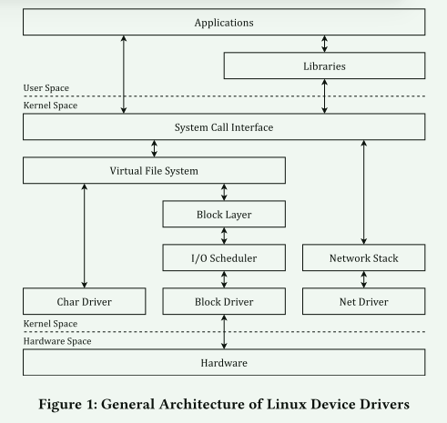

设备驱动程序起着与硬件通信的作用，因此应用程序只需要与内核提供的系统调用接口进行交互。 这样，虽然实际中有很多不同的设备，但它们都实现了内核提供的统一接口，使得它们之间的差异对用户来说是透明的。 编写设备驱动程序涉及为目标设备定义多个“回调函数”并将它们注册到内核。 当内核需要操作这个设备时，就会调用相应的回调函数。 此外，开发人员经常利用内核中定义的函数和数据结构，并在其他模块或子系统之上构建设备驱动程序。

编写一个“safe 安全”的设备驱动程序并非易事。 宏内核架构意味着整个内核，包括核心内核和设备驱动程序，都以相同的特权级别运行在相同的地址空间中。 这意味着**没有任何机制可以防止驱动程序错误地调用内核函数或操作关键内核内存，这可能会导致内核恐慌 panic**.

设备驱动程序中发生的典型错误包括：不正确的边界检查、空指针取消引用、信息泄漏、释放后使用等。其中许多错误很容易被攻击者利用。 **这些错误可归因于 Linux 是用 C 语言编写的，C 语言是一种不安全的编程语言**[2]。 这一事实促使我们想出一种利用安全编程语言进行设备驱动程序开发的方法。

****

**Rust语言**

所有权系统的主要思想源于 "线性逻辑"[7] 和 "线性类型"[16] 的概念，这意味着所有值都必须精确使用一次。在这种系统中，既不需要引用计数，也不需要垃圾回收，因为线性资源不会被重复或丢弃。由于不存在共享资源，它还能实现安全的并行计算。然而，线性类型系统受到的限制太多，并不实用。因此，Rust 使用了所有权概念，放宽了纯线性的限制。

在所有权系统下，每个值（例如堆栈上的整数）都有一个唯一的所有者。 当值的所有者超出范围时，该值将被销毁。 所有权可以在变量之间移动（转移）。 一旦移动了某个值，就无法再从原始变量绑定中访问该值。 Rust 还允许临时借用值的引用而不会使原始绑定无效。 引用的行为受到限制。 一方面，为了防止悬空指针错误，引用的生命周期不能超过它指向的值。 另一方面，只要正在读取某个值，就有多个引用是安全的； 当写入该值时，只允许存在一个引用.

Rust 的所有权系统消除了别名，并保证每个引用都是有效的。 这可以防止许多内存损坏错误，例如双重释放和释放后使用。此外，由于可变引用是唯一的，因此也避免了竞争条件，因为不可能有多个线程访问同一变量。

## 设计

### 系统架构

主要解决以下挑战：

1. 如何指示Rust编译器生成可以在内核空间运行的裸机机器代码
2. 如何调用内核内部定义的函数
3. 如何将Rust代码与内核链接并生成内核模块。

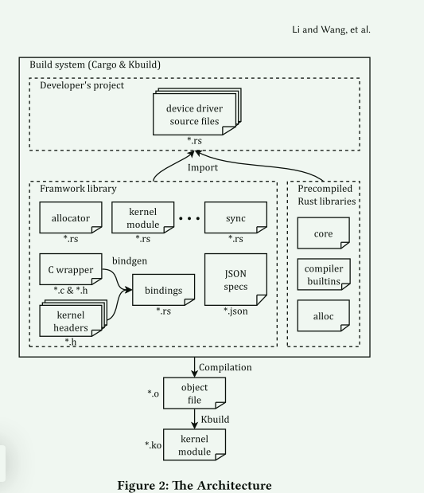

### 设备驱动接口

每种类型的设备驱动程序都被建模为一个特征，它严格规定了该类型的每个驱动程序必须实现的接口。 开发人员应该定义自己的结构来表示设备驱动程序，然后为该结构实现相应的特征。 使用这种设计模式，每种类型的设备驱动程序都具有相同的接口，以便可以使用统一的框架轻松管理它们。 这为开发人员实现驱动程序提供了更优雅的接口，并减少了一些样板代码，例如设备驱动程序注册和注销。

### 工具和基础设施

为了遵循传统的Rust编码风格，并为内核编程提供更有用的工具，重新实现了Rust标准库的部分内容，以适应Linux内核。

## 实现

### 构建系统(build system)

项目的构建系统将 Rust 与 Linux 内核集成。 集成涉及两个技术方面。 首先，由于Linux内核的整体设计，设备驱动程序作为内核的一部分，无法使用用户空间中存在的库（例如Rust标准库）或执行内核内部禁止的操作（例如 浮点运算）。 因此，需要更改 Rust 编译器的默认目标，以生成静态链接且与操作系统无关的机器代码，而不使用浮点指令。 其次，为了利用内核内部定义的现有数据结构和函数，需要将内核头转换为 Rust 绑定。 我们的系统包括脚本和 makefile 来自动化整个过程。

#### 编译独立于操作系统的Rust code。

 默认情况下，Rust 编译器会自动链接标准库和 C 运行时的启动例程。 虽然这种默认行为在用户空间中是正确的，但它在内核空间中不起作用，其中唯一可用的“库”是内核本身。 因此，我们增强了Rust编译器，以生成直接在硬件上运行的代码，而不依赖于标准库。 这是通过向 Rust 编译器添加新目标来完成的。 Rust 支持使用 JSON 规范文件定义新目标，这些文件描述了编译目标的属性，例如其架构、操作系统和默认链接器。 我们根据内置 target3 的默认规范创建一个自定义目标，并对其进行修改以满足需要。 主要修改包括禁用动态链接和使用浮点硬件等。请注意，Rust 编译器附带了一组预编译库（core、compiler_builtins、alloc）。 要将这些库用于新目标，需要重新编译它们。 核心库提供了必要的 Rust 类型和结构，例如 Result 和 Option。 编译器内置库包含 LLVM（Rust 编译器的代码生成后端）在生成机器代码时可能调用的编译器内在函数。 alloc 库提供了用于管理堆分配值的智能指针和集合。 有一个名为cargo-xbuild4的现有工具可以自动交叉编译这些库。

#### 生成内核头的绑定

 Linux内核定义了大量的函数和数据结构。 通常，建议内核开发人员通过包含 Rust 编译器无法直接读取的内核头来重用代码。 为了解决这个问题，我们的系统通过生成外部函数接口（FFI）绑定来重新导出内核头中定义的符号，以便开发人员可以从 Rust 调用外部 C 函数。 虽然手动编写绑定允许我们创建更优雅的 API，但我们更喜欢自动生成它们，原因有两个：

1. 内核函数的数量太大，因此手动为所有函数编写每个 FFI 绑定是不切实际的
2. Linux内核不保证ABI稳定性，这意味着不同版本的内核的数据结构可能会有所不同

我们使用bindgen工具，它将内核头文件作为输入并输出Rust版本类型定义和函数声明。 它调用 clang 构建 C 头文件的抽象语法树 (AST)，然后将它们转换为 Rust。 为了让 clang 正确处理内核头，我们从 Kbuild 中提取编译器标志。 使用bindgen的一个缺点是它无法生成内联函数或宏的绑定，因为它们将在编译期间扩展，因此不会生成任何符号。 因此，Rust 无法调用它们。可以通过手动编写包装内联函数或宏的 C 函数来解决此问题

#### 实现各种 Rust 原语

 标准库定义了几种对于编译器正常工作至关重要的语言项5。 例如，恐慌处理函数定义了程序崩溃时的行为。 如果没有这些，编译器就无法生成相应的机器代码。 因此，我们需要自己实施这些。 我们不在恐慌处理程序中实现任何恢复机制，因为当设备驱动程序出现严重错误并且不太可能恢复时会调用它。 相反，我们使用内核中定义的 BUG 宏断言失败，该宏输出寄存器的内容和堆栈跟踪，然后停止当前进程。

### API和基础设施

#### Interface

设备驱动程序源代码通常包含驱动程序注册和初始化等样板代码。 这些常见行为可以概括为所有设备驱动程序的统一接口。 在我们的系统中，每种类型的设备驱动程序都被建模为一个特征，它为此类驱动程序规定了一个接口。 以下代码片段介绍了 CharDevice 特征的定义。 它强制每个字符设备驱动程序必须实现一个初始化函数 init() 和一个销毁函数 cleanup()，该函数将字符串作为驱动程序的名称。

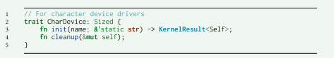

驱动程序开发人员需要根据这个接口来实现他们的驱动程序。 通过使用泛型编程，我们的框架可以轻松管理不同的驱动程序，因为它们具有相同的接口。 然后可以减少样板代码

#### 内核分配器

为了在 Rust 中分配内核内存，我们通过包装内核中定义的 kmalloc() 和 kfree() 使用 GlobalAlloc 特性重新实现默认分配器。 这样，所有堆分配请求都将被路由到我们定制的分配器。 当程序员使用需要内存分配的类型（例如 Box<T>）时，编译器会自动请求内存。 Box<T> 是一个智能指针类型，包含泛型类型 T，它可用于为任何其他类型分配内核内存。 然后，Rust 的所有权系统能够跟踪已分配内存的生命周期，并在其生命周期结束时自动释放它。 因此，开发人员可以从复杂且容易出错的内核内存管理中解放出来

#### 同步原语

为了支持内核空间中的同步，我们还模仿 Rust 标准库实现了同步原语 Mutex 和 Spinlock。 底层的锁原语是内核提供的自旋锁和互斥锁。 根据设计，Mutex 和 Spinlock 包含指向受保护数据的指针，但不提供任何访问数据的接口。 它们唯一的方法称为 lock()，它分别返回 MutexGuard 或 SpinlockGuard。 这两种保护类型实现了 Deref 和 DerefMut 特征，因此可以取消引用它们以获得对共享数据的可变或不可变引用。 因此，开发人员除非显式调用 lock() 方法，否则无法访问共享数据。 这消除了开发人员在使用数据之前忘记锁定数据的情况。 此外，通过利用所有权系统，一旦不再使用守卫，编译器将帮助我们释放锁。

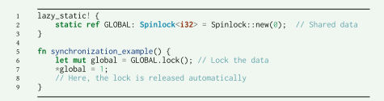

这种设计带来了三个好处：首先，自旋锁锁定数据，而不是控制流。 其次，开发人员需要在使用数据之前锁定数据，因为 Spinlock 不提供任何接触数据的接口。 否则，编译器将抛出编译错误。 第三，得益于所有权系统，开发人员不需要记住释放锁，因为当它们超出范围时，它们会自动解锁

## 内核设备驱动常见错误

我们将Bug分为三类：

1. 语言特有的安全问题：对于这种Bug，我们可以使用高级编程语言来解决。

2. 一般安全问题：这种错误本质上是不可避免的，但Rust编译器可能会为开发人员提供额外的帮助。

3. 逻辑错误：在这种情况下，这是开发者的责任

### 语言特有的安全问题

#### 基于数组的缓冲区溢出

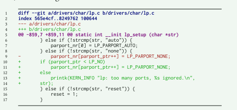

相比之下，Rust 保证对数组的任何访问都将在运行时进行检查，因此可以避免这种漏洞。 以下 Rust 示例尝试读取越界值。 直接运行该程序将触发恐慌处理程序，立即停止执行，这样攻击者就无法利用缓冲区溢出来覆盖内存。

#### Using unsafe functions

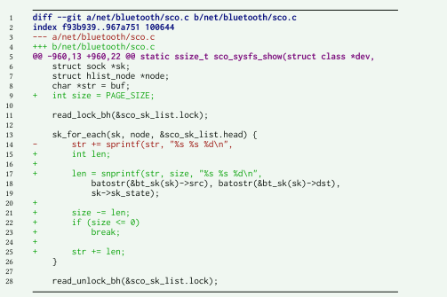

该示例不检查其复制的字符串的长度，从而导致内存损坏。

Rust 并没有天真地将连续序列视为数组，而是提供了更高级别的抽象，例如 str、slice 和 array。 他们严格定义复制时的行为。 例如，函数clone_from_slice将元素从一个切片克隆到另一个切片，如果两个切片具有不同的大小，它会发生panic。 因此，程序员将在驱动程序开发过程中收到潜在错误的警报

#### 未初始化的数据

内核通常将数据从内核空间复制到用户空间。 如果未将未使用的字段清零，敏感的内核信息可能会泄漏到用户空间。

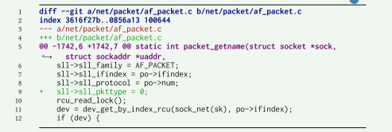

请注意，上述错误在 Rust 中不会发生，因为 Rust 的内存初始化检查保证内存始终被初始化。 因此，不存在未初始化的数据。

#### 不正确的内存管理

与用户空间中使用 malloc() 和 free() 进行动态内存分配类似，Linux 内核也有一个通用内存分配器，称为 kmalloc() 和 kfree()。 设备驱动程序开发人员负责管理内核内存，该内存非常脆弱且容易出错。 许多漏洞是由不正确的内核内存管理引起的，例如空指针取消引用、内存泄漏、双重释放和释放后使用

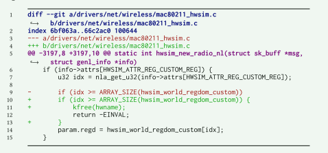

上述问题在 Rust 中不存在，因为 Rust 的所有权系统确保每个分配只要不再使用，最终都会被释放。 因此开发人员不需要显式地释放任何资源，当超出范围时它会自动释放。 因此，如果实现正确，Rust 中就不会发生内存泄漏、双重释放和释放后使用的情况。 此外，由于所有权系统确保引用的寿命不会超过它所指向的值，因此不存在诸如空引用之类的虚假引用。

### 一般安全问题

这些安全问题从根本上是不可避免的，但 Rust 确实提供了一些帮助来减轻其中的一些问题

#### 整数溢出 

当算术运算的结果不适合固定大小的整数时，就会发生整数溢出[5]。 结果可能太小或太大而无法用给定的位数表示。 对于 Rust，在运行时检查整数溢出。 然而，出于性能考虑，Rust 默认情况下只会对调试版本执行溢出检查。 这意味着 Rust 仍然可以帮助开发人员在开发阶段发现并缓解整数溢出。 在发布版本中，禁用溢出检查以获得更好的性能。

#### 并发

Rust 声称自己是线程安全的，但是，Rust 无法阻止一般的竞争条件，因为这根本上是不可能的。 毕竟，硬件资源本质上是共享的。 在用户空间中，Rust 使用线程并发运行代码，并使用所有权系统来防止线程之间共享可变状态。 然而，这在内核空间中不起作用，因为内核本身是可抢占的，换句话说，每一段内核代码都可能被所有用户进程共享。 这对于 Rust 编译器来说是不可知的，因为从编译器的角度来看，它只是编译一个单线程程序。 因此，Rust 无法像在用户空间中那样轻松地防止内核并发问题。 幸运的是，Rust 严格的类型检查提供了一些帮助。

### 逻辑错误

#### 死锁

死锁是一组锁相互等待而没有人能够继续执行的状态。 发生这种情况是因为并发管理不正确。 尽管 Rust 声称它保证线程安全，但它并不认为死锁不安全，因为死锁无法静态防止

#### 错误处理

故障在设备驱动程序中很常见，但如果处理得当，大多数故障都可以被检测到并解决，而不会导致内核崩溃。 然而，进行错误处理总是具有挑战性。 首先，程序员倾向于关注功能，而不是仔细考虑所有可能的错误情况； 其次，在产品交付给客户并且发生一些灾难之前，可能不会注意到错误处理的缺失。 第三，程序员通常使用不一致的隐式占位符作为返回值（例如，0 表示成功，-1 表示失败）。 Rust 的结果类型提供了一种优雅的方法来处理错误。 类型 Result<T, E> 是一个具有两种可能变体的枚举，Ok(T) 表示成功并包含 T 类型的值，Err(E) 表示 E 类型的错误。返回类型 Result 的函数有 能够返回一个值或一个错误。 因此，Rust 帮助开发人员在代码开发中更加规范。

程序员可能会忘记检查返回值，从而无法处理错误，这是一个常见的问题。 Rust 规定，要获取 Result 中包含的基础值，必须处理错误情况。 上面的代码可以用 Rust 重写如下。 当且仅当 Result 被 match 语句消耗时，ret 变量的类型为整数。 Rust 编译器将检查 match 语句是否同时处理成功情况和错误情况。

## 评估

1. Rust 会生成巨大的内核模块吗？ 
2. 我们的系统对实际设备驱动程序的性能影响是什么？

### 二进制大小

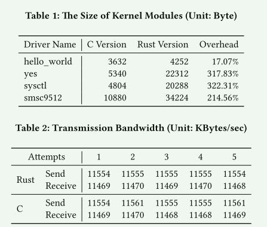

除了最简单的“hello world”驱动程序外，用 Rust 编写的内核模块通常比相应的 C 版本大 2-3 倍。 在检查了ELF部分的内容后，我们发现大的尺寸主要来自于Rust库的链接，例如核心库。 可以预见，如果链接的库越多，二进制文件的大小将会更大。 尽管这在资源有限的系统中可能是一个问题，但值得注意的是，二进制大小仍在“几千字节”之内，这对于在 Linux 上运行的现代设备来说通常是可以接受的。

> RFL项目的开发者在内核引入了自定义的核心库，这可以减小大小

### 性能

表 2 给出了 iPerf 测得的带宽。 请注意，C 和 Rust 之间几乎没有什么区别，因为它们都达到了最大带宽。 这反映了这样一个事实：大多数设备驱动程序只是硬件和内核之间的接口，因此通常它们不是性能瓶颈。

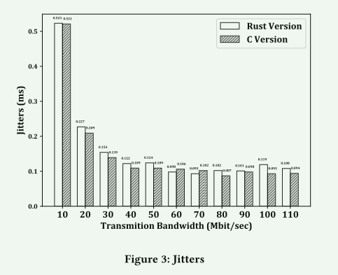

抖动量化了连续传输时间之间的差异。 它衡量网络延迟的稳定性。 如图所示，总体来说，C 版本的抖动较低，而 C 和 Rust 之间的差异很小。 Rust 在某些情况下甚至更好（带宽 = 60 和 70）

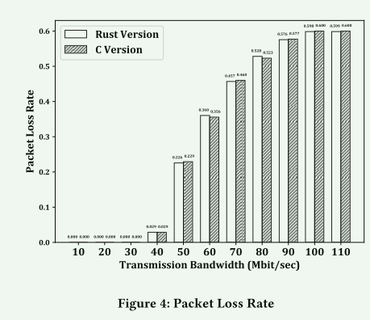

当发送速率超过接收器的容量时，就会发生丢包。从图 4 来看，C 和 Rust 之间没有显着差异

上述性能评估表明，C 和 Rust 之间的差异可以忽略不计。 这是预料之中的，因为 Rust 是为低级编程而设计的，并且它的大部分安全检查都是在编译时完成的。 我们将性能评估结果总结为以下几个方面：

1. Rust编译器有足够的能力生成与C编译器性能相当的机器代码。 
2.  设备驱动程序通常作为内核和硬件之间的接口，因此它们通常不是实际应用程序中的性能瓶颈。

## 讨论

What can a safe programming language solve?

What can it NOTsolve?

Some limitations of our project：

 首先，即使使用我们的框架，编写设备驱动程序也可能需要一定程度的不安全代码。 因为（1）编写C风格的回调函数，（2）调用内核函数，（3）操作原始指针在设备驱动程序开发中很常见，但在Rust中所有这些都是不安全的操作。 将原始指针传递给内核会使编译器失去生命周期和所有权的跟踪，这意味着释放后使用等内存损坏仍然可能发生。 其次，我们提供的 API 不够通用，无法适用于所有场景。 例如，如果内核需要锁的指针，则互斥锁和自旋锁将不起作用。最后，我们没有设计故障恢复机制，一旦发生错误，内核处理程序会直接停止当前进程并打印出堆栈跟踪。 这将是我们未来的工作。