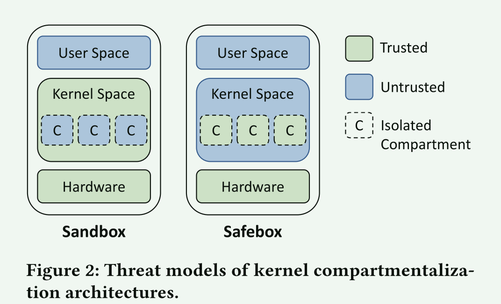
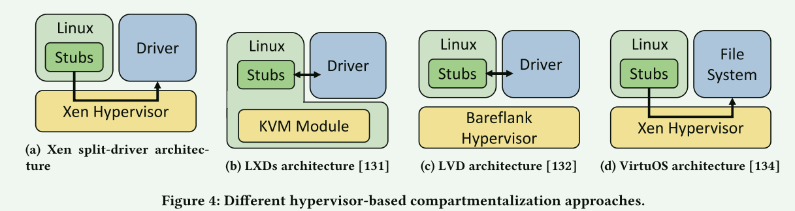
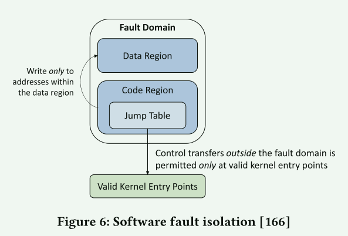

# Securing Monolithic Kernels using Compartmentalization

单片操作系统，其中所有内核功能都驻留在单个共享的地址空间中。在内核的非必要部分（例如设备驱动程序）中有一个缺陷，也可能导致整个操作系统落入攻击者的控制之下。内核加固技术可能可以防止某些类型的漏洞，但它们未能解决一个根本性的弱点：即内核中缺乏安全隔离不同部分的内核安全性。

贡献:

1. 我们提供了一个统一的框架，根据不同的威胁模型将内核划分技术分为两大类架构：沙箱(sandbox) 和安全箱 (safebox)。 这两种架构的不同之处在于它们解决了内核划分中的两个重要挑战：
   1.  识别合适的划分边界
   2. 在运行时在识别的边界之间强制隔离
2. 对现有工作进行分类
3. 回答为什么采用通用基准测试策略来比较不同分区系统很困难，提出了新的比较方法

## 背景

宏内核：

1. 代码库庞大，容易导致用户程序破坏内核
2. 形式化验证方法和静态程序分析过于困难
3. 内核模糊方法可以检测更多漏洞，但不能保证没有漏洞
4. 安全的语言(rust)重写现有代码，但是不能解决所有的漏洞
5. 单个错误导致整个内核权限被控制

常见的解决方法：

1. ASLR：地址空间随机化
2. DEP
3. stack canaries
4. shadow stack

我们认为，单一操作系统的划分对于逐步实现更安全的操作系统至关重要。 有趣的是，虽然不是严格的内核划分，但 Linux 社区已经对地址空间隔离技术表现出了兴趣，以对抗 Spectre/Meltdown 系列漏洞 。 **一些分区系统，例如 VirtuOS ，已经有效地将整体操作系统转变为微内核，模糊了这两种架构之间的界限。**

软件划分技术：内核划分属于其中一种：将软件分解为隔离但又互相协作的组件以减少漏洞利用的过程

## 内核划分技术

一般来说，所有内核分区系统都会在不可信的系统组件（可能是有缺陷或恶意的）和可信的系统组件（被认为是良性的）之间创建边界。 内核分区是通过 

1. 资源访问控制来限制内核分区可访问的代码和数据
2. 当执行跨越分区边界时进行控制传输限制来强制执行

现有的分区系统采用的威胁模型的假设不同，因此在分区边界执行这些控制的方向有所不同:

**sandbox:** 针对内核子系统，将这些子系统视为不安全的部分。分区系统对离开分区边界的数据和控制流强制执行安全规则，以便分区内的任何错误或漏洞不会对内核产生不利影响。 沙箱架构通过将不可信组件限制在其自己的隔离隔间内来减少内核的攻击面。

**safebox:** 与sandbox相反，这种方法认为内核是不安全的，为了避免安全的内核子系统免受其它部分的干扰，需要将安全的内核子系统隔离起来。**这种场景应该是一些机密信息相关的，比如内核中的加密模块**。

### sandbox

资源访问控制：资源访问控制通过限制对隔离区之外的数据的写访问来保持内核非控制数据（例如配置数据）的完整性。 这可以保护内核的其余部分免受任何可能损坏内核内存并意外更改内核行为的修改。

控制传输限制：防止因为控制数据(函数指针、跳转目标、返回地址)的破坏导致程序出现错误的执行流，sandbox会干预分区的控制传输，具体来说，它们将组件的控制流限制为一组不可变的有效入口点，这些入口点可以在编译时定义。

sandbox架构可以处理几种内核威胁模型：

1. buggy extensions containing bugs that could affect system up-time  扩展本身的bug
2. exploitable extensions containing bugs that can be leveraged by a user-space program to corrupt kernel state 包含可被用户程序利用的bug
3. malicious extensions actively trying to compromise the system  恶意的内核扩展

沙箱系统通过故障隔离和容错来限制有缺陷的扩展，并通过漏洞隔离来包含可利用的和恶意的扩展。 总体而言，它们实现了完整性、机密性、可靠性和可恢复性。

故障隔离：故障隔离有错误的组件的影响限制在一定范围内，以提高系统的完整性和可靠性。

- Integrity : 故障隔离系统限制对内核内存的写访问，以确保沙箱化的内核组件只能修改自己的内存或其具有合法访问权限的内存。这保护数据的完整性，防止错误修改沙盒以外的内核内存.此外，沙盒组件在没有合法访问权限的情况下无法执行任意内核函数。 此限制强制执行控制流完整性，与资源访问控制（即数据完整性）相结合，可以防止有缺陷的内核组件影响系统其余部分的行为。
- Reliability : 可靠性衡量系统在存在故障组件的情况下保持运行的能力.通过划分不可靠的内核组件并限制它们与系统其余部分的交互，现有的内核划分技术允许故障组件发生故障而不会导致系统崩溃，从而提高了其可靠性。

故障容错：故障隔离不能使得发生故障的组件恢复功能，具有故障容错的系统允许从故障中恢复

- Recoverability：**为了促进自动恢复，一个具有故障容错的系统会跟踪内核对象的组件更新。当检测到故障时，恢复机制会卸载有问题的组件，恢复内核状态，释放由有问题组件持有的内核资源，然后在其隔离区重新启动内核组件**。

漏洞隔离：故障隔离和容错系统都假设内核组件中的故障是意外错误。 相比之下，漏洞隔离系统假设一个更强的威胁模型，其中组件要么是可利用的，要么是恶意的。

- Confidentiality：沙箱系统可以限制不可信组件对其隔离区之外的内核内存的读取访问，以保护敏感的内核数据。 然而，基于软件的漏洞隔离系统通常不会出于性能考虑而限制读取访问； 因此，机密性攻击超出了它们的范围。随着高效硬件隔离原语的出现，基于硬件的漏洞隔离系统可以保证敏感内核数据的机密性，而不会产生大量的性能开销
- Integrity：

### safebox

资源访问控制：限制只有隔离组件才能访问一些与安全相关的内核资源

safebox可以处理的威胁模型：

1. the kernel is benign but contains exploitable vulnerabilities 内核是良性的但是包含可利用的漏洞
2. the kernel is compromised and potentially malicious 内核受到损害并且可能是恶意的

安全状态隔离(Security State Isolation): 攻击者可以利用内核漏洞来获取任意读/写原语，这使他们能够破坏安全关键状态以绕过安全机制

- Confidentiality: **保险箱系统通过限制内核对保险箱内存储的数据的读取访问来保护机密性**。 然而，与沙箱系统类似，基于软件的保险箱系统通常由于性能问题而不能保证机密性，而基于硬件的保险箱系统却可以
- Integrity: 为了防止篡改安全关键状态，保险箱系统限制内核对保险箱的写访问。 对于依赖内存管理单元 (MMU) 来正确配置访问权限或页表映射的保险箱系统，损坏的 MMU 可能会违反保险箱隔离。 因此，在此类系统中还必须保留 MMU 完整性 。基于硬件的实现是不是会产生循环依赖的问题？

安全策略执行(Secure Policy Enforcement):尽管可以使用安全状态隔离保险箱来隔离安全机制的状态（数据），但策略（代码）本身仍然可能被损坏.

- Integrity

## 内核划分边界

1. 创建分区
2. 执行隔离

这两个步骤都涉及到内核分解（将要分区化的内核组件的代码和数据分开）和胶合代码生成（在隔离组件与内核的其余部分之间进行数据传递和同步）。

### 内核划分

用户空间的划分工具并不能直接应用在内核中：

1. 内核代码空间太大：随着程序状态数量的指数级增长，程序分析的成本迅速变得难以承受、
2. 复杂的内核数据依赖
3. 缺乏多线程的支持

需要分解哪些东西？胶水代码的生成？

1. 设备驱动分解
2. 安全状态分解
3. 策略执行分解

## 分区隔离机制

1. 用户/内核特权级分离

   1. sandbox ： 将内核的组件放到用户态实现 ->  性能开销
   2. safebox ：使用可行执行环境(TEE)来保护应用程序免受恶意内核的危害。与基于沙箱的隔离一样，飞地和可信内核功能之间的任何通信都会带来巨大的开销。

2. 内核/虚拟机分离

   1. sanbox ：将内核组件放到单独的虚拟机中运行

   

   2. safebox: 虚拟机管理程序可以通过管理内存的多个视图，对运行受信任区间的虚拟机强制执行细粒度的内存权限。 每个视图都为 VM 定义一组访问权限，以限制从 VM 外部访问的代码和数据

3. 内核内的地址空间隔离：基于地址的分区使用内存管理单元 (MMU) 在单独的地址空间中运行分区以进行隔离

4. 内核内的基于域的隔离：

   依靠特权级别来强制划分边界是以昂贵的特权级别转换为代价的。为了避免这种开销，研究人员探索了在同一特权级别的单个地址空间内强制限制数据访问和控制传输的方法。 基于域的内核内划分将地址空间划分为多个域，这些域彼此之间以及内核的其余部分共享相同的地址转换

   1. 基于软件的隔离机制

   

   		2. 基于硬件的隔离机制

5. 跨域通信的优化：除了一些 SFI 方法之外，跨域通信构成了创建分区后开销的主要来源

   1. 异步通信

   这将编程模型从阻塞转换为非阻塞模型，因此可能需要对隔离区进行一些重新设计，以便在等待异步调用完成时执行有用的工作。 为了避免工程工作，另一种方法是保留阻塞编程模型，但使用协作线程库将多个轻量级线程复用到单个硬件线程上。 当轻量级线程进行跨域调用时，它会透明地让位于同一域中的另一个轻量级线程。 这种方法还有助于对不同轻量级线程进行的跨域调用进行批处理和管道化。

   2. Leveraging Cache Coherence : 核间通信？
   3. Sparing the Hypervisor：使用vmfunction指令避免虚拟机的进入和退出操作

## 新兴硬件功能

1. 加密技术：AMD  和 Intel  提出了新的硬件扩展来加密属于host虚拟机的页面。此加密可防止虚拟机管理程序读取 VM 的数据页。这些硬件扩展可以用于实现safebox，以保护虚拟机中的数据免受虚拟机管理程序的影响。
2. Hardware Capabilities：CHERI  是 RISC  和 ARM-v8 指令集架构 (ISA) 的扩展。 它用 128 位功能和 1 位带外标签取代了内存地址(指针)
3. Control Flow Integrity: 英特尔控制流执行技术（CET）提供了两种新的 ISA 功能来防御控制流攻击：影子堆栈（SS）和间接分支跟踪（IBT）

## 评估标准

1. 性能测试

   1. Microbenchmarks
      1. 评估核心内核功能最常用的微基准是 LMBench ，它测量对单个系统调用的性能影响
      2. 为了测量网络吞吐量的开销，隔离网络驱动程序  的系统通常使用 netperf  和 iperf  来评估总体发送/接收带宽
      3.  KENALI  和 SKEE  使用 ARM 周期计数寄存器（CCNT）来测量往返上下文切换的延迟，作为跨越隔离隔室的成本

   1. Macrobenchmarks
      1. 此现有系统  使用 ApacheBench  和 httperf  来测量 Web 服务器带宽的开销

2. 安全评估

   1. 安全性评估用于验证内核分区机制针对故障和漏洞的有效性。 为了评估故障隔离和抗故障系统，故障注入用于验证它们是否将内核与故障隔离，否则会导致未定义的行为或系统故障
   2. 为了评估系统缓解漏洞的能力，作者可以使用常见漏洞和(CVE)（公开披露的网络威胁的数据库）中的实际漏洞进行实验
   3. 测量内核的 TCB 大小（以代码行为单位）作为其攻击面的间接测量

3. Practicality Evaluation 实用性评估

4. 建议

   1. 未来的工作评估常见划分操作引入的开销，例如相对于其他系统的转换成本（或至少相对于一些众所周知的“成本”，例如函数调用或系统调用），以促进数量级 比较
   2. 未来的工作至少定量测量需要编写的代码量和修改的文件/子系统的数量
