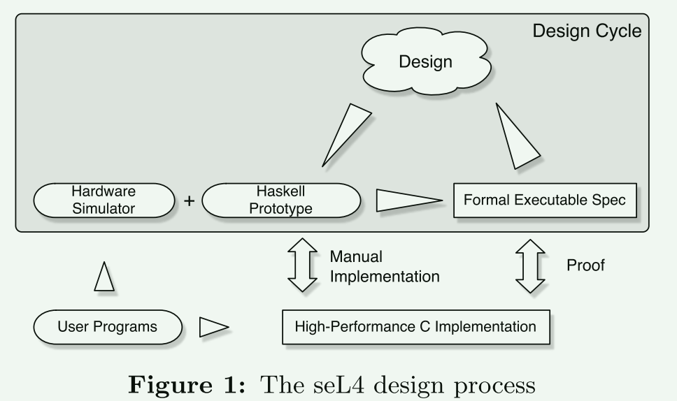
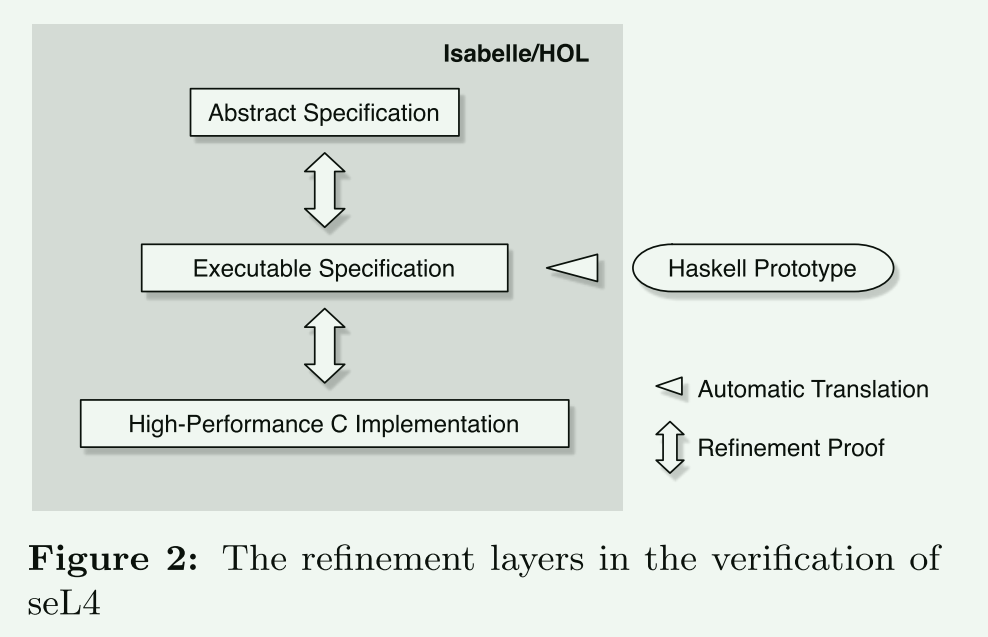
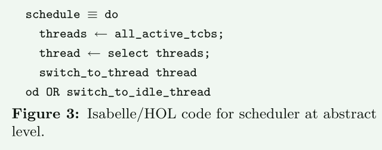
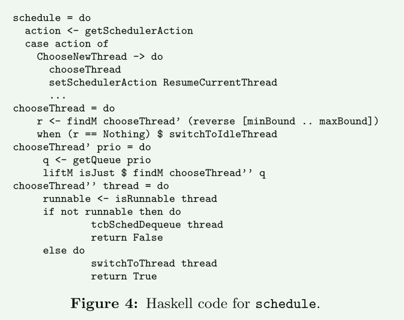
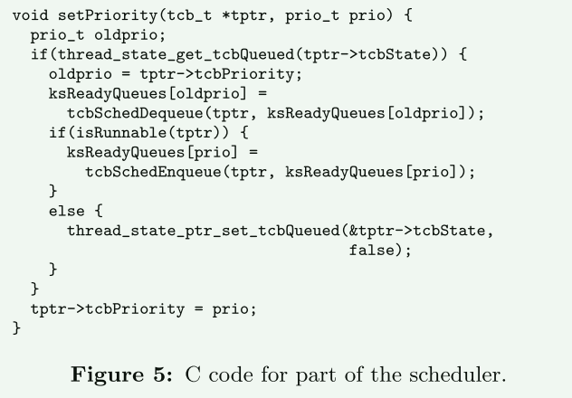

# Sel4

- 完整的形式验证是保证系统没有编程错误的唯一已知方法

- 计算机系统的安全性和可靠性与底层操作系统(OS)内核的安全性和可靠性紧密相关
- 任何规模较大的代码库中的bug都是不可避免的
- 当安全性或可靠性是最重要的时候，通常的方法是减少特权代码的数量，以最大限度地减少漏洞

**达到的目标**

- 适用于真实场景，性能优越
- 行为是被精确描述的
- 终止和执行安全
- 实现被证明是满足规范的

## 内核设计过程

- 操作系统设计人员喜欢自底向上构建
- 形式化验证倾向于自顶向下，因为证明的可处理性是由系统的复杂性决定的。高层的抽象更为简单，更容易建模，最后通过对底层硬件高度抽象来完成。

- 使用haskell作为中间层
- ==向上可以转为为可证明的定理==
- 向下给操作系统开发者一个清晰的视图

根据文中后面对工作量的评估，使用haskell作为中间层并没有带来更多的负担，相反，它降低了工作量

### Haskell到c语言

- Haskell运行时庞大，无法验证正确性
- 依赖垃圾收集，不适合实时环境
- C语言可以优化底层实现的性能

使用haskell实现了可执行模型，但是并不能作为最终的系统。

## 形式化验证

使用的技术：

1. 交互式定理证明系统
2. 机器辅助
3. 机器检查

**refinement : A refinement proof establishes acorrespondence between a high-level (abstract) and a low-level (concrete, or refined) representation of asystem.**

refinement ：极致、优雅、精细化

refinement proof 可以保证抽象模型的霍尔逻辑性质也可以在内核代码上被实现。

- 顶层是对系统行为的主要的、完整的抽象规范
  - 描述内核的外部接口：参数
  - 描述系统调用的效果
  - 描述中断、VM故障时会发生什么
- Haskell生成的可执行规范
  - 中间原型
  - 包含所有的数据结构和实现细节
- 底层是seL4的高性能C实现
  - 要对程序进行正式验证，它们必须具有正式定义的语义
  - 项目成就之一: 为C编程语言的一个大子集提供了非常精准形式语义

refinement使得在在不同的层次中的实现可以互相改进。使得系统最终可以消除bug。

### 如何保证证明是正确的？

我在证明一个系统的正确性，如何保证我写的证明是正确的呢？

- 实现一定程度的正式的、可被机器检查的证明
- 两种特定的技术:
  - 数学、语义和Hoare逻辑不是公理化的，而是被定义和证明的。
  - Isabelle theorem prover 可以产生外部证明，这个外部证明可以被一个小而简单的就检查器检查？

## 内核如何设计

正确性证明的主体  Hoare三元组  每个规范级别的程序语句和函数

- 证明是沿着函数边界分解的
- 每个证明单元都有一组需要在执行前满足的前提条件，函数中修改系统状态的语句或语句序列，以及在执行后必须满足的后置条件
- 为了不影响性能的情况下最小化证明复杂性，需要对内核的一些典型属性进行检查和评估。

#### 全局变量和副作用

使用全局变量和带副作用的变量对证明很不利

- 全局变量通常需要说明和证明不变属性

#### 内存管理

- 将内存分配的控制权导出到用户程序中
  - 单独验证
  - 可以依赖已验证的内核
- Before re-using a block of memory, all references to this memory must be invalidated.
  - finding all outstanding capabilities to the object
  - returning the object to the memory pool only when the last capability is deleted.

#### 并发

单核下导致并发的原因以及解决方法:

- yield: 应用程序会因为一些事件而产生切换
  - 事件驱动的内核执行模型
  - 单个内核栈
  - 原子性的编程接口
- interrupt
  - 关闭大多数中断，只保留少数几个中断?
  - 保留的少数几个中断使用轮询实现?
- exception
  - 内核完全避免了异常？
  - ==内存错误==

#### I/O

## 证明

四类主要的不变量：

1. 低级内存不变量
   1. 对象地址不为0
   2. 对象按大小对其
   3. 对象不会重叠
2. 类型不变量
   1. 对象具有定义良好的类型
3. 数据结构不变量
4. 算法不变量

前两种不变量可以用类型安全的语言完成部分覆盖

## 维护成本

- 最好的情况是局部的、低级的代码更改，通常是不会影响可观察行为的优化。
- 添加新的、独立的特性，这些特性不会以复杂的方式与现有的特性进行交互
- 添加新的、大型的特性，比如在内核中添加一个复杂的新数据结构，以支持与内核其他部分交互的新API
