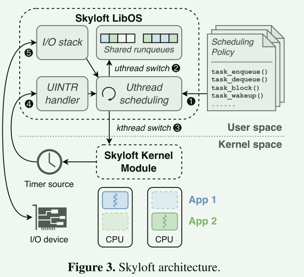

# Skyloft A General High-Efficient Scheduling Framework in User Space

## 摘要

Skyloft 是一个通用、高效的用户空间调度框架。它利用用户模式中断，直接在用户空间交付和处理硬件定时器。这一功能使 Skyloft 能够实现 µs 级抢占。Skyloft 提供一组调度接口，支持不同的调度策略，包括抢占式和非抢占式两种。Skyloft 作为用户空间调度框架运行，与 Linux 兼容，并与 DPDK 等高性能 I/O 框架无缝集成。

评估结果表明，通过用户空间定时器中断对每 CPU 调度进行优化，Skyloft 的完全公平调度器（CFS）和循环罗宾调度器（RR）可显著减少唤醒延迟（100µs 对 10000µs）。与通用调度框架 ghOSt 相比，Skyloft 将延迟关键（LC）应用的最大吞吐量提高了 1.2 倍。此外，与专门的调度框架 Shinjuku 不同，Skyloft 不仅支持 LC 应用程序，还能在低负载条件下为尽力（BE）应用程序有效分配 CPU 资源。通过将 5µs 抢占机制纳入 "工作重叠"（Work-Stealing）策略，在 Skyloft 上运行的 RocksDB 服务器的性能比 Shenango 提高了 1.9 倍。

## 引言

云计算越来越需要高度优化和定制化的调度策略，以提高尾部延迟、吞吐量和资源利用率等关键指标的性能。

> 领域的核心问题: 自定义调度策略

已有工作利用用户代理、实时更新和伯克利数据包过滤器（BPF）等技术，努力定制 Linux 调度器，

- 通过内核调度线程会带来性能开销，原因是频繁的模式切换和局部性降低
- 在内核中开发调度策略要么受限于有限的接口，要么需要对内核的调度子系统进行重大修改
- 内核级调度无法充分利用广泛部署的内核旁路驱动程序和框架，如 DPDK 和 SPDK 

最近的用户空间线程管理在没有内核干预的情况下做出调度决策，以提高性能。

- 这些方法都不够灵活，无法同时支持 µs 级抢占和多个应用
- 无法提供与基于内核的方法相同的调度策略多样性

**µs 级抢占对于满足当今严格的 µs 级尾延迟 SLO 至关重要**。调度器必须支持抢占式调度，以实施重尾工作负载的处理器共享（PS）策略。ZygOS 和 Shenango  等用户空间调度程序不支持单个应用程序内的抢占式调度。其他用户空间调度程序依赖 Linux 信号进行抢占，这会带来额外的开销。

**支持多种应用对于提高 CPU 效率至关重要**。调度器必须将未使用的内核从延迟关键型（LC）应用动态分配给尽力而为型（BE）应用，并迅速将内核重新分配回 LC 应用，以处理突发负载.Shinjuku和 Concord不支持与其他应用共享内核，以提高低负载时的 CPU 效率，因为它们只将内核专用于单个应用。

> 现有方法或理论的局限性，未解决的难点

Skyloft的目标:

1. **高灵活性**: 可灵活支持多个应用程序的各种调度策略。它同时支持抢占式和非抢占式两种调度策略，允许在应用程序之间和单个应用程序内部高效管理线程
2. **高效率:** Skyloft 支持 µs 级抢占，使其能够高效地实施基于抢占的调度策略
3. **高兼容性**： Skyloft 与 DPDK 等内核旁路 I/O 框架完全兼容，可实现高性能 I/O 操作

Skyloft的方法:

1. 对于 µs 级抢占，Skyloft 利用了英特尔处理器中引入的新硬件功能--用户中断 (UINTR)
2. 为了支持多个应用程序，Skyloft 避免依赖全局控制器做出决策。kyloft 提供了一系列调度操作，便于执行各种调度策略

> 研究目标与方法

**贡献**

1. Skyloft 利用新的硬件特性（UINTR）支持内核旁路抢占式调度。据我们所知，Skyloft 是首个支持 µs 级抢占式多应用调度的通用用户空间框架
2. Skyloft 提出了一种范式，通过一组通用操作来开发各种调度程序
3. 基于 Skyloft，以前需要对专用调度程序进行重大修改的调度策略，现在只需数百行代码即可实现。skyloft 在流行应用的合成和实际工作负载上都取得了与现有作品相当甚至更好的性能

## 动机

### us级别抢占

通过内核 IPI（处理器间中断）进行抢占已被广泛应用于现有工作中。在 ghOSt 中，代理向内核发送信息，内核则发送 IPI 以抢占其他内核，这就带来了额外的上下文切换开销。对于 Shenango 等用户空间调度框架，则使用 Linux 信号发送抢占信号。除了内核 IPI 处理外，这种机制还要求在用户空间通过信号处理程序来处理信号，从而带来更多的上下文切换开销。此外，当不同内核上的多个线程同时接收信号时，信号处理会面临可扩展性挑战，导致数据竞赛造成处理时间增加

### 多应用支持

内核空间调度程序可以轻松处理地址空间切换，但这些特权操作很难在用户空间中执行。此外，调度器需要掌握所有线程（属于不同的应用程序）的全局视图，如优先级、时间片等，以便进行适当的调度。因此，用户空间调度程序需要共享数据，以获得所有线程的全局视图。

## 设计

###  用户态中断

UINTR 允许将中断直接发送到用户空间处理程序，而无需切换地址空间或权限级别，为事件分派和处理器间通信提供了一种低开销机制。

处理用户中断的过程包括以下步骤：(1) 识别：当内核接收到中断 V 时，如果 V 符合 UINV 值，则进入下一步。否则，V 将作为传统中断处理。(2) 处理：内核根据 UPID 的 PIR 字段中设置的位，设置 UIRR 中的每个位，检测待处理的用户中断。(3) 发送：一旦 CPU 进入用户模式且 UIRR 被设置，用户中断就会被发送。堆栈指针、指令指针等当前状态被保存到堆栈中，控制流跳转到用户中断处理程序。(4) 处理：中断处理程序完成上下文保存并处理中断。处理完毕后，它将恢复上下文并执行 UIRET 指令以返回正常执行。在 Skyloft 中，抢占可以通过两种机制触发：向其他内核发送 IPI 或利用硬件生成的定时器中断。

#### 定时器中断

定时器中断对于支持每 CPU 调度模型至关重要，如图 2a 所示，定时器中断消除了对专用调度器内核的需求。然而，实现用户空间对硬件中断（包括定时器中断）的处理是一项重大挑战。

Skyloft 实现了在用户空间管理硬件中断（如定时器中断）的两个关键步骤。第一步是用定时器中断向量配置 UINV 寄存器，使内核能将定时器中断识别为用户中断.仅有这一步是不够的，因为定时器事件发生时，PIR 不会自动更新。由于 PIR 仍然为空，内核不会触发用户中断处理过程。因此，第二步--更新 PIR--更具挑战性。虽然可以使用 SENDUIPI 指令更新 PIR，但这将不必要地产生一个 IPI。幸运的是，我们发现 UPID 中的一个名为 SN（抑制通知）的位可以阻止实际 IPI 的生成。因此，Skyloft 要求每个内核在设置 SN 位后向自己发送一个 IPI，从而在不触发 IPI 的情况下有效更新 PIR。

### 跨应用程序调度线程

Skyloft 会为其调度的应用程序分配一定数量的隔离core。当应用程序启动时，Skyloft 会创建与隔离core数量相等的内核线程，并将每个线程绑定到其中一个core上

单一绑定规则：不得将两个或更多活动内核线程同时绑定到同一个隔离core上。

Skyloft 会将所有应用程序的所有用户线程组织到一个全局运行队列或每个 CPU 运行队列中，具体取决于所选的调度策略。所有应用程序共享这些运行队列

下一个线程属于同一个应用程序，则切换可直接在用户空间进行，无需内核干预。但是，如果下一个线程来自不同的应用程序，则需要进行应用程序切换。这包括将当前应用程序的活动内核线程设置为非活动（暂停），并激活（唤醒）目标应用程序的非活动内核线程。这两个步骤必须在内核中同时进行，以遵守绑定规则.

### 通用调度操作

## 实现

### 

## 评估

1. Skyloft 的定时器中断委托对每 CPU 调度器有何影响？
2. 与通用调度框架 ghOSt 相比，Skyloft 调度器在多个应用中的表现如何？
3. Skyloft 如何处理实际应用中的轻尾和重尾工作负载？
4. 与 Skyloft 操作相关的开销是多少？

- skyloft 能以较低的开销处理 µs 级的定时器中断，因此与 Linux 调度器相比，Skyloft 的唤醒延迟要低得多，即使对 Linux CFS 进行调整以减少唤醒延迟也是如此。

- schbench 中的唤醒延迟与时间片大致成正比：时间片越小，唤醒延迟越低。

- Skyloft 的性能与 Shenango 相当，都在其最大吞吐量的 2% 以内。在低负载情况下，Skyloft 的尾部延迟略低于 Shenango，因为 Shenango 会因频繁的内核调整、切换和单个应用的唤醒而产生额外开销。

- Linux 信号的开销最大，涉及用户和内核之间的多次切换。发送和接收用户 IPI 都不涉及权限级别的改变，因此开销低于其他机制