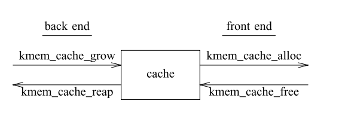
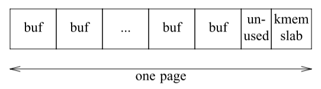

# Slab论文阅读笔记

## 为什么slab？

内核中初始化和销毁某些对象的成本超过了为其分配和释放内存的成本。

改进之处:

- 改进分配器，提供更快的分配速度
- 缓存频繁使用的对象，在使用之间保留基本结构

## 为什么需要在中央分配器完成对象缓存？

中央分配器: 管理整个系统的内存分配

可以在各个子系统实现局部的内存分配器和缓存对象，但这会带来一些问题?

- 局部的对象缓存无法与其它子系统交互，不能感知对方的内存压力
- 局部的分配器可绕过中央分配器会导致无法使用中央分配器的调试和记录信息
- 增加许多没必要的代码

### Cache系统结构设计

1. 每个cache由一个前端和一个后端构成。(解耦)

2. 前端提供接口给其它部分使用
3. 后端向VM(vmalloc)系统申请页面，构造对象缓存(grow)
4. 当对象缓存不够时会向VM系统申请，当系统发现页不够时再向Slab要回页面(reap)
5. 无需向整个堆(这里应该指代Slab管理的整体内存)加锁，而是对每个Cache进行加锁 ==提高性能==

## 使用Slab系统带来的好处

- 快速回收未使用的内存页面, 每个slab带有元素据，可以很快进行查找
- 分配和释放内存很快，只需要在三个列表中移动slab指针
- 不太严重的外部碎片
- 内部碎片最小 (需要控制slab大小来达到一个较好的利用率)

## 实现细节

小对象的布局:

小对象与slab结构体在同一页面之上

大对象布局：

slab结构体与空闲链表所需空间从小对象中获取，所有页面用来存放对象。如果此时仍然将slab信息与对象放在一起，会导致使用率骤降。比如对于一个2048B大小的对象来说，每个slab由一个页（页大小为4096B）构成，那么一个slab只能存放一个对象，因为剩余的2048B一部分用来存放slab对象，导致无法再容纳一个对象了。

## 缓冲区地址分布对缓存利用率和总线平衡的影响

- 中型缓冲区的地址分布会影响系统的整体缓存利用率

### 着色机制

每次创建新的平板时，缓冲区地址都以与slab起始地址 (始终与页面对齐) 略有不同的偏移量 (颜色) 开始。

## 对整个系统提供的特性

- 审核模式下会记录线程信息和栈内容
- 检查释放的地址的正确性

- 内存消耗分布，有助于识别内存泄漏
- 检测缓冲区末端的写入？
- 指示各个子系统的活动水平，分配器不同Cache为各个子系统提供对象缓存

## Future

- 管理其它类型的内存 

在创建Cache时将自定义的freepages/getpages接口当作参数传入

- 多核支持  -- 每CPU缓存
- 用作用户态分配器

## 个人思考

- 对于小对象来说，可能依然会造成利用率较低的情况，比如一个8字节大小的对象，那么空闲链表的存在依然会导致一个slab可能2/5的区域都用来存放空闲链表数据

空闲链表的存在是用来加快索引以及维护cache命中率，使用这些小对象应该不会像那些大对象对缓存命中和分配速度要求高，是不是可以将维护这些对象使用情况的空闲链表用位图结构来代替，这样可以大大增加slab的利用率，只是降低了一点速度和命中率。

