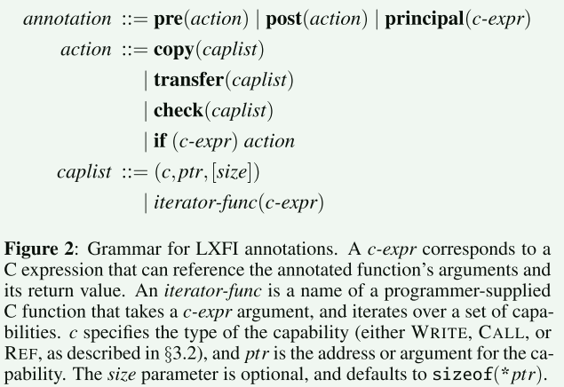
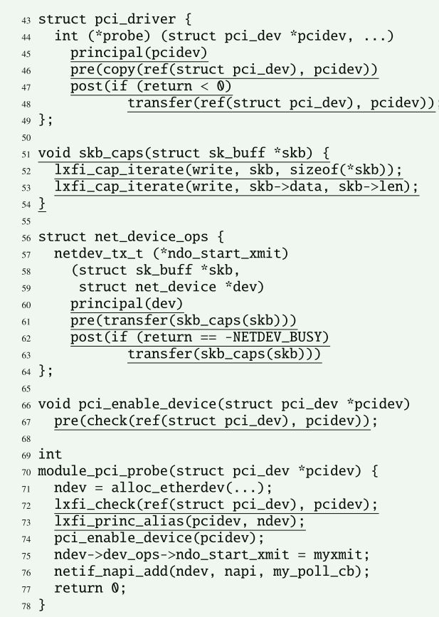
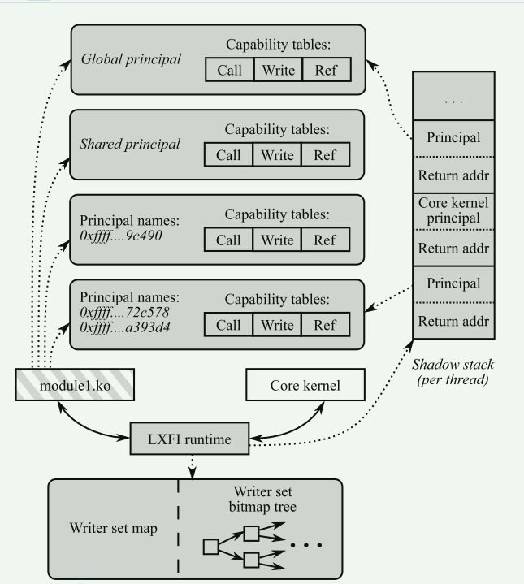
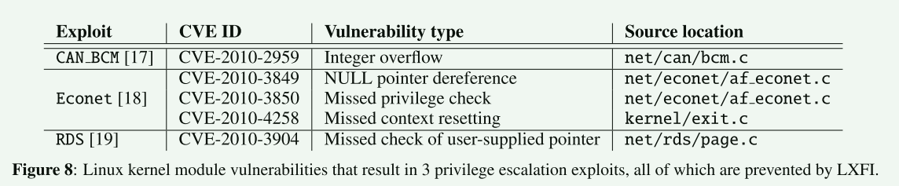
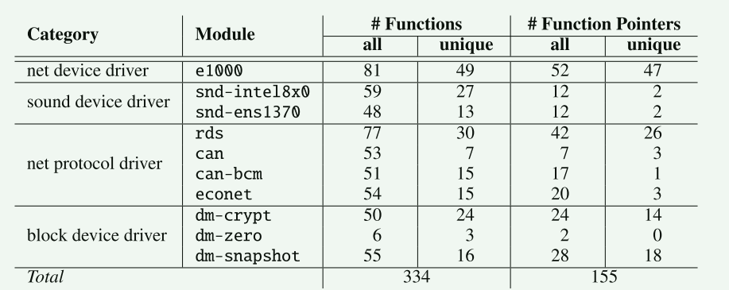
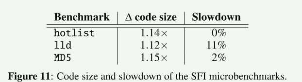
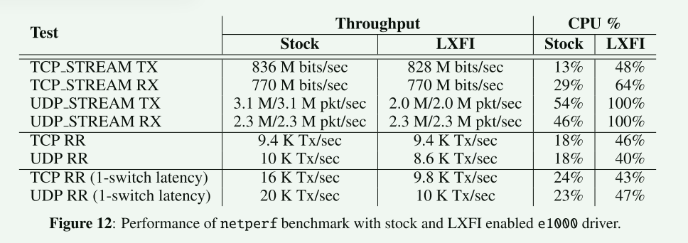
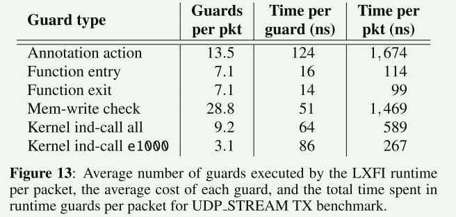

# Software fault isolation with API integrity and multi-principal modules

本文提出了LXFI，一种将内核模块与核心内核隔离的系统，这样内核模块中的漏洞就不会导致权限提升攻击。 为了安全地让内核模块访问复杂的内核 API，LXFI 引入了 API 完整性的概念，它捕获接口假定的一组契约。 为了划分共享模块内的权限，LXFI 引入了模块主体。 程序员通过功能和注释指定主体和 API 完整性规则。 使用编译器插件，LXFI 根据程序员的注释对生成的代码进行检测，以在模块之间授予、检查和传输功能。


## 背景和动机

使用软件隔离将内核模块与核心内核隔离挑战之一在于模块需要使用核心内核中的支持功能才能正确运行； 例如，它们需要能够获取锁、复制数据等，这需要调用内核中的函数来实现这些抽象。 由于**内核不为指针提供类型安全，因此受感染的模块可以利用一些看似“无害”的内核 API 来获取特权**。

LXFI 防止权限升级的方法是将模块彼此隔离并与内核核心隔离。 当然，模块可能合法地需要提升当前进程的权限，例如通过文件系统中的 setuid 位，因此这种方法不会阻止所有可能的权限提升漏洞。然而，实践中发现的大多数漏洞利用都利用了每个有缺陷的模块都具有完全特权的事实，而降低模块的特权将减少可能的漏洞利用的数量。

LXFI解决的前人工作为解决的挑战:

挑战1：如果一个内核模块在多种情况下使用，该模块可能拥有多种权限

> 网络协议模块（如 econet）必须拥有写入该模块管理的所有套接字的权限。因此，如果攻击者利用了其 econet 连接中的漏洞，那么攻击者也能修改通过任何其他 econet 套接字发送的数据。

挑战2：第二个挑战是内核模块使用复杂的内核接口。这些内核接口可能被入侵模块滥用，以获得额外权限（如破坏内存）

> 为了防止 Linux 中的此类攻击，我们将 API 完整性定义为开发人员希望任何模块在使用内存分配器、PCI 子系统或网络堆栈等接口时遵循的契约。构成内核模块与核心内核之间契约的一系列规则对于每个内核 API 都是不同的，因此内核模块可以执行的操作也是特定于 API 的

构成 API 完整性的几种契约：

1. Memory safety and control flow integrity
2. Function call integrity.
3. Data structure integrity.


### 威胁模型

LXFI 做出两个假设来隔离内核模块。 首先，LXFI 假设核心内核、内核接口上的注释以及 LXFI 验证器本身都是正确的。其次，LXFI 根据模块代码导入的函数，推断出模块应获得的初始权限。因此，我们相信每个内核模块的程序员只会调用该模块所需的函数。我们认为这是一个合适的假设，因为内核开发人员大多是善意的，不会故意访问不必要的接口。因此，通过捕获模块的预期权限，并查看源代码中所需的接口，我们可以防止对手在运行时访问任何额外的接口。


## 注释

1. 内核开发人员注释核心内核接口，以强制核心内核和模块之间的 API 完整性
2. 模块开发人员注释模块的某些部分，他们需要在不同模块主体之间切换权限
3. LXFI 的编译时重写器对生成的代码进行检测，以在运行时执行 API 完整性检查
4. LXFI 的运行时在这些检测点被调用，并执行必要的检查以维护 API 完整性

### 主体(Principals)

为了最大限度地减少攻击者在利用模块中的漏洞时可以利用的特权，LXFI 在逻辑上将模块分解为与模块抽象的每个实例相对应的多个主体。 **每个模块主体只能访问该模块抽象实例所需的权限，而不能访问整个模块的全局权限**

为了支持该计划，LXFI 提供了三种机制。

1. LXFI 允许程序员在模块中定义主体
2. LXFI 允许程序员通过提供函数类型注释来定义调用模块时应使用的主体
3. 一个模块可以在多个实例之间共享某些状态

### 能力(Capabilities)

#### WRITE (ptr, size)

 此功能意味着模块可以将任何值写入内核地址空间中的内存区域 [ptr, ptr+size)。 它还可以将该区域内的地址传递给需要可写内存的内核例程。

#### REF (t,a)

此功能允许模块将 a 作为参数传递给需要 REF 类型 t 功能的内核函数.与 WRITE 功能不同，REF (t,a) 不授予对地址 a 处的存储器的写访问权限

#### CALL (a)

该模块可以调用或跳转到目标内存地址a。

能力的基本操作是授予能力、撤销能力的所有副本以及检查调用者是否拥有能力。 为了给模块建立基本的执行环境，LXFI在模块加载时授予模块初始能力，包括： 

1. 对其可写数据部分的WRITE能力； 
2. 对当前内核堆栈的WRITE能力（不包括我们稍后描述的影子堆栈）； 
3. 对模块符号表中导入的所有内核例程的 CALL 功能

### 接口注释(Interface annotations)



有四种操作可以通过预注释或后注释执行:

1.  复制操作将调用者授予被调用者进行预注释的能力（对于后注释，反之亦然）
2. 转移操作将功能的所有权从调用者转移到被调用者
3. 检查操作验证调用者是否拥有特定功能； 所有检查注释都是预先的
4. 为了支持条件注释，LXFI 支持 if 操作，该操作基于表达式有条件地执行某些操作（例如复制或传输），该表达式可以涉及函数的参数，或者对于后注释，可以涉及函数的返回值


**为了指定调用该函数的权限的主体，LXFI 提供了主体注释。 LXFI 的主体由任意指针命名**。基于指针的主体命名方案的一个复杂之处是，模块抽象的单个实例可能具有用于不同接口的单独数据结构。 例如，PCI网络设备驱动程序可以由网络子系统和PCI子系统两者调用。 网络子系统将使用net device结构体的指针作为主体名称，PCI子系统将使用pci dev结构体的指针作为主体名称。 尽管这两个名称可能指代相同的逻辑主体（即单个物理网卡），但名称不同。

LXFI 将主体与其名称分开。 这允许单个逻辑主体具有多个名称，并且 LXFI 提供了一个名为 `lxfi_princ_alias` 的函数，模块可以使用该函数将名称映射到主体。 特殊值global和shared可以用作主体注释的参数，以分别指示模块的全局和共享主体



## 编译时重写

在编译核心内核和模块时，LXFI 使用编译器插件将调用和检查插入到生成的代码中，以便 LXFI 运行时可以强制执行 API 完整性和主体的注释。

LXFI 必须对核心内核代码执行的唯一重写涉及模块可能提供的函数指针的调用。 如果模块能够提供核心内核将调用的函数指针，并且诱使内核执行模块本身无法直接执行的调用，则该模块可能会增加其特权。为了确保情况并非如此，LXFI 执行两项检查。 **首先，在从核心内核调用函数指针之前，LXFI 验证提供指针（如果有）的模块主体是否具有该函数的适当 CALL 能力**。 其次，LXFI 确保模块提供的函数的注释与函数指针类型匹配。 这确保模块不能通过将函数存储在具有不同注释的函数指针中来更改函数上的有效注释


## 运行时检查

为了执行指定的应用程序接口完整性，LXFI 运行时必须跟踪能力，并确保在内核/模块边界执行必要的能力操作。例如，在模块调用任何内核函数之前，LXFI 运行时会验证模块是否拥有在该地址调用函数的权限（即 CALL 能力），以及模块传递的参数是否可以安全调用。同样，在内核调用模块提供的任何函数指针之前，LXFI 运行时会验证模块是否有调用该函数的权限，以及函数指针和被调用函数的注释是否匹配。



- LXFI会干预内核模块与核心内核之间的交互
- LXFI 运行时会跟踪每个内核模块的 主体以及两个特殊主体
- LXFI 为每个模块主体维护三个能力表（每个能力类型一个）。高效管理能力表对 LXFI 的性能非常重要
- LXFI 为每个内核线程维护一个影子堆栈，以记录 LXFI 特定的上下文。影子堆栈与虚拟地址空间中的线程内核堆栈相邻，但只有 LXFI 运行时才能访问
- 为了在函数返回时强制控制流完整性，LXFI运行时将返回地址推送到包装器入口处的影子堆栈上，并在出口处验证其值以确保返回地址没有损坏。 运行时还在包装器入口和出口处的影子堆栈上保存和恢复主体


## 使用LXFI指南

1. 遵循最小特权原则，尽可能授予 REF 能力而不是 WRITE 能力。 这确保模块无法修改对象的内存内容，除非绝对必要
2. 对于模块分配的内存区域，向模块授予 WRITE 功能，并在free时从模块中撤销它
3. 如果模块需要将某个固定值传递到内核 API（例如，回调函数的参数) 则应为该固定值授予特殊类型的 REF 能力，并注释相关函数要求为其参数提供特殊类型的 REF 能力。
4. 当处理大型数据结构时，模块只需要对少量结构成员进行写访问，请修改内核 API 以提供更强的 API 完整性
5. 要将模块的实例彼此隔离，请使用主体注释来注释相应的接口。 用作主体名称的指针通常是与抽象相关的主要数据结构，例如套接字、块设备、网络接口等
6. 要操纵模块内部的权限，请对模块的代码进行两种类型的更改。 首先，为了操作实例之间共享的数据，插入对 LXFI 的调用以切换到模块的全局主体。 其次，为了创建主体别名，请插入对 LXFI 运行时的类似调用
7. 当 API 在核心内核和模块之间隐式传输权限时，显式添加从核心内核到模块的调用以授予必要的功能


## 评估

1. LXFI 能否阻止导致权限升级的内核模块漏洞？
2. 注释内核/模块接口需要多少工作？
3. LXFI 使 SFI 微基准测试减慢了多少？
4. LXFI 会使 Linux 内核模块减慢多少？




- 整数溢出漏洞来获取 root 权限： 当分配大小溢出时，LXFI将仅授予模块针对与实际分配大小相对应的字节数的写入能力，而不是模块所要求的字节数。 当模块尝试写入同一slab中的相邻对象时，LXFI检测到该模块没有WRITE能力并引发错误



- 给定模块所需的注释数量由该模块直接调用的函数（在核心内核或其他模块中定义）的数量以及核心内核和模块调用的函数指针的数量决定
- 相似的模块通常会调用同一组核心内核函数，并且核心内核通常会在多个模块中以相同的方式调用模块函数。这表明，随着 LXFI 支持更多模块，支持新模块的工作量可能会很小。





- 虽然性能上差距不大，但是CPU使用率大大增加，说明这些任务性能其实是限制于硬件



- LXFI 大部分时间都花在执行注释操作（授予、撤销和检查）以及检查内存写入权限上。 它们都是系统中最频繁发生的事件


good:

- 文章找到了一种有效的方法来实现内核模块与核心内核隔离，这种方法类似微内核中基于能力的方法，通过授予模块对数据、代码，内核功能的不同能力，并使用编译器工具生成运行时代码，使得系统在运行过程中需要必要的检查才能允许模块使用核心内核的功能
- 文章设计了一套标记语言，方便开发者指定规则，并把代码生成和运行时检查隐藏在背后


bad:

- 标记语言意味着需要大量的人工标注，并且如果内核接口变化，这些注释也需要被更新
- 运行时检查虽然没有造成直接的性能下降，但是CPU使用率变得更高，这意味着当性能不再受限于硬件时，性能影响将更明显


设想的解决方案：

1. 对模块和核心内核之间进行有效的划分
2. 数据结构的抽象：不允许模块恶意构造
3. 核心内核导出的接口对模块具有不同的可见性

```rust
pub trait CoreKernelFunc{
    #[public(feature1,feature2)]
    fn a();
     #[public(feature3)]
    fn b();
}
```

