# Splinter: Bare-Metal Extensions for Multi-Tenant Low-Latency Storage

## 序言

利用类型安全实现轻量级隔离并不是什么新鲜事。SPIN通过依赖语言强制隔离，允许应用程序安全、动态地将扩展加载到其内核中。类似地，NetBricks  将 Rust 的安全特性应用于数据平面数据包处理，在由网络函数链组成的编译时已知域集之间提供内存安全。Splinter 结合了这些方法，并将其应用于一个全新的、具有挑战性的领域。语言强制隔离具有native性能，无需垃圾回收开销，非常适合像内存存储这样的低延迟数据密集型服务，尤其是当必须在运行时通过大量细粒度保护域添加和删除功能时。

## 动机

现有的内存存储通过提供仅支持 get 和 put 的简单键值接口，以数据模型换取性能。许多实际应用都以树、图、矩阵或向量的形式组织数据。使用键值接口执行聚合或树遍历等操作通常需要多次获取。应用程序通常被分解为存储层和计算层，因此这些额外的获取操作会通过网络传输数据，并导致每个请求的停滞。

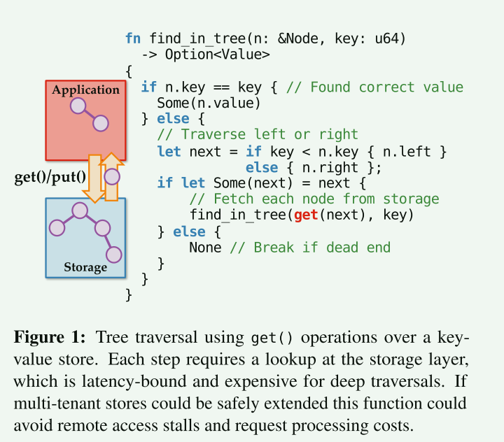

- 客户端需要一次发送一个请求，并在本地进行判断后，根据结果再次发出请求

### 硬件隔离开销

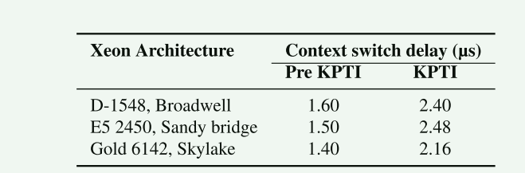

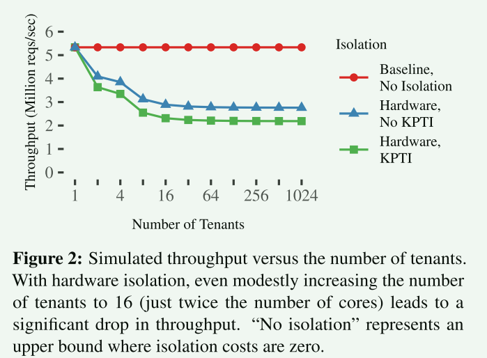

- 采用硬件隔离（无论 KPTI 如何）的吞吐量明显低于基线。即使只有 16 个租户，仅上下文切换成本就将服务器吞吐量降低了 1.8 倍。

## 设计

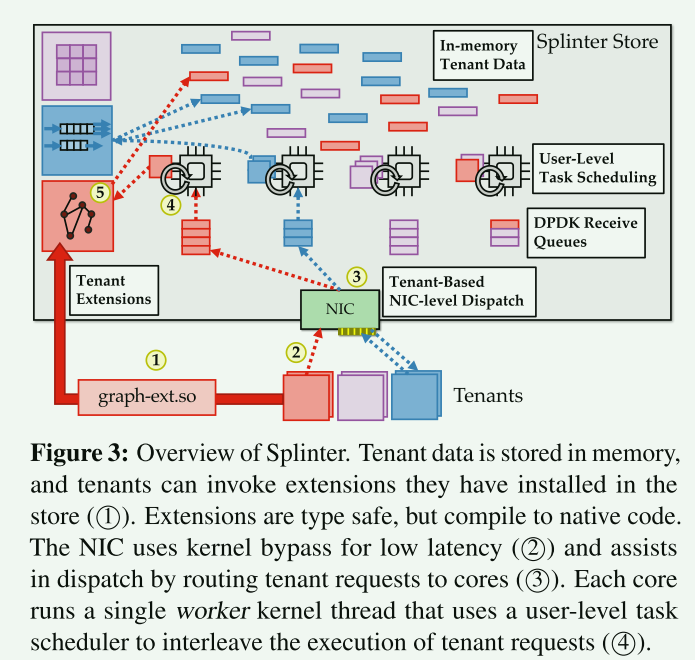

除了快速内核旁路网络请求处理外，Splinter 的速度还取决于以两种关键方式利用 Rust 编译器：

1. 实现低成本隔离
2. 实现低成本任务切换。

这两者相互交织。Splinter 使用无栈生成器来暂停和恢复正在运行的扩展，这需要编译器的支持

一个关键挑战是，与简单的 get/put 接口相比，**扩展调用会给请求处理带来更多不规则性**。通过避免硬件上下文切换，Splinter 将任务切换成本控制在 11 纳秒左右，但这样做的代价是，**Splinter 不得不在没有传统抢占式调度的情况下处理这些多变的工作负载**。

- Splinter 的每个工作任务调度器通过复用长运行任务和短运行任务来建立大部分合作调度，从而解决了这一矛盾。此外，还有一个额外的线程作为其他线程的看门狗，在需要时支持抢占式调度。

### 扩展编译和限制

Splinter 商店不能直接加载租户提供的本地代码。代码必须经过编译和类型检查，以确保其安全性，然后才能加载到存储空间中。编译器是可信的，必须由存储提供商运行。

限制：

1. Rust 的标准类型和生命周期检查
2. 不允许在扩展中使用不安全的代码
3. 来自外部依赖项的代码可能包括不安全代码，除非这些不安全代码是可信的，否则不应将其纳入不可信任的扩展中

这些检查与其他三项运行时保证相结合，确保了隔离性：

1. 只有当扩展和密钥均为同一租户所有时，存储才会接受或提供插入/获取密钥下的值的引用
2. 防止不合作的扩展占用 CPU 时间和堆栈、堆或记录内存
3. 捕获执行扩展操作时发生的恐慌（运行时异常）和堆栈溢出

#### 威胁模型

Splinter 存储有两个利益相关者：存储提供商和存储租户。Splinter 应保护租户互不侵犯，保护提供商不受租户侵犯。租户的不当行为可能是无意的，表现为错误或意外的高应用负载；也可能是恶意的，表现为租户试图读取他人数据、拒绝服务或使用不公平的部分资源。我们考虑的是来自商店 "内部 "的威胁；而来自 "外部 "的威胁，如攻击者利用机器上运行的其他服务获得 root 访问权限，则应使用标准的安全最佳实践来处理。

除了为租户提供优质服务外，服务提供商还有一个关键问题：保护租户数据的机密性和完整性。扩展之间不共享状态，Splinter 也不提供扩展间通信的手段。因此，不需要复杂的共享策略；Splinter 的唯一目标就是隔离扩展。

与其他数据库一样，Splinter 的可信计算基础（TCB）包括库、编译器、硬件等，它是在这些基础上构建的；虽然这些代码不会直接暴露给租户，但其中的漏洞仍可能导致漏洞利用。依赖项包括 LLVM [42]、CPU、网卡（NIC）及其内核旁路库（DPDK [20]）。

与其他数据库相比，Splinter 的设计在某些方面提供了更大的攻击面，但在另一些方面却降低了攻击面。**由于 Splinter 允许执行租户代码，因此其安全性取决于 Rust 类型系统的健全性，而 Rust 类型系统的健全性尚未得到证实。虽然在编译器中发现了一些健全性问题[34]，但证明工作正在取得进展[35]，Splinter 会自动受益于这些进展。如果扩展不能违反 Rust 的安全类型，那么剩下的攻击途径就是系统中的不安全代码；扩展不能提供不安全代码，但它们可以在 Splinter 明确向扩展公开的接口和库中间接调用不安全代码**。从好的方面看，扩展在攻击其他代码之前必须先破坏其中一层保护：它们无法直接访问系统库和系统调用等，只能通过破坏 Rust 的安全环境来获得。

#### 内存安全（memory safety)

Rust 的内存安全（和数据竞争自由）是通过强大的所有权概念来保证的，它让 rustc 编译器可以静态地推理出每个对象及其引用的生命周期。编译器的借用检查器会静态跟踪对象和引用的创建和销毁位置。它确保引用的生命周期（最初由其绑定的作用域决定）被引用对象的生命周期所包含。Rust 将不可变引用和可变引用区分开来；不可变引用是指当引用被持有时，对底层对象的访问限制为只读。当存在可变引用时，编译器不允许对一个对象进行多个引用（无论哪种类型），这样可以防止数据竞争

#### 限制unsafe Rust

Splinter 在 Rust 语言之外的一个重要额外限制是，扩展代码必须远离不安全的 Rust 语言。例如，**不安全代码可以取消引用指针、执行不安全的投类、省略边界检查以及实现低级同步原语。Rust 中的所有不安全代码都需要不安全块，而 Splinter 不允许扩展代码使用不安全块。**

扩展不能实现不安全代码，但可以间接调用。这通常是人们所希望的。例如，扩展在要求存储空间填充响应数据包缓冲区时会执行一些不安全代码。但在某些情况下，这种做法并不可取。例如，可以通过 Rust 标准库诱导文件 I/O。为了防止这种情况，Splinter 限制扩展使用标准库的一个子集，该子集不包含 I/O 或操作系统功能。

我们的经验是，安全的 Rust 与其标准库中的基本数据结构相结合，足以编写复杂的命令式扩展（如 Facebook 的 TAO [10]）。如果不安全的代码可以带来性能上的优势，那么存储空间就可以提供这种功能，只要它被认为是安全的，因为它是可信的，可以包含不安全的代码

### store 扩展接口

扩展使用的接口与RPC接口类似，但是不需要数据拷贝

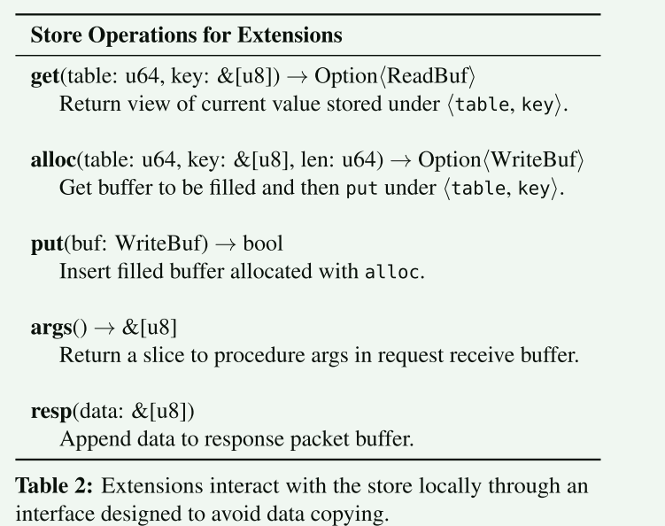

Splinter 试图确保只需复制一次，就能将数据从 NIC 缓冲区移入存储区。

**Rust 的借用检查器可以防止出现使用后无限制（use-after-free）等问题；一旦缓冲区的所有权转移到存储区，扩展就无法保留对缓冲区的引用，从而消除了将数据复制到存储区以确保安全的需要。接收数据包缓冲区也有同样的保证。Rust 的借用检查器确保对它的引用不会超过 RPC 的生命周期，因此无需将接收到的参数或数据复制到扩展中以确保安全**

**put()存储的值必须从表堆中分配；扩展程序不能将任意（堆或栈分配的）内存传递给 put()。**Splinter 强制执行这一点是为了优化记录布局；键和值可以强制分配到单个表堆中，从而简化堆管理，并消除哈希表查找时的缓存缺失。因此，Splinter 使用一种扩展无法构建的类型（WriteBuf）来封装分配，确保它们只能传递从 alloc() 获取的缓冲区。WriteBuf 有一个获取底层缓冲区引用的方法，因此扩展程序可以填充它

#### 避免序列化和反序列化

扩展不能执行不安全的操作，否则就会破坏 Rust 的内存安全保证。不幸的是，这意味着安全的 Rust 代码无法将不透明字节数组转换为/转换为不同类型，以避免序列化/去序列化数据。

- 对于小参数，扩展代码可以通过算术在不同格式之间进行转换，但对于更丰富的数据模型，参数、存储值和响应将具有更复杂的结构化格式。

- Splinter 的接口为扩展代码提供了一种机制，用于在字节片和对一小部分类型的引用之间进行转换。如果切片（&[u8]）自然对齐到所需的类型，Splinter 允许转换为该类型的引用（&T），其中 T 仅限于有符号/无符号整数以及由它们构建的复合类型。

### 协作式调度扩展

与其他类似系统一样，为了避免内核线程上下文切换和迁移造成的抖动，Splinter 运行的工作线程数量与系统中的内核数量相同（图 3），每个工作线程被固定在一个特定的内核上。生成器在工作线程的堆栈中调用，避免了堆栈切换。

为了解决拒绝服务攻击和长时间占用cpu的问题，Splinter 采用了针对延迟敏感服务的用户级线程技术[59]，并将其应用于不受信任的代码。一个额外的（主要是空闲的）线程充当看门狗。如果内核上的任务在几毫秒内无法完成，看门狗就会纠正这种情况

### 租户局部性和工作窃取

Splinter 存储避免使用任何形式的集中调度核心将请求路由到核心，因为这很容易成为瓶颈[55]。与此同时，它需要平衡各核心之间的请求，同时仍然努力利用本地性来避免跨核心协调开销。为此，客户端会将每个租户的请求路由到特定的内核。这就提供了缓存本地性，减少了争用，并提高了性能隔离度。

每当内核上的调度程序在本地接收队列中没有收到请求时，它就会尝试从邻居的接收队列中窃取请求（图 5）。发送队列并不与特定（服务器端）源端口绑定，因此响应可以直接从窃取请求的内核发送

## 实现

Splinter 存储器由 7500 行 Rust 代码实现。它使用 NetBricks 网络功能虚拟化框架 [56] 作为 DPDK [20] 数据包处理框架的封装。Splinter 还包含 1100 行 Rust 代码，为扩展提供存储接口。扩展会导入该接口并对其进行编译。存储空间也导入了该接口，因为它定义了存储空间如何与扩展交互，为调用创建新的生成器。Splinter 在 github 上开放并免费提供1。存储不必用 Rust 编写，但这样做也有好处。它不仅能防止存储区内出现数据竞赛和分段故障，还能让存储区使用 Rust 的类型系统和生命周期，确保不会在对象生命周期和跨信任边界的引用方面出现错误，从而被对手利用。

## 评估

本文就五个关键问题对 Splinter 进行了评估：

1. Splinter 的隔离开销是多少？
2. Splinter 支持高租户密度吗？
3. Splinter 在异构运行时的操作性能如何？
4. 具有代表性的扩展是否能带来延迟和吞吐量方面的优势
5. 什么情况下客户端执行的操作优于基于扩展的操作？

### 实验配置

> 描述实验的设置

### 隔离开销

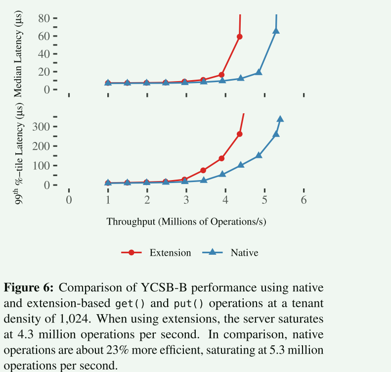

- 对于提供的每秒 350 万次操作（Mops/s）以下的负载，有隔离和无隔离的中位延迟几乎相同
- 在有隔离的情况下，中位延迟峰值超过 4 Mops/s，在 4.3 Mops/s 时达到 59 µs。在没有隔离的情况下，这一峰值出现在 5.3 Mops/s。尾延迟（第 99 百分位数）在 3 Mops/s 时开始出现差异
- 总体而言，在这种以扩展方式调用极细粒度操作的极小工作负载中，Splinter 的隔离成本对存储吞吐量的影响仍然只有约 19%
- 基于硬件的隔离所造成的 1.8 倍（模拟）损失相比，这是一项重大改进（比本地 get/put 减少 1.2 倍）

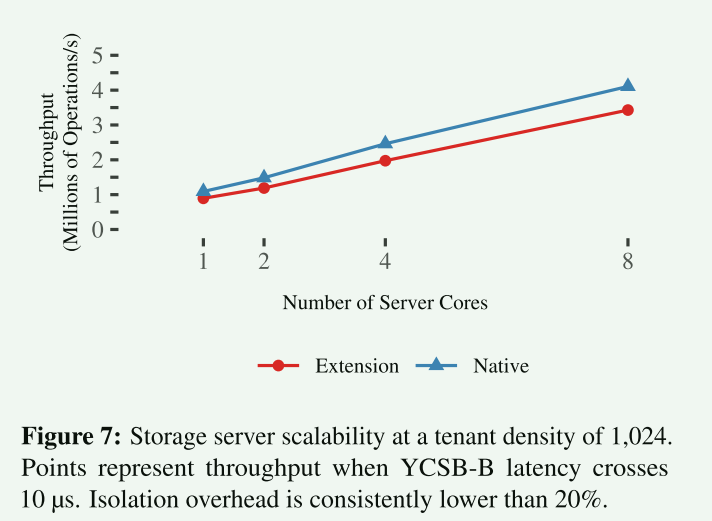

- 从扩展而不是直接调用 get 和 put 操作对可扩展性没有影响；两种情况下的可扩展性都接近线性。不过，如上所述，这确实会影响吞吐量。在一个内核上，吞吐量减少了 200 Kops/s（18%），而在八个内核上，吞吐量减少了 700 Kops/s（17%）

### 租户密度

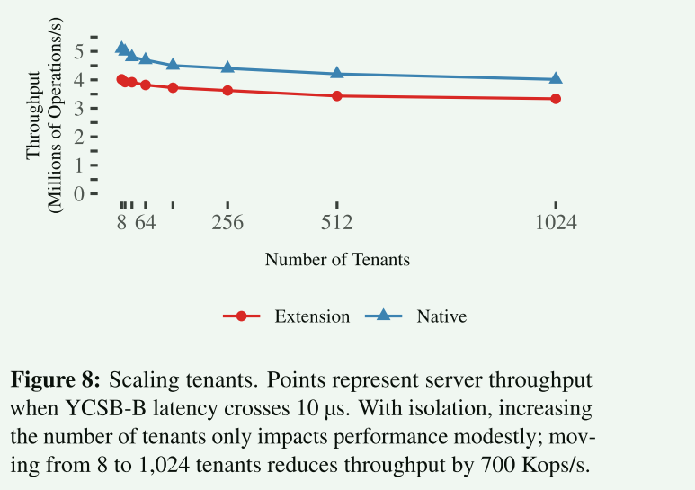

- 隔离后的吞吐量始终保持在无隔离吞吐量的 22% 以内。

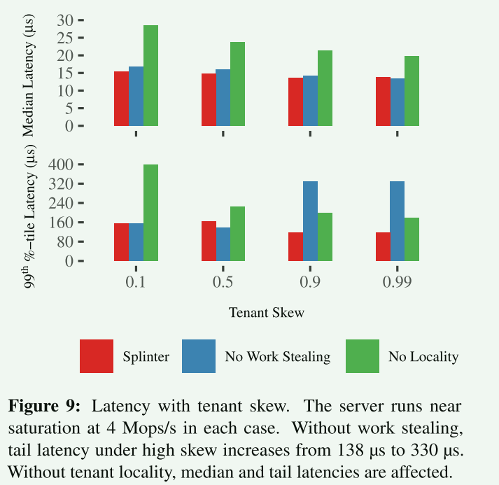

### 聚合扩展

在线数据聚合是应用程序的一项常见任务

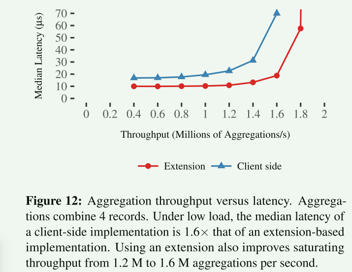

- 基于扩展的实现在低负载情况下将中位延迟降低了 38%（从 16 µs 降至 10 µs），在高负载情况下的收益更大
- 这种改进主要是由于往返次数的减少；与基于客户端的扩展不同，aggregate() 扩展在开始聚合之前不需要等待存储返回间接列表。其次，它还从服务器的角度提高了性能。Splinter 的扩展调用比普通的 get() 操作更昂贵（第 5.2 节），但它们省去了一些昂贵的网络和 RPC 处理。
- 在速度较慢的网络中，Splinter 的优势会更大，因为扩展可以减少网络负载

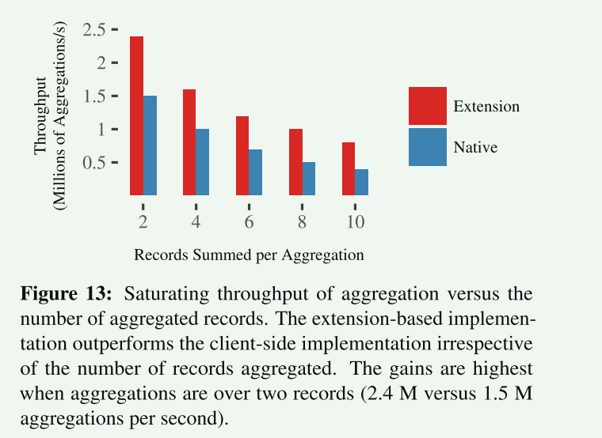

- 聚合记录数对基于扩展和基于客户端实现的饱和吞吐量的影响
- 不过，如果工作很简单（如求和），在存储区聚合总是更好的选择。基于扩展的聚合在饱和吞吐量方面的收益总是超过 50%。

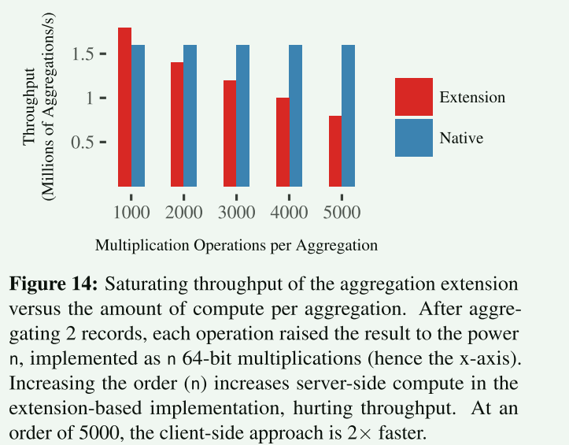

- 对于计算密集型操作而言，在存储区运行扩展所产生的额外 CPU 成本可能会超过减少 RPC 所带来的收益
- 扩展非常适合计算量不大的操作。对于存储在高负载服务器上的数据的计算密集型操作，客户端应在本地获取数据并执行操作。

## 相关工作

内核扩展的语言级方法 [8, 30] 与 Splinter 的设计和目标非常吻合。**SPIN 让语言隔离的扩展作为内核的一部分运行。它消除了运行时开销（垃圾收集除外），因为扩展是编译的；它消除了控制传输开销，因为它不需要切换页表；它消除了保护域之间的复制，因为类型安全指针可以作为能力工作**。与租户必须编写 Rust 代码的 Splinter 一样，SPIN 的一个主要缺点是扩展程序必须用 Modula-3 而不是 C 编写，因此无法使用传统代码

使用 Rust 进行低成本、零拷贝隔离，已被广泛用于廉价的软件故障隔离 [5] 和网络数据包处理管道 [56]。Splinter 以这些理念为基础，将其应用于存储，并超越了静态域，成为一种运行时可	扩展的服务。Tock [43] 是一种嵌入式操作系统，它利用 Rust 的安全性将内核分解为不可信任的胶囊。Tock 的胶囊与 Splinter 的扩展类似，但它们不能防止拒绝服务（无限循环），而且胶囊是静态的，不能添加到运行中的内核中。它们与 Splinter 的区别还在于，它们假定信任域的数量较少；它们针对的是软件分解。Splinter 的目标是密集多租户，对信任域的数量没有静态限制。