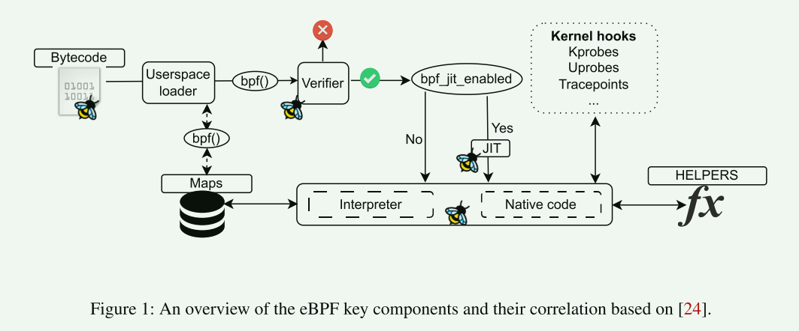
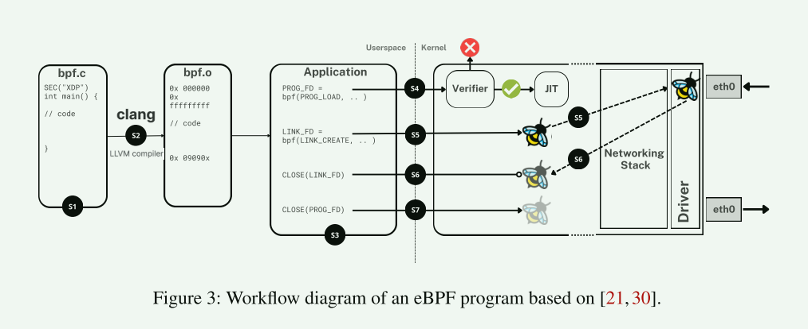
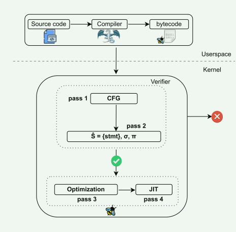
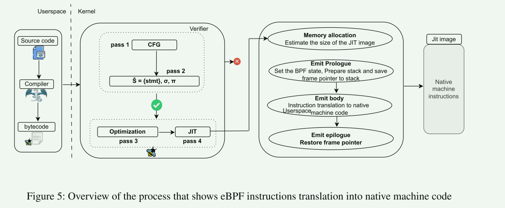

# The eBPF Runtime in the Linux Kernel

扩展伯克利数据包过滤器（eBPF）是一种运行时，用户可以将程序加载到操作系统（OS）内核（如 Linux 或 Windows）中，并在指定的内核钩子处安全高效地执行这些程序。**与绕过或完全取代内核的流行方法不同，eBPF 使用户可以灵活地即时修改内核，快速进行实验和迭代，并部署解决方案以满足特定工作负载的需求，同时与内核协同工作。**

## introduction

单片机操作系统 Linux 旨在实现通用性，满足各类用户的需求。它们定义了必要的抽象，以便安全高效地复用和共享硬件资源。显而易见，Linux 内核的单片式设计选择是有代价的，例如，由于紧密耦合的组件而增加了复杂性和维护难度，更大的攻击面带来了更高的安全风险，在资源受限的环境中降低了可扩展性和灵活性。

- 绕过或取代操作系统内核的方法已获得了强劲的发展势头。内核旁路解决方案和库操作系统允许针对特定工作负载专用整个操作系统堆栈，从而显著提高性能

  > [!WARNING]
  >
  > 这些解决方案可能会通过完全控制硬件来抑制资源复用。它们还可能要求重写应用逻辑，并放弃操作系统的传统优势，如安全性和隔离模型。

- 另一个方向是探索为特定工作负载定制内核机制和策略

  > 理想情况下，他们希望在不放弃性能监视、管理和管理工具的情况下，具有与以前的方法相当的性能	

  > [!WARNING]
  >
  > 它涉及到更改内核代码，并将特定于工作负载的内核更改部署到一组大型机器上，由于目标应用程序种类繁多，频繁的内核重新部署非常复杂，这在规模上是不切实际的

> SPIN使用Modula-3语言编写，确保动态加载模块的安全性和效率。另一方面，VINO主要关注如何通过故障隔离技术安全地将扩展组合在一起

- eBPF使Linux内核在运行时动态可编程，同时确保其运行时完整性保持不变

## Background

goals：performance, security, and observability 

内核自定义的挑战：

1. 当需要定制内核时，开发人员将需要修改内核代码，和/或编写内核模块

   > 对内核进行复杂的更改需要对其复杂的代码库非常熟悉，从而产生巨大的维护负担。除非这些更改被内核社区所接受，否则由于内核api不稳定，它们需要在内核升级时被转发。代码中任何未被捕获的错误都很容易导致系统崩溃，并使生产服务器宕机，这直接导致停机和收入损失。

2. 在一组服务器上部署对内核的更改，无论多么小，都是一个漫长的过程。用新内核替换正在运行的内核会中断机器上托管的工作负载

   1. 机器必须引导到新的内核，并再次重新初始化所有服务。这种循环对于导致冷启动和大量启动时间的工作负载尤其有害
   2. 执行一个广泛的测试阶段来测试和鉴定这些更改，同时修复任何检测到的回归

安全和动态的内核定制：

在内核中托管一个安全高效的虚拟机运行时允许动态地定制内核，实现与现有内核内代码相似的性能，同时确保内核的完整性在任何情况下都不会被破坏。在运行时动态地将程序加载到内核中，将允许在不中断任何服务的情况下跨舰队进行快速部署

## Overview

eBPF被定义为一个支持eBPF指令集的抽象虚拟机。虚拟机有一组11个寄存器和一个固定大小的堆栈。eBPF程序在Linux内核提供的受限虚拟机环境中运行。eBPF指令集是64位指令的一个小而通用的集合。这些指令提供了广泛的范围功能，使eBPF程序能够在内核空间内有效地执行各种任务

**eBPF运行时是将抽象虚拟机和相关实体映射到另一个操作系统或硬件平台所需的一组必要组件**

- **eBPF字节码**被定义为eBPF指令的有限序列
- **eBPF Userspace Loader **：eBPF有一个充满活力的用户空间加载器生态系统，如BCC ， Bptrace和libbpf
- **eBPF Verifier**：eBPF验证器是eBPF系统中的一个关键组件，它在字节码被内核接受之前检查字节码，确保与eBPF相关的安全属性，以及在任何情况下程序的加载不会对内核的完整性和安全性产生负面影响
- **eBPF Just-In-Time Compiler**
- **eBPF Hooks**  eBPF程序的流程是由事件决定的，这些事件在内核或应用程序遇到特定的挂钩点时执行
  - 这些预定义的挂钩点放置在内核的各个位置，并涵盖各种事件，包括系统调用、函数进入和退出、网络套接字、跟踪点等
- **eBPF Program Types**：BPF_PROG_TYPE是eBPF程序的分类，确定其功能、输入参数、可接受的操作和内核中的附加点。每种程序类型都有定义其行为和与系统交互的特征
- **eBPF Helpers**：eBPF辅助函数是专门为eBPF程序提供的特殊功能，可以与系统及其执行上下文进行交互。这些辅助函数简化了诸如打印调试消息、检索系统启动时间、操作网络数据包和与eBPF映射互动等任务
- **eBPF Maps**：一种特定类型的抽象数据结构，例如数组或哈希映射，可以促进用户空间和内核之间的数据交换

### eBPF对象的生命周期

每个eBPF对象都有一个内核表示，用于管理内核中的eBPF程序，并通过文件描述符暴露给用户空间。eBPF对象的生命周期与文件描述符的生命周期相关联。

- 为了在进程生命周期之外实现持久性，内核允许将这些文件描述符固定在一个名为bpffs的特殊伪文件系统上。每个固定操作都会引用eBPF对象，从而延长其生命周期

**eBPF programs** ：这些对象代表着被加载到内核中的实际程序。通过bpf系统调用的BPF_PROG_LOAD命令返回一个代表该程序的文件描述符，经过eBPF验证程序和JIT编译程序，创建其内核表示形式

**eBPF Maps**： 当eBPF程序创建时，map是使用bpf系统调用的BPF_MAP_CREATE命令定义的，该命令将返回一个文件描述符。**该描述符在eBPF程序中的伪装载指令中用于引用地图**

**eBPF Links**： eBPF链接在确保eBPF探针在触发它们的应用程序生命周期之外继续存在方面发挥着至关重要的作用

- eBPF链接是使用bpf系统调用的BPF_LINK_CREATE命令创建的。该链接使开发人员能够间接地将eBPF程序附加到内核钩子，提供比常规直接附加方法更灵活和可持续的方法

**BTF**： BTF对象代表了从用户空间提交到内核的eBPF程序或映射的BTF类型信息，以便验证程序或映射在验证过程中将此类型信息绑定到内核

### 指令集设计

11个64位寄存器：r0 返回值，r10指向只读的堆栈

关键原则：与实际硬件指令集架构（ISA）保持接近等效

1. 简化解释器和JIT的实现。
2. 等效性允许优化编译器后端发出eBPF汇编，其性能接近于本地编译的程序。这是因为JIT可以将eBPF指令翻译为本机机器指令，大多数情况下是一对一映射，而无需引入任何额外的指令来处理翻译。

### BTF：The BPF Type Format

BTF是专门为eBPF使用而设计的调试信息格式。它是由编译器在编译内核或eBPF程序时产生的。除了关于C类型的信息之外，它还包含函数原型信息、类型和声明的自定义注释(它们对eBPF验证器具有上下文敏感的含义)，以及用于更好的自省和调试的源信息

- BTF总是与内核和eBPF程序一起发布，验证器严重依赖于它们来执行其静态分析

优势：

1. eBPF verifier：它使用内核的BTF信息在eBPF程序中为它们访问的内核指针强制类型安全
2. BTF可以为函数和变量的类型和声明携带自定义注释。它们用于为内核或程序中使用的类型附加上下文敏感的含义，以帮助验证
3. Debug：在分析程序时，验证器可以将源信息和行信息打印到其日志中，这在程序因用户输出而被拒绝时会派上用场。它还允许用源信息注释eBPF字节码和JIT编译的代码。对于eBPF映射，可以通过识别来自BTF的数据类型来实现数据的结构化转储
4. CO-RE：通过编码对结构类型成员的内存访问的符号引用，命名的枚举常量值和命名的内核配置选项，这些使编译后的程序更具可移植性。所有这些重定位都是在加载程序时由验证器或libbpf解决的。这种动态解析确保eBPF程序可以适应不同的内核版本和体系结构，而无需重新编译。

### eBPF workflow

## Safety of eBPF Program

在eBPF程序的上下文中，程序安全性是指必须满足的一组属性，以保护内核的运行时完整性，并维护将在其中执行eBPF程序的内核上下文的不变量。违反这些安全属性的程序在加载到内核时应该被拒绝。

- Memory Safety：对于程序可访问的所有内存区域，验证器努力保证不存在越界访问、无效或任意内存访问或use-afterfree错误
- Type Safety： 验证器精确地知道指向程序可访问的内存区域的每个寄存器的类型。它跟踪堆栈上对象的类型。这个过程有助于避免由类型混淆引起的错误，并确保不同类型的程序可以在不破坏内核内存的情况下利用各种实用程序
- Resource Safety： 验证器检查程序在退出时是否没有留下遗留资源
- Information Leak Safety： eBPF验证器通过分析可能引用内核内存的指针来禁止任何内核信息泄漏，旨在防止任何泄漏到用户可访问的内存区域
- Data Race Freedom：验证器旨在确保程序对内核状态的访问不受数据竞争的影响。它强制内核状态的任何操作都通过帮助程序实现适当的同步
- Termination：验证器对它将在程序的所有路径上探索的指令的最大数量进行限制，称为指令复杂性限制，旨在确保所有程序终止
- Deadlock Freedom：验证器旨在确保程序没有死锁，禁止在某个点同时拥有多个锁
- Upholding Execution Context Invariants：换句话说，程序的执行可能不会违反现有内核代码的不变量和假设

### Verifier

#### Validation of the Control Flow Graph

- 除第一个指令外，所有指令都至少有一条传入的控制流边。除了EXIT，所有指令还有一个传出的顺序控制流边，指向下一条指令。对于无条件的JUMP指令，顺序边指向它们要跳转的指令
- 对于CALL和有条件的JUMP指令，还有一个额外的传出分支控制流边指向分支目标
- 验证器使用深度优先搜索算法遍历程序的CFG

检查的变量：

1. 确保没有无限循环或具有无法静态确定的复杂终止条件的循环。
2. 确保程序中不存在无法访问的指令
3. 确保所有子程序以EXIT或JUMP指令结束，即不会自动切换到下一个子程序

**状态修剪**

### Symbolic Execution 符号执行

- 验证器必须通过程序中的所有可行路径进行详尽探索，并精确跟踪栈的状态（以字节级粒度）和程序寄存器在控制流中的每个点

### Instruction Simulation

eBPF指令集定义了所有指令类型、它们的预期操作数和预期行为。所有指令都以传递函数的形式编码到验证器中

### Post-Verification Optimizations

1. Dead Code Elimination
2. Inlining and Instruction Rewriting

### Just-In-Time Compilation

## User Case

1. XDP/TC ：通过绕过内核网络堆栈来执行高性能的网络数据包处理，同时仍然可以访问其状态。这包括以高速率丢弃数据包以缓解DDoS攻击，负载平衡，实现网络功能，将流量重定向到不同的cpu或网络设备，或直接重写和传输数据包而不经过内核
2. Socket Lookup
3. Socket Reuseport
4. Control Groups
5. User-Level Protocol：允许在套接字发生sendmsg或sendfile操作时调用eBPF程序。这些程序用于强制执行发送的每条消息的有效负载的策略
6. Congestion Control:eBPF程序可以注册为TCP拥塞控制操作的回调，允许更快的实验、数据收集和在生产环境中定制拥塞控制算法的迭代
7. Socket Operations
8. Profiling
9. Tracing 

## 新兴的eBPF应用

1. 设备驱动程序
2. 调度
3. Storage

## 挑战

1. 理解各种可用的钩子点，识别它们对特定任务的适用性，并将eBPF程序与它们无缝集成，这需要对内核复杂性和eBPF方法有深刻的理解
2. 详尽的文档和用户友好的开发工具的缺乏加剧了这些可用性障碍
3. 需要考虑不同版本内核之间的兼容性和稳定性
4. 更可伸缩的验证器直接转化为eBPF的增强功能，因为更大的有效程序集可以通过它
5. eBPF的安全保证取决于验证器实现的正确性和合理性
6. 尽管eBPF程序中允许函数调用，但不支持静态或动态库。这意味着位于不同源文件中的两个或多个程序可能需要重新实现相同的函数