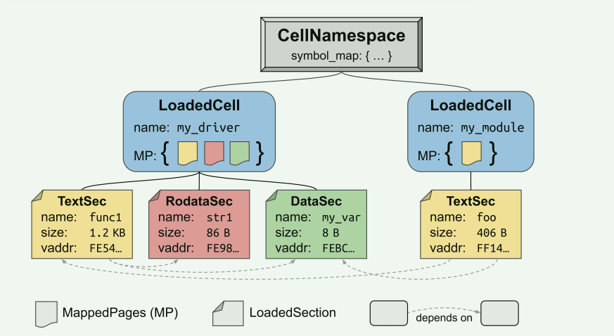

# Theseus OS 补充

由于Theseus 可以优雅地处理语言级故障（Rust 中的panic），因此我们展示了Theseus 能够容忍操作系统核心中出现的更具挑战性的瞬态硬件故障。

- Theseus 更关注组件的组合和互换(组件的热更新)，并不关注组件之间的隔离

Theseus 中的单元具有在实现时明确定义的边界，并在运行时持续存在：

1. 在实现时：单元作为一个crate实现
2. 在编译时：作为单个对象文件存在
3. 在运行时：作为一组可加载的内存区域 (每个section都有边界，应该是在linker中指定)（携带了依赖元数据)

在运行时可识别的显式单元边界是Theseus 中强大的数据/故障隔离和状态管理的基础。

在运行时，Theseus 根据需要加载所有单元并将其链接到系统中。

1. 需要查找并解析单元目标文件
2. 将其sections加载到内存中
3. 解析其依赖关系以写入链接器重定位条目
4. 根据需要递归加载任何丢失的单元，以及将新的公共符号添加到符号映射中。

 在此过程中，Theseus 构建了详细的单元元数据。

- 一个`LoadedCell` 对应一个crate，section之间的关系都会被记录，比如一个代码段中的函数引用了数据段的某个数据
  - 被加载的section对应了内存中的一个section node，记录了section的大小，内存中的位置，双向依赖关系
  - section node可能还包含其它元数据
- 一组crate可以构成`CellNameSpace` , 包含了这组crate的公共符号信息，可以用于快速解决cell之间的依赖关系

Theseus 将功能尽可能分割成许多小crate，避免这些crate的循环依赖。在数量和大小上需要折中。

**nano_core**

Theseus 在链接阶段分割编译过程，将原始单元对象文件直接放入操作系统映像中，以便链接推迟到运行时。未链接的目标文件无法运行，因此我们必须使用 nano_core 启动Theseus。由于静态链接的单元会失去其边界和依赖性，因此 nano_core 在最终引导阶段通过使用增强符号表和在构建时烧录到操作系统映像中的其他元数据动态地逐一加载其组成单元来完全替换自身。这满足了所有单元的运行时持久边界的要求，允许 nano_core 在引导后安全卸载。

- 这些cell(crate)是没有被链接过的，而链接器的作用就是将crate的相关依赖的符号位置等信息建立好， 并把所有的数据综合到一个文件中
- Theseus 将链接的过程放到运行时，动态地建立这些关系
- nano_core起到一个最小核心的作用，需要一个原始加载器来完成一部分功能，而且最后它会被卸载掉

从这里来看，上面`CellNameSpace` 就可以理解了，在加载一个crate的时候，由于没有经过链接器处理，所以它和它依赖的crate都是裸的，在加载到内存中后，就可以建立他们的关系（主要还是修改对应的符号项，让编译出来的可重定位文件能找到对应的符号信息）。`CellNameSpace` 就可以用来表征这种关系。

**state**

Theseus 细胞通常持有soft states，这些状态可以毫无错误地丢失或丢弃。